# 0 Background

## 0.1 拨码开关

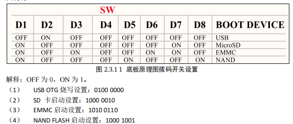

## 0.2 Cortex A7 MPCore 架构

### 0.2.1 Cortex A处理器运行模型

以前的 ARM 处理器有 7 中运行模型：User、FIQ、IRQ、Supervisor(SVC)、Abort、Undef和 System，其中 User 是非特权模式，其余 6 中都是特权模式。新的Cortex-A 架构加入了Trust Zone安全扩展，新加了一种运行模式: Monitor，同时还新支持虚拟化扩展，因此加入了另一个运行模式：Hyp，因此Cortex-A7有9种处理模式。

| 模式              | 描述                           |
| --------------- | ---------------------------- |
| User(USR)       | 用户模式，非特权模式，大部分程序运行的时候就处于此模式。 |
| FIQ             | 快速中断模式，进入 FIQ 中断异常。          |
| IRQ             | 一般中断模式。                      |
| Supervisor(SVC) | 超级管理员模式，特权模式，供操作系统使用。        |
| Monitor(MON)    | 监视模式，用于安全扩展模式。               |
| Abort(ABT)      | 数据访问终止模式，用于虚拟存储以及存储保护。       |
| Hyp(HYP)        | 超级监视模式，用于虚拟化扩展。              |
| Undef(UND)      | 未定义指令终止模式。                   |
| System(SYS)     | 系统模式，用于运行特权级的操作系统任务。         |

除了 User(USR)用户模式以外，其它 8 种运行模式都是特权模式。这几个运行模式可以通过软件进行任意切换，也可以通过中断或者异常来进行切换。大多数的程序都运行在用户模式，用户模式下是不能访问系统所有资源的，有些资源是受限的，要想访问这些受限的资源就必须进行模式切换。但是用户模式是不能直接进行切换的，用户模式下需要借助异常来完成模式切换，当要切换模式的时候，应用程序可以产生异常，在异常的处理过程中完成处理器模式切换。当中断或者异常发生以后，处理器就会进入到相应的异常模式种，每一种模式都有一组寄存器供异常处理程序使用，这样的目的是为了保证在进入异常模式以后，用户模式下的寄存器不会被破坏。

### 0.2.2 Cortex-A 寄存器组

ARM 架构提供了 16 个 32 位的通用寄存器(R0~R15)供软件使用，前 15 个(R0~R14)可以用作通用的数据存储，R15 是程序计数器 PC，用来保存将要执行的指令。ARM 还提供了一个当前程序状态寄存器 CPSR 和一个备份程序状态寄存器 SPSR，SPSR 寄存器就是 CPSR 寄存器的备份。

1. Cortex-A内核寄存器：34个通用寄存器，8个状态寄存器，Hyp模式下独有一个ELR_Hyp寄存器

2. R0~R15 就是通用寄存器，通用寄存器可以分为三类：`未备份寄存器，即 R0~R7`，`备份寄存器，即 R8~R14`， `程序计数器 PC，即 R15`
   
   - **未备份寄存器**：未备份寄存器指的是 R0~R7 这 8 个寄存器，因为在所有的处理器模式下这 8 个寄存器都是同一个物理寄存器，在不同的模式下，这 8 个寄存器中的数据就会被破坏。
   
   - **备份寄存器**：每种处理器模式使用 R14(LR)来存放当前子程序的返回地址，如果使用 BL 或者 BLX来调用子函数的话，R14(LR)被设置成该子函数的返回地址。
   
   - **程序计数器** **R15**：程序计数器 R15 也叫做 PC，R15 保存着当前执行的指令地址值加 8 个字节，这是因为 ARM的流水线机制导致的。
   
   - **程序状态寄存器**：所有的处理器模式都共用一个 CPSR 物理寄存器，因此 CPSR 可以在任何模式下被访问。CPSR 是当前程序状态寄存器，该寄存器包含了条件标志位、中断禁止位、当前处理器模式标志等一些状态位以及一些控制位。所有的处理器模式都共用一个 CPSR 必然会导致冲突，为此，除了 User 和 Sys 这两个模式以外，其他 7 个模式每个都配备了一个专用的物理状态寄存器，叫做 SPSR(备份程序状态寄存器)，当特定的异常中断发生时，SPSR 寄存器用来保存当前程序状态寄存器(CPSR)的值，当异常退出以后可以用 SPSR 中保存的值来恢复 CPSR。
     因为 User 和 Sys 这两个模式不是异常模式，所以并没有配备 SPSR，因此不能在 User 和Sys 模式下访问 SPSR，会导致不可预知的结果。由于 SPSR 是 CPSR 的备份，因此 SPSR 和CPSR 的寄存器结构相同，如图所示：
     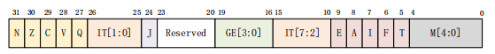
     **I(bit7)**：I=1 禁止 IRQ，I=0 使能 IRQ。
     **F(bit6)**：F=1 禁止 FIQ，F=0 使能 FIQ。
     **M[4:0]**：处理器模式控制位

## 0.3 Uboot

### 0.3.1 Uboot命令

1. ？bootz 或 help bootz

2. 信息查询命令

3. 环境变量操作命令

4. 网络操作命令
   
   | 环境变量      | 描述                                  |
   | --------- | ----------------------------------- |
   | ipaddr    | 开发板 IP 地址，可选配置，也可通过 dhcp 命令从路由器获取   |
   | ethaddr   | 开发板的 MAC 地址，**必须设置**                |
   | gatewayip | 网关地址                                |
   | netmask   | 子网掩码                                |
   | serverip  | 服务器 IP 地址（即 Ubuntu 主机 IP 地址），用于调试代码 |
   
   ```txt
   setenv ipaddr 192.168.1.50
   setenv ethaddr b8:ae:1d:01:00:00
   setenv gatewayip 192.168.1.1
   setenv netmask 255.255.255.0
   setenv serverip 192.168.1.253
   saveenv
   ```
   
   ip地址需确保确保 Ubuntu 主机和开发板的 IP地址在同一个网段内，
   
   - ping命令
   
   - dhcp
   
   - nfs
     
     > nfs [loadAddress] [[hostIPaddr:]bootfilename]
     
     如将 zImage 下载到开发板 DRAM 的 0X80800000 地址处：
     
     > nfs 80800000 192.168.1.253:/home/zuozhongkai/linux/nfs/zImage

5. EMMC及SD卡操作命令
   
   | MMC 命令          | 功能描述                              |
   | --------------- | --------------------------------- |
   | mmc info        | 输出 MMC 设备的详细信息                    |
   | mmc read        | 从 MMC 设备中读取数据                     |
   | mmc write       | 向 MMC 设备写入数据                      |
   | mmc rescan      | 扫描系统中的 MMC 设备                     |
   | mmc part        | 列出当前 MMC 设备的分区信息                  |
   | mmc dev         | 切换当前操作的 MMC 设备（如从 mmc 0 切到 mmc 1） |
   | mmc list        | 列出系统中所有有效的 MMC 设备                 |
   | mmc hwpartition | 设置 MMC 设备的硬件分区                    |
   | mmc bootbus     | 设置指定 MMC 设备的 BOOT_BUS_WIDTH 域的值   |
   | mmc bootpart    | 设置指定 MMC 设备的 boot 和 RPMB 分区大小     |
   | mmc partconf    | 设置指定 MMC 设备的 PARTITION_CONFG 域的值  |
   | mmc rst         | 复位 MMC 设备                         |
   | mmc setdsr      | 设置 MMC 设备的 DSR 寄存器值               |

## 0.4 vscode settings

`search.exclude`：控制 VS Code 的**搜索功能**（比如全局查找文字、替换内容），排除指定路径，搜索时不会扫描这些目录 / 文件。`files.exclude`：控制 VS Code 左侧的**资源管理器面板**，排除指定路径，这些内容不会显示在文件列表中每个配置项里的。`"路径规则": true`表示 “启用这条排除规则”（值为`false`则禁用）。

```json
{
  "search.exclude": {
    "**/node_modules": true,
    "**/bower_components": true,
    "**/*.o": true,
    "**/*.su": true,
    "**/*.cmd": true,
    "arch/arc": true,
    "arch/avr32": true,
    "arch/blackfin": true,
    "arch/m68k": true,
    "arch/microblaze": true,
    "arch/mips": true,
...
    "include/configs/[a-l]*": true,
    "include/configs/[n-z]*": true,
    "include/configs/[A-Z]*": true,
    "include/configs/m[a-w]*": true
  },
  "files.exclude": {
    "**/.git": true,
    "**/.svn": true,
    "**/.hg": true,
    "**/CVS": true,
    "**/.DS_Store": true,
    "**/*.o": true,
    "**/*.su": true,
    "**/*.cmd": true,
    "arch/arc": true,
    "arch/avr32": true,
    "arch/blackfin": true,
    "arch/m68k": true,
    "arch/microblaze": true,
    "arch/mips": true,
    "arch/nds32": true,
...
    "include/configs/m[a-w]*": true
  }
}
```

## 0.5 NFS无法挂载的问题

开发板可以正常 ping 通 Ubuntu 主机、正常使用 TFTP 功能，但通过 NFS 挂载根文件系统时持续失败。开发板使用的**低版本 U-Boot 仅支持 NFS v2 协议**，而 Ubuntu 22.04 默认使用的 6.2.0 高版本内核，**默认关闭了 NFS v2 协议支持和 UDP 端口**，两端协议不兼容，最终导致挂载失败。

### 1. 前置问题确认

- 执行 `sudo cat /proc/fs/nfsd/versions`，确认当前 Ubuntu 仅支持 NFS v3/v4，无 v2 支持
- 执行 `dpkg --get-selections | grep linux-image`，确认当前为 6.2.0 等高版本内核，该版本内核默认不提供 NFS v2 支持

### 2. 内核降级与默认启动配置

- 安装兼容 NFS v2 的低版本内核：`sudo apt-get install linux-image-5.19.0-41-generic`
- 修改 GRUB 配置 `sudo vim /etc/default/grub`，设置默认启动该低版本内核，调整启动超时参数
- 执行 `sudo update-grub` 更新 GRUB 配置，重启系统后用 `uname -a` 确认内核切换成功

### 3. 开启 NFS v2 服务支持

- 修改 NFS 内核服务配置 `sudo vim /etc/default/nfs-kernel-server`，调整 RPCNFSDCOUNT、RPCMOUNTDOPTS 等核心参数，强制启用 NFS v2
- 执行 `sudo service nfs-kernel-server restart` 重启 NFS 服务

### 4. 校验 NFS 共享路径配置

- 检查 `sudo vim /etc/exports`，确认根文件系统所在的共享目录，配置了正确的权限放行参数 `rw,sync,no_root_squash`

### 5. 开启 UDP 端口与最终验证

- 修改 `sudo vim /etc/nfs.conf`，启用 vers2 和 udp 配置
- 再次重启 NFS 服务，通过 `netstat -a | grep "nfs"` 确认 UDP 端口已正常监听
- 执行 `sudo cat /proc/fs/nfsd/versions`，确认系统已支持 NFS v2，挂载失败问题彻底解决

## 0.6 Uboot启动Linux

手动启动：

```sh
tftp 80800000 zImage
tftp 83000000 imx6ull-alientek-emmc.dtb
bootz 80800000 – 83000000
```

设置根文件系统位置：

```sh
setenv bootargs console=ttymxc0,115200 root=/dev/mmcblk1p2 rootwait rw


```

### 0.6.1 EMMC启动

先检查EMMC 的分区 1 中有没有zImage 文件和设备树文件，命令`ls mmc 1:1`。设置 bootargs 和 bootcmd这两个环境变量，设置如下：

```sh
setenv bootargs 'console=ttymxc0,115200 root=/dev/mmcblk1p2 rootwait rw'
setenv bootcmd 'mmc dev 1; fatload mmc 1:1 80800000 zImage; fatload mmc 1:1 83000000 imx6ull-alientek-emmc.dtb; bootz 80800000 - 83000000;'
saveenv
```

### 0.6.2 网络启动

设置 bootargs 和 bootcmd 这两个环境变量，设置如下：

```sh
setenv bootargs 'console=ttymxc0,115200 root=/dev/mmcblk1p2 rootwait rw'
setenv bootcmd 'tftp 80800000 zImage; tftp 83000000 imx6ull-alientek-emmc.dtb; bootz 80800000 - 83000000'
saveenv
```

# 1 HighPercise_Delay

## 1.1 GPT 定时器

GPT 定时器为一个32位向上定时器(从0x00000000)开始向上递增。

## 1.2 GPT 定时器时钟源

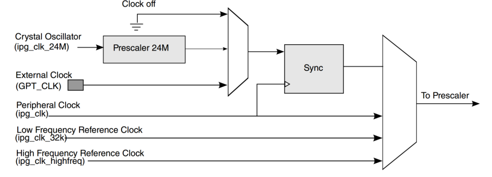

选择`ipg_clk=66MHZ`时钟频率。

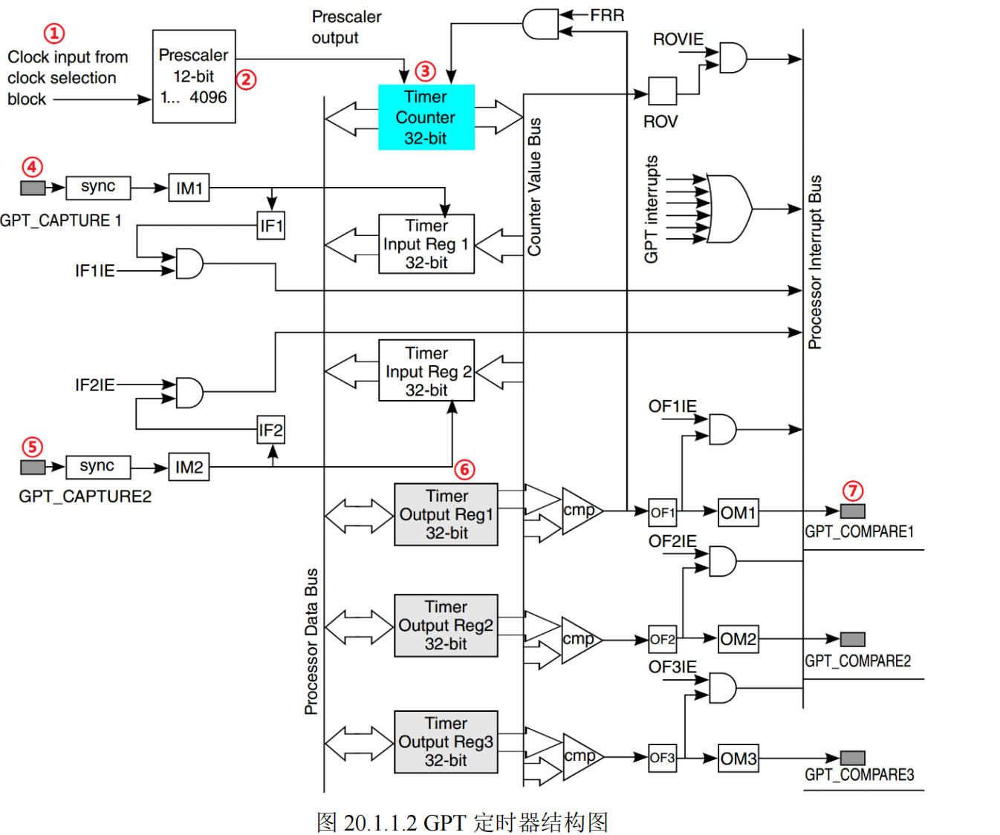

3为GPT内部32位计数器。4和5为两路输入捕获通道。6为三路输出比较中断，当计数器里面的值和输出比较寄存器里面的比较值相等就会触发输出比较中断。

## 1.3 运行模式

GPT 定时器有两种工作模式：重新启动(restart)模式和自由运行(free-run)模式。

**重新启动(restart)模式**：当 GPTx_CR(x=1，2)寄存器的 FRR 位清零的时候 GPT 工作在此模式。在此模式下，当计数值和比较寄存器中的值相等的话计数值就会清零，然后重新从0X00000000 开始向上计数，只有比较通道 1 才有此模式！向比较通道 1 的比较寄存器写入任何数据都会复位 GPT 计数器。

**自由运行(free-run)模式**：当 GPTx_CR(x=1，2)寄存器的 FRR 位置 1 时候 GPT 工作在此模式下，此模式适用于所有三个比较通道，当比较事件发生以后并不会复位计数器，而是继续计数，直到计数值为 0XFFFFFFFF，然后重新回滚到 0X00000000。

## 1.4 GPT定时器内部重要寄存器

### 1.4.1 GPTx_CR

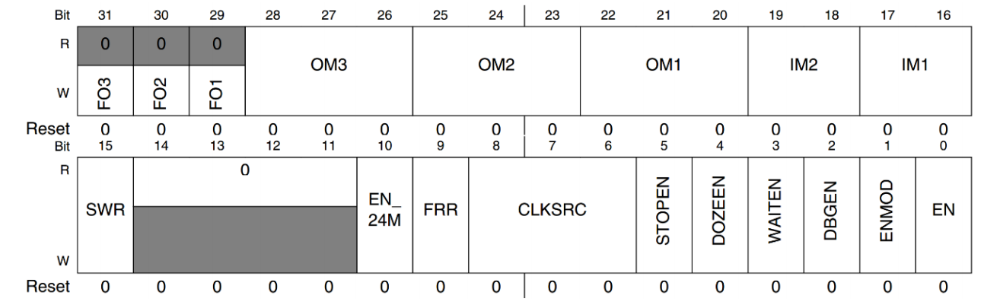

**SWR(bit15)**：复位 GPT 定时器，向此位写 1 就可以复位 GPT 定时器，当 GPT 复位完成以后此为会自动清零。

**FRR(bit9)**：运行模式选择，当此位为 0 的时候比较通道 1 工作在重新启动(restart)模式。当此位为 1 的时候所有的三个比较通道均工作在自由运行模式(free-run)。

**CLKSRC(bit8:6)**：GPT 定时器时钟源选择位，为 0 的时候关闭时钟源；为 1 的时候选择ipg_clk 作为时钟源；为 2 的时候选择 ipg_clk_highfreq 为时钟源；为 3 的时候选择外部时钟为时钟源；为 4 的时候选择 ipg_clk_32k 为时钟源；为 5 的时候选择 ip_clk_24M 为时钟源。本章例程选择 ipg_clk 作为 GPT 定时器的时钟源，因此此位设置位 1(0b001)。

**ENMOD(bit1)**：GPT 使能模式，此位为 0 的时候如果关闭 GPT 定时器，计数器寄存器保存定时器关闭时候的计数值。此位为 1 的时候如果关闭 GPT 定时器，计数器寄存器就会清零。

**EN(bit)**：GPT 使能位，为 1 的时候使能 GPT 定时器，为 0 的时候关闭 GPT 定时器。

### 1.4.2 GPTx_PR

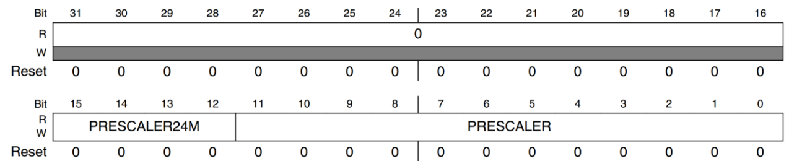

寄存器 GPTx_PR 用到的重要位就一个：PRESCALER(bit11:0)，这就是 12 位分频值，可设置 0~4095，分别对应 1~4096 分频。

### 1.4.3 GPTx_SR

GPT 定时器的状态寄存器。

**ROV(bit5)**：回滚标志位，当计数值从 0XFFFFFFFF 回滚到 0X00000000 的时候此位置 1。

### 1.4.4 GPTx_CNT

保存着 GPT 定时器的当前计数值。最后看一下 GPT 定时器的输出比较寄存器 GPTx_OCR，每个输出比较通道对应一个输出比较寄存器，因此一个 GPT 定时器有三个 OCR 寄存器，它们的作都是相同的。以输出比较通道 1 为例，其输出比较寄存器为 GPTx_OCR1，这是一个 32 位寄存器，用于存放 32 位的比较值。当计数器值和寄存器 GPTx_OCR1 中的值相等就会产生比较事件，如果使能了比较中断的话就会触发相应的中断。

---

## 1.5 代码分析

### 1.5.1 协处理器

由于GIC控制器的寄存器基地址存在CP15协处理器中。CP15 协处理器一般用于存储系统管理，但是在中断中也会使用到，CP15 协处理器一共有16 个 32 位寄存器。CP15 协处理器的访问通过如下另个指令完成：

```assembly
MCR{cond} p#, <expression1>, Rd, Cn, Cm{, <expression2>}
```

- {cond}：条件码（可选）

- p#：协处理器编号（0-15）

- <expression1>：协处理器操作码1

- Rd：ARM寄存器，包含要写入的数据

- Cn：协处理器寄存器编号

- Cm：协处理器寄存器编号

- <expression2>：协处理器操作码2

**MRC:** 将 CP15 协处理器中的寄存器数据读到 ARM 寄存器中。

**MCR:** 将 ARM 寄存器的数据写入到 CP15 协处理器寄存器中。

假如我们要将 CP15 中 C0 寄存器的值读取到 R0 寄存器中，那么就可以使用如下命令：

```assembly
MRC p15, 0, r0, c0, c0, 0
```

CP15 协处理器有 16 个 32 位寄存器，c0~c15，先看一下 c0、c1、c12 和 c15 这四个寄存器。

1. C0寄存器
   **bit31:24**：厂商编号，0X41，ARM。
   **bit23:20**：内核架构的主版本号，ARM 内核版本一般使用 rnpn 来表示，比如 r0p1，其中 r0后面的 0 就是内核架构主版本号。
   **bit19:16**：架构代码，0XF，ARMv7 架构。
   **bit15:4**：内核版本号，0XC07，Cortex-A7 MPCore 内核。
   **bit3:0**：内核架构的次版本号，rnpn 中的 pn，比如 r0p1 中 p1 后面的 1 就是次版本号。

2. C1寄存器
   当 MRC/MCR 指令中的 CRn=c1，opc1=0，CRm=c0，opc2=0 的时候就表示此时的 c1 就是 SCTLR 寄存器，也就是系统控制寄存器，这个是 c1 的基本作用。SCTLR 寄存器主要是完成控制功能的，比如使能或者禁止 MMU、I/D Cache 等。

3. C12寄存器
   当 MRC/MCR 指令中的 CRn=c12，opc1=0，CRm=c0，opc2=0 的时候就表示此时 c12 为 VBAR 寄存器，也就是向量表基地址寄存器。设置中断向量表偏移的时候就需要将新的中断向量表基地址写入 VBAR 中，

4. C15寄存器
   c15 作为 CBAR 寄存器，因为 GIC 的基地址就保存在 CBAR中，我们可以通过如下命令获取到 GIC 基地址：
   
   ```assembly
   MRC p15, 4, r1, c15, c0, 0 ; 获取 GIC 基础地址，基地址保存在 r1 中。
   ```
   
   获取到 GIC 基地址以后就可以设置 GIC 相关寄存器了，比如我们可以读取当前中断 ID，当前中断 ID 保存在 GICC_IAR 中，寄存器 GICC_IAR 属于 CPU 接口端寄存器，寄存器地址相对于 CPU 接口端起始地址的偏移为 0XC，因此获取当前中断 ID 的代码如下：
   
   ```assembly
   MRC p15, 4, r1, c15, c0, 0 ;获取 GIC 基地址
   ADD r1, r1, #0X2000 ;GIC 基地址加 0X2000 得到 CPU 接口端寄存器起始地址
   LDR r0, [r1, #0XC] ;读取 CPU 接口端起始地址+0XC 处的寄存器值，也就是寄存器 ;GIC_IAR 的值
   ```

### 1.5.2 中断使能

#### 1 **IRQ** **和** **FIQ** **总中断使能**

寄存器 CPSR 的 I=1 禁止 IRQ，当 I=0 使能 IRQ；F=1 禁止 FIQ，F=0 使能 FIQ。

| 指令      | 描述        |
| ------- | --------- |
| cpsid i | 禁止 IRQ 中断 |
| cpsie i | 使能 IRQ 中断 |
| cpsid f | 禁止 FIQ 中断 |
| cpsie f | 使能 FIQ 中断 |

#### 2 **ID0~ID1019** **中断使能和禁止**

GIC 寄存器 GICD_ISENABLERn 和 GICD_ ICENABLERn 用来完成外部中断的使能和禁止，对于 Cortex-A7 内核来说中断 ID 只使用了 512 个。一个 bit 控制一个中断 ID 的使能，那么就需要 512/32=16 个 GICD_ISENABLER 寄存器来完成中断的使能。同理，也需要 16 个GICD_ICENABLER 寄存器来完成中断的禁止。其中 GICD_ISENABLER0 的 bit[15:0]对应ID15~0 的 SGI 中断，GICD_ISENABLER0 的 bit[31:16]对应 ID31~16 的 PPI 中断。

#### 3 中断优先级

1. `GICC_PMR` 寄存器，此寄存器用来决定使用几级优先级，`GICC_PMR `寄存器只有低 8 位有效，这 8 位最多可以设置 256 个优先级。
2. `GICC_BPR`，抢占优先级和子优先级。一般将所有的中断优先级位都配置为抢占优先级，比如 I.MX6U 的优先级位数为 5(32 个优先级)，所以可以设置 Binary point 为 2，表示 5 个优先级位全部为抢占优先级。
3. 某个中断 ID 的中断优先级设置由寄存器`D_IPRIORITYR `来完成。Cortex-A7 使用了 512 个中断 ID，每个中断 ID 配有一个优先级寄存器，所以一共有 512 个 `D_IPRIORITYR` 寄存器。
   
   

# 2 Uboot-顶层Makefile 分析

## 2.1 .uboot.xxx_cmd文件

u-boot.xxx_cmd 是一系列的文件，这些文件都是编译生成的，都是一些命令文件，比如文件.u-boot.bin.cmd。

```makefile
cmd_u-boot.bin := cp u-boot-nodtb.bin u-boot.bin
```

`u-boot.bin`为`u-boot-nodtb.bin`的重命名。文件`cmd_u-boot.bin **:=** cp u-boot-nodtb.bin u-boot.bin`用于生成`uboot.nodtb.bin`。

```makefile
cmd_u-boot-nodtb.bin := arm-linux-gnueabihf-objcopy --gap-fill=0xff -j .text -j .secure_text -j .rodata -j .hash -j .data -j .got -j .got.plt -j .u_boot_list -j .rel.dyn -O binary  u-boot u-boot-nodtb.bin
```

arm-linux-gnueabihf-objcopy，使用 objcopy 将 ELF 格式的 u-boot 文件转换为二进制的 u-boot-nodtb.bin 文件。文件.u-boot.cmd 用于生成 u-boot，该文件`u-boot`为ELF格式的文件。

```makefile
cmd_u-boot := arm-linux-gnueabihf-ld.bfd  -pie --gc-sections -Bstatic -Ttext 0x87800000 -o u-boot -T u-boot.lds arch/arm/cpu/armv7/start.o --start-group  arch/arm/cpu/built-in.o  arch/arm/cpu/armv7/built-in.o  arch/arm/imx-common/built-in.o  arch/arm/lib/built-in.o  board/freescale/common/built-in.o  board/freescale/mx6ullevk/built-in.o  cmd/built-in.o  common/built-in.o  disk/built-in.o  drivers/built-in.o  drivers/dma/built-in.o  drivers/gpio/built-in.o  drivers/i2c/built-in.o  drivers/mmc/built-in.o  drivers/mtd/built-in.o  drivers/mtd/onenand/built-in.o  drivers/mtd/spi/built-in.o  drivers/net/built-in.o  drivers/net/phy/built-in.o  drivers/pci/built-in.o  drivers/power/built-in.o  drivers/power/battery/built-in.o  drivers/power/fuel_gauge/built-in.o  drivers/power/mfd/built-in.o  drivers/power/pmic/built-in.o  drivers/power/regulator/built-in.o  drivers/serial/built-in.o  drivers/spi/built-in.o  drivers/usb/dwc3/built-in.o  drivers/usb/emul/built-in.o  drivers/usb/eth/built-in.o  drivers/usb/gadget/built-in.o  drivers/usb/gadget/udc/built-in.o  drivers/usb/host/built-in.o  drivers/usb/musb-new/built-in.o  drivers/usb/musb/built-in.o  drivers/usb/phy/built-in.o  drivers/usb/ulpi/built-in.o  fs/built-in.o  lib/built-in.o  net/built-in.o  test/built-in.o  test/dm/built-in.o --end-group arch/arm/lib/eabi_compat.o  -L /usr/local/arm/gcc-linaro-4.9.4-2017.01-x86_64_arm-linux-gnueabihf/bin/../lib/gcc/arm-linux-gnueabihf/4.9.4 -lgcc -Map u-boot.map

```

.u-boot.cmd 使用到了 arm-linux-gnueabihf-ld.bfd，也就是链接工具，使用 ld.bfd 将各个 builtin.o 文件链接在一起就形成了 u-boot 文件。uboot 在编译的时候会将同一个目录中的所有.c 文件都编译在一起，并命名为 built-in.o。

## 2.2 Uboot顶层Makefile分析

make支持递归调用，Makefile 中使用“make”命令来执行其他的 Makefile文件，一般都是子目录中的 Makefile 文件。主目录的 Makefile 可以使用如下代码来编译这个子目录：

```makefile
$(MAKE) -C subdir
```

该命令可调用make目录，-C为指定目录。通过export可以向子make传递变量，unexport不将变量传递给子make。

```makefile
export VARIABLE ……  #导出变量给子 make 
unexport VARIABLE ……  #不导出变量给子 make
```

有两个特殊的变量：`SHELL`和`MAKEFLAGS`，这两个变量除非使用“unexport”声明，否则的话在整个make的执行过程中，它们的值始终自动的传递给子make。在uboot的主Makefile中有如下代码：

```makefile
MAKEFLAGS += -rR --include-dir=$(CURDIR)
```

如make -s，那么s就是一个MAKEFLAGS。

## 2.3 命令输出/静默输出/编译结果输出目录/代码检查/模块编译

### 2.3.1 命令输出

```makefile
ifeq ("$(origin V)", "command line")
  KBUILD_VERBOSE = $(V)
endif
ifndef KBUILD_VERBOSE
  KBUILD_VERBOSE = 0
endif

ifeq ($(KBUILD_VERBOSE),1)
  quiet =
  Q =
else
  quiet=quiet_
  Q = @
endif
```

> `origin V`表示V的来源，若来源于command line 则继续往下执行。Makefile 中会用到变量 quiet 和 Q 来控制编译的时候是否在终端输出完整的命令。

顶层中可以见到，`$(Q)$(MAKE) $(build)=tools`。在命令前加上@make这样就不会在终端输出命令，`quiet_`的意思是输出短命令。

### 2.3.2 静默输出

```makefile
ifneq ($(filter 4.%,$(MAKE_VERSION)),)    # make-4
ifneq ($(filter %s ,$(firstword x$(MAKEFLAGS))),)
  quiet=silent_
endif
else                    # make-3.8x
ifneq ($(filter s% -s%,$(MAKEFLAGS)),)
  quiet=silent_
endif
endif

export quiet Q KBUILD_VERBOSE
```

> 这里的`MAKE_VERSION`和`MAKEFLAGS`为内置变量。

当make -s时，会将-s参数传递给MAKEFLAGS，此时quiet=silent。

### 2.3.3 设置编译结果输出目录

在 make 的时候使用“O”来指定输出目录，比如“make O=out”就是设置目标文件输出到 out 目录中。这么做是为了将源文件和编译产生的文件分开。

```makefile
# KBUILD_SRC is set on invocation of make in OBJ directory
# KBUILD_SRC is not intended to be used by the regular user (for now)
ifeq ($(KBUILD_SRC),)

# OK, Make called in directory where kernel src resides
# Do we want to locate output files in a separate directory?
ifeq ("$(origin O)", "command line")
  KBUILD_OUTPUT := $(O)
endif

# That's our default target when none is given on the command line
PHONY := _all
_all:

# Cancel implicit rules on top Makefile
$(CURDIR)/Makefile Makefile: ;

ifneq ($(KBUILD_OUTPUT),)
# Invoke a second make in the output directory, passing relevant variables
# check that the output directory actually exists
saved-output := $(KBUILD_OUTPUT)
KBUILD_OUTPUT := $(shell mkdir -p $(KBUILD_OUTPUT) && cd $(KBUILD_OUTPUT) \
                                && /bin/pwd)
$(if $(KBUILD_OUTPUT),, \
     $(error failed to create output directory "$(saved-output)"))

PHONY += $(MAKECMDGOALS) sub-make

$(filter-out _all sub-make $(CURDIR)/Makefile, $(MAKECMDGOALS)) _all: sub-make
    @:

sub-make: FORCE
    $(Q)$(MAKE) -C $(KBUILD_OUTPUT) KBUILD_SRC=$(CURDIR) \
    -f $(CURDIR)/Makefile $(filter-out _all sub-make,$(MAKECMDGOALS))

# Leave processing to above invocation of make
skip-makefile := 1
endif # ifneq ($(KBUILD_OUTPUT),)
endif # ifeq ($(KBUILD_SRC),)
```

PHONY表示告知make后面不是文件。

`$(CURDIR)/Makefile Makefile: ;`告诉make，makefile文件本身不需要被构建。

`$(filter-out _all sub-make $(CURDIR)/Makefile, $(MAKECMDGOALS)) _all: sub-make`这其中`MAKECMDGOALS`表示用户指定目标。将这些目标的依赖全部标记为`sub-make`。

随后`sub-make:FORCE`，`$(Q)$(MAKE) -C $(KBUILD_OUTPUT) `-c切换至指定目录。`KBUILD_SRC=$(CURDIR)`设置环境变量即源码目录为当前目录。`-f $(CURDIR)/Makefile`使用指定路径的makefile。`-f`表示指定文件。

### 2.3.4 代码检查

```makefile
ifeq ("$(origin C)", "command line")
  KBUILD_CHECKSRC = $(C)
endif
ifndef KBUILD_CHECKSRC
  KBUILD_CHECKSRC = 0
endif
```

### 2.3.5 模块化编译

```makefile
# Use make M=dir to specify directory of external module to build
# Old syntax make ... SUBDIRS=$PWD is still supported
# Setting the environment variable KBUILD_EXTMOD take precedence
ifdef SUBDIRS
  KBUILD_EXTMOD ?= $(SUBDIRS)
endif

ifeq ("$(origin M)", "command line")
  KBUILD_EXTMOD := $(M)
endif

# If building an external module we do not care about the all: rule
# but instead _all depend on modules
PHONY += all
ifeq ($(KBUILD_EXTMOD),)
_all: all
else
_all: modules
endif

ifeq ($(KBUILD_SRC),)
        # building in the source tree
        srctree := .
else
        ifeq ($(KBUILD_SRC)/,$(dir $(CURDIR)))
                # building in a subdirectory of the source tree
                srctree := ..
        else
                srctree := $(KBUILD_SRC)
        endif
endif
objtree        := .
src        := $(srctree)
obj        := $(objtree)

VPATH        := $(srctree)$(if $(KBUILD_EXTMOD),:$(KBUILD_EXTMOD))

export srctree objtree VPATH

# Make sure CDPATH settings don't interfere
unexport CDPATH
```

首先还是判断M的来源，若指定了m则`KBUILD_EXTMOD`为其m的指定值。

接下来确定srctree的路径。

VPATH为make的内置变量，用于指定查找源文件的搜索路径，当make在当前目录找不到某个文件时，会在VPATH指定的路径中查找。VPATH为通过`:`将路径进行分割。

## 2.4 获取主机架构和系统

```makefile
HOSTARCH := $(shell uname -m | \
    sed -e s/i.86/x86/ \
        -e s/sun4u/sparc64/ \
        -e s/arm.*/arm/ \
        -e s/sa110/arm/ \
        -e s/ppc64/powerpc/ \
        -e s/ppc/powerpc/ \
        -e s/macppc/powerpc/\
        -e s/sh.*/sh/)

HOSTOS := $(shell uname -s | tr '[:upper:]' '[:lower:]' | \
        sed -e 's/\(cygwin\).*/cygwin/')

export    HOSTARCH HOSTOS
```

 这里`sed`为Stream Editor（流编辑器），用于文本处理和转换。sed 进行多次替换，每个 -e 参数代表一个替换规则。这里`sed -e s/i.86/x86/ `就表示将`i.86`替换为x86。

`HOSTOS := $(shell uname -s | tr '[:upper:]' '[:lower:]' | sed -e 's/\(cygwin\).*/cygwin/')`这里表示首先使用`uname -s`获取系统OS如`Linux`，后面tr将其转换为小写`linux`，并将其作为输入给到sed，替换其中cygwin.*内容为`cygwin`。

## 2.5 设置目标架构、交叉编译器和配置文件

```makefile
# set default to nothing for native builds
ifeq ($(HOSTARCH),$(ARCH))
CROSS_COMPILE ?=
endif

KCONFIG_CONFIG    ?= .config
export KCONFIG_CONFIG

# SHELL used by kbuild
CONFIG_SHELL := $(shell if [ -x "$$BASH" ]; then echo $$BASH; \
      else if [ -x /bin/bash ]; then echo /bin/bash; \
      else echo sh; fi ; fi)

HOSTCC       = cc
HOSTCXX      = c++
HOSTCFLAGS   = -Wall -Wstrict-prototypes -O2 -fomit-frame-pointer
HOSTCXXFLAGS = -O2

ifeq ($(HOSTOS),cygwin)
HOSTCFLAGS    += -ansi
endif
```

看到第3行CROSS_COMPILE，此处CROSS_COMPILE若未定义则为空，CROSS_COMPILE可从命令行赋值，如make ARCH=arm CROSS_COMPILE=arm-linux-gnueabihf-指定。make中变量查找按如下顺序：

```txt
   1. 命令行参数（最高优先级）
   2. 环境变量
   3. Makefile中的赋值
   4. 默认值
```

`KCONFIG_CONFIG    ?= .config`此处是将字符串`.config`赋值给`KCONFIG_CONFIG`，后面可以用`include $(KCONFIG_CONFIG)`的方式包含.config这个文件。

## 2.6 调用 scripts/Kbuild.include && 交叉编译工具变量设置

主makefile会调用文件 `scripts/Kbuild.include`。

```makefile
scripts/Kbuild.include: ;
include scripts/Kbuild.include
```

这里包含`scripts/Kbuild.include`，这个里面定义了很多变量。`scripts/Kbuild.include: ;`这里之所以要这样写是因为，如果Kbuild.include不存在会报错，这样写就不会报错了。`;`为一个空命令。

```makefile
AS        = $(CROSS_COMPILE)as
# Always use GNU ld
ifneq ($(shell $(CROSS_COMPILE)ld.bfd -v 2> /dev/null),)
LD        = $(CROSS_COMPILE)ld.bfd
else
LD        = $(CROSS_COMPILE)ld
endif
CC        = $(CROSS_COMPILE)gcc
CPP        = $(CC) -E
AR        = $(CROSS_COMPILE)ar
NM        = $(CROSS_COMPILE)nm
LDR        = $(CROSS_COMPILE)ldr
STRIP        = $(CROSS_COMPILE)strip
OBJCOPY        = $(CROSS_COMPILE)objcopy
OBJDUMP        = $(CROSS_COMPILE)objdump
AWK        = awk
PERL        = perl
PYTHON        = python
DTC        = dtc
CHECK        = sparse
```

这里设置交叉编译工具。

接下来导出了其他变量，一些变量定义在`config.mk`文件中，在makefile后面会通过include来包含config.mk文件。config.mk中一些值比如`CONFIG_SYS_ARCH`会定义在`.config`文件中。

## 2.7 Make xxx_defconfig

```makefile
# To make sure we do not include .config for any of the *config targets
# catch them early, and hand them over to scripts/kconfig/Makefile
# It is allowed to specify more targets when calling make, including
# mixing *config targets and build targets.
# For example 'make oldconfig all'.
# Detect when mixed targets is specified, and make a second invocation
# of make so .config is not included in this case either (for *config).

version_h := include/generated/version_autogenerated.h
timestamp_h := include/generated/timestamp_autogenerated.h

no-dot-config-targets := clean clobber mrproper distclean \
             help %docs check% coccicheck \
             ubootversion backup

config-targets := 0
mixed-targets  := 0
dot-config     := 1

ifneq ($(filter $(no-dot-config-targets), $(MAKECMDGOALS)),)
    ifeq ($(filter-out $(no-dot-config-targets), $(MAKECMDGOALS)),)
        dot-config := 0
    endif
endif

ifeq ($(KBUILD_EXTMOD),)
        ifneq ($(filter config %config,$(MAKECMDGOALS)),)
                config-targets := 1
                ifneq ($(words $(MAKECMDGOALS)),1)
                        mixed-targets := 1
                endif
        endif
endif

ifeq ($(mixed-targets),1)
# ===========================================================================
# We're called with mixed targets (*config and build targets).
# Handle them one by one.

PHONY += $(MAKECMDGOALS) __build_one_by_one

$(filter-out __build_one_by_one, $(MAKECMDGOALS)): __build_one_by_one
    @:

__build_one_by_one:
    $(Q)set -e; \
    for i in $(MAKECMDGOALS); do \
        $(MAKE) -f $(srctree)/Makefile $$i; \
    done

else
ifeq ($(config-targets),1)
# ===========================================================================
# *config targets only - make sure prerequisites are updated, and descend
# in scripts/kconfig to make the *config target

KBUILD_DEFCONFIG := sandbox_defconfig
export KBUILD_DEFCONFIG KBUILD_KCONFIG

config: scripts_basic outputmakefile FORCE
    $(Q)$(MAKE) $(build)=scripts/kconfig $@

%config: scripts_basic outputmakefile FORCE
    $(Q)$(MAKE) $(build)=scripts/kconfig $@

else
# ===========================================================================
# Build targets only - this includes vmlinux, arch specific targets, clean
# targets and others. In general all targets except *config targets.

ifeq ($(dot-config),1)
# Read in config
-include include/config/auto.conf

# Read in dependencies to all Kconfig* files, make sure to run
# oldconfig if changes are detected.
-include include/config/auto.conf.cmd

# To avoid any implicit rule to kick in, define an empty command
$(KCONFIG_CONFIG) include/config/auto.conf.cmd: ;
```

第20行，等于MAKECMDGOALS中筛选符合no-dot-config-targets若不为空则就成立，此处过滤后明显为空，因此dot-config继续为1。

第26行，若KBUILD_EXTMOD为空则成立，此处为空，条件成立。27行，当我们输入符合config的命令时，条件成立，config-targets := 1，继续往下`ifneq ($(words $(MAKECMDGOALS)),1)`判断了MAKECMDGOALS中word的个数，此时个数为1，条件不符合。

第52行，条件成立。基于模式匹配规则，执行第63行。64行为主命令，63行为scripts_basic和outputmakefile等为依赖。FORCE 没有规则和依赖的，所以每次都会重新生成 FORCE。当 FORCE 作为其他目标的依赖时，由于 FORCE 总是被更新过的，因此依赖所在的规则总是会执行的。

```makefile
# Basic helpers built in scripts/
PHONY += scripts_basic
scripts_basic:
    $(Q)$(MAKE) $(build)=scripts/basic
    $(Q)rm -f .tmp_quiet_recordmcount

# To avoid any implicit rule to kick in, define an empty command.
scripts/basic/%: scripts_basic ;

PHONY += outputmakefile
# outputmakefile generates a Makefile in the output directory, if using a
# separate output directory. This allows convenient use of make in the
# output directory.
outputmakefile:
ifneq ($(KBUILD_SRC),)
    $(Q)ln -fsn $(srctree) source
    $(Q)$(CONFIG_SHELL) $(srctree)/scripts/mkmakefile \
        $(srctree) $(objtree) $(VERSION) $(PATCHLEVEL)
endif
```

此处为scripts_basic和outmakefile的构建。变量 build 是在 scripts/Kbuild.include 文件中有定义。

`build := -f $(srctree)/scripts/Makefile.build obj`，因此build为`build=-f ./scripts/Makefile.build obj`，scripts_basic 展开以后如下：

```makefile
scripts_basic:
@make -f ./scripts/Makefile.build obj=scripts/basic //也可以没有@，视配置而定
@rm -f . tmp_quiet_recordmcount //也可以没有@
```

scripts_basic 会调用文件./scripts/Makefile.build。可以看到不管是%config还是scripts_basic目标的构建都和`make -f ./scripts/Makefile.build`有关系。

## 2.8 Makefile build

### 2.8.1 Scripts_basic

“make xxx_defconfig“配置 uboot 的时候如下两行命令会执行脚本

```makefile
scripts/Makefile.build：

@make -f ./scripts/Makefile.build obj=scripts/basic

@make -f ./scripts/Makefile.build obj=scripts/kconfig xxx_defconfig
```

在scripts/Makefile.build中可见如下代码：

```makefile
# Modified for U-Boot
prefix := tpl
src := $(patsubst $(prefix)/%,%,$(obj))
ifeq ($(obj),$(src))
prefix := spl
src := $(patsubst $(prefix)/%,%,$(obj))
ifeq ($(obj),$(src))
prefix := .
endif
endif
```

prefix为`.`当前目录，src=scripts/basic。继续往下：

```makefile
# Read auto.conf if it exists, otherwise ignore
# Modified for U-Boot
-include include/config/auto.conf
-include $(prefix)/include/autoconf.mk
include scripts/Makefile.uncmd_spl

include scripts/Kbuild.include

# For backward compatibility check that these variables do not change
save-cflags := $(CFLAGS)

# The filename Kbuild has precedence over Makefile
kbuild-dir := $(if $(filter /%,$(src)),$(src),$(srctree)/$(src))
kbuild-file := $(if $(wildcard $(kbuild-dir)/Kbuild),$(kbuild-dir)/Kbuild,$(kbuild-dir)/Makefile)
include $(kbuild-file)
```

kbuild-dir为`./scripts/basic`,kbuild-file为./scripts/basic/Makefile。

```makefile
# We keep a list of all modules in $(MODVERDIR)

__build: $(if $(KBUILD_BUILTIN),$(builtin-target) $(lib-target) $(extra-y)) \
     $(if $(KBUILD_MODULES),$(obj-m) $(modorder-target)) \
     $(subdir-ym) $(always)
    @:
```

这里__build为默认目标，命令“@make -f ./scripts/Makefile.build obj=scripts/basic”没有指定目标，所以会使用到默认目标：__build。在顶层 Makefile 中，KBUILD_BUILTIN 为 1，KBUILD_MODULES 为 0，因此展开后目标__build 为：

```makefile
__build:$(builtin-target) $(lib-target) $(extra-y)) $(subdir-ym) $(always)
@:
```

这5个依赖只有always有内容，最终为：

```makefile
_build: scripts/basic/fixdep
@:
```

scripts_basic 目标的作用就是编译出 scripts/basic/fixdep。

### 2.8.2 %config 目标对应的命令

Makefilke.build 会读取 scripts/kconfig/Makefile 中的内容，此文件有如下所示内容：

```makefile
%_defconfig: $(obj)/conf
    $(Q)$< $(silent) --defconfig=arch/$(SRCARCH)/configs/$@ $(Kconfig)

# Added for U-Boot (backward compatibility)
%_config: %_defconfig
    @:
```

目标%\_defconfig 刚好和我们输入的 xxx_defconfig 匹配，依赖为obj，展开为是 scripts/kconfig/conf。得到 scripts/kconfig/conf 以后就要执行目标%_defconfig 的命令：

```makefile
$(Q)$< $(silent) --defconfig=arch/$(SRCARCH)/configs/$@ $(Kconfig)
```

展开后为：

```makefile
@ scripts/kconfig/conf --defconfig=arch/../configs/xxx_defconfig Kconfig
```

这里会将mx6ull_alientek_emmc_defconfig 中的配置输出到.config 文件中，最终生成 uboot 根目录下的.config 文件。

因此make xxx_defconfig，会干两件事情：

1. 编译出fixdep.c；
2. 生成.config文件；

## 2.9 make过程

配置好 uboot 以后就可以直接 make 编译了，如果不使用模块编译，那么_all=all。

```makefile
PHONY += all
ifeq ($(KBUILD_EXTMOD),)
_all: all
else
_all: modules
endif
```

在主 Makefile 中 all 目标规则如下：

```makefile
all:        $(ALL-y)
ifneq ($(CONFIG_SYS_GENERIC_BOARD),y)
    @echo "===================== WARNING ======================"
    @echo "Please convert this board to generic board."
    @echo "Otherwise it will be removed by the end of 2014."
    @echo "See doc/README.generic-board for further information"
    @echo "===================================================="
endif
ifeq ($(CONFIG_DM_I2C_COMPAT),y)
    @echo "===================== WARNING ======================"
    @echo "This board uses CONFIG_DM_I2C_COMPAT. Please remove"
    @echo "(possibly in a subsequent patch in your series)"
    @echo "before sending patches to the mailing list."
    @echo "===================================================="
endif
```

all依赖于All-y，ALL-y如下：

```makefile
# Always append ALL so that arch config.mk's can add custom ones
ALL-y += u-boot.srec u-boot.bin u-boot.sym System.map u-boot.cfg binary_size_check

ALL-$(CONFIG_ONENAND_U_BOOT) += u-boot-onenand.bin
ifeq ($(CONFIG_SPL_FSL_PBL),y)
ALL-$(CONFIG_RAMBOOT_PBL) += u-boot-with-spl-pbl.bin
else
ifneq ($(CONFIG_SECURE_BOOT), y)
# For Secure Boot The Image needs to be signed and Header must also
# be included. So The image has to be built explicitly
ALL-$(CONFIG_RAMBOOT_PBL) += u-boot.pbl
endif
endif
ALL-$(CONFIG_SPL) += spl/u-boot-spl.bin
ALL-$(CONFIG_SPL_FRAMEWORK) += u-boot.img
ALL-$(CONFIG_TPL) += tpl/u-boot-tpl.bin
ALL-$(CONFIG_OF_SEPARATE) += u-boot.dtb
ifeq ($(CONFIG_SPL_FRAMEWORK),y)
ALL-$(CONFIG_OF_SEPARATE) += u-boot-dtb.img
endif
ALL-$(CONFIG_OF_HOSTFILE) += u-boot.dtb
ifneq ($(CONFIG_SPL_TARGET),)
ALL-$(CONFIG_SPL) += $(CONFIG_SPL_TARGET:"%"=%)
endif
ALL-$(CONFIG_REMAKE_ELF) += u-boot.elf
ALL-$(CONFIG_EFI_APP) += u-boot-app.efi
ALL-$(CONFIG_EFI_STUB) += u-boot-payload.efi

ifneq ($(BUILD_ROM),)
ALL-$(CONFIG_X86_RESET_VECTOR) += u-boot.rom
endif
```

ALL-y 主要包含 u-boot.srec、u-boot.bin、u-boot.sym、System.map、u-boot.cfg 和 binary_size_check 这几个文件，其他文件的包含再根据配置的不同而不同。ALL-y中的u-boot.bin就是最终我们所需要的文件。

```makefile
u-boot.bin: u-boot-dtb.bin FORCE
    $(call if_changed,copy)
else
u-boot.bin: u-boot-nodtb.bin FORCE
    $(call if_changed,copy)
endif
```

这里的if_changed是一个函数，当一些先决条件比目标新的时候，或者命令行有改变的时候，if_changed 就会执行一些命令。从u-boot-nodtb.bin 可生成 u-boot.bin。u-boot-nodtb.bin依赖于u-boot。目标 u-boot 依赖于 u-boot_init、u-boot-main 和 u-boot.lds，u-boot_init 和 u-boot-main 是两个变量，在顶层 Makefile 中有定义，值如下：

```makefile
u-boot-init := $(head-y)
u-boot-main := $(libs-y)
```

`head-y := arch/arm/cpu/$(CPU)/start.o`，$(libs-y)在顶层 Makefile 中被定义为 uboot 所有子目录下 build-in.o 的集合，代码如下：

```makefile
AVE_VENDOR_COMMON_LIB = $(if $(wildcard $(srctree)/board/$(VENDOR)/common/Makefile),y,n)

libs-y += lib/
libs-$(HAVE_VENDOR_COMMON_LIB) += board/$(VENDOR)/common/
libs-$(CONFIG_OF_EMBED) += dts/
libs-y += fs/
libs-y += net/
libs-y += disk/
libs-y += drivers/
libs-y += drivers/dma/
libs-y += drivers/gpio/
libs-y += drivers/i2c/
libs-y += drivers/mmc/
libs-y += drivers/mtd/
libs-$(CONFIG_CMD_NAND) += drivers/mtd/nand/
libs-y += drivers/mtd/onenand/
libs-$(CONFIG_CMD_UBI) += drivers/mtd/ubi/
libs-y += drivers/mtd/spi/
libs-y += drivers/net/
libs-y += drivers/net/phy/
libs-y += drivers/pci/
libs-y += drivers/power/ \
    drivers/power/fuel_gauge/ \
    drivers/power/mfd/ \
    drivers/power/pmic/ \
    drivers/power/battery/ \
    drivers/power/regulator/
libs-y := $(patsubst %/, %/built-in.o, $(libs-y))
```

最后调用函数数 patsubst，将 libs-y 中的“/”替换为”/built-in.o”，相当于将 libs-y 改为所有子目录中 built-in.o 文件的集合。该规则就相当于将以 u-boot.lds 为链接脚本，将 arch/arm/cpu/armv7/start.o 和各个子目录下的 built-in.o 链接在一起生成 u-boot。

u-boot.lds 的规则如下：

```makefile
u-boot.lds: $(LDSCRIPT) prepare FORCE
 $(call if_changed_dep,cpp_lds)
```

各子目录下的 built-in.o 是怎么生成的，以 drivers/gpio/built-in.o 为例，在drivers/gpio/目录下会有个名为.built-in.o.cmd 的文件，此文件内容如下：

接下来的重点就是各子目录下的 built-in.o 是怎么生成的，以 drivers/gpio/built-in.o 为例，在drivers/gpio/目录下会有个名为.built-in.o.cmd 的文件，此文件内容如下：

```makefile
cmd_drivers/gpio/built-in.o := arm-linux-gnueabihf-ld.bfd -r -o drivers/gpio/built-in.o drivers/gpio/mxc_gpio.o
```

drivers/gpio/built-in.o 这个文件是使用 ld 命令由文件 drivers/gpio/mxc_gpio.o 生成而来的，mxc_gpio.o 是 mxc_gpio.c 编译生成的.o 文件。

最后将所有的.o文件全部链接在一起形成了最后了uboot.bin文件，整体流程图如下：

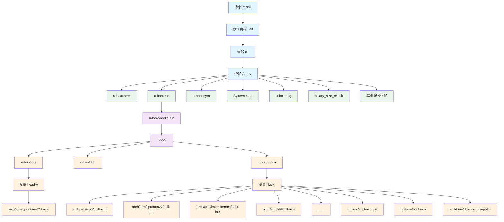

可以看到，一部分生成了start.o另一部分的libs-y生成了所有的.o文件。


# 3 U-Boot启动流程

## 3.1 u-boot.lds 链接脚本

编译u-boot之后会生成一个u-boot.lds的链接脚本文件。链接脚本中会指定一个Entry(_start)的入口函数，该入口函数定义在arch/arm/lib/vectors.S 文件中。

## 3.2 _start

在_start中跳转至save_boot_params_ret函数中设置cpsr寄存器，进入SVC模式，关闭IRQ和FRQ中断，设置向量表地址为0x87800000，设置中断向量表重定位。

最后跳转至函数`bl cpu_init_cp15`和`bl cpu_init_crit`，函数 `cpu_init_cp15 `用来设置 CP15 相关的内容，比如关闭 MMU 啥的。函数`cpu_init_crit`会跳转至`lowlevel_init`函数。

## 3.3 lowlevel_init

```c
#include <asm-offsets.h>
#include <config.h>
#include <linux/linkage.h>

ENTRY(lowlevel_init)
    /*
     * Setup a temporary stack. Global data is not available yet.
     */
    ldr    sp, =CONFIG_SYS_INIT_SP_ADDR
    bic    sp, sp, #7 /* 8-byte alignment for ABI compliance */
#ifdef CONFIG_SPL_DM
    mov    r9, #0
#else
    /*
     * Set up global data for boards that still need it. This will be
     * removed soon.
     */
#ifdef CONFIG_SPL_BUILD
    ldr    r9, =gdata
#else
    sub    sp, sp, #GD_SIZE
    bic    sp, sp, #7
    mov    r9, sp
#endif
#endif
    /*
     * Save the old lr(passed in ip) and the current lr to stack
     */
    push    {ip, lr}

    /*
     * Call the very early init function. This should do only the
     * absolute bare minimum to get started. It should not:
     *
     * - set up DRAM
     * - use global_data
     * - clear BSS
     * - try to start a console
     *
     * For boards with SPL this should be empty since SPL can do all of
     * this init in the SPL board_init_f() function which is called
     * immediately after this.
     */
    bl    s_init
    pop    {ip, pc}
ENDPROC(lowlevel_init)

```

此处`CONFIG_SYS_INIT_SP_ADDR`的定义如下：

```c
#define CONFIG_SYS_INIT_RAM_ADDR IRAM_BASE_ADDR
#define CONFIG_SYS_INIT_RAM_SIZE IRAM_SIZE

#define CONFIG_SYS_INIT_SP_OFFSET \
(CONFIG_SYS_INIT_RAM_SIZE - GENERATED_GBL_DATA_SIZE)
#define CONFIG_SYS_INIT_SP_ADDR \
(CONFIG_SYS_INIT_RAM_ADDR + CONFIG_SYS_INIT_SP_OFFSET)

CONFIG_SYS_INIT_RAM_ADDR = IRAM_BASE_ADDR = 0x00900000。
CONFIG_SYS_INIT_RAM_SIZE = 0x00020000 =128KB。

#define GENERATED_GBL_DATA_SIZE 256
```

因此：

```c
CONFIG_SYS_INIT_SP_OFFSET = 0x00020000 – 256 = 0x1FF00
CONFIG_SYS_INIT_SP_ADDR = 0x00900000 + 0X1FF00 = 0X0091FF00
```

回到最上层代码，`bic    sp, sp, #7 /* 8-byte alignment for ABI compliance */`对第3位清零，8字节对齐处理。sp减去GD_SIZE，大小为248。此时SP位置如下：

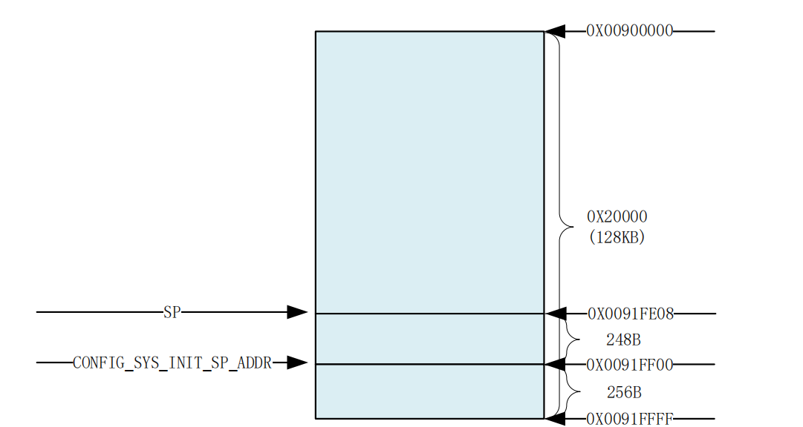

最后，`mov    r9, sp`sp指针给到r9，随后跳转至`s_init`函数。对于imx6ull来说s_init函数就是一个空函数。`save_boot_params_ret`随后跳转至_main函数。    

## 3.3 _main

_main 函数定义在文件 arch/arm/lib/crt0.S 中。

```c
ENTRY(_main)

/*
 * Set up initial C runtime environment and call board_init_f(0).
 */

#if defined(CONFIG_SPL_BUILD) && defined(CONFIG_SPL_STACK)
    ldr    sp, =(CONFIG_SPL_STACK)
#else
    ldr    sp, =(CONFIG_SYS_INIT_SP_ADDR)
#endif
#if defined(CONFIG_CPU_V7M)    /* v7M forbids using SP as BIC destination */
    mov    r3, sp
    bic    r3, r3, #7
    mov    sp, r3
#else
    bic    sp, sp, #7    /* 8-byte alignment for ABI compliance */
#endif
    mov    r0, sp
    bl    board_init_f_alloc_reserve
    mov    sp, r0
    /* set up gd here, outside any C code */
    mov    r9, r0
    bl    board_init_f_init_reserve

    mov    r0, #0
    bl    board_init_f

#if ! defined(CONFIG_SPL_BUILD)

/*
 * Set up intermediate environment (new sp and gd) and call
 * relocate_code(addr_moni). Trick here is that we'll return
 * 'here' but relocated.
 */

    ldr    sp, [r9, #GD_START_ADDR_SP]    /* sp = gd->start_addr_sp */
#if defined(CONFIG_CPU_V7M)    /* v7M forbids using SP as BIC destination */
    mov    r3, sp
    bic    r3, r3, #7
    mov    sp, r3
#else
    bic    sp, sp, #7    /* 8-byte alignment for ABI compliance */
#endif
    ldr    r9, [r9, #GD_BD]        /* r9 = gd->bd */
    sub    r9, r9, #GD_SIZE        /* new GD is below bd */

    adr    lr, here
    ldr    r0, [r9, #GD_RELOC_OFF]        /* r0 = gd->reloc_off */
    add    lr, lr, r0
#if defined(CONFIG_CPU_V7M)
    orr    lr, #1                /* As required by Thumb-only */
#endif
    ldr    r0, [r9, #GD_RELOCADDR]        /* r0 = gd->relocaddr */
    b    relocate_code
here:
/*
 * now relocate vectors
 */

    bl    relocate_vectors

/* Set up final (full) environment */

    bl    c_runtime_cpu_setup    /* we still call old routine here */
#endif
#if !defined(CONFIG_SPL_BUILD) || defined(CONFIG_SPL_FRAMEWORK)
# ifdef CONFIG_SPL_BUILD
    /* Use a DRAM stack for the rest of SPL, if requested */
    bl    spl_relocate_stack_gd
    cmp    r0, #0
    movne    sp, r0
    movne    r9, r0
# endif
    ldr    r0, =__bss_start    /* this is auto-relocated! */

#ifdef CONFIG_USE_ARCH_MEMSET
    ldr    r3, =__bss_end        /* this is auto-relocated! */
    mov    r1, #0x00000000        /* prepare zero to clear BSS */

    subs    r2, r3, r0        /* r2 = memset len */
    bl    memset
#else
    ldr    r1, =__bss_end        /* this is auto-relocated! */
    mov    r2, #0x00000000        /* prepare zero to clear BSS */

clbss_l:cmp    r0, r1            /* while not at end of BSS */
#if defined(CONFIG_CPU_V7M)
    itt    lo
#endif
    strlo    r2, [r0]        /* clear 32-bit BSS word */
    addlo    r0, r0, #4        /* move to next */
    blo    clbss_l
#endif

#if ! defined(CONFIG_SPL_BUILD)
    bl coloured_LED_init
    bl red_led_on
#endif
    /* call board_init_r(gd_t *id, ulong dest_addr) */
    mov     r0, r9                  /* gd_t */
    ldr    r1, [r9, #GD_RELOCADDR]    /* dest_addr */
    /* call board_init_r */
#if defined(CONFIG_SYS_THUMB_BUILD)
    ldr    lr, =board_init_r    /* this is auto-relocated! */
    bx    lr
#else
    ldr    pc, =board_init_r    /* this is auto-relocated! */
#endif
    /* we should not return here. */
#endif

ENDPROC(_main)
```

20行，读取sp指针至r0寄存器中(0X0091FF00)，调用函数`board_init_f_alloc_reserve`，函数 board_init_f_alloc_reserve 主要是留出早期的 malloc 内存区域和 gd 内存区域，其中`CONFIG_SYS_MALLOC_F_LEN=0X400`。

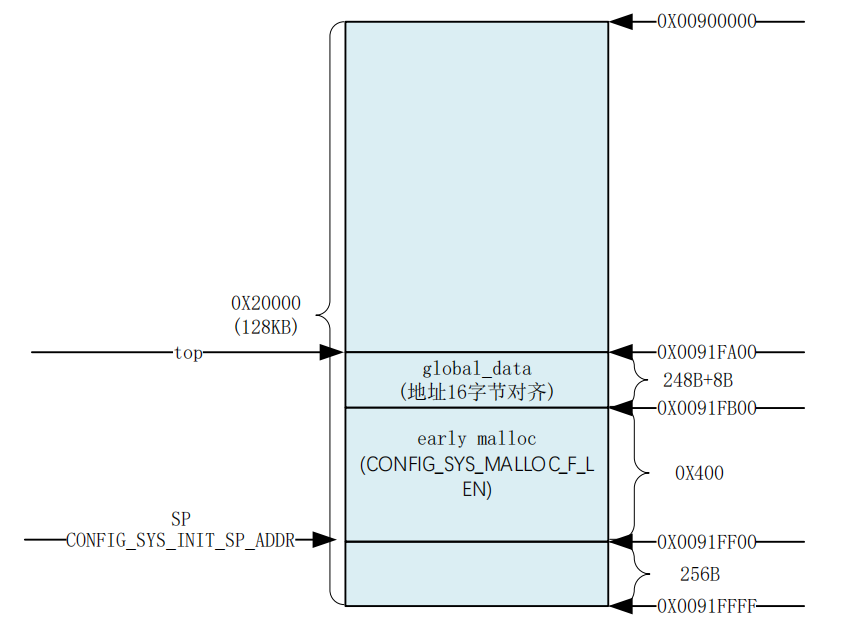

函数`board_init_f_alloc_reserve`返回值为新的 top 值`top=0X0091FA00`。接着继续调用`函数 board_init_f_init_reserve`。

```c
void board_init_f_init_reserve(ulong base)
{
    struct global_data *gd_ptr;
#ifndef _USE_MEMCPY
    int *ptr;
#endif

    /*
     * clear GD entirely and set it up.
     * Use gd_ptr, as gd may not be properly set yet.
     */

    gd_ptr = (struct global_data *)base;
    /* zero the area */
#ifdef _USE_MEMCPY
    memset(gd_ptr, '\0', sizeof(*gd));
#else
    for (ptr = (int *)gd_ptr; ptr < (int *)(gd_ptr + 1); )
        *ptr++ = 0;
#endif
    /* set GD unless architecture did it already */
#if !defined(CONFIG_ARM)
    arch_setup_gd(gd_ptr);
#endif
    /* next alloc will be higher by one GD plus 16-byte alignment */
    base += roundup(sizeof(struct global_data), 16);

    /*
     * record early malloc arena start.
     * Use gd as it is now properly set for all architectures.
     */

#if defined(CONFIG_SYS_MALLOC_F)
    /* go down one 'early malloc arena' */
    gd->malloc_base = base;
    /* next alloc will be higher by one 'early malloc arena' size */
    base += CONFIG_SYS_MALLOC_F_LEN;
#endif
}
```

这部分主要就是为了初始化 gd，gd->malloc_base 为 gd 基地址+gd 大小=0X0091FA00+248=0X0091FAF8，在做 16 字节对齐，最终 `gd->malloc_base=0X0091FB00`，这个也就是 early malloc 的起始地址。

`ldr    sp, [r9, #GD_START_ADDR_SP]`此处会将sp设置为`gd->start_addr_sp=0X9EF44E90`，0X9EF44E90为DDR地址，从这里新的sp和gd将会存放在DDR中。39-40行对齐进行8字节对齐操作。

`ldr    r9, [r9, #GD_BD]`，获取 gd->bd 的地址赋给 r9，此时 r9 存放的是老的 gd，这里通过获取 gd->bd 的地址来计算出新的 gd 的位置。GD_BD=0，

`sub    r9, r9, #GD_SIZE`，新的 gd 在 bd 下面，所以 r9 减去 gd 的大小就是新的 gd 的位置，获取到新的 gd的位置以后赋值给 r9。

main 函数的运行流程，在_main 函数里面调用了 board_init_f、relocate_code、relocate_vectors 和 board_init_r 这 4 个函数。

# 4  Uboot 命令

对于SD卡的方式来启动uboot，那么需要先编译uboot，然后通过imxdownload将`uboot.bin`文件烧录到SD卡中，使用`ls /dev/sd*`即可看见所有存储设备，需要烧写到`/dev/sdb`这样中，而不能是`/dev/sdb1`。

## 4.1 网络操作命令

类似如下格式：

```txt
setenv ipaddr 192.168.137.50
setenv ethaddr b8:ae:1d:01:00:00
setenv gatewayip 192.168.137.1
setenv netmask 255.255.255.0
setenv serverip 192.168.137.230
saveenv
```

1. ping 命令

2. dhcp命令

3. nfs命令
   
   ```txt
   nfs 80800000 192.168.137.230:/home/tengfei/linux/nfs/zImage
   ```

4. tftp命令
   
   ```txt
   tftp 80800000 zImage
   ```

## 4.2 **EMMC** **和** **SD** **卡操作命令**

| MMC 命令          | 功能描述                              |
| --------------- | --------------------------------- |
| mmc info        | 输出 MMC 设备的详细信息                    |
| mmc read        | 从 MMC 设备中读取数据                     |
| mmc write       | 向 MMC 设备写入数据                      |
| mmc rescan      | 扫描系统中的 MMC 设备                     |
| mmc part        | 列出当前 MMC 设备的分区信息                  |
| mmc dev         | 切换当前操作的 MMC 设备（如从 mmc 0 切到 mmc 1） |
| mmc list        | 列出系统中所有有效的 MMC 设备                 |
| mmc hwpartition | 设置 MMC 设备的硬件分区                    |
| mmc bootbus     | 设置指定 MMC 设备的 BOOT_BUS_WIDTH 域的值   |
| mmc bootpart    | 设置指定 MMC 设备的 boot 和 RPMB 分区大小     |
| mmc partconf    | 设置指定 MMC 设备的 PARTITION_CONFG 域的值  |
| mmc rst         | 复位 MMC 设备                         |
| mmc setdsr      | 设置 MMC 设备的 DSR 寄存器                |

1. mmc info 
   该命令可以查看当前选中的mmc设备的信息。
   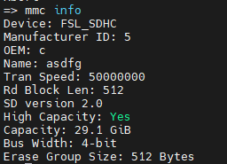

2. mmc list
   mmc list 命令用于来查看当前开发板一共有几个 MMC 设备。
   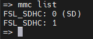

3. mmc dev
   mmc dev 命令用于切换当前 MMC 设备。具体命令格式为：
   
   ```txt
   mmc dev [dev] [part]
   ```
   
   `[dev]`用来设置要切换的 MMC 设备号，`[part]`是分区号。如果不写分区号的话默认为分区 0。
   使用如下命令切换到 SD 卡：
   
   ```txt
   mmc dev 0 // 切换到 SD 卡，0 为 SD 卡，1 为 eMMC
   ```

4. mmc part
   有时候 SD 卡或者 EMMC 会有多个分区，可以使用命令“mmc part”来查看其分区，比如查看 EMMC 的分区情况，输入如下命令：
   
   ```txt
   mmc dev 1 //切换到 EMMC
   mmc part //查看 EMMC 分区
   ```
   
   emmc一般会有两个分区，第 0 个分区存放 uboot，第 1 个分区存放Linux 镜像文件和设备树，第 2 个分区存放根文件系统。

5. mmc read

6. mmc write
   使用命令 `mmc write`将数据写道mmc中，命令格式为：
   
   ```txt
   mmc write addr blk# cnt
   ```
   
   addr 是要写入 MMC 中的数据在 DRAM 中的起始地址，blk 是要写入 MMC 的块起始地址(十六进制)，cnt 是要写入的块大小，一个块为 512 字节，可以使用`mmc write`来升级uboot。通过tftp或者nfs将uboot.bin下载到开发板的DRAM中，再使用命令`mmc write`将其写入到MMC设备中。
   使用`tftp 80800000 u-boot.imx`，会显示如下过程：
   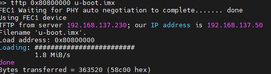
   u-boot.imx 大小为 363520 字节，379904/512=710，所以我们要向 SD 卡中写入710个块，如果有小数的话就要加 1 个块。使用命令“mmc write”从 SD 卡分区 0 第 2 个块(扇区)开始烧写，一共烧写 710(0x2C6)个块，命令如下：
   
   ```txt
   mmc dev 0 0
   mmc write 80800000 2 2C6
   ```

7. mmc erase
   如果要擦除 MMC 设备的指定块就是用命令`mmc erase`：
   
   ```txt
   mmc erase blk# cnt
   ```
   
   blk 为要擦除的起始块，cnt 是要擦除的数量。

## 4.3 FAT格式文件系统操作命令

1. fatinfo
   fatinfo 命令用于查询指定 MMC 设备分区的文件系统信息，命令格式为：
   
   ```txt
   fatinfo <interface> [<dev[:part]>]
   ```
   
   interface 表示接口，比如 mmc，dev 是查询的设备号，part 是要查询的分区。比如要查询 EMMC 分区 1 的文件系统信息，命令如下：
   
   ```txt
   fatinfo mmc 1:1
   ```

2. fatls
   fatls 命令用于查询 FAT 格式设备的目录和文件信息，命令格式如下：
   
   ```txt
   fatls <interface> [<dev[:part]>] [directory]
   ```
   
   interface 是要查询的接口，比如 mmc，dev 是要查询的设备号，part 是要查询的分区，directory是要查询的目录。比如查询 EMMC 分区 1 中的所有的目录和文件，输入命令：
   
   ```txt
   fatls mmc 1:1
   ```

3. fstype
   fstype 用于查看 MMC 设备某个分区的文件系统格式，命令格式如下：
   
   ```txt
   fstype <interface> <dev>:<part>
   ```
   
   正点原子 EMMC 核心板上的 EMMC 默认有 3 个分区，输入如下命令：
   
   ```txt
   fstype mmc 1:0
   fstype mmc 1:1
   fstype mmc 1:2
   ```
   
   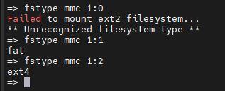
   从上图可以看出，分区 0 格式未知，因为分区 0 存放的 uboot，并且分区 0 没有格式化，所以文件系统格式未知。分区 1 的格式为 fat，分区 1 用于存放 linux 镜像和设备树。分区 2 的格式为 ext4，用于存放 Linux 的根文件系统(rootfs)。

4. fatload
   fatload 命令用于将指定的文件读取到 DRAM 中，命令格式如下：
   
   ```txt
   fatload <interface> [<dev[:part]> [<addr> [<filename> [bytes [pos]]]]]
   ```
   
   interface 为接口，比如 mmc，dev 是设备号，part 是分区，addr 是保存在 DRAM 中的起始地址，filename 是要读取的文件名字。bytes 表示读取多少字节的数据，如果 bytes 为 0 或者省略的话表示读取整个文件。pos 是要读的文件相对于文件首地址的偏移，如果为 0 或者省略的话表示从文件首地址开始读取。比如将 EMMC 分区 1 中的 zImage 文件读取到 DRAM 中的0X80800000 地址处，命令如下：
   
   ```txt
   fatload mmc 1:1 80800000 zImage
   ```

5. fatwrite
   uboot默认是没有使能fatwrite命令的。
   fatwirte 命令用于将 DRAM 中的数据写入到 MMC 设备中，命令格式如下：
   
   ```txt
   fatwrite <interface> <dev[:part]> <addr> <filename> <bytes>
   ```

## 4.4 Boot操作命令

uboot 的本质工作是引导 Linux，所以 uboot 肯定有相关的 boot(引导)命令来启动 Linux。常用的跟 boot 有关的命令有：bootz、bootm 和 boot。

1. bootz
   要启动 Linux，需要先将 Linux 镜像文件拷贝到 DRAM 中，如果使用到设备树的话也需要将设备树拷贝到 DRAM 中。bootz 命令用于启动 zImage 镜像文件，bootz 命令格式如下：
   
   ```txt
   bootz [addr [initrd[:size]] [fdt]]
   ```
   
   命令 bootz 有三个参数，`add` 是 Linux 镜像文件在 DRAM 中的位置，`initrd` 是 initrd 文件在DRAM 中的地址，如果不使用 initrd 的话使用‘-’代替即可，`fdt `就是设备树文件在 DRAM 中的地址。
   如用tftp来启动的话则为如下格式：
   
   ```txt
   tftp 80800000 zImage
   tftp 83000000 imx6ull-14x14-emmc-7-1024x600-c.dtb
   bootz 80800000 - 83000000
   ```
   
   同样可以从emmc中启动：
   
   ```txt
   fatload mmc 1:1 80800000 zImage
   fatload mmc 1:1 83000000 imx6ull-14x14-emmc-7-1024x600-c.dtb
   bootz 80800000 - 83000000
   ```

2. bootm
   bootm 和 bootz 功能类似，但是 bootm 用于启动 uImage 镜像文件。如果不使用设备树的话启动 Linux 内核的命令如下：
   
   ```txt
   bootm addr
   ```
   
   addr 是 uImage 镜像在 DRAM 中的首地址。如果要使用设备树，那么 bootm 命令和 bootz 一样，命令格式如下：
   
   ```txt
   bootm [addr [initrd[:size]] [fdt]]
   ```

3. boot
   boot 命令也是用来启动 Linux 系统的，只是 boot 会读取环境变量 bootcmd 来启动 Linux 系统，bootcmd 是一个很重要的环境变量！其名字分为“boot”和“cmd”，也就是“引导”和“命令”，说明这个环境变量保存着引导命令，其实就是启动的命令集合，具体的引导命令内容是可以修改的。比如我们要想使用 tftp 命令从网络启动 Linux 那么就可以设置 bootcmd 为  `tftp 80800000 zImage; tftp 83000000 imx6ull-14x14-emmc-7-1024x600-c.dtb; bootz 80800000 -83000000`，然后使用 saveenv 将 bootcmd 保存起来。然后直接输入 boot 命令即可从网络启动Linux 系统，命令如下：
   
   ```txt
   setenv bootcmd 'tftp 80800000 zImage; tftp 83000000 imx6ull-14x14-emmc-7-1024x600-c.dtb; bootz 80800000 - 83000000'
   saveenv
   boot
   ```
   
   uboot 倒计时结束以后就会启动 Linux 系统，其实就是执行的 bootcmd 中的启动命令。只要不修改 bootcmd 中的内容，以后每次开机 uboot 倒计时结束以后都会使用 tftp 命令从网络下载 zImage 和 imx6ull-14x14-emmc-7-1024x600-c.dtb，然后启动 Linux。
   如果想从 EMMC 启动那就设置 bootcmd 为`fatload mmc 1:1 80800000 zImage; fatload mmc 1:1 83000000 imx6ull-14x14-emmc-7-1024x600-c.dtb; bootz 80800000 - 83000000`，然后使用 boot
   命令启动即可，命令如下：
   
   ```txt
   setenv bootcmd 'fatload mmc 1:1 80800000 zImage; fatload mmc 1:1 83000000 imx6ull-14x14-emmc-7-1024x600-c.dtb; bootz 80800000 - 83000000'
   savenev
   boot
   ```
   
   在启动 Linux 内核的时候可能会遇到如下错误：
   
   ```txt
   “Kernel panic – not Syncing: VFS: Unable to mount root fs on unknown-block(0,0)”
   ```
   
   这是因为linux系统没有找到根文件系统。

# 5 Linux 启动流程

## 5.1 Linux工程目录分析

| 名称            | 描述                                                                                           | 备注                         |
| ------------- | -------------------------------------------------------------------------------------------- | -------------------------- |
| arch          | 架构相关目录，存放不同 CPU 架构（ARM、x86、RISC-V、PowerPC 等）的架构特有代码，包含启动、中断、内存管理、平台相关驱动等核心逻辑                 | Linux 自带，编译时仅会用到目标架构对应的子目录 |
| block         | 块设备相关目录，实现块设备通用层逻辑，包含 IO 调度器、块设备核心驱动框架、bio 处理机制等                                             | Linux 自带                   |
| certs         | 内核证书相关目录，存放内核签名、模块签名所需的证书与密钥管理代码，用于内核安全启动与模块签名校验                                             | Linux 自带                   |
| crypto        | 加密相关目录，实现内核态通用加密算法框架，包含对称 / 非对称加密、哈希算法、压缩算法等通用密码学实现                                          | Linux 自带                   |
| Documentation | 文档相关目录，存放内核所有子系统、API、驱动开发、配置项的官方说明文档，是内核开发与使用的全量参考资料                                         | Linux 自带                   |
| drivers       | 驱动相关目录，内核最大的子目录，存放所有外设、总线、设备类型的驱动代码，覆盖字符设备、网络设备、USB、I2C、SPI、GPU、输入设备等全品类驱动                   | Linux 自带，驱动开发核心目录          |
| firmware      | 固件相关目录，存放硬件设备所需的固件二进制文件与加载逻辑，用于驱动硬件时加载对应固件                                                   | Linux 自带                   |
| fs            | 文件系统相关目录，实现 Linux 支持的所有文件系统（ext4、XFS、Btrfs、FAT、NFS 等），以及虚拟文件系统 VFS 的核心框架                     | Linux 自带                   |
| include       | 头文件相关目录，存放内核公共 C 语言头文件，分为通用头文件（linux/）和架构特有头文件（asm-xxx/），是内核模块开发的核心头文件来源                     | Linux 自带                   |
| init          | 初始化相关目录，存放 Linux 内核启动的核心初始化代码，包含 start_kernel () 入口函数、内核早期初始化、根文件系统挂载逻辑，是内核启动的起点             | Linux 自带                   |
| ipc           | 进程间通信相关目录，实现 System V IPC 与 POSIX IPC 机制，包含消息队列、共享内存、信号量等内核态实现                               | Linux 自带                   |
| kernel        | 内核核心目录，存放 Linux 内核核心子系统代码，包含进程调度、进程管理、中断处理、时间管理、系统调用、锁机制、trace 调试等核心逻辑                       | Linux 自带，内核核心功能实现目录        |
| lib           | 库相关目录，存放内核态通用基础库函数，如字符串操作、数学运算、位图操作、CRC 校验等，是内核运行依赖的通用工具函数，区别于用户态 glibc                      | Linux 自带                   |
| LICENSES      | 许可证相关目录，存放 Linux 内核使用的各类开源许可证文本，包含 GPL-2.0、MIT、BSD 等许可证完整文件，规范内核代码的开源使用规则                    | Linux 自带                   |
| mm            | 内存管理相关目录，实现 Linux 内核内存管理子系统，包含物理内存管理、虚拟内存管理、页表管理、内存分配器、缺页异常处理、内存回收等核心逻辑                      | Linux 自带                   |
| net           | 网络相关目录，实现 Linux 内核完整网络协议栈，包含 TCP/IP、UDP、ICMP、网络设备驱动框架、套接字层、防火墙、网络命名空间，以及 IPv6、WiFi、蓝牙等各类网络协议 | Linux 自带                   |
| rust          | Rust 语言支持目录，高版本内核新增，存放 Rust 语言编写的内核核心代码、驱动框架、示例，以及 Rust-for-Linux 相关实现                       | Linux 自带，5.14 及以上版本逐步支持    |
| samples       | 例程相关目录，存放内核开发官方示例代码，包含内核模块、BPF 程序、驱动开发、系统调用等各类示例，是内核开发学习的核心参考                                | Linux 自带                   |
| scripts       | 脚本相关目录，存放内核编译、配置、打包、补丁管理所需的各类脚本，包含 make menuconfig 配置脚本、编译辅助脚本、检查脚本、内核签名脚本等                  | Linux 自带，内核编译配置核心辅助目录      |
| security      | 安全相关目录，实现内核安全框架，包含 SELinux、AppArmor 等 Linux 安全模块（LSM），以及内核安全机制、访问控制、强制访问控制（MAC）等逻辑           | Linux 自带                   |
| sound         | 音频处理相关目录，实现 Linux 内核音频子系统 ALSA，包含音频驱动核心框架、声卡驱动、音频编解码器驱动、MIDI 支持等                             | Linux 自带                   |
| tools         | 工具相关目录，存放内核配套的用户态工具，包含性能分析、调试、BPF、内存检测、GPIO 等工具，用于内核调试、性能优化与系统管理                             | Linux 自带                   |
| usr           | 与 initramfs 相关的目录，用于内核编译时生成 initramfs（初始内存文件系统）镜像，包含 initramfs 打包逻辑与根文件系统早期用户态程序             | Linux 自带，用于内核启动时挂载临时根文件系统  |
| virt          | 虚拟化相关目录，实现 Linux 内核虚拟化技术核心逻辑，主要包含 KVM（Kernel-based Virtual Machine）虚拟机管理程序的内核态实现，支持多架构虚拟化扩展  | Linux 自带                   |

## 5.2 顶层makefile详解

1. **版本号**：由 `VERSION`、`PATCHLEVEL`、`SUBLEVEL`、`EXTRAVERSION` 组成（如 4.1.15）。
2. **MAKEFLAGS 变量**：设置 `MAKEFLAGS += -rR --include-dir=$(CURDIR)`。
3. **命令输出控制**：`make V=1` 显示完整编译命令，默认 `V=0` 精简输出。
4. **静默编译**：`make -s` 实现完全静默编译（无打印信息）。
5. **输出目录指定**：`make O=xxx` 将编译产物输出到指定目录 `xxx`。
6. **代码检查**：`make C=1` 检查需重编译的文件，`make C=2` 检查所有源码。
7. **外部模块编译**：`make M=dir`（或旧语法 `SUBDIRS=dir`）单独编译指定目录的外部模块。
8. **架构与交叉编译器**：需设置 `ARCH`（如 `arm`）和 `CROSS_COMPILE`（如 `arm-linux-gnueabihf-`）。
9. **调用通用定义**：通过 `include scripts/Kbuild.include` 引入通用编译规则。
10. **交叉工具变量**：定义 `AS`、`LD`、`CC`、`OBJCOPY` 等交叉编译工具（带 `CROSS_COMPILE` 前缀）。
11. **头文件路径**：`USERINCLUDE`（UAPI 头文件）和 `LINUXINCLUDE`（内核头文件）指定编译头文件路径。
12. **导出变量**：向子 Makefile 导出版本、架构、编译工具、头文件路径、编译标志等核心变量。

### 5.2.1 **make xxx_defconfig** **过程**

1. 变量初始化
   首先设置关键变量：
   
   ```makefile
   config-targets := 0
   mixed-targets := 0
   dot-config := 1
   ```
   
   当执行 `make xxx_defconfig` 时，`KBUILD_EXTMOD` 为空且目标匹配 `%config`，因此最终变量值为：
   
   - `config-targets = 1`（仅配置目标）
   - `mixed-targets = 0`（无混合目标）
   - `dot-config = 1`（需生成 `.config`）

2. 匹配`%config`目标
   因 `config-targets=1`，执行以下逻辑：
   
   ```makefile
   # 引入架构特定 Makefile（如 arch/arm/Makefile）
   include arch/$(SRCARCH)/Makefile
   export KBUILD_DEFCONFIG KBUILD_KCONFIG
   
   # %config 目标规则
   %config: scripts_basic outputmakefile FORCE
       $(Q)$(MAKE) $(build)=scripts/kconfig $@
   ```
   
   - 依赖 `scripts_basic`：需先编译基础工具；
   - 命令展开后为：`@make -f ./scripts/Makefile.build obj=scripts/kconfig xxx_defconfig`。

3. 编译`scripts_basic`目标
   `scripts_basic` 规则：
   
   ```makefile
   scripts_basic:
       $(Q)$(MAKE) $(build)=scripts/basic
       $(Q)rm -f .tmp_quiet_recordmcount
   ```
   
   - `build` 展开为 `-f $(srctree)/scripts/Makefile.build obj`，因此命令变为：`@make -f ./scripts/Makefile.build obj=scripts/basic`。
   
   #### Makefile.build 处理逻辑：
   
   - 确定 `kbuild-dir=./scripts/basic`，优先读取 `Kbuild`，无则用 `Makefile`；
   - 默认目标 `__build` 依赖 `always`，而 `always=scripts/basic/fixdep scripts/basic/bin2c`；
   - **最终动作**：编译 `fixdep` 和 `bin2c` 两个工具。

4. 执行`%config`目标
   命令 `@make -f ./scripts/Makefile.build obj=scripts/kconfig xxx_defconfig` 处理：
   
   - `kbuild-dir=./scripts/kconfig`，读取 `scripts/kconfig/Makefile`；
   
   - 该文件中匹配 %_defconfig规则：
     
     ```makefile
     %_defconfig: $(obj)/conf
         $(Q)$< $(silent) --defconfig=arch/$(SRCARCH)/configs/$@ $(Kconfig)
     ```
   
   - 展开后为：
     `@scripts/kconfig/conf --defconfig=arch/arm/configs/xxx_defconfig Kconfig`
   
   #### 关键动作：
   
   - 先编译 `scripts/kconfig/conf.c` 生成 `conf` 工具；
   - `conf` 工具读取 `arch/arm/configs/xxx_defconfig` 默认配置，结合 `Kconfig` 生成最终的 `.config` 文件。

### 5.2.2 make过程

1. `make` 整体流程
   
   - 顶层目标链
     执行 `make` 或 `make all` 时，顶层 Makefile 目标链为：
     _all`（默认目标）→ `all` → `vmlinux
     关键代码：
     
     ```makefile
     # 顶层 Makefile
     PHONY := _all
     _all:
     
     PHONY += all
     ifeq ($(KBUILD_EXTMOD),)
     _all: all  # 非外部模块编译时，_all 依赖 all
     else
     _all: modules
     endif
     
     all: vmlinux  # all 依赖 vmlinux
     ```
   
   - `vmlinux` 的依赖与链接
     `vmlinux` 是未压缩的 ELF 格式内核镜像，其依赖与链接逻辑如下：
     
     

     #### 关键依赖变量
    
     顶层 Makefile 定义了 `vmlinux` 的核心依赖：
    
     ```makefile
     # 导出给 link-vmlinux.sh 的变量
     export KBUILD_VMLINUX_INIT := $(head-y) $(init-y)  # 初始化相关
     export KBUILD_VMLINUX_MAIN := $(core-y) $(libs-y) $(drivers-y) $(net-y)  # 核心主体
     export KBUILD_LDS := arch/$(SRCARCH)/kernel/vmlinux.lds  # 链接脚本
    
     vmlinux-deps := $(KBUILD_LDS) $(KBUILD_VMLINUX_INIT) $(KBUILD_VMLINUX_MAIN)
     ```
    
     各变量最终值（以 ARM 架构为例）：
    
     - `head-y`：`arch/arm/kernel/head.o`（启动入口）
     - `init-y`：`init/built-in.o`
     - `core-y`：`usr/built-in.o` + `arch/arm/` 下各子目录 `built-in.o` + `kernel/`/`mm/`/`fs/` 等 `built-in.o`
     - `libs-y`：`arch/arm/lib/lib.a` + `lib/lib.a` + 对应 `built-in.o`
     - `drivers-y`：`drivers/`/`sound/`/`firmware/` 下 `built-in.o`
     - `net-y`：`net/built-in.o`
    
    
    
     #### 链接生成 `vmlinux`
    
     `vmlinux` 的规则：
    
     ```makefile
     vmlinux: scripts/link-vmlinux.sh $(vmlinux-deps) FORCE
         # 可选步骤（headers_check、samples 等）
         +$(call if_changed,link-vmlinux)  # 核心链接命令
     ```
    
     - `if_changed` 函数：检查依赖或参数变化，若变化则执行 `cmd_link-vmlinux`。
    
     - `cmd_link-vmlinux`：调用 `scripts/link-vmlinux.sh` 完成链接，展开后为：
    
     ```makefile
     /bin/bash scripts/link-vmlinux.sh arm-linux-gnueabihf-ld -EL -p --no-undefined -X --pic-veneer --build-id
     ```
    
     `link-vmlinux.sh` 核心逻辑：
    
     ```makefile
     vmlinux_link() {
       local lds="${objtree}/${KBUILD_LDS}"  # 链接脚本：arch/arm/kernel/vmlinux.lds
       if [ "${SRCARCH}" != "um" ]; then
         ${LD} ${LDFLAGS} ${LDFLAGS_vmlinux} -o ${2} \
           -T ${lds} ${KBUILD_VMLINUX_INIT} \
           --start-group ${KBUILD_VMLINUX_MAIN} --end-group ${1}
       fi
     }
     # 调用链接函数
     vmlinux_link "${kallsymso}" vmlinux
     ```
    
     最终将 `head.o`、各目录 `built-in.o` 和 `.a` 库文件，通过链接脚本 `vmlinux.lds` 链接成 `vmlinux`。

2. `built-in.o` 文件编译生成过程
   `vmlinux` 依赖的 `built-in.o` 是各子目录源码编译后打包生成的，下面详细分析其生成流程。
   
   - `vmlinux-deps` 依赖 `vmlinux-dirs`
     顶层 Makefile 中，`vmlinux-deps` 依赖 `vmlinux-dirs`：
     
     ```makefile
     $(sort $(vmlinux-deps)): $(vmlinux-dirs) ;
     ```
     
     `vmlinux-dirs` 是生成 `vmlinux` 所需的所有子目录列表，定义为：
     
     ```makefile
     vmlinux-dirs := $(patsubst %/,%,$(filter %/, \
       $(init-y) $(init-m) $(core-y) $(core-m) \
       $(drivers-y) $(drivers-m) $(net-y) $(net-m) $(libs-y) $(libs-m)))
     ```
     
     最终值（部分）：`init`、`usr`、`arch/arm/kernel`、`kernel`、`mm`、`fs`、`drivers` 等。
   
   - 遍历子目录编译
     顶层 Makefile 定义了 `vmlinux-dirs` 的编译规则：
     
     ```makefile
     $(vmlinux-dirs): prepare scripts
         $(Q)$(MAKE) $(build)=$@
     ```
     
     - `build` 变量展开为：`-f ./scripts/Makefile.build obj`
     - 命令展开后为：`@make -f ./scripts/Makefile.build obj=$@`（`$@` 为子目录名，如 `init`、`kernel` 等）
     
     即：对每个子目录，都调用 `scripts/Makefile.build` 进行编译，生成该目录下的 `built-in.o`。
   
   - `scripts/Makefile.build` 详细分析
     以 `obj=init` 为例，分析 `scripts/Makefile.build` 如何生成 `init/built-in.o`。
     
     1. 默认目标 `__build`
        `scripts/Makefile.build` 的默认目标是 `__build`：
        
        ```makefile
        __build: $(if $(KBUILD_BUILTIN),$(builtin-target) $(lib-target) $(extra-y)) \
                 $(if $(KBUILD_MODULES),$(obj-m) $(modorder-target)) \
                 $(subdir-ym) $(always)
            @:
        ```
        
        - 编译内核镜像时（非模块编译），`KBUILD_BUILTIN=1，KBUILD_MODULES`
           为空，因此 `__build` 简化为：
          
          ```makefile
          __build: $(builtin-target) $(lib-target) $(extra-y) $(subdir-ym) $(always)
          @:
          ```
        
        - 核心依赖是 `builtin-target`，即该目录下的 `built-in.o`。
     
     2. `builtin-target` 的定义
        `scripts/Makefile.build` 中定义 `builtin-target`：
        
        ```makefile
        ifneq ($(strip $(obj-y) $(obj-m) $(obj-) $(subdir-m) $(lib-target)),)
        builtin-target := $(obj)/built-in.o  # 如 init/built-in.o
        endif
        ```
        
        只要该目录下有 `obj-y`（需要编译进内核的目标文件）等变量非空，就定义 `builtin-target` 为 `$(obj)/built-in.o`。
        `obj-y` 由该目录下的 `Makefile` 定义（如 `init/Makefile` 会指定 `obj-y := main.o do_mounts.o ...`）。
     
     3. `built-in.o` 的生成规则
        `scripts/Makefile.build` 中定义了 `builtin-target` 的生成规则：
        
        ```makefile
        ifdef builtin-target
        quiet_cmd_link_o_target = LD $@
        # 核心链接命令：根据 obj-y 是否为空选择不同方式
        cmd_link_o_target = $(if $(strip $(obj-y)),\
          # 情况1：obj-y 不为空，用 LD 链接所有 obj-y 中的 .o 文件
          $(LD) $(ld_flags) -r -o $@ $(filter $(obj-y), $^) $(cmd_secanalysis),\
          # 情况2：obj-y 为空，用 AR 创建空的 built-in.o
          rm -f $@; $(AR) rcs$(KBUILD_ARFLAGS) $@)
        
        # built-in.o 依赖 obj-y 中的所有 .o 文件
        $(builtin-target): $(obj-y) FORCE
            $(call if_changed,link_o_target)  # 调用链接命令
        
        targets += $(builtin-target)
        endif
        ```
        
        ##### 详细解释每一步：
        
        1. **依赖关系**：`$(builtin-target)`（如 `init/built-in.o`）依赖 `$(obj-y)`（如 `init/main.o`、`init/do_mounts.o` 等），因此会先编译该目录下的 `.c`/`.S` 文件生成对应的 `.o` 文件。
        2. **`if_changed` 函数**：检查 `obj-y` 中的 `.o` 文件是否有更新，或链接命令是否变化，若变化则执行 `cmd_link_o_target`。
        3. **`cmd_link_o_target` 的两种情况**：
           - **情况 1：`obj-y` 不为空**（大多数目录的情况）：
             - 使用 `$(LD)`（链接器，如 `arm-linux-gnueabihf-ld`）执行链接。
             - `-r`：生成可重定位的目标文件（即 `built-in.o` 可继续参与后续链接）。
             - `-o $@`：输出文件为 `$(builtin-target)`（如 `init/built-in.o`）。
             - `$(filter $(obj-y), $^)`：取所有 `obj-y` 中的 `.o` 文件作为输入。
             - 最终将该目录下所有需要编译进内核的 `.o` 文件链接成一个 `built-in.o`。
           - **情况 2：`obj-y` 为空**（少数目录仅作为容器，无直接编译的源码）：
             - 先删除旧的 `built-in.o`。
             - 使用 `$(AR)`（归档工具）创建一个空的 `built-in.o`（避免后续链接出错）。

### 5.2.3 Linux `make zImage` 过程

#### 5.2.3.1 核心内核镜像文件区别

在分析编译流程前，先明确嵌入式开发中最常用的 4 种内核镜像的关系与差异，这是理解`zImage`生成逻辑的基础：

| 镜像文件    | 核心定义             | 生成逻辑                                       | 核心特点                     | 典型大小       | 适用场景                            |
|:-------:|:----------------:|:------------------------------------------:|:------------------------:|:----------:|:-------------------------------:|
| vmlinux | 编译生成的原始内核文件      | 顶层 Makefile 链接所有`built-in.o`、库文件生成         | ELF 格式，包含完整符号表、调试信息，未压缩  | ~16MB      | 内核调试、问题定位，嵌入式设备不直接使用            |
| Image   | 纯二进制内核镜像         | 通过`objcopy`处理 vmlinux，去除 ELF 头、符号表、冗余段     | 仅保留内核可执行二进制数据，未压缩        | ~12MB      | 编译中间产物，用于后续生成压缩镜像               |
| zImage  | gzip 压缩后的自解压内核镜像 | 先生成 Image，经 gzip 压缩后拼接解压启动头代码              | 自解压格式，启动时先运行内置解压代码，再执行内核 | ~6MB       | 嵌入式 Linux 主流启动镜像，新版 U-Boot 原生支持 |
| uImage  | 老版 U-Boot 专用镜像   | 在 zImage 头部追加 64 字节描述头（含加载地址、镜像大小、生成时间等信息） | 需老版 U-Boot 识别头部信息才能启动    | 略大于 zImage | 仅适配非常古老的 U-Boot 版本，现已基本淘汰       |

#### 5.2.3.2 `make zImage` 编译执行流程

执行`make zImage`时，整体遵循「先编译 vmlinux→生成 Image→压缩打包生成 zImage」的核心链路，下面结合 Makefile 规则分步详解。

##### 1. 顶层入口规则（arch/arm/Makefile）

`zImage`属于 ARM 架构专属的启动镜像，核心规则定义在`arch/arm/Makefile`中，而非顶层 Makefile：

```makefile
# arch/arm/Makefile 核心代码
# 定义支持的所有启动镜像类型
BOOT_TARGETS = zImage Image xipImage bootpImage uImage

# 所有启动镜像均依赖vmlinux，必须先编译出vmlinux
$(BOOT_TARGETS): vmlinux
    $(Q)$(MAKE) $(build)=$(boot) MACHINE=$(MACHINE) $(boot)/$@
```

- 依赖约束：`zImage`强依赖`vmlinux`，执行命令时会先按照前文`make`流程，完整编译链接出 ELF 格式的`vmlinux`；

- 命令展开：`$(build)`固定展开为`-f ./scripts/Makefile.build obj`, `$(boot)`固定为`arch/arm/boot`，最终执行的命令为：
  
  ```bash
  @make -f ./scripts/Makefile.build obj=arch/arm/boot MACHINE=arch/arm/boot/zImage
  ```
  
  本质是调用`scripts/Makefile.build`通用编译框架，进入`arch/arm/boot`目录执行后续编译逻辑。

##### 2. Image 镜像生成逻辑

`scripts/Makefile.build`会读取`arch/arm/boot/Makefile`，该文件定义了`Image`的生成规则，这是`zImage`生成的前置步骤：

```makefile
# arch/arm/boot/Makefile 核心代码
$(obj)/Image: vmlinux FORCE
    $(call if_changed,objcopy)
```

- 目标与依赖：目标为`arch/arm/boot/Image`，依赖已编译完成的`vmlinux`；

- 核心执行逻辑：`if_changed`函数会触发`cmd_objcopy`命令，完整命令如下：
  
  ```makefile
  cmd_objcopy = $(OBJCOPY) -O binary -R .comment -S vmlinux $@
  ```
  
  各参数作用：
  
  - `-O binary`：将 ELF 格式的 vmlinux 转换为纯二进制格式；
  - `-R .comment`：删除注释段等非必要冗余信息；
  - `-S`：剥离符号表、重定位信息，进一步缩小文件体积；
    
    

- 最终输出：无冗余的纯二进制内核镜像`arch/arm/boot/Image`。

##### 3. zImage 自解压镜像生成逻辑

`zImage`是自解压格式，核心由「解压启动代码」+「压缩后的内核镜像」两部分组成，相关规则定义在`arch/arm/boot/compressed/Makefile`中，分步执行如下：

###### （1）压缩 Image 生成 piggy.gz

首先将上一步生成的`Image`通过 gzip 压缩，生成压缩包`piggy.gz`：

```makefile
# arch/arm/boot/compressed/Makefile 核心代码
$(obj)/piggy.gz: $(obj)/../Image FORCE
    $(call if_changed,gzip)
```

- 依赖：`arch/arm/boot/Image`；
- 执行逻辑：通过 gzip 算法对 Image 进行无损压缩，大幅缩小内核体积，生成`piggy.gz`压缩包。

###### （2）将压缩包转换为可链接目标文件

`piggy.gz`是纯二进制压缩包，无法直接参与链接，需转换为可重定位的目标文件`piggy.o`，将压缩数据嵌入到目标文件中：

```makefile
# arch/arm/boot/compressed/Makefile 核心代码
$(obj)/piggy.o: $(obj)/piggy.gz FORCE
    $(call if_changed,objcopy)
```

- 核心逻辑：通过`objcopy`将二进制压缩包包装为 ELF 格式的目标文件，供后续链接使用。

###### （3）编译内核解压启动代码

自解压的核心是内置的解压代码，相关源码位于`arch/arm/boot/compressed/`目录下，主要包括：

- `head.S`：解压启动入口，完成基础硬件初始化、内存环境准备；
- `misc.c`：gzip 解压算法的核心实现，以及内核重定位相关逻辑；
- 其他辅助文件：cache 操作、异常处理、平台适配相关代码。

这些源码会被交叉编译器编译为`head.o`、`misc.o`等目标文件，作为 zImage 的启动入口。

###### （4）链接生成最终 zImage

最后通过链接器，将「解压启动代码目标文件」与「包含压缩内核的 piggy.o」链接在一起，生成最终的`zImage`：

```makefile
# arch/arm/boot/compressed/Makefile 核心代码
$(obj)/zImage: $(obj)/head.o $(obj)/misc.o $(obj)/piggy.o FORCE
    $(call if_changed,ld)
```

- 链接约束：通过专用链接脚本`arch/arm/boot/compressed/vmlinux.lds`控制内存布局，确保解压启动代码位于镜像最前端，保证设备上电后先执行解压逻辑；
- 最终输出：自解压格式的`zImage`镜像，输出到`arch/arm/boot/`目录下，可直接用于 U-Boot 引导启动。

#### 5.2.3.3 总结

`make zImage`命令的完整执行链路可总结为 5 步：

1. 执行顶层 Makefile 逻辑，编译所有子目录源码，链接生成 ELF 格式的原始内核文件`vmlinux`；
2. 进入`arch/arm/boot`目录，通过`objcopy`处理`vmlinux`，剥离冗余信息，生成纯二进制镜像`Image`；
3. 进入`arch/arm/boot/compressed`目录，通过 gzip 压缩`Image`，生成`piggy.gz`压缩包；
4. 编译解压启动相关源码，生成`head.o`、`misc.o`等目标文件，同时将`piggy.gz`转换为可链接的`piggy.o`；
5. 通过链接器将解压代码目标文件与压缩内核目标文件链接，生成最终的自解压镜像`zImage`。

# 6 文件系统

根文件系统是 Linux 系统中最顶层、最核心的文件系统，挂载在唯一的根目录/下，是整个操作系统的 "根基"。所有其他文件系统（硬盘分区、U 盘、网络存储等）都必须挂载到它的子目录上才能被访问，没有它 Linux 内核无法完成启动和运行任何用户程序。

根文件系统是挂载在/下的 Linux 系统顶层逻辑目录树（系统架构），ext4 是它最常用的磁盘存储格式（物理实现）。

## 6.1 根文件系统目录

| 目录      | 核心作用                                                       |
| ------- | ---------------------------------------------------------- |
| `/`     | 根目录，所有文件和目录的起点                                             |
| `/bin`  | 所有用户都能使用的基础命令（ls、cp、mv、chmod、mount、umount、mkdir）           |
| `/sbin` | 系统管理员使用的系统管理命令（ifconfig、reboot、shutdown、fdisk、fsck、init 等） |
| `/etc`  | 系统全局配置文件目录（passwd、fstab、systemd 配置等），配置网络ssh等              |
| `/dev`  | 设备文件目录（硬盘、键盘、鼠标等硬件都以文件形式存在），如通过dev/tty 可以操作串口              |
| `/lib`  | 存放linux所必须的库文件                                             |
| `/proc` | 虚拟文件系统，存储内核和进程的实时状态信息                                      |
| `/sys`  | 虚拟文件系统，用于管理和查看硬件设备信息                                       |
| `/root` | 超级用户 root 的家目录                                             |
| `/home` | 普通用户的家目录（每个用户对应一个子目录）                                      |
| `/usr`  | 系统软件和共享资源目录（大部分应用程序安装在这里）                                  |
| `/var`  | 可变数据目录（日志、缓存、邮件、数据库文件等）                                    |
| `/tmp`  | 临时文件目录，系统重启后会自动清空                                          |
| `/mnt`  | 临时挂载点（用于挂载 U 盘、光盘等外部存储）                                    |
| `/boot` | 系统启动相关文件（内核镜像、grub 引导程序等）                                  |

## 6.2 根文件系统制作工具

BusyBox：只做最基础的命令集，是所有嵌入式根文件系统的基石

Buildroot：嵌入式入门首选，简单够用，编译速度比 Yocto 快很多

Yocto：工业级标准，复杂项目必选，学习成本高但长期收益大

debootstrap：制作完整 Debian/Ubuntu 根文件系统的唯一官方标准工具

## 6.3 配置编译busybox

### 6.3.1 添加编译器

1. 在make menuconfig 中的`Cross compiler prefix`配置交叉编译器，如`(/usr/local/arm/gcc-linaro-4.9.4-2017.01-x86_64_arm-linux-gnueabihf/bin/arm-linux-gnueabihf-)`

2. 顶层makefile中配置
   `CROSS_COMPILE ?= /usr/local/arm/gcc-linaro-4.9.4-2017.01-x86_64_arm-linux-gnueabihf/bin/arm-linux-gnueabihf-`
   `ARCH ?= arm`

### 6.3.2 支持中文字符

在`libbb/printable_string.c`和`libbb/unicode.c`这些文件中，找到`if (c < ' ' || c >= 0x7f)`类似这样的语句，将`c >= 0x7f`这样的判断去掉。

### 6.3.3 具体配置项

1. 取消静态编译（防止 DNS 问题）：
   
   ```
   Location: -> Settings -> Build static binary (no shared libs)
   ```
   
   不勾选该选项。

2. **启用 vi 风格行编辑**：
   
   ```
   Location: -> Settings -> vi-style line editing commands
   ```
   
   勾选该选项。

3. **取消简化模块工具**：
   
   ```
   Location: -> Linux Module Utilities -> Simplified modutils
   ```
   
   不勾选该选项。

4. **确保 mdev 及其子项全部选中**（默认已选中）：
   
   ```
   Location: -> Linux System Utilities -> mdev (16 kb)
   ```

5. **启用 Unicode 支持中文**：
   `Location: -> Settings -> Support Unicode`（勾选）
   `Location: -> Settings -> Support Unicode -> Check $LC_ALL, $LC_CTYPE and $LANG environment variables`（勾选）

### 6.3.4 安装到指定根文件系统目录

```makefile
make install CONFIG_PREFIX=/home/tengfei/linux/nfs/rootfs
```

### 6.3.5 向 rootfs 添加 /lib 库文件

Linux 应用程序大多是**动态编译**的，运行时需要依赖 `.so` 动态库，所以必须把交叉编译器里的库拷贝到根文件系统。

1. 在 rootfs 下创建 lib 目录
   
   ```sh
   mkdir lib
   ```

2. 从交叉编译器目录拷贝库文件
   
   ```sh
   /usr/local/arm/gcc-linaro-4.9.4-2017.01-x86_64_arm-linux-gnueabihf/arm-linux-gnueabihf/libc/lib
   
   cp *so* *.a /home/tengfei/linux/nfs/rootfs/lib/ -d # 保留软链接
   ```

3. 特殊处理：`ld-linux-armhf.so.3`
   这个文件默认是软链接，**直接用软链接会导致程序无法运行**，必须拷贝成实体文件：
   先删除 rootfs/lib 里的软链接版本再重新拷贝实体文件（不加 -d）
   
   ```sh
   rm /home/tengfei/linux/nfs/rootfs/lib/ld-linux-armhf.so.3
   cp ld-linux-armhf.so.3 /home/tengfei/linux/nfs/rootfs/lib/
   ```

4. 再拷贝另一批库
   
   ```sh
   /usr/local/arm/gcc-linaro-4.9.4-2017.01-x86_64_arm-linux-gnueabihf/arm-linux-gnueabihf/lib
   cp *so* *.a /home/tengfei/linux/nfs/rootfs/lib/ -d
   ```

### 6.3.6 向 rootfs 添加 /usr/lib 库文件

1. 在 rootfs/usr 下创建 lib 目录
   
   ```sh
   mkdir usr/lib
   ```

2. 从交叉编译器的 usr/lib 拷贝库
   
   ```sh
   /usr/local/arm/gcc-linaro-4.9.4-2017.01-x86_64_arm-linux-gnueabihf/arm-linux-gnueabihf/libc/usr/lib
   cp *so* *.a /home/tengfei/linux/nfs/rootfs/usr/lib/ -d
   ```
   
   最后创建`dev proc mnt sys tmp root`这些目录。

## 6.4 根文件系统初步测试 （NFS 挂载启动）

Linux 内核支持用 NFS 作为根文件系统，对应的完整参数格式为：

```sh
root=/dev/nfs nfsroot=[<server-ip>:]<root-dir>[,<nfs-options>] ip=<client-ip>:<server-ip>:<gw-ip>:<netmask>:<hostname>:<device>:<autoconf>:<dns0-ip>:<dns1-ip>
```

各参数含义如下：

- `root=/dev/nfs`：告诉内核根文件系统为 NFS 网络挂载。
- `<server-ip>`：Ubuntu 主机 IP，即 NFS 服务器地址。
- `<root-dir>`：Ubuntu 上根文件系统 rootfs 的路径。
- `<nfs-options>`：NFS 挂载参数，如 `tcp`、`rw` 等。
- `<client-ip>`：开发板启动后使用的 IP 地址。
- `<gw-ip>`：网关地址。
- `<netmask>`：子网掩码。
- `<hostname>`：开发板主机名，一般留空。
- `<device>`：网卡名称，I.MX6U 一般为 `eth0`。
- `<autoconf>`：自动配置，设为 `off`。
- `<dns0-ip>`、`<dns1-ip>`：DNS 地址，可不配置。

使用时在 U-Boot 中设置 `bootargs`，示例命令如下：

```sh
setenv bootargs 'console=ttymxc0,115200 root=/dev/nfs nfsroot=192.168.137.230:/home/tengfei/linux/nfs/rootfs,proto=tcp rw ip=192.168.137.251:192.168.137.230:192.168.137.1:255.255.255.0::eth0:off'
saveenv
boot
```

设置保存后启动内核，若能正常挂载并进入 shell，说明根文件系统可用。


# 7 字符驱动

## 7.1 字符驱动简介

字符设备是 Linux 中最基础的一类设备驱动，像点灯、按键、IIC、SPI、LCD 这类按字节流顺序读写的设备都属于字符设备，对应的驱动就是字符设备驱动。

Linux 里 “一切皆为文件”，驱动加载后会在`/dev`目录下生成设备文件，应用程序通过`open`/`close`/`read`/`write`等 API 操作这个文件，就能间接控制硬件。这些 API 由 C 库提供，通过系统调用让程序从用户空间 “陷入” 内核空间，最终调用驱动里对应的函数，完成对底层硬件的操作。

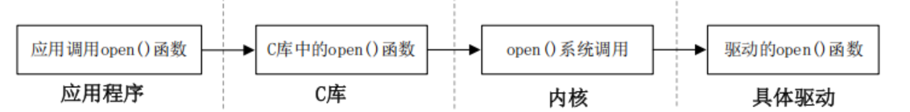


每一个系统调用，在驱动中都有与之对应的一个驱动函数，在 Linux 内核文件 include/linux/fs.h 中有个叫做 file_operations 的结构体，此结构体就是 Linux 内核驱动操作函数集合。

## 7.2 字符设备驱动开发步骤

### 7.2.1 搭建驱动模块基础：实现加载与卸载

所有 Linux 驱动的通用入口，内核通过这两个函数识别并管理驱动模块。模块两种运行方式：编译进内核：内核启动时自动运行，适合最终稳定版本，编译为`.ko`模块：调试首选，修改后仅编译驱动，加载 / 卸载即可生效。

```c
module_init(xxx_init);  // 注册模块加载函数，insmod/modprobe时自动调用
module_exit(xxx_exit);  // 注册模块卸载函数，rmmod/modprobe -r时自动调用
```

函数修饰符

- `__init`：标记入口函数，仅初始化时执行，执行后内核会回收其内存
- `__exit`：标记出口函数，仅模块卸载时执行

模块操作命令

| 操作   | 命令                | 特点                                          |
| ---- | ----------------- | ------------------------------------------- |
| 加载   | `insmod xxx.ko`   | 简单直接，不自动解决模块依赖                              |
| 自动加载 | `modprobe xxx`    | 推荐，自动分析并加载所有依赖模块，默认查找`/lib/modules/<内核版本>/` |
| 卸载   | `rmmod xxx.ko`    | 推荐，仅卸载指定模块                                  |
| 卸载   | `modprobe -r xxx` | 同时卸载未被其他模块使用的依赖模块                           |

### 7.2.2 内核注册 / 注销字符设备

让内核识别到字符设备，建立设备与驱动操作函数的关联。

执行时机：**注册在入口函数，注销在出口函数**（必须配对，防止资源泄漏），核心函数为：

```c
// 注册字符设备
int register_chrdev(unsigned int major, const char *name, const struct file_operations *fops);
// 注销字符设备
void unregister_chrdev(unsigned int major, const char *name);
```

关键参数说明

- `major`：主设备号，Linux 用它区分不同类型的字符设备
- `name`：设备名，可通过`cat /proc/devices`查看已注册的设备及主设备号
- `fops`：设备操作函数集合的指针，是内核与驱动的核心接口

注意：必须选择**未被占用**的主设备号，先执行`cat /proc/devices`查询系统已用编号

### 7.2.3 实现设备操作函数（驱动业务核心）

通过`struct file_operations`结构体，将应用层的 open/read/write/close 等系统调用，映射到驱动层的具体硬件操作。

- 基础必实现函数（根据设备需求增减）
  - `open`：打开设备，做硬件初始化、资源申请等准备工作
  - `release`：关闭设备，释放 open 中申请的资源
  - `read`：从设备读取数据到用户空间
  - `write`：将用户空间的数据写入设备

结构体初始化要点

```c
static struct file_operations test_fops = {
    .owner = THIS_MODULE,  // 必须设置，防止模块被意外卸载
    .open = chrtest_open,
    .read = chrtest_read,
    .write = chrtest_write,
    .release = chrtest_release,
};
```

关键坑点：**内核空间与用户空间不能直接拷贝数据**，必须使用内核提供的`copy_to_user()`（内核→用户）和`copy_from_user()`（用户→内核）函数。

### 7.2.4 添加必要的模块信息（编译必需）

必需项：`MODULE_LICENSE("GPL");`，不添加会导致编译报错

可选项：`MODULE_AUTHOR("作者名");`、`MODULE_DESCRIPTION("驱动描述");`、`MODULE_VERSION("版本号");`

### 7.2.5 完整最简字符设备驱动模板

```c
#include <linux/module.h>
#include <linux/fs.h>
#include <linux/uaccess.h>

/* 设备操作函数声明 */
static int chrtest_open(struct inode *inode, struct file *filp);
static ssize_t chrtest_read(struct file *filp, char __user *buf, size_t cnt, loff_t *offt);
static ssize_t chrtest_write(struct file *filp, const char __user *buf, size_t cnt, loff_t *offt);
static int chrtest_release(struct inode *inode, struct file *filp);

/* 设备操作函数集合 */
static struct file_operations test_fops = {
    .owner = THIS_MODULE,
    .open = chrtest_open,
    .read = chrtest_read,
    .write = chrtest_write,
    .release = chrtest_release,
};

/* 驱动入口函数 */
static int __init chrtest_init(void)
{
    int ret;
    ret = register_chrdev(200, "chrtest", &test_fops);
    if (ret < 0) {
        printk("chrdev register failed!\n");
        return ret;
    }
    printk("chrdev init success!\n");
    return 0;
}

/* 驱动出口函数 */
static void __exit chrtest_exit(void)
{
    unregister_chrdev(200, "chrtest");
    printk("chrdev exit success!\n");
}

/* 设备操作函数实现（填充业务逻辑） */
static int chrtest_open(struct inode *inode, struct file *filp)
{
    return 0;
}

static ssize_t chrtest_read(struct file *filp, char __user *buf, size_t cnt, loff_t *offt)
{
    return 0;
}

static ssize_t chrtest_write(struct file *filp, const char __user *buf, size_t cnt, loff_t *offt)
{
    return 0;
}

static int chrtest_release(struct inode *inode, struct file *filp)
{
    return 0;
}

/* 注册入口出口 */
module_init(chrtest_init);
module_exit(chrtest_exit);

/* 模块信息 */
MODULE_LICENSE("GPL");
MODULE_AUTHOR("zuozhongkai");
```


## 7.3 设备号

Linux 设备号是内核管理设备的 “身份证”，主设备号表示某一个具体的驱动，次设备号表示使用这个驱动的各个设备。

### 7.3.1 设备号的组成

1. 数据类型：`dev_t`
   Linux 提供了一个名为 dev_t 的数据类型表示设备号，dev_t 定义在文件 include/linux/types.h 里面，定义如下：
   
   ```c
   // include/uapi/asm-generic/int-ll64.h
   typedef unsigned int __u32;
   
   // include/linux/types.h
   typedef __u32 __kernel_dev_t;
   typedef __kernel_dev_t dev_t;
   ```

2. 位分配：主设备号 + 次设备号
   32 位的 `dev_t` 被拆分为两部分：
   
   - **高 12 位**：主设备号（范围 `0~4095`，因为 212=4096），用于**标识一个具体的驱动**。
   - **低 20 位**：次设备号，用于**标识使用同一驱动的不同设备**（比如一个驱动控制 3 个 LED，次设备号可设为 `0、1、2`）。

3. 设备号操作宏（关键！）
   内核在 `include/linux/kdev_t.h` 中提供了 3 个宏，用于设备号的拆分与组合：
   
   | 宏               | 作用                                | 示例                         |           |
   | --------------- | --------------------------------- | -------------------------- | --------- |
   | `MAJOR(dev)`    | 从 `dev_t` 中提取**主设备号**             | `MAJOR(200<<20             | 0) = 200` |
   | `MINOR(dev)`    | 从 `dev_t` 中提取**次设备号**             | `MINOR(200<<20             | 5) = 5`   |
   | `MKDEV(ma, mi)` | 将主设备号 `ma` 和次设备号 `mi` 组合成 `dev_t` | `MKDEV(200, 0) = (200<<20) | 0`        |

### 7.3.2 设备号的分配方式

主设备号的分配有两种：**静态分配**（手动指定）和**动态分配**（内核自动分配，推荐）。

1. 静态分配设备号
   **方法**：驱动开发者手动指定一个主设备号（比如之前示例中的 `200`），然后通过 `register_chrdev` 注册。
   **注意事项**：
   
   1. 需先检查系统中已占用的设备号，避免冲突：
      
      ```bash
      cat /proc/devices  # 查看当前已使用的主设备号
      ```
   
   2. 常用设备号可参考内核文档 `Documentation/devices.txt`，但最终以实际平台占用情况为准。

2. 动态分配设备号（Linux 社区推荐）
   **核心思想**：注册驱动前，先向内核 “申请” 一个未被使用的设备号，内核自动分配并返回，彻底避免冲突。
   **关键函数**：
   1）申请设备号：`alloc_chrdev_region`
   
   ```c
   int alloc_chrdev_region(dev_t *dev, unsigned baseminor, unsigned count, const char *name);
   ```
   
   **参数详解**：
   
   - `dev`：**输出参数**，保存内核分配的起始设备号（含主、次设备号）。
   
   - `baseminor`：次设备号的起始地址，一般设为 `0`（表示次设备号从 0 开始递增）。
   
   - `count`：要申请的**连续设备号数量**（比如一个驱动控制 2 个设备，count 设为 2）。
   
   - `name`：设备名字，会出现在 `/proc/devices` 中。
     **返回值**：成功返回 0，失败返回负数错误码。
   
   2） 释放设备号：`unregister_chrdev_region`
   驱动卸载时，必须释放申请的设备号，防止资源泄漏：
   
   ```c
   void unregister_chrdev_region(dev_t from, unsigned count);
   ```
   
   **参数详解**：
   
   - `from`：要释放的**起始设备号**（即 `alloc_chrdev_region` 中 `dev` 的值）。
   - `count`：要释放的设备号数量（需与申请时的 `count` 一致）。

### 7.3.3 使用案例

```c
#include <linux/module.h>
#include <linux/fs.h>

static dev_t devid;  // 保存分配到的设备号

static int __init chrtest_init(void)
{
    int ret;
    /* 1. 动态申请设备号：次设备号从0开始，申请1个，设备名为"chrtest" */
    ret = alloc_chrdev_region(&devid, 0, 1, "chrtest");
    if (ret < 0) {
        printk("alloc chrdev region failed!\n");
        return ret;
    }
    /* 2. 提取主、次设备号（可选，用于打印或后续逻辑） */
    printk("major=%d, minor=%d\n", MAJOR(devid), MINOR(devid));

    /* 3. 后续注册字符设备等操作... */
    return 0;
}

static void __exit chrtest_exit(void)
{
    /* 4. 释放设备号 */
    unregister_chrdev_region(devid, 1);
}

module_init(chrtest_init);
module_exit(chrtest_exit);
MODULE_LICENSE("GPL");
```

## 7.4 编译驱动程序及APP

### 7.4.1 编译驱动程序

```makefile
KERNELDIR := /home/tengfei/linux/imx6ul/linux_kernel/My_Kernel/linux-imx-rel_imx_4.1.15_2.1.0_ga_alientek
CURRENT_PATH := $(shell pwd)
obj-m := chrdevbase.o

build: kernel_modules

kernel_modules:
    $(MAKE) -C $(KERNELDIR) M=$(CURRENT_PATH) modules
clean:
    $(MAKE) -C $(KERNELDIR) M=$(CURRENT_PATH) clean
```

### 7.4.2 编译APP程序

```shell
arm-linux-gnueabihf-gcc chrdevbaseApp.c -o chrdevbaseApp
```


## 7.5 新字符设备驱动

### 7.5.1 分配和释放设备号

使用 register_chrdev 函数注册字符设备的时候只需要给定一个主设备号即可，但是这样会带来两个问题：①需要事先确定哪些主设备号没有使用；②会将一个主设备号下的所有次设备号都使用掉，比如现在设置 LED 这个主设备号为200，那么 0~1048575(2^20-1)这个区间的次设备号就全部都被 LED 一个设备分走了。

因此需要由 Linux 内核分配设备可以使用的设备号，该函数如下：

```c
int alloc_chrdev_region(dev_t *dev, unsigned baseminor, unsigned count, const char *name)
```

如果给定了设备的主设备号和次设备号就使用如下所示函数注册设备号：

```c
int register_chrdev_region(dev_t from, unsigned count, const char *name)
```

注销字符设备之后要释放设备号，不管是`alloc_chrdev_region` 函数还是`register_chrdev_region `函数申请的设备号，统一使用如下释放函数：

```c
void unregister_chrdev_region(dev_t from, unsigned count);
```

新字符设备驱动的示例如下：

```c
int major;
int minor;
dev_t devid;

if (major)
{
    devid = MKDEV(major, 0);
    register_chrdev_region(devid, 1, "test");
}
else
{
    alloc_chrdev_region(&devid, 0, 1, "test");
    major = MAJOR(devid);
    minor = MINOR(devid);
}
```

如果要注销设备号的话，使用如下代码：

```c
unregister_chrdev_region(devid, 1); /* 注销设备号 */
```

### 7.5.2 新字符设备驱动的注册方法

1. 字符设备结构
   在 Linux 中使用 cdev 结构体表示一个字符设备，cdev 结构体在 include/linux/cdev.h 文件中的定义如下:
   
   ```c
   struct cdev {
      struct kobject kobj;       // 内核对象基类，用于设备模型、引用计数、sysfs
      struct module *owner;      // 指向驱动所属的内核模块（THIS_MODULE）
      const struct file_operations *ops;  // 字符设备操作函数集（open/read/write等）
      struct list_head list;     // 内核链表节点，将cdev挂入字符设备链表
      dev_t dev;                 // 设备号（主设备号+次设备号，32位无符号整数）
      unsigned int count;        // 设备号数量（次设备号个数）
   };
   ```
   
   在 cdev 中有两个重要的成员变量：`ops `和 `dev`，这两个就是字符设备文件操作函数集合`file_operations` 以及设备号 `dev_t`。编写字符设备驱动之前需要定义一个` cdev `结构体变量，这个变量就表示一个字符设备，如下所示：
   
   ```c
   struct cdev test_cdev;
   ```

2. cdev_init函数
   定义好 cdev 变量以后就要使用 cdev_init 函数对其进行初始化：
   
   ```c
   void cdev_init(struct cdev *cdev, const struct file_operations *fops)
   ```
   
   参数 cdev 就是要初始化的 cdev 结构体变量，参数 fops 就是字符设备文件操作函数集合。使用 cdev_init 函数初始化 cdev 变量的示例代码如下：
   
   ```c
   struct cdev testcdev;
   
   static struct file_operations test_fops = {
       .owner = THIS_MODULE,
   };
   
   testcdev.owner = THIS_MODULE;
   cdev_init(&testdev, &test_fops);
   ```

3. cdev_add函数
   cdev_add 函数用于向 Linux 系统添加字符设备(cdev 结构体变量)，首先使用 cdev_init 函数完成对 cdev 结构体变量的初始化，然后使用 cdev_add 函数向 Linux 系统添加这个字符设备。
   
   ```c
   int cdev_add(struct cdev *p, dev_t dev, unsigned count)
   ```
   
   ```c
   struct cdev testcdev;
   
   static struct file_operations test_fops = {
       .owner = THIS_MODULE,
   };
   
   testcdev.owner = THIS_MODULE;
   cdev_init(&testdev, &test_fops);
   cdev_add(&testdev, devid, 1);
   ```

4. cdev_del函数
   卸载驱动的时候一定要使用 cdev_del 函数从 Linux 内核中删除相应的字符设备，cdev_del函数原型如下：
   
   ```c
   void cdev_del(struct cdev *p)
   ```

### 7.5.2 自动创建设备节点

之前需要使用 `modprobe`加载驱动程序以后还需要使用命令`mknod`手动创建设备节点。自动创建设备节点的话，在驱动中实现自动创建设备节点的功能以后，使用 `modprobe` 加载驱动模块成功的话就会自动在`/dev `目录下创建对应的设备文件。

1. mdev机制
   udev 是一个用户程序，在 Linux 下通过 udev 来实现设备文件的创建与删除，udev 可以检测系统中硬件设备状态，可以根据系统中硬件设备状态来创建或者删除设备文件。比如使用modprobe 命令成功加载驱动模块以后就自动在/dev 目录下创建对应的设备节点文件,使用rmmod 命令卸载驱动模块以后就删掉/dev 目录下的设备节点文件。使用 busybox 构建根文件系统的时候，busybox 会创建一个 udev 的简化版本—mdev，所以在嵌入式 Linux 中我们使用mdev 来实现设备节点文件的自动创建与删除，Linux 系统中的热插拔事件也由 mdev 管理，在/etc/init.d/rcS 文件中如下语句：
   
   ```shell
   echo /sbin/mdev > /proc/sys/kernel/hotplug
   ```

2. 创建和删除类
   自动创建设备节点的工作是在驱动程序的入口函数中完成的，一般在 cdev_add 函数后面添加自动创建设备节点相关代码。首先要创建一个 class 类，class 是个结构体，定义在文件include/linux/device.h 里面。class_create 是类创建函数，class_create 是个宏定义，内容如下：
   
   ```c
   #define class_create(owner, name) \
   ({ \
      static struct lock_class_key __key; \
      __class_create(owner, name, &__key); \
   })
   
   struct class *__class_create(
         struct module *owner,
         const char *name,
         struct lock_class_key *key
   )
   
   ```
   
   class_create展开后如下：
   
   ```c
   struct class *class_create (struct module *owner, const char *name)
   ```
   
   class_create 一共有两个参数，参数 owner 一般为 THIS_MODULE，参数 name 是类名字。返回值是个指向结构体 class 的指针，也就是创建的类。
   卸载驱动程序的时候需要删除掉类，类删除函数为 class_destroy，函数原型如下：
   
   ```c
   void class_destroy(struct class *cls);
   ```
   
   参数 cls 就是要删除的类；

3. 创建设备
   创建好类以后还不能实现自动创建设备节点，我们还需要在这个类下创建一个设备。使用 device_create 函数在类下面创建设备，device_create 函数原型如下：
   
   ```c
   struct device *device_create(
       struct class *class,   // 1. 刚才创建的“类”
       struct device *parent, // 2. 父设备（一般填 NULL）
       dev_t devt,           // 3. 设备号（主+次）
       void *drvdata,        // 4. 私有数据（一般填 NULL）
       const char *fmt, ...  // 5. 设备名字（会出现在 /dev/下）
   );
   ```
   
   参数 fmt 是设备名字，如果设置 fmt=xxx 的话，就会生成/dev/xxx这个设备文件。返回值就是创建好的设备。
   卸载驱动的时候需要删除掉创建的设备，设备删除函数为 device_destroy，函数原型如下：
   
   ```c
   void device_destroy(struct class *class, dev_t devt)
   ```

### 7.5.3 设置文件私有数据

每个硬件设备都有一些属性，比如主设备号(dev_t)，类(class)、设备(device)、开关状态(state)等等，在编写驱动的时候可以将这些属性全部写成变量的形式：

```c
dev_t devid; /* 设备号 */
struct cdev cdev; /* cdev */
struct class *class; /* 类 */
struct device *device; /* 设备 */
int major; /* 主设备号 */
int minor; /* 次设备号 */
```

但是这样写不专业！对于一个设备的所有属性信息我们最好将其做成一个结构体，编写驱动 open 函数的时候将设备结构体作为私有数据添加到设备文件中：

```c
/* 设备结构体 */
struct test_dev{
    dev_t devid;          /* 设备号 */
    struct cdev cdev;     /* cdev 字符设备结构体 */
    struct class *class;  /* 类 */
    struct device *device;/* 设备 */
    int major;            /* 主设备号 */
    int minor;            /* 次设备号 */
};

struct test_dev testdev;

static int test_open(struct inode *inode, struct file *filp)
{
    filp->private_data = &testdev;    
    return 0;
}
```

在 open 函数里面设置好私有数据以后，在 write、read、close 等函数中直接读取 private_data即可得到设备结构体。我们把设备结构体的地址 `&testdev` 赋值给这个指针。这样，在后续的 `read`、`write`、`ioctl` 等函数中，只要能拿到 `filp` 指针，就能取回这个设备结构体。

那么如何使用？

```c
static ssize_t test_read(struct file *filp, char __user *buf, size_t cnt, loff_t *offt)
{
    // 1. 取出私有数据，强制类型转换回原来的结构体指针
    struct test_dev *dev = (struct test_dev *)filp->private_data;

    // 2. 现在可以随意访问设备的属性了
    printk("Major: %d\n", dev->major); 
    // ... 进行硬件读写操作 ...

    return 0;
}
```
