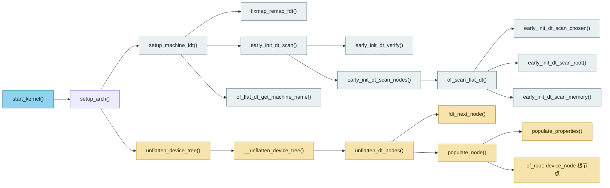
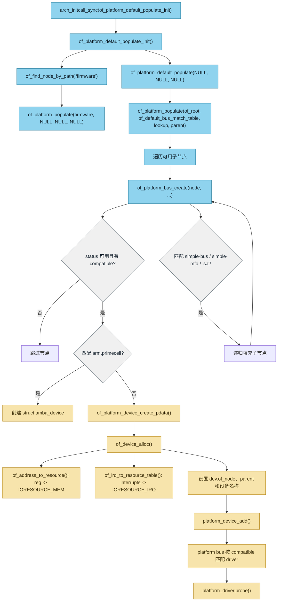
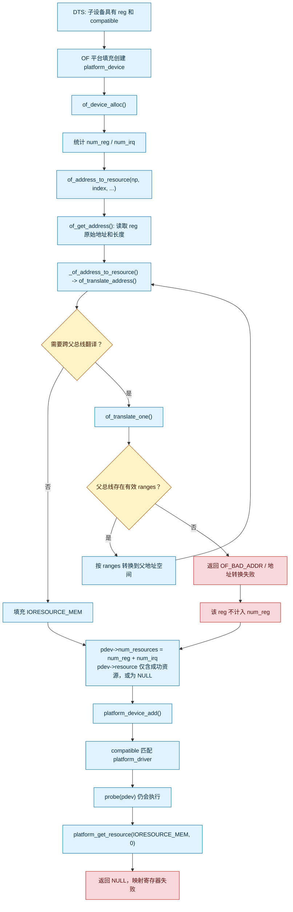

# 1 设备树基础与工具链

设备树（Device Tree，简称 DT）是嵌入式 Linux 中描述硬件拓扑和硬件资源的数据结构。它将板级硬件差异从驱动代码中分离出来，使同一个驱动能够运行在多个硬件配置不同的开发板上。

本章说明设备树的基本概念、`.dts`、`.dtsi`、`.dtb` 与 `dtc` 的关系，并介绍内核源码中的位置、构建方式以及设备树的编译和反编译方法。

## 1.1 什么是设备树

设备树是一棵由节点（node）和属性（property）组成的树形数据结构。内核启动时读取设备树，获得板上设备及其资源信息，然后依据这些信息创建和匹配设备。

设备树通常描述以下内容：

- 板卡型号和 SoC 型号。
- 设备的寄存器地址和地址空间大小。
- 中断控制器及设备使用的中断。
- GPIO、时钟、复位、电源和引脚复用等资源。
- 设备之间的连接关系和兼容性标识。

设备树不等于驱动。二者职责不同：

- 驱动代码定义“如何控制设备”，例如如何读写寄存器、处理中断和管理电源。
- 设备树定义“设备位于何处、连接了哪些资源、采用何种硬件配置”。

例如，同一个 GPIO LED 驱动可以服务于多块开发板；只需在各自的设备树中修改 LED 所使用的 GPIO 编号和有效电平，无需修改驱动主体。

### 1.1.1 设备树的工作流程

典型流程如下：

```text
硬件原理图
    ↓
.dts 和 .dtsi 源文件
    ↓ dtc 或内核构建系统
.dtb 二进制设备树
    ↓ Bootloader 传递给内核
Linux 内核解析设备树
    ↓
创建设备并与驱动的 compatible 表匹配
```

在 ARM、ARM64、RISC-V 和 PowerPC 等嵌入式平台中，Bootloader 通常将 `.dtb` 加载到内存，并把设备树地址传递给内核。内核解析后，可通过 `/proc/device-tree` 或 `/sys/firmware/devicetree/base` 查看运行中的设备树。

### 1.1.2 设备树与平台设备

对于平台设备，设备树节点常通过 `compatible` 属性与驱动匹配：

```dts
led0 {
    compatible = "example,gpio-led";
    led-gpios = <&gpio1 3 0>;
};
```

驱动侧提供对应的 `of_device_id` 表：

```c
static const struct of_device_id gpio_led_of_match[] = {
    { .compatible = "example,gpio-led" },
    { }
};
MODULE_DEVICE_TABLE(of, gpio_led_of_match);
```

当 `compatible` 字符串相同时，内核将设备树节点对应的设备与该驱动匹配。节点名称如 `led0` 主要用于阅读和组织；真正参与设备树匹配的核心字段通常是 `compatible`。

## 1.2 DTS、DTSI、DTB 与 DTC

设备树开发中最常见的四个缩写分别代表源文件、包含文件、二进制文件和编译工具。

### 1.2.1 DTS

`.dts` 是 Device Tree Source 的缩写，即设备树源文件。它是可读、可编辑的文本文件，通常描述某一块具体开发板或产品板的最终硬件配置。

一个最小 `.dts` 文件示例如下：

```dts
/dts-v1/;

/ {
    model = "Example Board";
    compatible = "example,board", "example,soc";
};
```

其中：

- `/dts-v1/;`：声明该文件采用设备树语法版本 1。
- `/`：根节点。
- `model`：面向人阅读的板卡名称。
- `compatible`：供内核和驱动进行兼容性匹配的字符串列表。

`.dts` 通常是编译入口文件。编译后会生成一个与开发板对应的 `.dtb` 文件。

### 1.2.2 DTSI

`.dtsi` 是 Device Tree Source Include 的缩写，即设备树包含文件。它用于存放可复用的公共描述，不能简单理解为最终的板级设备树。

典型分层方式如下：

```text
芯片系列公共描述       arch/arm64/boot/dts/vendor/soc.dtsi
SoC 封装或子系列描述    arch/arm64/boot/dts/vendor/soc-package.dtsi
具体开发板描述          arch/arm64/boot/dts/vendor/board.dts
```

板级 `.dts` 可通过 C 预处理器包含 `.dtsi`：

```dts
#include "soc.dtsi"

/ {
    model = "Example Board";
};

&uart0 {
    status = "okay";
};
```

使用 `.dtsi` 的目的：

- 避免为同一 SoC 的多块开发板重复描述公共外设。
- 使 SoC 默认配置与板级差异分层维护。
- 允许板级 `.dts` 通过 `&label` 引用并覆盖已有节点属性。

注意：`.dtsi` 的内容会在预处理阶段展开到 `.dts` 中，最终由 `dtc` 处理的是展开后的设备树文本。

### 1.2.3 DTB

`.dtb` 是 Device Tree Blob 的缩写，即设备树二进制文件。它是由 `dtc` 将 `.dts` 编译得到的二进制格式，常被 Bootloader 和 Linux 内核使用。

其关系为：

```text
.dts + .dtsi --(cpp 预处理 + dtc 编译)--> .dtb
```

`.dtb` 不是 C 源码，不能直接使用普通文本编辑器可靠地修改。正确做法是修改 `.dts` 或 `.dtsi`，然后重新编译生成 `.dtb`。

常见加载位置因平台而异，例如：

- U-Boot 可能从 FAT、ext4、TFTP 或 FIT 镜像加载 `.dtb`。
- 某些 Android 或厂商固件会将 `.dtb` 打包进 `boot.img`、`dtbo.img` 或其他固件镜像。
- 内核安装后，发行版可能将设备树放在 `/boot/dtbs/<内核版本>/`。

### 1.2.4 DTC

`dtc` 是 Device Tree Compiler 的缩写，即设备树编译器。它负责在设备树源码与二进制设备树之间转换。

常用调用形式：

```sh
dtc -I dts -O dtb -o board.dtb board.dts
dtc -I dtb -O dts -o board.dts board.dtb
```

重要参数：

| 参数        | 含义                              |
| --------- | ------------------------------- |
| `-I dts`  | 指定输入格式为设备树源文件                   |
| `-I dtb`  | 指定输入格式为二进制设备树                   |
| `-O dtb`  | 指定输出格式为二进制设备树                   |
| `-O dts`  | 指定输出格式为设备树源文本                   |
| `-o <文件>` | 指定输出文件名                         |
| `-i <目录>` | 增加 `.dtsi` 搜索目录                 |
| `-@`      | 保留符号信息，供 Device Tree Overlay 使用 |
| `-f`      | 即使存在错误也强制生成输出，通常仅用于排查问题         |

## 1.3 设备树文件在 Linux 内核源码中的路径

Linux 内核将设备树源码按 CPU 架构分类存放。源码树中的根路径通常为：

```text
arch/<架构>/boot/dts/
```

常见架构路径：

```text
arch/arm/boot/dts/       32 位 ARM
arch/arm64/boot/dts/     64 位 ARM
arch/riscv/boot/dts/     RISC-V
arch/powerpc/boot/dts/   PowerPC
```

以 ARM64 为例，厂商和 SoC 系列通常继续分目录组织：

```text
arch/arm64/boot/dts/
├── allwinner/
├── amlogic/
├── freescale/
├── mediatek/
├── qcom/
├── rockchip/
└── ti/
```

例如，Rockchip 平台的板级文件可能位于：

```text
arch/arm64/boot/dts/rockchip/<board>.dts
```

同目录中通常还包含该 SoC 的 `.dtsi` 文件。实际文件名取决于内核版本和厂商维护方式，应以当前源码树为准。

### 1.3.1 构建输出目录中的 DTB 路径

若内核使用独立输出目录构建，例如 `make O=out ...`，生成的 `.dtb` 不在源码目录，而在输出目录的相同相对路径下：

```text
out/arch/arm64/boot/dts/<厂商目录>/<board>.dtb
```

不使用 `O=` 时，`.dtb` 通常生成在源码树内：

```text
arch/arm64/boot/dts/<厂商目录>/<board>.dtb
```

因此，修改设备树后应确认实际部署到 Bootloader 或 `/boot` 的文件来自当前构建输出目录，避免把旧 `.dtb` 误复制到开发板。

### 1.3.2 运行时设备树的位置

内核启动后，已解析的设备树会导出为目录结构：

```sh
ls /proc/device-tree
ls /sys/firmware/devicetree/base
```

这些目录中的属性通常是原始二进制字节，不能默认按字符串直接查看。例如，可用下面的命令读取 `model`：

```sh
tr -d '\000' < /proc/device-tree/model
```

运行时目录适合核对“内核实际拿到的设备树”，而不是仅检查源码文件。若部署了错误的 `.dtb`，这里能够直接暴露问题。

## 1.4 DTC 源码位置与编译方式

### 1.4.1 内核源码树中的 DTC

Linux 内核自带一份 `dtc` 源码，主要位于：

```text
scripts/dtc/
```

该目录除了设备树编译器本体，还包含 `libfdt` 等相关代码。`libfdt` 是操作扁平化设备树（Flattened Device Tree，FDT）二进制格式的库，内核、Bootloader 和用户空间工具都可能使用它。

常见目录内容包括：

```text
scripts/dtc/
├── dtc.c          dtc 主程序源码
├── dtc-parser.y   语法分析规则
├── dtc-lexer.l    词法分析规则
├── checks.c       设备树检查规则
├── libfdt/        FDT 操作库
└── Makefile       构建规则
```

不同内核版本的文件组织会略有差异，但 `scripts/dtc/` 是内核内置设备树工具的核心位置。

### 1.4.2 内核如何编译 DTC

内核构建设备树前，会根据主机环境准备主机工具（host tools）。当系统没有可直接复用的合适 `dtc` 时，Kbuild 会构建内核源码树中的 `scripts/dtc/dtc`，再用它编译 `.dts`。

逻辑上可理解为：

```text
主机 C 编译器
    ↓
scripts/dtc/ 源码
    ↓
scripts/dtc/dtc（主机可执行程序）
    ↓
arch/<架构>/boot/dts/*.dts
    ↓
*.dtb
```

这里的 `dtc` 是运行在构建主机上的工具，而不是运行在目标开发板上的程序。因此交叉编译内核时：

- `dtc` 使用主机编译器构建。
- 内核和目标 `.dtb` 使用目标架构对应的构建配置生成。
- 不应使用 `CROSS_COMPILE` 强制把 `dtc` 编译成目标板 CPU 可执行文件。

在内核源码根目录执行以下命令，可单独准备脚本和 `dtc`：

```sh
make scripts
```

完成后，通常可在以下位置找到内核构建出的工具：

```text
scripts/dtc/dtc
```

若使用 `O=out`，该工具的位置可能位于输出目录的 `scripts/dtc/dtc`，应以实际构建目录为准。

## 1.4 使用内核构建系统编译设备树

直接执行 `dtc` 只能处理简单的设备树文件。内核中的板级 `.dts` 通常依赖大量 `.dtsi`、头文件和配置宏，因此推荐从内核源码根目录使用 `make` 构建。

### 1.4.1 编译全部 DTB

先准备目标架构的内核配置，再构建设备树：

```sh
make ARCH=arm64 <defconfig>
make ARCH=arm64 dtbs
```

交叉编译示例：

```sh
make ARCH=arm64 CROSS_COMPILE=aarch64-linux-gnu- <defconfig>
make ARCH=arm64 CROSS_COMPILE=aarch64-linux-gnu- dtbs
```

`dtbs` 目标会编译当前架构配置中需要的全部设备树二进制文件。对于首次构建或修改公共 `.dtsi` 的情况，这种方式更可靠。

### 1.4.2 编译单个 DTB

修改某个板级文件后，可只构建对应目标，缩短编译时间：

```sh
make ARCH=arm64 arch/arm64/boot/dts/<厂商目录>/<board>.dtb
```

使用独立输出目录时：

```sh
make O=out ARCH=arm64 arch/arm64/boot/dts/<厂商目录>/<board>.dtb
```

其中 `<厂商目录>` 与 `<board>` 必须替换为实际路径和文件名。例如，目标文件名应与内核 `Makefile` 中列出的 `dtb-$(CONFIG_...)` 条目一致。

### 1.4.3 构建过程中的 DTS 处理步骤

内核构建系统处理设备树时，大致经过以下步骤：

1. 使用 C 预处理器处理 `#include`、宏定义和条件编译内容。
2. 建立 `.dts`、`.dtsi` 和头文件之间的依赖关系。
3. 调用 `dtc` 将预处理结果转换为 `.dtb`。
4. 对启用 Overlay 的设备树按需加入符号信息。
5. 将 `.dtb` 输出到对应的架构输出目录。

因此，只修改 `.dtsi` 后直接运行旧的 `dtc` 命令，可能无法得到与内核构建一致的结果。应优先执行对应的 `make ... .dtb` 目标。

### 1.4.4 常见构建错误

`dtc` 报错时，应先查看报错文件和行号。常见问题包括：

- `syntax error`：节点、属性或分号语法错误。
- `Label or path ... not found`：`&label` 引用的标签不存在，或未包含声明该标签的 `.dtsi`。
- `duplicate label`：同一编译单元中标签重名。
- `Warning (unit_address_vs_reg)`：节点名中的单元地址与 `reg` 属性不一致。
- `Warning (avoid_unnecessary_addr_size)`：`#address-cells` 或 `#size-cells` 设置不必要或位置不正确。

不建议为了消除告警而直接添加 `-f`。应先判断告警是否反映了真实硬件描述错误，特别是地址、中断和 GPIO 相关问题。

## 1.5 手动编译 DTS 文件

当 `.dts` 不依赖复杂内核包含文件时，可直接使用独立 `dtc` 编译。

### 1.5.1 基本编译命令

```sh
dtc -I dts -O dtb -o board.dtb board.dts
```

该命令的含义：

- 输入为 `board.dts` 源文件。
- 输出格式为 `.dtb`。
- 输出文件为 `board.dtb`。

若 `.dts` 使用同目录或指定目录下的 `.dtsi`，可增加包含路径：

```sh
dtc -I dts -O dtb -i ./include -i ./dts -o board.dtb board.dts
```

### 1.5.2 含内核头文件的 DTS

内核设备树经常包含 `dt-bindings` 头文件，例如：

```dts
#include <dt-bindings/interrupt-controller/irq.h>
```

这类 `.dts` 往往还使用 C 宏，不能只执行简单的 `dtc` 命令。推荐方式是使用内核 Kbuild。若因调试需要手动处理，必须先调用与内核一致的 C 预处理器，并提供正确的头文件搜索路径；这比直接执行 `dtc` 更容易遗漏参数。

结论：

- 自己编写的简单 `.dts`：可直接用 `dtc`。
- 内核源码中的板级 `.dts`：优先用 `make ... .dtb`。

## 1.6 反编译 DTB 文件

反编译是将 `.dtb` 转回可读的 `.dts` 文本，常用于检查厂商提供的二进制设备树、确认实际部署内容和排查配置问题。

### 1.6.1 基本反编译命令

```sh
dtc -I dtb -O dts -o board.dts board.dtb
```

为提高可读性，常同时保留符号信息：

```sh
dtc -I dtb -O dts -@ -o board.dts board.dtb
```

反编译完成后可用文本工具查看：

```sh
less board.dts
```

### 1.6.2 反编译运行中的设备树

要确认内核实际使用的设备树，可从运行时设备树目录生成 `.dts`：

```sh
dtc -I fs -O dts -o running.dts /sys/firmware/devicetree/base
```

其中 `-I fs` 表示输入是以文件系统目录形式导出的设备树，而不是 `.dtb` 文件。

该方法尤其适合排查以下问题：

- 修改后的 `.dtb` 是否真正被 Bootloader 加载。
- Bootloader 是否对设备树进行了额外修改。
- 内核启动后某个节点是否被禁用或覆盖。

### 1.6.3 反编译结果的限制

反编译结果适合分析，但通常不能保证与原始 `.dts` 完全一致：

- `.dtsi` 的包含层次已经被展开，无法自动恢复原始文件划分。
- 注释、空行和原始格式不会保留。
- 部分标签可能变成路径或自动生成的形式。
- 宏定义在编译时已被替换为具体数值。

因此，反编译后的 `.dts` 应作为分析和修改的参考。若需要长期维护，最好回到原始内核源码中的 `.dts` 和 `.dtsi` 修改，再重新构建。

## 1.7 设备树编译与部署检查

修改设备树后的推荐检查顺序如下：

1. 修改正确的板级 `.dts` 或对应的公共 `.dtsi`。
2. 使用内核 `make` 重新生成目标 `.dtb`。
3. 确认生成文件的路径、时间戳和文件名。
4. 将新 `.dtb` 部署到 Bootloader 实际加载的位置。
5. 重启开发板。
6. 通过 `/proc/device-tree` 或 `/sys/firmware/devicetree/base` 核对运行时内容。
7. 查看内核日志，确认对应驱动完成匹配和 probe。

可使用以下命令确认设备树相关日志：

```sh
dmesg | grep -i -E 'of:|device tree|dtb|probe'
```

注意事项：

- `.dtb` 文件名必须与 Bootloader 配置或启动脚本中指定的文件名一致。
- 同一开发板可能存在多个启动介质和多个 `.dtb` 副本，应确认实际生效的副本。
- 设备树的 `status = "disabled";` 会阻止对应节点被启用；常用 `status = "okay";` 启用设备。
- 修改寄存器地址、中断号、GPIO 极性前应对照芯片手册和硬件原理图。
- 不应直接修改运行时 `/proc/device-tree` 文件；它是内核导出的只读硬件描述视图。

## 1.8 本章小结

本章建立了设备树的基本工具链认识：

- `.dts` 是具体板级设备树源文件。
- `.dtsi` 是可复用的公共包含文件。
- `.dtb` 是由 `dtc` 生成、供 Bootloader 和内核加载的二进制设备树。
- `dtc` 的内核源码主要位于 `scripts/dtc/`，由 Kbuild 作为主机工具构建。
- 设备树源码通常位于 `arch/<架构>/boot/dts/`。

### 1.8.1 查找板级 DTS 与目标 DTB

在内核源码根目录中，先根据实际芯片或板卡名称查找 `.dts` 文件：

```sh
find arch/arm64/boot/dts -name '*<board>*.dts'
find arch/arm/boot/dts -name '*<board>*.dts'
```

例如，64 位 ARM 的设备树源码通常位于：

```text
arch/arm64/boot/dts/<厂商目录>/<board>.dts
```

修改前应确认该文件确实是 Bootloader 使用的目标板设备树。一个 SoC 目录下可能同时存在评估板、多个产品板和多个硬件版本的 `.dts` 文件。

### 1.8.2 使用内核 Kbuild 编译设备树

内核源码中的 `.dts` 往往包含 `.dtsi` 和 `dt-bindings` 头文件，因此优先在内核源码根目录使用 Kbuild 编译。

首次构建时，先生成与目标架构对应的内核配置：

```sh
make ARCH=arm64 <defconfig>
```

编译当前配置涉及的全部设备树：

```sh
make ARCH=arm64 dtbs
```

ARM64 交叉编译示例：

```sh
make ARCH=arm64 CROSS_COMPILE=aarch64-linux-gnu- <defconfig>
make ARCH=arm64 CROSS_COMPILE=aarch64-linux-gnu- dtbs
```

若只修改了某一个板级 `.dts` 或其包含的 `.dtsi`，可以仅构建对应 `.dtb`：

```sh
make ARCH=arm64 arch/arm64/boot/dts/<厂商目录>/<board>.dtb
```

使用独立输出目录时，所有构建命令都应带上相同的 `O=` 参数：

```sh
make O=out ARCH=arm64 <defconfig>
make O=out ARCH=arm64 arch/arm64/boot/dts/<厂商目录>/<board>.dtb
```

此时生成文件通常位于：

```text
out/arch/arm64/boot/dts/<厂商目录>/<board>.dtb
```

不使用 `O=out` 时，文件通常生成在内核源码树的对应路径下。不要只依据文件名判断构建结果，应确认部署的是本次构建生成的 `.dtb`。

### 1.8.3 使用独立 dtc 编译简单 DTS

对于不依赖内核头文件、宏和复杂 `.dtsi` 层次的独立 DTS，可直接使用 `dtc`：

```sh
dtc -I dts -O dtb -o board.dtb board.dts
```

命令含义：

- `-I dts`：输入格式是 DTS 源文本。
- `-O dtb`：输出格式是二进制 DTB。
- `-o board.dtb`：指定输出文件。
- `board.dts`：输入的设备树源文件。

若 DTS 需要从指定目录搜索 `.dtsi`，可增加一个或多个 `-i` 参数：

```sh
dtc -I dts -O dtb -i ./dts -i ./include -o board.dtb board.dts
```

若系统未安装独立 `dtc`，在 Debian 或 Ubuntu 主机上可安装：

```sh
sudo apt install device-tree-compiler
dtc --version
```

对于内核源码内的板级 `.dts`，不建议用上面的简化命令替代 Kbuild。否则容易漏掉 C 预处理、`dt-bindings` 搜索路径和内核配置相关宏。

### 1.8.4 反编译 DTB 文件

将二进制设备树反编译为可读 DTS：

```sh
dtc -I dtb -O dts -o board.dts board.dtb
```

命令含义：

- `-I dtb`：输入格式是 DTB 二进制文件。
- `-O dts`：输出格式是 DTS 文本。
- `-o board.dts`：指定反编译后的输出文件。
- `board.dtb`：待分析的二进制设备树。

对于可能包含 Overlay 符号信息的 DTB，可使用 `-@` 保留符号相关输出：

```sh
dtc -I dtb -O dts -@ -o board.dts board.dtb
```

反编译结果适合检查 `compatible`、`reg`、GPIO、中断和 `status` 等实际内容，但不能恢复原始 `.dtsi` 的包含结构、注释和宏名称。长期维护应修改原始 `.dts/.dtsi`，不要把反编译文件直接当作唯一源码。

### 1.8.5 导出并核对运行中的设备树

确认开发板实际加载的设备树时，可直接导出内核运行中的设备树：

```sh
dtc -I fs -O dts -o running.dts /sys/firmware/devicetree/base
```

也可查看设备树目录和板卡型号：

```sh
ls /proc/device-tree
tr -d '\000' < /proc/device-tree/model
```

推荐的完整操作顺序：

1. 修改目标板的 `.dts` 或公共 `.dtsi`。
2. 使用 `make ... .dtb` 或 `make ... dtbs` 生成新的 `.dtb`。
3. 记录并核对输出 `.dtb` 的完整路径和更新时间。
4. 将该 `.dtb` 复制到 Bootloader 实际加载的位置，或更新包含该文件的启动镜像。
5. 重启开发板。
6. 使用 `dtc -I fs -O dts` 导出运行中的设备树，与修改内容核对。
7. 使用 `dmesg` 检查设备树匹配和驱动 probe 结果。

```sh
dmesg | grep -i -E 'of:|device tree|dtb|probe'
```

## 2 设备树基本语法

设备树源文件采用树形结构。每个节点用于描述一个硬件实体、总线、资源提供者或逻辑配置单元；节点内部使用属性描述其特征和资源。

一个节点由节点名称、可选的单元地址、可选标签、属性以及子节点组成。设备树语法使用分号结束属性声明，使用花括号包围节点内容。

## 2.1 节点与子节点

### 2.1.1 节点基本形式

设备树节点的一般形式如下：

```dts
[标签:] 节点名称[@单元地址] {
    属性名 = 属性值;
    子节点 {
        属性名 = 属性值;
    };
};
```

各部分含义如下：

- `标签`：可选的符号名称，供其他节点通过 `&标签` 引用。
- `节点名称`：节点的逻辑名称，用于表示设备、总线或功能单元。
- `@单元地址`：可选的单元地址（unit address），通常对应设备在父总线地址空间中的首地址。
- `属性`：键值形式的硬件描述信息。
- `子节点`：从属于当前节点的节点。

示例：

```dts
uart0: serial@10000000 {
    compatible = "example,uart";
    reg = <0x10000000 0x1000>;
    status = "okay";
};
```

在该示例中，`uart0` 是标签，`serial` 是节点名称，`10000000` 是单元地址。其他位置可通过 `&uart0` 引用该节点。

### 2.1.2 父子关系

节点之间通过嵌套表示父子关系。父节点通常代表 SoC、总线或控制器，子节点代表挂接在其上的设备。

```dts
soc {
    #address-cells = <1>;
    #size-cells = <1>;

    i2c0: i2c@10001000 {
        compatible = "example,i2c";
        reg = <0x10001000 0x1000>;

        eeprom@50 {
            compatible = "atmel,24c02";
            reg = <0x50>;
        };
    };
};
```

上述结构表达了以下关系：

- `soc` 是 SoC 内部设备的父节点。
- `i2c@10001000` 是挂在 SoC 总线上的 I2C 控制器。
- `eeprom@50` 是挂在 I2C 总线上的从设备，`0x50` 是它的 I2C 从地址，不是 CPU 物理地址。

因此，`reg` 和单元地址的解释依赖父节点所代表的总线类型与 `#address-cells`、`#size-cells` 定义，不能脱离父节点单独理解。

### 2.1.3 同级节点的命名规则

同一父节点下，节点的完整名称必须唯一。完整名称由节点名称和可选单元地址共同组成：

```text
节点全名 = 节点名称[@单元地址]
```

错误示例，两个同级节点全名都为 `led`：

```dts
led {
};

led {
};
```

正确示例，使用不同名称：

```dts
status-led {
};

power-led {
};
```

对于同类且地址不同的设备，可使用相同节点名称但必须使用不同单元地址：

```dts
serial@10000000 {
};

serial@10001000 {
};
```

这两个节点的完整名称分别为 `serial@10000000` 和 `serial@10001000`，因此可以作为同级节点共存。

注意事项：

- 标签不等于节点名称，标签仅是编译期引用符号。
- 同级节点的标签也应保持唯一，否则 `dtc` 会报告重复标签错误。
- 节点名称应使用小写字母、数字和连字符，避免使用含义不明的缩写。
- 当节点存在 `reg` 属性时，节点的 `@单元地址` 应与 `reg` 的首个地址一致，否则 `dtc` 可能给出 `unit_address_vs_reg` 告警。

## 2.2 地址、长度与 reg 属性

### 2.2.1 reg 属性

`reg` 属性用于描述设备的地址信息。对于内存映射设备，最常见的形式是“起始地址 + 地址空间长度”。

```dts
reg = <地址 长度>;
```

示例：

```dts
gpio0: gpio@10020000 {
    compatible = "example,gpio";
    reg = <0x10020000 0x1000>;
};
```

在父节点的 `#address-cells = <1>;` 且 `#size-cells = <1>;` 时，`reg = <0x10020000 0x1000>;` 表示：

- 地址为 `0x10020000`。
- 长度为 `0x1000` 字节。

`reg` 的含义不局限于 CPU 物理地址：

- 在 I2C 子节点中，`reg` 常表示 I2C 从设备地址。
- 在 SPI 子节点中，`reg` 常表示片选号。
- 在 PCI 等总线中，`reg` 的单元格式由该总线绑定文档定义。

编写前应查阅该节点所属总线或设备的 Devicetree binding 文档，不能把所有 `reg` 都当作物理地址。

### 2.2.2 #address-cells

`#address-cells` 是父节点的属性，用于规定其直接子节点的 `reg` 属性中，一个地址使用多少个 32 位单元（cell）表示。

```dts
#address-cells = <数量>;
```

例如：

```dts
soc {
    #address-cells = <1>;
    #size-cells = <1>;

    timer@10000000 {
        reg = <0x10000000 0x1000>;
    };
};
```

`#address-cells = <1>;` 表示子节点的每个地址由一个 32 位 cell 表示。适用于地址可在 32 位内表示的场景。

对于 64 位地址，常使用两个 cell：

```dts
soc {
    #address-cells = <2>;
    #size-cells = <2>;

    device@0,10000000 {
        reg = <0x0 0x10000000 0x0 0x1000>;
    };
};
```

其中 `reg` 的前两个 cell `0x0 0x10000000` 组成 64 位地址，后两个 cell `0x0 0x1000` 组成 64 位长度。

### 2.2.3 #size-cells

`#size-cells` 同样由父节点定义，用于规定其直接子节点 `reg` 属性中，一个长度使用多少个 32 位 cell 表示。

```dts
#size-cells = <数量>;
```

常见取值：

- `<1>`：长度由一个 32 位 cell 表示。
- `<2>`：长度由两个 32 位 cell 表示，通常用于 64 位地址空间。
- `<0>`：子节点没有地址空间长度字段。

I2C、SPI 等子设备通常只需要一个地址或片选号，而没有地址空间长度，因此父总线节点常设置：

```dts
i2c0: i2c@10001000 {
    #address-cells = <1>;
    #size-cells = <0>;

    sensor@36 {
        reg = <0x36>;
    };
};
```

这里的 `sensor@36` 与 `reg = <0x36>;` 均表示 I2C 从地址 `0x36`。`#size-cells = <0>;` 表示不需要为子节点的 `reg` 提供长度字段。

### 2.2.4 地址单元的作用范围

`#address-cells` 和 `#size-cells` 只约束直接子节点，不能跨层继承。每一层总线节点都应根据其子节点的地址格式自行设置。

```dts
/ {
    #address-cells = <2>;
    #size-cells = <2>;

    soc {
        #address-cells = <1>;
        #size-cells = <1>;

        uart@10000000 {
            reg = <0x10000000 0x1000>;
        };
    };
};
```

在该示例中，根节点针对 `soc` 的 `reg` 使用两个地址 cell 和两个长度 cell；而 `soc` 直接子节点 `uart@10000000` 的 `reg` 使用一个地址 cell 和一个长度 cell。

## 2.3 常用标准属性

### 2.3.1 model 属性

`model` 属性用于描述整块板卡或系统的可读名称，通常定义在根节点。

```dts
/ {
    model = "Example ARM64 Development Board";
};
```

`model` 主要面向人阅读，内核可将其显示在启动日志或系统信息中，但通常不用于驱动匹配。

注意：设备树规范中没有通用的 `mode` 属性。若题目中的“mode 属性”指板卡名称，正确属性名应为 `model`；若某节点存在 `mode`，则它通常是该设备 binding 定义的自定义属性，含义必须以该驱动文档为准。

### 2.3.2 status 属性

`status` 属性用于说明节点是否可用。内核设备树代码会根据它判断节点能否被视为可用节点。

```dts
status = "okay";
```

常见取值：

| 值                     | 含义                   |
| --------------------- | -------------------- |
| `"okay"` 或 `"ok"`     | 节点可用，允许内核创建对应设备      |
| `"disabled"`          | 节点已禁用，通常不创建对应设备      |
| `"reserved"`          | 节点已保留，不应被普通系统软件使用    |
| `"fail"`、`"fail-sss"` | 节点不可用，`sss` 为错误状态字符串 |

未声明 `status` 时，设备树规范默认该节点为可用；但板级设备树通常会显式用 `status = "okay";` 覆盖 SoC `.dtsi` 中的 `status = "disabled";`。

示例：

```dts
&uart1 {
    status = "okay";
};
```

该写法通过标签引用在 `.dtsi` 中定义的 `uart1` 节点，并启用该 UART 控制器。

### 2.3.3 compatible 属性

`compatible` 属性用于声明节点的硬件兼容性，是设备树设备与驱动匹配的关键属性。

```dts
compatible = "厂商,设备型号";
```

常见写法是从最具体到最通用列出多个字符串：

```dts
compatible = "example,board-v2", "example,board", "example,soc";
```

驱动匹配时通常从左到右查找，并优先匹配最具体的字符串。驱动侧示例：

```c
static const struct of_device_id example_of_match[] = {
    { .compatible = "example,board-v2" },
    { .compatible = "example,board" },
    { }
};
```

编写规则：

- 使用 `厂商前缀,型号` 形式，例如 `"vendor,device"`。
- 前缀应使用 Devicetree 上游登记或厂商约定的名称。
- 不要使用节点名替代 `compatible`。
- 不要只因设备“看起来相近”就复用其他芯片的 `compatible`，寄存器和行为差异会导致驱动错误工作。

## 2.4 特殊节点

### 2.4.1 aliases 节点

`/aliases` 是根节点下的特殊节点，用于为其他设备树节点定义稳定别名。

```dts
/ {
    aliases {
        serial0 = &uart0;
        serial1 = &uart1;
        ethernet0 = &gmac0;
    };
};
```

属性名是别名，属性值是目标节点引用。内核可使用别名为设备分配稳定编号；例如 `serial0` 常对应第一个串口控制台的逻辑编号。

常见用途：

- 固定串口、网卡、I2C 控制器等设备的逻辑编号。
- 避免硬件节点在不同板级设备树中的排列顺序影响设备编号。
- 供 Bootloader、内核和驱动通过 `of_alias_get_id()` 获取别名编号。

注意：别名不会修改目标节点的 `compatible`、硬件地址或驱动匹配关系，它只提供另一种稳定引用方式。

### 2.4.2 chosen 节点

`/chosen` 是根节点下的特殊节点，用于传递启动时的系统配置信息，而不是描述固定硬件。

```dts
/ {
    chosen {
        bootargs = "console=ttyS0,115200 root=/dev/mmcblk0p2 rw";
        stdout-path = "serial0:115200n8";
    };
};
```

常见属性：

- `bootargs`：传递给内核的命令行参数。Bootloader 也可能在启动时覆盖或追加该值。
- `stdout-path`：指定早期控制台或标准输出设备，值可以使用 `/aliases` 中定义的串口别名。
- `linux,initrd-start` 和 `linux,initrd-end`：initramfs 的起止地址，常由 Bootloader 在启动时填充。

`chosen` 节点描述的是本次启动上下文。不要把 GPIO、寄存器地址等固定硬件资源放入该节点。

### 2.4.3 device_type 属性

`device_type` 属性用于标识节点的设备类别，典型值包括 `"cpu"` 和 `"memory"`：

```dts
cpus {
    #address-cells = <1>;
    #size-cells = <0>;

    cpu0: cpu@0 {
        device_type = "cpu";
        reg = <0>;
    };
};

memory@40000000 {
    device_type = "memory";
    reg = <0x40000000 0x40000000>;
};
```

在现代设备树中，普通外设驱动应使用 `compatible` 来进行识别和匹配，不能以 `device_type` 替代 `compatible`。`device_type` 主要保留给 CPU、内存等规范明确要求或历史上需要该属性的节点。

## 2.5 自定义属性

设备树允许节点定义自定义属性，用于传递该设备 binding 规定的硬件差异信息。自定义不表示可以随意命名；属性名、数据类型和取值应与驱动解析代码或 binding 文档保持一致。

### 2.5.1 常见属性值形式

设备树的属性值常见形式如下：

```dts
demo@0 {
    compatible = "example,demo";
    label = "demo-device";
    example-u32 = <123>;
    example-array = <1 2 3>;
    example-bytes = [de ad be ef];
    enabled-by-default;
};
```

含义如下：

- `label = "demo-device";`：字符串属性，以 `\0` 结束。
- `example-u32 = <123>;`：一个或多个 32 位 cell。
- `example-array = <1 2 3>;`：32 位 cell 数组。
- `example-bytes = [de ad be ef];`：字节数组。
- `enabled-by-default;`：布尔属性；属性存在即为真，不存在即为假。

内核驱动可使用 OF API 读取属性：

```c
u32 value;
const char *label;
int ret;

ret = of_property_read_u32(np, "example-u32", &value);
ret = of_property_read_string(np, "label", &label);

if (of_property_read_bool(np, "enabled-by-default")) {
    /* 属性存在时执行对应配置。 */
}
```

参数说明：

- `np`：目标节点对应的 `struct device_node` 指针。
- `"example-u32"`、`"label"`：需要读取的属性名。
- `&value`、`&label`：保存读取结果的输出地址。

返回值说明：

- `0`：属性读取成功。
- `< 0`：属性不存在、长度不匹配或数据格式不正确。

### 2.5.2 自定义属性的设计原则

为设备设计属性时，应遵循以下原则：

- 优先复用已有 Devicetree binding 中定义的标准属性，例如 `reg`、`interrupts`、`clocks` 和 `reset-gpios`。
- 属性名应表达硬件连接或硬件能力，而不是驱动内部实现细节。
- 同一个属性在所有兼容板卡上应保持相同的数据类型和单位。
- 布尔属性只用“存在或不存在”表达，不要同时写成 `feature-enable = <1>;` 和布尔形式。
- 数值属性应在 binding 文档中明确单位，例如毫秒、微秒、赫兹或字节。

错误示例：

```dts
demo@0 {
    delay = <10>;
};
```

`delay` 无法判断单位，驱动维护者也无法确认其含义。更清晰的写法是：

```dts
demo@0 {
    reset-delay-us = <10>;
};
```

该名称明确表示复位延迟，单位为微秒。

## 2.6 基本语法示例

以下示例综合使用了节点、标签、地址单元、`reg`、`compatible`、`status`、`aliases` 和 `chosen`：

```dts
/dts-v1/;

/ {
    model = "Example Development Board";
    compatible = "example,board", "example,soc";
    #address-cells = <2>;
    #size-cells = <2>;

    aliases {
        serial0 = &uart0;
    };

    chosen {
        stdout-path = "serial0:115200n8";
    };

    memory@40000000 {
        device_type = "memory";
        reg = <0x0 0x40000000 0x0 0x40000000>;
    };

    soc {
        #address-cells = <1>;
        #size-cells = <1>;

        uart0: serial@10000000 {
            compatible = "example,uart";
            reg = <0x10000000 0x1000>;
            status = "okay";
            current-speed = <115200>;
        };
    };
};
```

阅读顺序建议：

1. 从根节点确认板卡的 `model` 和 `compatible`。
2. 查看根节点的地址编码规则，再理解内存节点的 `reg`。
3. 进入 `soc`，使用其 `#address-cells` 和 `#size-cells` 解读 UART 的 `reg`。
4. 通过 `aliases` 确认 `serial0` 指向 `uart0`。
5. 通过 `chosen` 确认启动控制台使用 `serial0`。
6. 查看 UART 节点的 `compatible`、`status` 和设备专用属性。

## 2.7 设备树属性在内核中的表示与设备绑定

设备树属性不会逐项复制到 `struct device` 的普通成员中。内核首先把 DTB 解析为一棵 `struct device_node` 树；随后，由平台总线、I2C、SPI 等总线代码根据节点内容创建具体的内核设备对象。创建出的设备通过 `dev->of_node` 关联到对应的设备树节点。

因此，准确链路应为：

```text
.dts/.dtsi
    ↓ dtc
.dtb
    ↓ 内核早期解析（unflatten）
struct device_node 树及其属性链表
    ↓ 各总线依据节点创建具体设备
struct platform_device / i2c_client / spi_device ...
    ↓
struct device::of_node 指向对应的 device_node
    ↓
驱动使用 OF 或设备资源接口读取属性
```

### 2.7.1 DTB 解析与 device_node

#### 2.7.1.1 内核先创建节点树，不是先创建所有 device

“内核为每个 DTS 节点创建一个 `struct device`”的说法不正确。

内核启动早期会把扁平化的 DTB 解析为 `struct device_node` 组成的树。该步骤会保留设备树节点、属性和父子关系，但不会为每一个 DTS 节点都创建 `struct device`。

不会直接创建普通设备的节点包括：

- 根节点 `/`。
- `/aliases`、`/chosen` 等特殊配置节点。
- 仅用于组织结构或提供资源的节点。
- `status = "disabled";` 的设备节点。
- 需要由特定总线控制器或专用内核代码进一步处理的节点。

具体设备由相应子系统创建。例如：

- 平台总线代码会为符合条件的 SoC 外设节点创建 `struct platform_device`。
- I2C 控制器驱动在注册适配器后，根据其子节点创建 `struct i2c_client`。
- SPI 控制器驱动根据其子节点创建 `struct spi_device`。
- CPU、内存、时钟和中断控制器等节点由各自的内核子系统解析处理。

所以，更准确的一一关系是：一个“可实例化的设备节点”通常会对应一个内核设备对象，但这取决于节点所属总线、绑定规则和内核配置，并不适用于设备树中的所有节点。

#### 2.7.1.2 struct device 与 of_node

由设备树创建或关联的设备，其通用设备对象会保存节点指针：

```c
struct device {
    /* ...其他成员... */
    struct device_node *of_node;
    /* ...其他成员... */
};
```

驱动通常通过 `struct device` 取得该指针：

```c
struct device_node *np = dev->of_node;
```

`dev->of_node` 的含义是“该设备关联的设备树节点”，而不是“在 `struct device` 内嵌了一份全部 DTS 属性”。`struct device` 仅保存指针，原始属性数据属于被指向的 `struct device_node`。

还应注意：并非每一个 `struct device` 都来自设备树。使用 ACPI、纯软件创建或传统板级代码注册的设备，`dev->of_node` 可能为 `NULL`。通用驱动可先判断：

```c
if (!dev->of_node)
    return -ENODEV;
```

#### 2.7.1.3 struct device_node 的关键成员

不同内核版本的 `struct device_node` 字段会略有变化，但现代内核的核心关系可以概括为：

```c
struct device_node {
    const char *name;
    phandle phandle;
    const char *full_name;
    struct fwnode_handle fwnode;
    struct property *properties;
    struct property *deadprops;
    struct device_node *parent;
    struct device_node *child;
    struct device_node *sibling;
    /* ...版本相关字段... */
};
```

字段说明：

- `name`：节点名称部分，例如 `serial`，不包含 `@10000000`。
- `full_name`：节点完整路径，例如 `/soc/serial@10000000`。
- `phandle`：节点的句柄值，供设备树引用使用。
- `properties`：当前节点的有效属性链表。
- `parent`、`child`、`sibling`：连接为设备树的父子和兄弟节点关系。
- `fwnode`：供设备树、ACPI 等统一固件节点接口使用。

需要纠正的是：主线 Linux 的 `struct device_node` 通常没有单独的 `compatible` 字段。`compatible` 与 `reg`、`status` 一样，都是存在 `properties` 链表中的属性。内核通过 `of_device_is_compatible()` 等 OF 接口查询它，而不是直接访问 `np->compatible`。

### 2.7.2 属性的原始存储形式

#### 2.7.2.1 struct property 属性链表

每个 DTS 属性会对应一个 `struct property`，并通过链表挂在所属节点的 `properties` 成员上。核心结构可概括为：

```c
struct property {
    char *name;
    int length;
    void *value;
    struct property *next;
    /* ...动态设备树等场景的版本相关字段... */
};
```

字段说明：

- `name`：属性名，例如 `compatible`、`reg`、`interrupts` 或 `reset-gpios`。
- `length`：`value` 的字节长度。
- `value`：DTB 中该属性的原始字节数据。
- `next`：下一个属性，连接属性链表。

示例 DTS：

```dts
led@0 {
    compatible = "test,led";
    reg = <0x12340000 0x1000>;
    gpios = <&gpio1 0 GPIO_ACTIVE_HIGH>;
};
```

对应的 `device_node->properties` 至少包含三个属性：

1. `compatible`：`value` 是以 `\0` 结束的字符串 `"test,led"`。
2. `reg`：`value` 是按大端格式编码的 32 位 cell 序列。
3. `gpios`：`value` 是 phandle 与 GPIO 参数组成的 32 位 cell 序列。

这里不能将 `reg` 简化为“两个 64 位数字”。设备树基本 cell 宽度为 32 位，`reg` 中地址与长度各占几个 cell 由父节点的 `#address-cells` 和 `#size-cells` 决定。例如 `<0x12340000 0x1000>` 在各为 1 的父节点下表示一个 32 位地址和一个 32 位长度；在 64 位编码场景中，一个地址或长度可能各使用两个 32 位 cell。

#### 2.7.2.2 原始属性的生命周期

常规静态设备树中，属性会在内核运行期间保持可访问，以供驱动在 probe 或后续运行阶段读取。但“永久保留”的表述不严谨：设备树 Overlay 动态添加或移除节点时，节点和属性可能被更新、从有效属性链表移至 `deadprops`，或在引用计数归零后释放。

驱动不应私自缓存 `property->value` 的裸指针并假设它永远有效。一般应通过 OF API 读取，或在确有长期保存需求时复制数据并按对应 API 的生命周期规则管理节点引用。

### 2.7.3 从原始属性到内核资源

#### 2.7.3.1 platform_device 的资源

平台总线为设备树节点创建 `struct platform_device` 时，OF 平台设备创建路径通常会解析该节点的地址资源和中断资源，并填充平台设备的资源数组。简化结构如下：

```c
struct platform_device {
    const char *name;
    int id;
    struct device dev;
    unsigned int num_resources;
    struct resource *resource;
};
```

常见调用顺序为：

```text
设备树节点
    ↓
OF 平台总线创建 platform_device
    ↓
解析 reg 和 interrupts 等资源
    ↓
platform_device::resource
    ↓
驱动调用 platform_get_resource() / platform_get_irq()
```

原说法中“`reg`、`interrupts` 会自动解析并存入所有 `platform_device`”应改为：当 OF 平台设备创建路径为某个设备节点创建了 `platform_device` 时，内核通常会把可解析的地址和中断信息转换为该设备的 `struct resource` 数组。普通 `device_node` 本身不会自动拥有一个 `struct resource` 数组，非平台总线设备也不使用 `platform_device->resource`。

`struct resource` 与原始属性的区别：

- `device_node->properties`：保留节点的原始属性字节，包括标准属性和自定义属性。
- `platform_device->resource`：平台总线转换后的 I/O 内存、I/O 端口或 IRQ 资源，便于平台驱动使用。
- `struct resource` 不存放 `status`、字符串、自定义数值、GPIO、时钟和电源等任意属性。

#### 2.7.3.2 reg 和 interrupts 的直接解析接口

驱动并不一定要依赖 `platform_device` 的资源数组。对于确实需要从节点直接转换资源的场景，可使用 OF 接口：

```c
struct resource res;
int irq;
int ret;

ret = of_address_to_resource(np, 0, &res);
irq = of_irq_get(np, 0);
```

参数说明：

- `np`：目标设备树节点。
- `0`：资源或中断索引，表示第一个 `reg` 条目或第一个中断。
- `res`：保存转换后的地址资源。

返回值说明：

- `of_address_to_resource()` 返回 `0` 表示地址转换成功，负错误码表示失败。
- `of_irq_get()` 返回大于 `0` 的 Linux IRQ 编号表示成功，负错误码表示失败；返回 `0` 通常表示中断尚未映射或不存在，应按接口文档谨慎处理。

#### 2.7.3.3 GPIO、时钟和复位资源

`gpios`、`clocks`、`resets` 等属性同样先以原始 cell 数据保存在 `properties` 中，但它们通常不会成为 `struct resource`。对应子系统会在驱动请求资源时解析 phandle 和参数。

现代 GPIO 驱动推荐使用描述符接口：

```c
struct gpio_desc *reset_gpio;

reset_gpio = devm_gpiod_get_optional(dev, "reset", GPIOD_OUT_LOW);
if (IS_ERR(reset_gpio))
    return PTR_ERR(reset_gpio);
```

该接口会根据 `dev` 的 `of_node` 查找 `reset-gpios` 属性，解析 GPIO 控制器 phandle、引脚号和有效电平，并返回 GPIO 描述符。

旧代码中的 `of_get_named_gpio()` 可以直接读取指定 GPIO 属性，但该整数 GPIO API 在新驱动中通常不再推荐。对新代码，应优先使用 `gpiod_get()`、`devm_gpiod_get()` 等描述符 API。

### 2.7.4 驱动读取设备树属性

#### 2.7.4.1 常用读取接口

驱动从 `dev->of_node` 获取节点后，常用 OF API 包括：

```c
u32 blink_rate;
const char *label;
int ret;

if (!of_device_is_compatible(dev->of_node, "test,led"))
    return -ENODEV;

ret = of_property_read_u32(dev->of_node, "blink-rate-hz", &blink_rate);
if (ret)
    return ret;

ret = of_property_read_string(dev->of_node, "label", &label);
if (ret)
    return ret;

if (of_property_read_bool(dev->of_node, "default-on")) {
    /* 布尔属性存在时执行对应配置。 */
}
```

接口与数据来源的对应关系：

| 接口                          | 读取内容                             |
| --------------------------- | -------------------------------- |
| `of_device_is_compatible()` | `compatible` 属性                  |
| `of_property_read_u32()`    | 单个 32 位 cell 属性                  |
| `of_property_read_string()` | 字符串属性                            |
| `of_property_read_bool()`   | 布尔属性是否存在                         |
| `of_address_to_resource()`  | 将 `reg` 转换为地址资源                  |
| `of_irq_get()`              | 将 `interrupts` 等信息映射为 Linux IRQ  |
| `platform_get_resource()`   | 从 `platform_device` 已准备的资源数组取得资源 |
| `platform_get_irq()`        | 从平台设备取得 IRQ 资源                   |
| `devm_gpiod_get()`          | 解析 `<name>-gpios` 并取得 GPIO 描述符   |

`of_property_read_*()` 和 `of_device_is_compatible()` 会查询节点的原始属性；`platform_get_resource()` 和 `platform_get_irq()` 面向的是已创建的 `platform_device` 资源，不应笼统称为“底层都直接访问 properties 链表”。

#### 2.7.4.2 驱动匹配与属性存储的先后关系

设备树节点与属性在 DTB 解析阶段已经形成 `device_node` 树。之后，设备创建和驱动匹配才会发生。因此，“匹配成功后才保存 DTS 属性”是错误的。

但也不能反过来说“解析 DTB 时就为全部节点创建了 device”。准确顺序为：

1. 内核解析 DTB，构造 `device_node` 和 `property` 数据。
2. 各总线和子系统根据可用节点创建相应设备对象。
3. 创建的设备通过 `dev->of_node` 关联节点。
4. 驱动依据 `compatible` 等规则与设备匹配，并在 probe 中读取属性和申请资源。

## 2.8 本章小结

- DTB 解析首先产生 `device_node` 树，设备树中的每个节点不会自动变成一个 `struct device`。
- `struct device::of_node` 保存关联节点的指针，原始属性存放在 `device_node->properties` 属性链表中。
- `compatible` 是普通设备树属性，不是现代主线 `struct device_node` 的独立成员。
- `reg`、`interrupts`、GPIO、时钟等属性先保留为原始 cell 数据，再由相应总线或资源框架按需解析。
- OF 平台设备通常会将可解析的地址和中断转换为 `platform_device` 的资源数组；该行为不适用于全部节点和全部总线。
- 驱动既可使用 OF API 读取原始属性，也可使用平台资源和 GPIO 描述符等接口取得解析后的资源。

## 3 设备树中断描述

设备树中的中断描述用于说明“设备的中断信号连接到哪个中断控制器，以及该控制器如何解释中断参数”。驱动不应把硬件 IRQ 号直接写死，而应从设备树解析中断并取得 Linux IRQ 编号。

中断控制器可以形成级联结构。以本章示例为例：

```text
FT5x06 触摸芯片的 INT 引脚
    ↓
GPIO0 的 PB5 引脚
    ↓ GPIO0 作为中断控制器
GIC 的 SPI 33 中断
    ↓
CPU
```

因此，FT5x06 节点描述的是“PB5 是本设备的中断”，GPIO0 节点描述的是“GPIO0 控制器的中断输出接到 GIC SPI 33”。内核会沿此中断父级链逐层解析，最终建立 Linux IRQ 映射。

### 3.1 示例节点与整体关系

宏 `GIC_SPI`、`IRQ_TYPE_LEVEL_HIGH`、`RK_PB5` 等通常来自设备树绑定头文件：

```dts
#include <dt-bindings/interrupt-controller/arm-gic.h>
#include <dt-bindings/interrupt-controller/irq.h>
#include <dt-bindings/gpio/gpio.h>

gpio0: gpio@fdd60000 {
    compatible = "rockchip,gpio-bank";
    reg = <0x0 0xfdd60000 0x0 0x100>;
    interrupts = <GIC_SPI 33 IRQ_TYPE_LEVEL_HIGH>;
    clocks = <&pmucru PCLK_GPIO0>, <&pmucru DBCLK_GPIO0>;

    gpio-controller;  // 表示这是一个gpio控制器
    #gpio-cells = <2>;
    gpio-ranges = <&pinctrl 0 0 32>;

    interrupt-controller;  // 表示这是一个GIC控制器
    #interrupt-cells = <2>;
};

ft5x06: ft5x06@38 {
    status = "disabled";
    compatible = "edt,edt-ft5306";
    reg = <0x38>;

    interrupt-parent = <&gpio0>;
    interrupts = <RK_PB5 IRQ_TYPE_LEVEL_LOW>;
    reset-gpios = <&gpio0 RK_PB6 GPIO_ACTIVE_LOW>;
    touchscreen-size-x = <800>;
    touchscreen-size-y = <1280>;
};
```

`ft5x06@38` 是 I2C 从设备，`reg = <0x38>` 表示 I2C 从地址。它的中断不是直接接到 GIC，而是接到 GPIO0 的 PB5；故 `interrupt-parent` 指向 `gpio0`，`interrupts` 按 GPIO0 的中断参数格式填写。

### 3.2 中断控制器节点

中断控制器节点向设备树声明：它能够接收一个或多个硬件中断输入，并把这些输入转换为可供子节点引用的中断域（IRQ domain）。GIC、GPIO 控制器、PCIe 控制器等都可能是中断控制器。

#### 3.2.1 interrupt-controller 属性

`interrupt-controller;` 是布尔属性。属性存在表示当前节点可以作为其他节点中断的父控制器。

```dts
gpio0: gpio@fdd60000 {
    interrupt-controller;
    #interrupt-cells = <2>;
};
```

该属性本身没有值。它告诉内核和设备树工具：其他节点可以通过 `interrupt-parent = <&gpio0>;` 把 GPIO0 指定为其中断父控制器。

`gpio-controller;` 与 `interrupt-controller;` 含义不同：

- `gpio-controller;`：当前节点可为其他节点提供 GPIO 引脚。
- `interrupt-controller;`：当前节点可为其他节点提供中断。

同一个 GPIO 控制器通常同时具备两种能力，因此示例中的 `gpio0` 同时声明了这两个布尔属性。

#### 3.2.2 #interrupt-cells 属性

标准属性名是 `#interrupt-cells`。它由中断控制器节点定义，表示“引用该控制器的一条中断时，需要在 `interrupts` 属性中写多少个 32 位 cell”。

```dts
#interrupt-cells = <2>;
```

在图片所示 Rockchip GPIO 控制器绑定中，两个 cell 的常见含义是：

```text
<GPIO 引脚编号 触发类型>
```

因此：

```dts
interrupts = <RK_PB5 IRQ_TYPE_LEVEL_LOW>;
```

可理解为“GPIO0 的 PB5 引脚产生低电平触发中断”。`RK_PB5` 是引脚编号宏，通常会展开成 GPIO bank 内的偏移量；`IRQ_TYPE_LEVEL_LOW` 是中断触发类型宏。

第二个 cell 的通用宏定义通常来自：

```c
#include <dt-bindings/interrupt-controller/irq.h>
```

常见取值包括：

| 宏                       | 含义    |
| ----------------------- | ----- |
| `IRQ_TYPE_EDGE_RISING`  | 上升沿触发 |
| `IRQ_TYPE_EDGE_FALLING` | 下降沿触发 |
| `IRQ_TYPE_EDGE_BOTH`    | 双边沿触发 |
| `IRQ_TYPE_LEVEL_HIGH`   | 高电平触发 |
| `IRQ_TYPE_LEVEL_LOW`    | 低电平触发 |

`#interrupt-cells` 的数值和每个 cell 的意义由中断控制器 binding 决定，不能机械地认为所有控制器都是 `<中断号 触发类型>`。例如 GIC 通常使用三个 cell，而本例 GPIO 控制器使用两个 cell。

#### 3.2.3 GPIO0 自身的 interrupts 属性

GPIO0 自己也是一个设备，它需要向上级 GIC 注册其汇总中断。因此 GPIO0 节点中也有：

```dts
interrupts = <GIC_SPI 33 IRQ_TYPE_LEVEL_HIGH>;
```

该 `interrupts` 不是描述 PB5，而是描述 GPIO0 控制器向 GIC 输出的中断。该属性的中断父控制器通常由更上层节点的 `interrupt-parent` 指定或继承；在完整 SoC DTS 中，根节点或 `soc` 节点通常已经设置为 GIC。

对于 ARM GIC，常见的三个 cell 含义为：

```text
<中断类型 中断号 触发类型>
```

其中：

- `GIC_SPI`：共享外设中断类型。
- `33`：GIC SPI 编号，必须以当前 SoC 的中断控制器和芯片手册为准。
- `IRQ_TYPE_LEVEL_HIGH`：高电平触发。

不要把 `33` 直接理解为驱动调用 `request_irq()` 时使用的 Linux IRQ 编号。内核会根据中断域映射将设备树规格转换为动态 Linux IRQ 编号。

### 3.3 GPIO 控制器与 #gpio-cells

#### 3.3.1 gpio-controller 属性

`gpio-controller;` 是布尔属性，表示当前节点可以提供 GPIO 资源，其他设备节点可用 phandle 引用它：

```dts
gpio-controller;
#gpio-cells = <2>;
```

例如，FT5x06 使用 GPIO0 的 PB6 作为复位引脚：

```dts
reset-gpios = <&gpio0 RK_PB6 GPIO_ACTIVE_LOW>;
```

该 GPIO 规格由三部分组成：

```text
<&GPIO 控制器 GPIO 引脚编号 GPIO 标志>
```

其中 phandle `&gpio0` 不计入 `#gpio-cells` 指定的数量。`#gpio-cells = <2>` 表示在 `&gpio0` 后还要提供两个 cell：引脚编号和 GPIO 标志。

在示例中：

- `&gpio0`：GPIO 控制器。
- `RK_PB6`：GPIO0 内 PB6 引脚的编号或偏移。
- `GPIO_ACTIVE_LOW`：低有效标志，表示逻辑上的“有效”状态对应硬件低电平。

`GPIO_ACTIVE_LOW` 描述的是设备信号的逻辑极性，不等于中断控制器的 `IRQ_TYPE_LEVEL_LOW`。前者主要用于 GPIO 消费者的逻辑值转换，后者描述中断触发方式；两者都可能是“低”，但含义和使用位置不同。

#### 3.3.2 #gpio-cells 属性

`#gpio-cells` 由 GPIO 控制器节点定义，规定消费者引用该 GPIO 控制器时，在 phandle 后需要提供的 GPIO 参数数量。

```dts
#gpio-cells = <2>;
```

在绝大多数 Linux GPIO binding 中，两个 cell 的常见语义为：

```text
<引脚偏移 GPIO 标志>
```

因此，下列属性使用同一套 GPIO 规格格式：

```dts
reset-gpios = <&gpio0 RK_PB6 GPIO_ACTIVE_LOW>;
enable-gpios = <&gpio0 RK_PB0 GPIO_ACTIVE_HIGH>;
```

具体的标志定义来自：

```c
#include <dt-bindings/gpio/gpio.h>
```

常见标志包括 `GPIO_ACTIVE_HIGH` 和 `GPIO_ACTIVE_LOW`。控制器若有特殊参数格式，应以自己的 binding 文档为准。

#### 3.3.3 gpio-ranges 属性

图片中的 GPIO0 节点还具有：

```dts
gpio-ranges = <&pinctrl 0 0 32>;
```

`gpio-ranges` 用于建立 GPIO 控制器与 pinctrl 控制器之间的编号映射，常见形式为：

```text
<&pinctrl GPIO 起始偏移 pinctrl 起始编号 引脚数量>
```

示例表示 GPIO0 的 32 个 GPIO 从偏移 0 开始，对应 pinctrl 中从编号 0 开始的一组引脚。该属性帮助 pinctrl 子系统在 GPIO 请求、复用和配置时定位正确的引脚控制资源；它不用于指定某个具体设备的中断。

### 3.4 中断消费者节点

#### 3.4.1 interrupt-parent 属性

`interrupt-parent` 用 phandle 指定当前节点中断由哪个中断控制器解析：

```dts
interrupt-parent = <&gpio0>;
```

在 FT5x06 节点中，这表示该节点的 `interrupts` 属性应按照 GPIO0 的 `#interrupt-cells = <2>` 格式解释。

`interrupt-parent` 可以省略。省略时，内核会从当前节点的父节点逐层向上查找最近的 `interrupt-parent`；因此很多 SoC 外设节点可继承 `soc` 或根节点指定的 GIC。但当一个设备中断接到 GPIO 控制器，而父总线默认中断控制器是 GIC 时，应显式写出 `interrupt-parent = <&gpio0>;`，避免按错误控制器解析。

新 binding 中也常使用 `interrupts-extended`，将中断控制器 phandle 和参数写在一起：

```dts
interrupts-extended = <&gpio0 RK_PB5 IRQ_TYPE_LEVEL_LOW>;
```

它适用于一个节点具有多个中断且中断来自不同控制器的情形。`interrupts-extended` 与 `interrupt-parent` + `interrupts` 是两种描述方法；通常应遵循具体 binding 的规定，不要无目的地同时重复填写。

#### 3.4.2 interrupts 属性

`interrupts` 属性保存一个或多个中断规格。其格式由 `interrupt-parent` 指向的中断控制器的 `#interrupt-cells` 决定。

FT5x06 示例：

```dts
interrupt-parent = <&gpio0>;
interrupts = <RK_PB5 IRQ_TYPE_LEVEL_LOW>;
```

按 GPIO0 的两 cell 格式解析为：

- 第一个 cell `RK_PB5`：FT5x06 INT 信号连接到 GPIO0 的 PB5。
- 第二个 cell `IRQ_TYPE_LEVEL_LOW`：PB5 低电平有效时触发中断。

是否应使用低电平触发、下降沿触发或其他方式，必须以触摸芯片数据手册、硬件连接方式和驱动 binding 为准。触摸芯片的 INT 输出若是保持低电平直到主机读取状态的方式，常使用低电平触发；若是短脉冲输出，通常需要边沿触发。

可以为多个中断指定名称，帮助驱动按名称取得对应 IRQ：

```dts
interrupts = <RK_PB5 IRQ_TYPE_LEVEL_LOW>,
             <RK_PB4 IRQ_TYPE_EDGE_FALLING>;
interrupt-names = "touch", "wakeup";
```

驱动可使用：

```c
int irq;

irq = platform_get_irq_byname(pdev, "touch");
if (irq < 0)
    return irq;
```

对于 I2C 或 SPI 设备，驱动和总线核心会按对应设备模型获取 IRQ；不应为使用该 API 而把 I2C/SPI 客户端错误地当成 `platform_device`。具体 API 应与驱动模型和 binding 保持一致。

### 3.5 驱动侧获取中断

当设备已通过 OF 平台设备创建路径变为 `platform_device` 时，可使用：

```c
int irq;

irq = platform_get_irq(pdev, 0);
if (irq < 0)
    return irq;
```

也可以从节点直接解析：

```c
int irq;

irq = of_irq_get(dev->of_node, 0);
if (irq < 0)
    return irq;
```

取得 Linux IRQ 编号后，驱动注册中断处理函数：

```c
ret = devm_request_threaded_irq(dev, irq,
                                NULL, ft5x06_irq_thread,
                                IRQF_ONESHOT,
                                dev_name(dev), data);
if (ret)
    return ret;
```

参数说明：

- `dev`：设备对象，设备释放时自动释放由 `devm_` 管理的中断资源。
- `irq`：由设备树映射得到的 Linux IRQ 编号。
- `NULL`：不使用顶半部硬中断处理函数。
- `ft5x06_irq_thread`：在线程上下文运行的中断处理函数，适合需要 I2C 读写的触摸控制器。
- `IRQF_ONESHOT`：线程处理函数执行期间屏蔽该 IRQ，避免同一中断并发重入。
- `dev_name(dev)`：中断名称，供 `/proc/interrupts` 和日志显示。
- `data`：传给中断处理函数的私有数据。

注意事项：

- 不要把设备树中的 GPIO 引脚号、GIC SPI 号和 Linux IRQ 编号混为一谈。
- GPIO 中断使用的触发类型必须同时符合外设 INT 输出特性和 GPIO 控制器能力。
- `interrupt-parent` 指向的节点必须包含 `interrupt-controller;` 和正确的 `#interrupt-cells`。
- 同一个信号不应只写私有的 `touch-gpio` 而遗漏标准 `interrupts` 描述，除非该驱动 binding 明确规定私有属性就是唯一接口。
- 如果驱动需要通过 I2C/SPI 访问设备，中断顶半部中不应直接进行可能睡眠的总线传输；通常应使用线程化中断或延后处理。

### 3.6 本章小结

- `interrupt-controller;` 声明节点可作为中断父控制器，`#interrupt-cells` 定义其子中断规格的 cell 数量。
- `gpio-controller;` 声明节点可提供 GPIO，`#gpio-cells` 定义 GPIO 引用中 phandle 后的参数数量。
- `interrupts` 的格式由 `interrupt-parent` 指向的控制器决定；GPIO0 的 `interrupts` 面向 GIC，FT5x06 的 `interrupts` 面向 GPIO0。
- `GPIO_ACTIVE_LOW` 是 GPIO 逻辑极性，`IRQ_TYPE_LEVEL_LOW` 是中断触发方式，两者不能混用。
- 设备树中断规格最终会通过 IRQ domain 映射为 Linux IRQ 编号，驱动应使用 OF、平台总线或所属总线模型的接口获取它。

## 4 设备树时钟描述

时钟（clock）是数字电路中周期性变化的信号，用于协调寄存器、总线和外设的状态变化。对 Linux 驱动而言，时钟不仅提供工作节拍，也常决定设备是否能够访问寄存器、以何种频率传输数据以及能耗水平。

设备树将时钟分为两类节点角色：

- 时钟生产者（clock provider）：提供一个或多个时钟输出，例如晶振、PLL、CRU/CCU 时钟控制器。
- 时钟消费者（clock consumer）：使用某个时钟的设备，例如 UART、I2C、SPI、MMC、显示控制器和网卡。

消费者通过 `clocks` 属性引用生产者。一个时钟规格通常由“生产者 phandle + 生产者规定数量的参数 cell”组成。

```text
时钟源（晶振）
    ↓
PLL
    ↓
CRU/CCU 时钟控制器
    ↓
分频器、复用器、门控器
    ↓
UART、I2C、SPI、MMC 等时钟消费者
```

### 4.1 时钟树与 Linux 时钟框架

#### 4.1.1 什么是时钟树

SoC 内部的时钟通常不是单一路径，而是由多个时钟源、PLL、复用器（mux）、分频器（divider）和门控器（gate）组成的层次结构，称为时钟树（clock tree）。

时钟树中的常见节点类型：

- 固定时钟：频率固定的外部晶振或固定时钟源。
- PLL：通过倍频或分频生成高频或不同频率的时钟。
- Mux：从多个父时钟中选择一个作为当前父时钟。
- Divider：对父时钟分频，得到较低频率。
- Gate：控制时钟是否输出到下游设备，用于节能和设备启停。
- 复合时钟：将 mux、divider、gate 等多个硬件功能组合为一个逻辑时钟。

例如，外部 `24 MHz` 晶振可作为 PLL 输入；PLL 产生多个高频时钟；CRU 再为 UART 选择父时钟、设置分频并打开时钟门控，最终向 UART 输出工作时钟和 APB/PCLK 总线时钟。

#### 4.1.2 Common Clock Framework

Linux 使用 Common Clock Framework（CCF）统一管理时钟。时钟控制器驱动向 CCF 注册时钟生产者，外设驱动通过 `struct clk` 句柄请求、设置和开关时钟。

常见时钟接口：

```c
struct clk *devm_clk_get(struct device *dev, const char *id);
int clk_prepare_enable(struct clk *clk);
void clk_disable_unprepare(struct clk *clk);
int clk_set_rate(struct clk *clk, unsigned long rate);
unsigned long clk_get_rate(struct clk *clk);
int clk_set_parent(struct clk *clk, struct clk *parent);
```

调用关系通常为：

```text
设备树 clocks / clock-names
    ↓
外设驱动 devm_clk_get()
    ↓
struct clk
    ↓
CCF
    ↓
时钟控制器驱动配置寄存器
```

驱动不应直接修改 CRU/CCU 的时钟寄存器来替代 CCF API，否则可能破坏与其他设备、运行时电源管理和时钟父子关系的协调。

### 4.2 时钟生产者属性

时钟生产者节点用于声明“我能够提供哪些时钟，以及消费者如何引用它们”。常见生产者包括固定晶振节点、PLL 节点及 SoC 时钟控制器节点。

#### 4.2.1 #clock-cells 属性

`#clock-cells` 是时钟生产者必须声明的属性，用于定义消费者引用该生产者的一路时钟时，phandle 后还需要提供多少个 32 位 cell：

```dts
#clock-cells = <数量>;
```

它描述的是“时钟规格参数的数量”，而不是直接描述“时钟输出路数”。输出路数由硬件和生产者 binding 决定。

当 `#clock-cells = <0>` 时，消费者只需要写生产者 phandle：

```dts
clocks = <&osc24m>;
```

这通常表示生产者对消费者只有一个无需额外选择参数的时钟输出。例如固定 24 MHz 晶振：

```dts
osc24m: osc24m {
    compatible = "fixed-clock";
    #clock-cells = <0>;
    clock-frequency = <24000000>;
    clock-output-names = "osc24m";
};
```

当 `#clock-cells = <1>` 时，消费者需要在 phandle 后提供一个时钟 ID 或索引：

```dts
clocks = <&cru SCLK_UART0>;
```

此处 `SCLK_UART0` 是由 CRU binding 定义的时钟 ID。一个 SoC 时钟控制器可提供很多路时钟，但只要每次通过一个 ID 即可唯一选中所需输出，其 `#clock-cells` 仍然是 `<1>`。

因此，以下说法需要修正：

- `#clock-cells = <0>` 往往意味着引用时不需指定输出 ID，常见于单一固定时钟。
- `#clock-cells >= <1>` 表示引用时需额外提供时钟规格参数，常见参数是时钟 ID。
- 它不能简单等同于“`0` 表示只有一路输出、`1` 表示有多路输出”。

#### 4.2.2 clock-output-names 属性

`clock-output-names` 是字符串或字符串列表，用于给生产者输出的时钟命名，主要用于调试、时钟摘要显示和生产者驱动注册时钟名称。

```dts
clock-output-names = "osc24m";
```

具有多个输出的简单时钟生产者可写为：

```dts
clock_provider: clocks {
    compatible = "example,clock-provider";
    #clock-cells = <1>;
    clock-output-names = "clock1", "clock2";
};
```

但 `clock-output-names` 列表的位置不必然等于消费者使用的 ID。若生产者使用非连续或特定硬件编号的输出 ID，应搭配 `clock-indices` 明确映射关系。

#### 4.2.3 clock-frequency 属性

`clock-frequency` 用于描述固定时钟的频率，单位为 Hz：

```dts
clock-frequency = <24000000>;
```

最常见于 `fixed-clock`：

```dts
xin24m: xin24m {
    compatible = "fixed-clock";
    #clock-cells = <0>;
    clock-frequency = <24000000>;
    clock-output-names = "xin24m";
};
```

对可编程 PLL 或 CRU 而言，当前频率可能由时钟控制器驱动和运行时 CCF 状态决定，不能仅靠 `clock-frequency` 静态描述。是否允许在某个节点使用该属性，应以对应 binding 为准。

#### 4.2.4 clock-indices 属性

`clock-indices` 用于将生产者的输出 ID 与 `clock-output-names` 中的字符串一一映射。它适用于输出 ID 不连续、不是从 0 开始，或者只公开硬件输出集合中一部分时钟的场景。

```dts
scpi_dvfs: clocks-0 {
    #clock-cells = <1>;
    clock-indices = <0>, <1>, <2>;
    clock-output-names = "at1clk", "ap1clk", "gpuclk";
};

scpi_clk: clocks-1 {
    #clock-cells = <1>;
    clock-indices = <3>;
    clock-output-names = "pxlclk";
};
```

上例的映射关系为：

| 时钟 ID | 输出名称     |
| ----- | -------- |
| `0`   | `at1clk` |
| `1`   | `ap1clk` |
| `2`   | `gpuclk` |
| `3`   | `pxlclk` |

如果未提供 `clock-indices`，输出通常按 `clock-output-names` 的位置顺序使用索引 `0`、`1`、`2` 等。`clock-indices` 的具体支持情况取决于生产者 binding 和驱动实现；对 SoC CRU 一般直接使用厂商提供的时钟 ID 宏，不应自行创建不匹配的索引表。

#### 4.2.5 assigned-clocks 属性

`assigned-clocks` 是设备树通用时钟绑定属性，用于在内核启动早期为指定时钟设置父时钟或目标频率。它并非只属于时钟控制器节点；可放在需要完成该初始化的节点中，常见于 CRU/CCU 节点或板级节点。

```dts
assigned-clocks = <&pmucru CLK_RTC_32K>, <&cru ACLK_RKVDEC_PRE>;
```

该属性是时钟规格列表。每一项的格式都遵从对应生产者的 `#clock-cells`：

```text
<&时钟生产者 时钟 ID>, <&另一个生产者 时钟 ID>
```

它只说明“要配置哪几路时钟”；具体配置由与它位置对应的 `assigned-clock-parents` 和 `assigned-clock-rates` 给出。

注意标准属性名是复数 `assigned-clock-parents`，不是 `assigned-clock-parent`。每个被配置时钟可选择一个父时钟规格；若某项不改变父时钟，可使用空规格占位，具体写法以 binding 和内核版本为准。

#### 4.2.6 assigned-clock-rates 属性

`assigned-clock-rates` 与 `assigned-clocks` 按位置一一对应，指定目标时钟频率，单位为 Hz：

```dts
assigned-clocks = <&pmucru CLK_RTC_32K>, <&cru ACLK_RKVDEC_PRE>;
assigned-clock-rates = <32768>, <300000000>;
```

对应关系如下：

| assigned-clocks 项      | assigned-clock-rates 项 | 含义                           |
| ---------------------- | ---------------------- | ---------------------------- |
| `&pmucru CLK_RTC_32K`  | `32768`                | 将 RTC 32K 时钟目标频率设置为 32768 Hz |
| `&cru ACLK_RKVDEC_PRE` | `300000000`            | 将视频解码预时钟目标频率设置为 300 MHz      |

请求的频率不一定能精确实现。CCF 会根据时钟硬件的父时钟和分频能力选择可用频率，驱动应使用 `clk_get_rate()` 查看实际结果；是否允许调整某时钟频率也由生产者驱动和硬件限制决定。

#### 4.2.7 assigned-clock-parents 属性

`assigned-clock-parents` 与 `assigned-clocks` 也是按位置对应的属性，用于在启动阶段切换目标时钟的父时钟：

```dts
assigned-clocks = <&cru SCLK_UART0>;
assigned-clock-parents = <&xin24m>;
assigned-clock-rates = <24000000>;
```

示例表示将 `SCLK_UART0` 的父时钟选择为外部 `xin24m`，并请求 `24 MHz`。实际是否支持该父子关系由时钟控制器硬件和 binding 决定。

当同时填写 `assigned-clock-parents` 与 `assigned-clock-rates` 时，内核会按通用时钟绑定规则处理启动配置。不要在运行中的外设仍依赖该时钟时随意改变其父时钟或频率，否则可能造成串口乱码、总线超时或多媒体设备异常。

### 4.3 时钟消费者属性

时钟消费者节点使用 `clocks` 引用所需的生产者输出，并使用 `clock-names` 为每一路时钟赋予驱动可读的名称。

#### 4.3.1 clocks 属性

`clocks` 是时钟规格列表。每一项由生产者 phandle 加上由 `#clock-cells` 定义的参数组成。

固定时钟示例，生产者的 `#clock-cells = <0>`：

```dts
uart0: serial@fdd50000 {
    clocks = <&xin24m>;
};
```

CRU 时钟示例，生产者的 `#clock-cells = <1>`：

```dts
uart0: serial@fdd50000 {
    clocks = <&cru SCLK_UART0>, <&cru PCLK_UART0>;
    clock-names = "baudclk", "apb_pclk";
};
```

两项分别代表 UART 的波特率源时钟和 APB 总线接口时钟。每一项的具体顺序、数量和名称必须符合 UART 控制器 binding 及驱动的要求。

#### 4.3.2 clock-names 属性

标准属性名是 `clock-names`，不是 `clock-name`。它是与 `clocks` 按顺序对应的字符串列表：

```dts
clocks = <&cru SCLK_UART0>, <&cru PCLK_UART0>;
clock-names = "baudclk", "apb_pclk";
```

对应关系为：

| clocks 项          | clock-names 项 | 驱动中的请求名称                        |
| ----------------- | ------------- | ------------------------------- |
| `&cru SCLK_UART0` | `"baudclk"`   | `devm_clk_get(dev, "baudclk")`  |
| `&cru PCLK_UART0` | `"apb_pclk"`  | `devm_clk_get(dev, "apb_pclk")` |

若消费者只使用一路时钟，且驱动通过 `devm_clk_get(dev, NULL)` 或索引方式请求，可不提供 `clock-names`；但多时钟设备应使用名称避免驱动依赖属性排列顺序。

#### 4.3.3 时钟消费者完整示例

下面给出固定晶振、CRU 和 UART 消费者的简化关系：

```dts
xin24m: xin24m {
    compatible = "fixed-clock";
    #clock-cells = <0>;
    clock-frequency = <24000000>;
    clock-output-names = "xin24m";
};

cru: clock-controller@fdd20000 {
    compatible = "example,soc-cru";
    reg = <0x0 0xfdd20000 0x0 0x1000>;
    #clock-cells = <1>;
    clocks = <&xin24m>;
    clock-names = "xin24m";

    assigned-clocks = <&cru SCLK_UART0>;
    assigned-clock-parents = <&xin24m>;
    assigned-clock-rates = <24000000>;
};

uart0: serial@fdd50000 {
    compatible = "example,soc-uart";
    reg = <0x0 0xfdd50000 0x0 0x1000>;
    clocks = <&cru SCLK_UART0>, <&cru PCLK_UART0>;
    clock-names = "baudclk", "apb_pclk";
    status = "okay";
};
```

关系说明：

1. `xin24m` 是固定时钟生产者，输出 `24 MHz`，消费者只写 `<&xin24m>` 即可引用。
2. `cru` 是时钟消费者，它使用 `xin24m` 作为输入；同时它也是时钟生产者，通过 `<&cru 时钟 ID>` 向其他节点输出多路时钟。
3. `assigned-*` 属性在启动阶段为 UART 源时钟选择父时钟并请求频率。
4. `uart0` 是最终消费者，通过两项 `clocks` 获得功能时钟与总线时钟。

### 4.4 驱动侧获取和管理时钟

#### 4.4.1 获取时钟

驱动在 probe 中通常使用资源托管接口获取时钟：

```c
struct clk *baudclk;
struct clk *apb_pclk;

baudclk = devm_clk_get(dev, "baudclk");
if (IS_ERR(baudclk))
    return PTR_ERR(baudclk);

apb_pclk = devm_clk_get(dev, "apb_pclk");
if (IS_ERR(apb_pclk))
    return PTR_ERR(apb_pclk);
```

其中 `"baudclk"` 与 `"apb_pclk"` 必须和 DTS 的 `clock-names` 字符串一致。`devm_clk_get()` 会根据 `dev->of_node` 查找 `clocks` 和 `clock-names`，然后向 CCF 请求对应的 `struct clk`。

#### 4.4.2 使能、设置频率与释放

设备访问寄存器或传输数据前，常需要打开相关时钟：

```c
ret = clk_prepare_enable(apb_pclk);
if (ret)
    return ret;

ret = clk_prepare_enable(baudclk);
if (ret) {
    clk_disable_unprepare(apb_pclk);
    return ret;
}

ret = clk_set_rate(baudclk, 24000000);
if (ret)
    goto disable_baudclk;

/* 设备寄存器访问和初始化。 */

return 0;

disable_baudclk:
clk_disable_unprepare(baudclk);
clk_disable_unprepare(apb_pclk);
return ret;
```

设备退出、probe 失败回滚或运行时挂起时，应按创建和使能的相反顺序关闭时钟：

```c
clk_disable_unprepare(baudclk);
clk_disable_unprepare(apb_pclk);
```

`devm_clk_get()` 仅自动管理时钟引用的释放，不会自动替代 `clk_prepare_enable()` 与 `clk_disable_unprepare()` 的使能计数配对。驱动仍应保证每次成功使能都有对应的关闭路径。

#### 4.4.3 常用调试方法

启用内核 `CONFIG_COMMON_CLK` 和 `CONFIG_DEBUG_FS` 后，常可通过 debugfs 查看时钟树：

```sh
cat /sys/kernel/debug/clk/clk_summary
```

该文件通常包含时钟名称、使能计数、准备计数、频率、父时钟和消费者信息。常用排查方向：

- 时钟名称是否与 DTS 的 `clock-names` 和驱动请求名称一致。
- 目标时钟是否已经 enable。
- 实际频率是否符合预期。
- 父时钟是否正确。
- 是否存在未关闭时钟导致的异常使能计数。

部分发行版或产品内核会禁用 debugfs，或使用不同的时钟调试接口，应以当前内核配置为准。

### 4.5 常见错误与注意事项

- 不要将 `#clock-cells` 当作时钟输出总数；它只规定消费者引用时钟所需的参数 cell 数量。
- 不要把 `clock-output-names` 与消费者的 `clock-names` 混淆：前者命名生产者输出，后者命名消费者所需时钟。
- 标准属性是 `clock-names`，不是 `clock-name`；标准父时钟配置属性是 `assigned-clock-parents`，不是 `assigned-clock-parent`。
- `assigned-clocks`、`assigned-clock-parents`、`assigned-clock-rates` 的多个条目必须按位置一一对应。
- `clock-frequency` 的单位是 Hz；不要将 MHz 数值直接填入，例如 `24 MHz` 应写成 `<24000000>`。
- 时钟 ID 宏必须来自该 SoC 的 `dt-bindings/clock/` 头文件，不能猜测数值。
- 驱动应通过 CCF API 操作时钟，并正确配对 `clk_prepare_enable()` 与 `clk_disable_unprepare()`。
- 修改 CRU、PLL 或关键总线时钟的 `assigned-*` 配置会影响多个外设，必须结合芯片手册、时钟 binding 和实际启动日志验证。

### 4.6 本章小结

- 时钟树由时钟源、PLL、mux、divider、gate 等节点组成，Linux 通过 CCF 统一管理。
- `#clock-cells` 定义消费者引用生产者时所需的参数数目，不直接表示输出路数。
- `clock-output-names`、`clock-frequency`、`clock-indices` 是常见生产者属性。
- `assigned-clocks`、`assigned-clock-parents` 和 `assigned-clock-rates` 用于启动时配置指定时钟的父时钟和目标频率。
- `clocks` 和 `clock-names` 是消费者属性，驱动通过 `devm_clk_get()` 获取 `struct clk`。
- 设备树描述、时钟控制器 binding、CCF API 与时钟硬件能力必须保持一致。

## 5 设备树 CPU 节点与拓扑

设备树中的 CPU 描述分为两个层次：

- `/cpus` 节点及其 `cpu@...` 子节点描述每个逻辑 CPU 的硬件属性和启动方式。
- `/cpu-map` 节点描述 CPU 在插槽、集群、核心和硬件线程中的拓扑关系。

`cpus` 回答“系统中有哪些 CPU”；`cpu-map` 回答“这些 CPU 在硬件拓扑上如何组织”。CPU 的启动、调度和频率管理主要依赖 CPU 节点及相关 binding，`cpu-map` 则为内核提供更完整的拓扑信息，尤其适用于多插槽、多 cluster 或具备 SMT 的系统。

### 5.1 cpus 节点

#### 5.1.1 cpus 节点的作用

`/cpus` 是根节点下的标准节点，用于容纳系统中全部 CPU 节点。它不是一个可由普通驱动 probe 的外设，而是内核架构代码在启动早期解析的系统描述节点。

典型结构：

```dts
/ {
    cpus {
        #address-cells = <1>;
        #size-cells = <0>;

        cpu0: cpu@0 {
            device_type = "cpu";
            compatible = "arm,cortex-a53";
            reg = <0>;
        };
    };
};
```

`/cpus` 节点通常包含：

- `#address-cells`：规定直接子 CPU 节点的 `reg` 属性中，CPU 硬件标识使用的 cell 数量。
- `#size-cells = <0>`：CPU 节点没有内存映射地址空间长度，因此其 `reg` 不包含长度字段。
- 一个或多个 `cpu@...` 子节点：每个子节点描述一个逻辑 CPU。

在 32 位 ARM 系统中，`#address-cells` 常为 `<1>`；在 ARM64 系统中，其值及 `reg` 编码应由当前架构和 MPIDR 硬件标识的位宽决定，常见为 `<2>`。不要只因为 CPU 数量较少就擅自修改该值，应遵从 SoC 的已有 DTSI 和 CPU binding。

#### 5.1.2 cpu@ 节点

`cpu@<单元地址>` 是 `/cpus` 的直接子节点，每个节点通常对应一个内核可见的逻辑 CPU。常用属性如下：

```dts
cpu0: cpu@0 {
    device_type = "cpu";
    compatible = "arm,cortex-a53";
    reg = <0>;
    enable-method = "psci";
    cpu-supply = <&vdd_cpu>;
    clocks = <&cru ARMCLK>;
};
```

属性说明：

- `device_type = "cpu"`：声明该节点为 CPU 节点。对 CPU 节点而言，这是标准且常用的属性。
- `compatible`：CPU IP 核类型或厂商实现标识，例如 `"arm,cortex-a53"`。具体字符串必须符合 CPU binding。
- `reg`：CPU 硬件标识，而不是 CPU 寄存器的物理基地址。ARM/ARM64 通常使用与 MPIDR 亲和性相关的标识编码。
- `enable-method`：指定内核启动次级 CPU 的方法。ARM64 常见 `"psci"`；某些旧平台可能使用自旋表（spin-table）或 SoC 私有方法。
- `cpu-release-addr`：使用 `enable-method = "spin-table"` 时常需提供，指定次级 CPU 的释放地址；使用 PSCI 时通常不需要。
- `cpu-supply`：可选，引用 CPU 电源调节器，供 CPUfreq、DVFS 或电源管理使用。
- `clocks`：可选，引用 CPU 时钟，供 CPU 频率或时钟控制相关驱动使用。

`reg` 与节点名的单元地址应保持一致。例如 `cpu@0` 对应 `reg = <0>;`。多核系统中应以实际 MPIDR/CPU 硬件 ID 为准，不能把 Linux CPU 序号机械地填入 `reg`。

#### 5.1.3 逻辑 CPU、物理核心与硬件线程

三个概念应区分：

- 逻辑 CPU：内核调度器可独立调度的处理单元，在 Linux 中通常显示为 CPU0、CPU1 等。
- 物理核心（core）：一个独立的 CPU 核心，可能对应一个逻辑 CPU，也可能因 SMT 对应多个逻辑 CPU。
- 硬件线程（thread）：SMT（Simultaneous Multithreading）核心中的可独立调度执行上下文，例如一个物理核心有两个硬件线程时，内核会看到两个逻辑 CPU。

多数嵌入式 ARM SoC 没有 SMT，一个 `cpu@...` 节点通常同时对应一个物理核心和一个逻辑 CPU。具有 SMT 的架构中，多个 `cpu@...` 节点可归属于同一 `core` 的多个 `thread`。

### 5.2 cpu-map 节点

#### 5.2.1 cpu-map 的作用

`/cpu-map` 是根节点下的标准拓扑描述节点。它通过 phandle 引用 `/cpus` 中已定义的 CPU 节点，描述系统的插槽、集群、核心和线程层次。**主要用于描述大小核架构的处理器。**

典型位置：

```dts
/ {
    cpus {
        /* CPU 节点定义。 */
    };

    cpu-map {
        /* CPU 拓扑描述。 */
    };
};
```

`cpu-map` 不创建新的 CPU，也不能替代 `/cpus` 中的 `cpu@...` 节点。它只通过 `cpu = <&cpuX>;` 将拓扑叶子节点关联到已存在的 CPU 节点。

在简单单核系统中，`cpu-map` 通常可以省略。对于多核、多 cluster、NUMA、多插槽或 SMT 系统，建议按 CPU binding 完整描述，以便内核正确识别共享层级和调度拓扑。

#### 5.2.2 socket 节点

`socketN` 是 `cpu-map` 的直接子节点，表示一个物理 CPU 插槽（socket）。常见命名为 `socket0`、`socket1` 等。

```dts
cpu-map {
    socket0 {
        cluster0 {
            /* core 节点。 */
        };
    };
};
```

CPU binding 规定，`socket` 的直接子节点必须是一个或多个 `cluster` 节点。也就是说，不能在 `socket0` 下直接放 `core0` 或 `thread0`：

错误示例：

```dts
cpu-map {
    socket0 {
        core0 {
            cpu = <&cpu0>;
        };
    };
};
```

正确示例：

```dts
cpu-map {
    socket0 {
        cluster0 {
            core0 {
                cpu = <&cpu0>;
            };
        };
    };
};
```

对于单 SoC 封装的嵌入式系统，通常也可把整个 SoC 视为 `socket0`。是否需要该层取决于绑定规则和系统复杂度；没有 `cpu-map` 的单核系统无需为了形式完整而强行添加。

#### 5.2.3 cluster 节点

`clusterN` 表示一组共享某些硬件资源的 CPU 核心集合。集群成员通常共享以下一种或多种资源：

- 同一 L2 或 L3 缓存层级。
- 同一个时钟域或电压域。
- 同一套电源管理或 DVFS 控制逻辑。
- 相近的微架构和性能/能耗特征。

例如 ARM big.LITTLE SoC 常有两个 cluster：一个 cluster 由高性能 Cortex-A7x 核组成，另一个 cluster 由低功耗 Cortex-A5x 核组成。内核可利用该拓扑信息进行调度域、能耗感知调度和 CPU 频率管理。

`cluster` 可以嵌套。对于具有多层硬件聚合关系的系统，一个 cluster 可包含子 cluster，叶子 cluster 再包含 `core` 节点：

```dts
cpu-map {
    socket0 {
        cluster0 {
            cluster0_0 {
                core0 {
                    cpu = <&cpu0>;
                };
            };
            cluster0_1 {
                core1 {
                    cpu = <&cpu1>;
                };
            };
        };
    };
};
```

普通四核 ARM SoC 常只需要一层 `cluster0`，不要为了使用该语法人为构造并不存在的多层集群。

#### 5.2.4 core 节点

`coreN` 表示一个物理 CPU 核心。它必须是 `cluster` 的直接子节点，或者在具备嵌套 cluster 的系统中位于叶子 `cluster` 下。

没有 SMT 时，`core` 节点直接引用一个 CPU：

```dts
cluster0 {
    core0 {
        cpu = <&cpu0>;
    };
    core1 {
        cpu = <&cpu1>;
    };
};
```

这里 `cpu` 属性是一个 phandle，指向 `/cpus` 中的 CPU 节点。每个 CPU 节点在同一个 `cpu-map` 中只能出现一次，避免同一逻辑 CPU 被映射到多个不同核心或集群。

#### 5.2.5 thread 节点

`threadN` 用于描述同一物理核心中的硬件线程。它必须位于 `core` 节点之下，并通过 `cpu` 属性引用一个逻辑 CPU 节点：

```dts
cluster0 {
    core0 {
        thread0 {
            cpu = <&cpu0>;
        };
        thread1 {
            cpu = <&cpu1>;
        };
    };
};
```

上例表示一个物理核心具有两个硬件线程，`cpu0` 和 `cpu1` 是该核心对应的两个逻辑 CPU。

当一个物理核心不支持 SMT 时，不应添加 `thread` 节点，而应在 `core` 下直接写 `cpu = <&cpuX>;`。将普通多核 CPU 错写为同一核心的多个 thread，会向内核提供错误拓扑信息，影响调度器对缓存共享和核心关系的判断。

### 5.3 单核 CPU 节点完整示例

以下为一个使用 PSCI 启动方式的简化单核 ARM64 示例。单核系统没有复杂拓扑，故无需 `cpu-map`：

```dts
/dts-v1/;

/ {
    compatible = "example,single-core-board";

    cpus {
        #address-cells = <2>;
        #size-cells = <0>;

        cpu0: cpu@0 {
            device_type = "cpu";
            compatible = "arm,cortex-a53";
            reg = <0x0 0x0>;
            enable-method = "psci";
        };
    };
};
```

该示例说明：

- `cpus` 节点用两个地址 cell 表达 ARM64 CPU 硬件标识。
- `cpu0: cpu@0` 定义一个逻辑 CPU，并提供标签 `cpu0` 供其他节点引用。
- `reg = <0x0 0x0>` 是 CPU0 的硬件标识编码，不是内存地址。
- `enable-method = "psci"` 表示多核场景中的次级 CPU 由 PSCI 固件接口启动；单核系统虽然不会启动次级核，保留该属性可与同系列 DTS 保持一致。
- 单核系统可省略 `cpu-map`，因为不存在插槽、cluster、core 或 thread 的拓扑歧义。

若需要显式描述单核拓扑，可写为：

```dts
cpu-map {
    socket0 {
        cluster0 {
            core0 {
                cpu = <&cpu0>;
            };
        };
    };
};
```

但只有在当前 SoC 的 binding、现有 DTS 风格或内核拓扑需求要求时才建议添加。对最小单核 DTS，它通常是可选项。

### 5.4 常见错误与注意事项

- `/cpus` 下的 CPU 节点与 `/cpu-map` 中的 `cpu = <&cpuX>;` 引用必须一致。
- `reg` 表示 CPU 硬件标识，不能填写 Linux CPU 序号或 CPU 寄存器基地址。
- `socket` 的直接子节点必须是一个或多个 `cluster`，不能直接放 `core`。
- `cluster` 描述共享资源的核心集合，可嵌套；不要虚构硬件不存在的 cluster 层级。
- 没有 SMT 时，`core` 直接引用 CPU；存在 SMT 时，`core` 下使用 `thread` 节点分别引用每个逻辑 CPU。
- 不要把 `cpu-map` 当作启动次级 CPU 的机制。CPU 启动方式由 `enable-method` 及 PSCI、spin-table 等相关 binding 决定。
- CPU `compatible`、`reg`、`enable-method` 和可选电源/时钟属性必须遵循当前架构的 CPU binding 与 SoC DTSI。

### 5.5 本章小结

- `cpus` 节点列出逻辑 CPU，`cpu@...` 节点描述 CPU 类型、硬件标识和启动方式。
- `cpu-map` 通过 phandle 引用 CPU 节点，描述 socket、cluster、core 和 thread 硬件拓扑。
- 每个 `socket` 下必须是一个或多个 `cluster`；`cluster` 下是 `core`，SMT 场景下 `core` 再包含 `thread`。
- `cluster` 是共享缓存、时钟、电压或性能特征的一组核心，可按真实硬件拓扑嵌套。
- 单核无 SMT 系统通常只需 `/cpus` 和一个 `cpu@...` 节点，`cpu-map` 可省略。

## 6 设备树 GPIO 节点与 GPIO 属性

GPIO（General Purpose Input/Output，通用输入输出）是 SoC 或扩展芯片提供的可编程数字引脚。一个 GPIO 引脚可被配置为输入或输出，并可用于读取按键、控制 LED、复位外设、使能电源、检测设备状态等。

设备树中，GPIO 也采用“生产者和消费者”模型：

- GPIO 控制器（GPIO provider）：提供多个 GPIO 引脚，例如 SoC 的 `gpio0`、`gpio1`。
- GPIO 消费者（GPIO consumer）：引用某个 GPIO 引脚的设备，例如 LED、按键、触摸屏和传感器。

GPIO 控制器节点声明自己可提供 GPIO；消费者节点通过 `<功能名>-gpios` 属性引用控制器、引脚编号和标志位。

### 6.1 GPIO 控制器节点

#### 6.1.1 gpio-controller 属性

GPIO 控制器节点使用布尔属性 `gpio-controller;` 声明自己是 GPIO 生产者：

```dts
gpio1: gpio@fdc60000 {
    compatible = "example,soc-gpio";
    reg = <0x0 0xfdc60000 0x0 0x100>;
    gpio-controller;
    #gpio-cells = <2>;
    ngpios = <32>;
};
```

`gpio-controller;` 本身没有属性值。它告诉内核：其他设备树节点可以通过 `&gpio1` 引用该节点，并向 GPIO 子系统请求其中的引脚。

GPIO 控制器节点通常还会包含：

- `compatible`：让 GPIO 控制器驱动匹配该硬件。
- `reg`：GPIO 寄存器地址和长度。
- `interrupts`、`interrupt-parent`：当 GPIO 控制器的中断输出连接到上级中断控制器时使用。
- `clocks`、`resets`：GPIO 控制器工作所需的时钟和复位资源。
- `gpio-ranges`：建立 GPIO 编号与 pinctrl 引脚编号之间的映射。
- `ngpios`：可选，声明控制器实际提供的 GPIO 数量；是否支持取决于控制器 binding。

`gpio-controller;` 只表示“可提供 GPIO”。若该控制器还可把 GPIO 引脚转换为中断，则还需要使用 `interrupt-controller;` 和 `#interrupt-cells`，其含义见第 3 章；不要把两种能力混为一谈。

#### 6.1.2 #gpio-cells 属性

`#gpio-cells` 是 GPIO 控制器的属性，用于规定消费者引用该控制器时，phandle 后面需要写多少个 32 位 cell：

```dts
#gpio-cells = <2>;
```

在 Linux 最常见的 GPIO binding 中，`#gpio-cells = <2>` 表示 GPIO 规格格式为：

```text
<&GPIO 控制器 引脚偏移 GPIO 标志>
```

其中：

- `&GPIO 控制器`：GPIO 控制器节点的 phandle，不计入 `#gpio-cells` 的数量。
- `引脚偏移`：该引脚在 GPIO 控制器内部的编号，通常从 `0` 开始。
- `GPIO 标志`：逻辑极性和可能的其他 GPIO 语义标志。

因此，`#gpio-cells = <2>` 并不是“控制器有两个 GPIO”，而是“每次引用这个控制器的 GPIO 时，需要在 phandle 后提供两个参数”。

不同控制器可能定义不同数量或不同含义的 cell。编写 DTS 时必须以该 GPIO 控制器 binding 为准，不能把 `<2>` 当成所有平台固定规则。

#### 6.1.3 GPIO 控制器的其他属性

除 `gpio-controller;` 和 `#gpio-cells` 外，GPIO 控制器节点还可以用若干属性描述引脚数量、不可用区间、线路名称及其与 pinctrl 的对应关系。

##### 6.1.3.1 ngpios 属性

`ngpios` 表示 GPIO 控制器实际对外提供的 GPIO 数量：

```dts
ngpios = <32>;
```

该属性表示控制器可提供偏移 `0` 到 `31` 的 GPIO。它常用于硬件寄存器宽度大于实际引脚数量的情况，避免内核把没有实际连接或不存在的位误认为可用 GPIO。

例如，某控制器寄存器宽度为 32 位，但芯片封装只引出 18 个 GPIO 时，可以写：

```dts
gpio1: gpio@fdc60000 {
    gpio-controller;
    #gpio-cells = <2>;
    ngpios = <18>;
};
```

此时消费者只能引用偏移 `0` 到 `17`。`ngpios` 不是通用硬件能力探测机制，控制器驱动是否读取该属性应以对应 binding 为准；不少 SoC GPIO 控制器的数量已由 `compatible` 和驱动固定，不需要在 DTS 中重复声明。

##### 6.1.3.2 gpio-reserved-ranges 属性

标准属性名是 `gpio-reserved-ranges`，中间没有额外下划线。它用于声明控制器编号空间中不可供普通消费者使用的 GPIO 区间。

属性值由一组“起始偏移、数量”构成：

```dts
gpio-reserved-ranges = <起始偏移 数量>, <起始偏移 数量>;
```

示例：

```dts
gpio-reserved-ranges = <6 2>, <20 4>;
```

该示例保留两个区间：

- `<6 2>`：保留偏移 `6`、`7`。
- `<20 4>`：保留偏移 `20`、`21`、`22`、`23`。

这些 GPIO 可能被芯片内部功能占用、未引出到封装管脚，或因板级硬件连接而不允许作为通用 GPIO 使用。保留范围可防止其他节点错误引用它们。

`gpio-reserved-ranges` 的偏移基于当前 GPIO 控制器的局部编号，不是 Linux 全局 GPIO 编号，也不是封装管脚编号。范围不应超出 `ngpios` 或控制器实际支持的 GPIO 数量。

##### 6.1.3.3 gpio-line-names 属性

`gpio-line-names` 是字符串列表，用于为 GPIO 控制器的各条 GPIO 线路提供可读名称：

```dts
gpio-line-names = "LED_STATUS", "LED_POWER", "", "WIFI_RESET";
```

列表中的字符串按 GPIO 偏移顺序对应：

- 第 1 个字符串对应偏移 `0`。
- 第 2 个字符串对应偏移 `1`。
- 空字符串 `""` 表示该线路没有定义名称。
- 第 4 个字符串对应偏移 `3`。

对 `ngpios = <32>;` 的控制器，建议提供 32 个字符串；没有名称的线路使用 `""` 占位，从而保持名称与偏移一一对应。

示例：

```dts
gpio-line-names = "", "", "touch-reset", "touch-int",
                  "", "", "", "", "", "", "", "",
                  "", "", "", "";
```

该属性主要改善调试可读性，例如使用 `gpioinfo`、`gpiodetect` 或内核 GPIO debug 信息时能看到线路名称。它不会改变 GPIO 的功能、极性、方向或驱动匹配关系。

线路名称应优先描述电路板连接的实际信号，如 `"touch-reset"`、`"camera-pwdn"`，而不是笼统写成 `"GPIO12"`。同一线路若已由消费者节点通过 `reset-gpios` 等属性引用，二者应描述同一个硬件连接，避免名称误导。

##### 6.1.3.4 gpio-ranges 属性

`gpio-ranges` 用于建立 GPIO 控制器的局部 GPIO 编号与 pinctrl 控制器引脚编号之间的映射。它使 GPIO 子系统能够定位相应管脚，并与 pinctrl 子系统协同完成复用和电气配置。

常见的数字范围格式为：

```dts
gpio-ranges = <&pinctrl GPIO 起始偏移 pinctrl 起始编号 引脚数量>;
```

示例：

```dts
gpio-ranges = <&pinctrl 0 32 16>;
```

该示例表示：

- `&pinctrl`：目标 pinctrl 控制器。
- `0`：GPIO1 中的起始偏移。
- `32`：pinctrl 控制器中对应的起始引脚编号。
- `16`：连续映射 16 个引脚。

即 GPIO1 的偏移 `0` 到 `15` 分别映射到 pinctrl 引脚 `32` 到 `47`。一个 GPIO 控制器可具有多个不连续范围：

```dts
gpio-ranges = <&pinctrl 0 32 16>,
              <&pinctrl 16 64 8>;
```

数字编号的含义完全由 pinctrl 驱动和 SoC binding 定义，不能把它简单理解为芯片封装上标注的脚号。部分 pinctrl binding 还支持通过引脚组名称建立映射，具体格式和是否需要 `gpio-ranges` 必须遵从当前 SoC 的 binding。

#### 6.1.4 GPIO 控制器组合示例

下面的示例组合了常见 GPIO 控制器属性：

```dts
gpio1: gpio@fdc60000 {
    compatible = "example,soc-gpio";
    reg = <0x0 0xfdc60000 0x0 0x100>;
    gpio-controller;
    #gpio-cells = <2>;

    ngpios = <24>;
    gpio-reserved-ranges = <6 2>, <20 2>;
    gpio-line-names = "led-status", "led-power", "", "touch-reset",
                      "touch-int", "", "", "", "", "", "", "",
                      "", "", "", "", "", "", "", "", "", "",
                      "", "";
    gpio-ranges = <&pinctrl 0 32 24>;
};
```

该控制器提供偏移 `0` 到 `23` 的 GPIO。其中偏移 `6`、`7` 和 `20`、`21` 被保留，不应由普通设备节点引用；`gpio-line-names` 为每个偏移保留一个位置；`gpio-ranges` 则把这些 GPIO 对应到 pinctrl 的引脚编号 `32` 到 `55`。

### 6.2 GPIO 消费者属性

#### 6.2.1 标准属性命名

GPIO 消费者属性通常采用：

```text
<功能名>-gpios
```

例如：

```dts
reset-gpios = <&gpio1 12 GPIO_ACTIVE_LOW>;
enable-gpios = <&gpio1 13 GPIO_ACTIVE_HIGH>;
power-gpios = <&gpio2 3 GPIO_ACTIVE_HIGH>;
```

属性名前半部分是 GPIO 的功能或连接信号名称。驱动使用 GPIO 描述符 API 请求 `"reset"`、`"enable"` 或 `"power"` 时，GPIO 子系统会自动查找 `reset-gpios`、`enable-gpios` 或 `power-gpios`。

GPIO 属性可包含多个规格。例如一个设备有两个数据选择引脚：

```dts
data-gpios = <&gpio1 12 GPIO_ACTIVE_HIGH>,
             <&gpio1 13 GPIO_ACTIVE_HIGH>;
```

驱动可按索引分别取得两个 GPIO。

#### 6.2.2 data-gpio = <&gpio1 12 0> 的含义

给定属性：

```dts
data-gpio = <&gpio1 12 0>;
```

若 `gpio1` 节点定义：

```dts
gpio-controller;
#gpio-cells = <2>;
```

则该值可拆分为：

```text
<&gpio1   12   0>
    │      │    └─ GPIO 标志
    │      └────── GPIO1 控制器内的引脚偏移 12
    └───────────── GPIO1 控制器的 phandle
```

在通用 Linux GPIO binding 中，标志 `0` 等价于 `GPIO_ACTIVE_HIGH`。因此该描述通常表示：设备使用 GPIO1 的第 12 个 GPIO，且该信号逻辑有效时为高电平。

等价但可读性更好的写法为：

```dts
data-gpios = <&gpio1 12 GPIO_ACTIVE_HIGH>;
```

这里需要注意两个问题：

1. `data-gpio` 是单数且不符合 Linux 推荐的 `<功能名>-gpios` 命名约定。它可能是旧代码或私有 binding 定义的属性；只有驱动明确读取 `data-gpio` 时才能继续使用。
2. 对新的 Linux 驱动和新的 DTS，优先使用 `data-gpios`。若驱动调用 `devm_gpiod_get(dev, "data", ...)`，它默认寻找的是 `data-gpios`，而不是 `data-gpio`。

不要仅凭属性名中含有 `data` 就假设该引脚方向一定是输入或输出。GPIO 的方向、初始值和使用时机由对应设备的硬件连接、binding 与驱动逻辑决定。

#### 6.2.3 GPIO 标志与逻辑极性

GPIO 标志常定义在：

```c
#include <dt-bindings/gpio/gpio.h>
```

最常用的两个标志为：

| 标志                 | 数值  | 含义          |
| ------------------ | --- | ----------- |
| `GPIO_ACTIVE_HIGH` | `0` | 逻辑有效对应硬件高电平 |
| `GPIO_ACTIVE_LOW`  | `1` | 逻辑有效对应硬件低电平 |

例如：

```dts
reset-gpios = <&gpio1 12 GPIO_ACTIVE_LOW>;
```

表示复位信号低有效。使用 GPIO 描述符 API 时，驱动按“逻辑值”控制引脚：

```c
gpiod_set_value_cansleep(reset_gpio, 1);
```

对低有效的 `reset-gpios` 而言，上述逻辑值 `1` 会由 GPIO 框架转换为物理低电平，即触发复位。驱动不应为了低有效而到处手动反转数值，应让设备树的极性描述和 GPIO 描述符框架完成转换。

GPIO 极性与中断触发方式是两个不同概念：

- `GPIO_ACTIVE_LOW`：说明设备信号在何种物理电平下代表“逻辑有效”。
- `IRQ_TYPE_LEVEL_LOW`：说明中断控制器应在何种电平状态下触发 IRQ。

二者可能都使用“低”，但一个用于 GPIO 逻辑值，一个用于 IRQ 触发机制，不能互换。

### 6.3 GPIO 与 pinctrl

一个 SoC 引脚在作为 GPIO 使用前，通常需要由 pinctrl 配置为 GPIO 功能，并按硬件需要设置上拉、下拉、驱动强度等电气特性。

GPIO 消费者节点常配合 `pinctrl-*` 属性：

```dts
sensor@0 {
    compatible = "example,sensor";
    reset-gpios = <&gpio1 12 GPIO_ACTIVE_LOW>;

    pinctrl-names = "default", "sleep";
    pinctrl-0 = <&sensor_reset_default>;
    pinctrl-1 = <&sensor_reset_sleep>;
};
```

其中：

- `pinctrl-names`：命名引脚状态。
- `pinctrl-0`：设备默认工作状态使用的引脚配置。
- `pinctrl-1`：设备休眠状态使用的引脚配置。
- `sensor_reset_default`：pinctrl 节点中定义的引脚复用和电气配置。

`reset-gpios` 决定设备使用哪个 GPIO；`pinctrl-*` 决定该 SoC 管脚是否真正切换为 GPIO 功能及其电气状态。只写其中之一可能导致引脚仍被复用为其他外设，或电平不稳定。

#### 6.3.1 pinmux 与 pinctrl 的职责

SoC 的同一个物理管脚通常具有多种复用功能。例如一个管脚可能可作为 UART、I2C、SPI、PWM 或 GPIO 使用。pinmux（pin multiplexer，引脚复用器）负责选择该管脚连接到哪一个片上功能模块；pinctrl（pin control，引脚控制）除管理复用关系外，通常还负责配置上拉、下拉、驱动强度、输出速度、施密特触发器等电气属性。

可以将两者理解为：

- pinmux：选择“这个管脚连接给谁使用”。
- pinctrl：配置“该管脚采用什么功能和电气状态”。

Linux 将它们统一纳入 pinctrl 框架。设备驱动通常不直接写 IOMUX 寄存器，而是通过设备树引用一个 pinctrl 状态；pinctrl 驱动再根据状态配置相应硬件寄存器。

#### 6.3.2 pinctrl 状态语法

设备节点通过 `pinctrl-names` 声明状态名称，再通过 `pinctrl-<索引>` 引用对应的 pinctrl 配置节点：

```dts
gpio-keys {
    pinctrl-names = "default", "sleep";
    pinctrl-0 = <&pinctrl_gpio_keys_default>;
    pinctrl-1 = <&pinctrl_gpio_keys_sleep>;
};
```

对应关系按索引位置一一匹配：

| 索引  | 状态名         | 属性          | 引用的 pinctrl 配置               |
| --- | ----------- | ----------- | ---------------------------- |
| `0` | `"default"` | `pinctrl-0` | `&pinctrl_gpio_keys_default` |
| `1` | `"sleep"`   | `pinctrl-1` | `&pinctrl_gpio_keys_sleep`   |

`pinctrl-0` 中的 `0` 是状态索引，而不是 GPIO 编号、管脚编号或 pinctrl 控制器编号。它表示与 `pinctrl-names` 字符串列表第 0 项对应的状态；`pinctrl-1` 对应第 1 项，依此类推。

`default` 是约定俗成且最常用的状态名，表示设备的正常工作配置。pinctrl 核心通常在设备 probe 前或 probe 过程中为设备选择该状态，因此外设驱动开始访问硬件时，相关管脚应已复用为正确功能并具备正确电气配置。

`default` 不是硬件寄存器名称，也不是唯一允许的状态名。常见状态还包括：

- `"sleep"`：系统休眠或设备运行时挂起时的低功耗配置，例如设置为输入、下拉或高阻。
- `"idle"`：设备闲置状态。
- `"init"`：早期初始化阶段使用的临时配置。

驱动可按需要选择特定状态：

```c
struct pinctrl *pinctrl;
int ret;

pinctrl = devm_pinctrl_get_select_default(dev);
if (IS_ERR(pinctrl))
    return PTR_ERR(pinctrl);

ret = pinctrl_pm_select_sleep_state(dev);
if (ret)
    return ret;
```

是否由驱动显式调用、何时切换到 `sleep` 状态，应由该驱动的电源管理逻辑和 binding 决定。

#### 6.3.3 为什么 IO 复用描述分成两部分

设备树通常把 IO 复用拆为“消费者引用”和“pinctrl 状态定义”两部分：

```text
设备节点
    pinctrl-0 = <&pinctrl_gpio_keys_default>;
              ↓ phandle 引用
pinctrl 状态节点
    fsl,pins = <具体管脚复用宏 电气配置>;
              ↓
pinctrl/IOMUXC 驱动配置硬件寄存器
```

第一部分位于设备节点，描述“设备在什么状态下需要哪组管脚”。第二部分位于 pinctrl 控制器节点中，描述“这组管脚具体如何复用、如何配置电气参数”。

分离的原因：

- 设备驱动只关心自身需要的状态，如默认工作、休眠或空闲状态，不需要知道特定 SoC 的 IOMUX 寄存器细节。
- 同一设备状态可以包含多个管脚；多个相关设备也可按板级设计复用一组已定义的状态节点。
- 同一个驱动可在不同 SoC 上使用，而各 SoC 的 pinctrl 节点可采用完全不同的属性格式。
- 电气配置属于板级硬件信息，放在 DTS 中而非驱动代码中，便于适配不同原理图。

两部分通过标签和 phandle 建立关联。下面的 `pinctrl_gpio_keys_default:` 是标签，`&pinctrl_gpio_keys_default` 是引用该标签的 phandle：

```dts
gpio-keys {
    pinctrl-names = "default";
    pinctrl-0 = <&pinctrl_gpio_keys_default>;
};

&iomuxc {
    pinctrl_gpio_keys_default: gpio-keys-default {
        /* SoC 专用管脚配置。 */
    };
};
```

标签名与节点名可以不同，但它们应表达清晰一致的用途。设备节点可在 `pinctrl-0` 中引用一个或多个状态节点；多个引用会组成同一个状态配置集合。

#### 6.3.4 i.MX6UL 的 fsl,pins 语法

NXP i.MX6UL 的 pinctrl 控制器通常命名为 `iomuxc`。在其子节点中，NXP pinctrl binding 使用 `fsl,pins` 属性描述一组管脚：

```dts
&iomuxc {
    pinctrl_gpio_keys_default: gpio-keys-default {
        fsl,pins = <
            MX6UL_PAD_NAND_D03__GPIO4_IO05 0x17059
            MX6UL_PAD_NAND_D02__GPIO4_IO04 0x17059
        >;
    };
};
```

`fsl,pins` 的每一项由两部分组成：

```text
<IOMUX_PAD_宏  PAD 控制配置值>
```

其中：

- `MX6UL_PAD_NAND_D03__GPIO4_IO05`：由 i.MX6UL 的 `imx6ul-pinfunc.h` 定义的宏。它编码了复用寄存器、PAD 控制寄存器、输入选择寄存器、复用模式等 SoC 专用信息，并选择该物理管脚的 `GPIO4_IO05` 功能。
- `0x17059`：PAD 控制配置值，常用于选择上拉/下拉、驱动能力、速度、施密特触发器等电气参数。每一位的准确含义必须查阅 i.MX6UL 参考手册和当前内核的 i.MX pinctrl binding。

不要把 `0x17059` 当作所有 GPIO 都适用的固定值。按键输入、I2C 开漏信号、高速接口和普通输出通常需要不同的上下拉、速度与驱动强度配置。

图片中的宏为 `MX6QDL_PAD_*`，它属于 i.MX6Q/i.MX6DL 系列，不是 i.MX6UL。虽然两类 SoC 都使用 `fsl,pins` 的整体写法，但必须包含各自的 pin function 头文件，并使用本 SoC 对应的宏：

```dts
/* i.MX6UL 示例。 */
#include "imx6ul-pinfunc.h"

/* i.MX6Q/i.MX6DL 示例才使用 imx6qdl-pinfunc.h 和 MX6QDL_PAD_* 宏。 */
```

不同 SoC 的宏名称相似不表示寄存器偏移、复用模式或电气参数完全兼容，不能直接复制替换。

#### 6.3.5 i.MX6UL GPIO 按键完整案例

以下示例将 GPIO 消费属性和 i.MX6UL pinctrl 状态完整连接。GPIO4_IO05 和 GPIO4_IO04 用于两个低有效按键：

```dts
#include "imx6ul-pinfunc.h"
#include <dt-bindings/input/input.h>

gpio-keys {
    compatible = "gpio-keys";
    pinctrl-names = "default";
    pinctrl-0 = <&pinctrl_gpio_keys_default>;

    power_key {
        label = "Power";
        linux,code = <KEY_POWER>;
        gpios = <&gpio4 5 GPIO_ACTIVE_LOW>;
        debounce-interval = <10>;
    };

    menu_key {
        label = "Menu";
        linux,code = <KEY_MENU>;
        gpios = <&gpio4 4 GPIO_ACTIVE_LOW>;
        debounce-interval = <10>;
    };
};

&iomuxc {
    pinctrl_gpio_keys_default: gpio-keys-default {
        fsl,pins = <
            MX6UL_PAD_NAND_D03__GPIO4_IO05 0x17059
            MX6UL_PAD_NAND_D02__GPIO4_IO04 0x17059
        >;
    };
};
```

该案例的对应关系如下：

1. `gpio-keys` 是 GPIO 消费者，`pinctrl-names = "default"` 声明一个默认状态。
2. `pinctrl-0` 的索引 `0` 对应 `pinctrl-names` 中的第一个名称 `"default"`，并通过 `&pinctrl_gpio_keys_default` 引用状态节点。
3. `pinctrl_gpio_keys_default` 位于 `iomuxc` 下，`fsl,pins` 将 `NAND_D03` 和 `NAND_D02` 管脚复用为 `GPIO4_IO05`、`GPIO4_IO04`，同时应用 `0x17059` 电气配置。
4. 两个按键子节点的 `gpios` 属性分别请求 GPIO4 的偏移 `5` 和 `4`。这些偏移必须与 `fsl,pins` 宏末尾的 `GPIO4_IO05`、`GPIO4_IO04` 相对应。
5. `GPIO_ACTIVE_LOW` 表示按键按下时硬件电平为低；`gpio-keys` 驱动据此向输入子系统报告逻辑按下状态。

如果省略 `pinctrl-0`，GPIO 控制器可能能被引用，但物理管脚仍保持 NAND 等默认复用功能，按键读取就可能始终错误或完全没有响应。反过来，只配置 `fsl,pins` 而没有 `gpios = <...>`，则完成了管脚复用但没有把该引脚分配给具体按键消费者。

### 6.4 驱动侧获取和使用 GPIO

#### 6.4.1 获取单个 GPIO

新的驱动优先使用 GPIO 描述符 API：

```c
struct gpio_desc *reset_gpio;

reset_gpio = devm_gpiod_get_optional(dev, "reset", GPIOD_OUT_HIGH);
if (IS_ERR(reset_gpio))
    return PTR_ERR(reset_gpio);
```

该代码会查找 `reset-gpios`，并将 GPIO 配置为输出。`GPIOD_OUT_HIGH` 是逻辑初始值；对于 `GPIO_ACTIVE_LOW` 的硬件，框架会自动处理物理电平反转。

`devm_gpiod_get_optional()` 在属性不存在时返回 `NULL`，适合硬件上可选的复位或使能引脚。若该 GPIO 是设备正常工作所必需的资源，应使用 `devm_gpiod_get()`，并在属性缺失时返回错误。

#### 6.4.2 获取 GPIO 数组

对于 `data-gpios` 一类包含多个 GPIO 的属性，可使用数组接口：

```c
struct gpio_descs *data_gpios;

data_gpios = devm_gpiod_get_array(dev, "data", GPIOD_IN);
if (IS_ERR(data_gpios))
    return PTR_ERR(data_gpios);
```

`data_gpios->ndescs` 表示数组中的 GPIO 数量，`data_gpios->desc[index]` 是对应索引的 GPIO 描述符。

若 DTS 保留私有属性名 `data-gpio`，标准 `devm_gpiod_get_array(dev, "data", ...)` 不会自动匹配。此时应优先修改 DTS 和驱动使用标准 `data-gpios`；仅在兼容旧 binding 时才使用驱动专用 OF 解析逻辑。

#### 6.4.3 设置和读取 GPIO

输出 GPIO 的常用操作：

```c
gpiod_set_value_cansleep(reset_gpio, 1);
gpiod_set_value_cansleep(reset_gpio, 0);
```

输入 GPIO 的常用操作：

```c
int value;

value = gpiod_get_value_cansleep(data_gpios->desc[0]);
if (value < 0)
    return value;
```

带 `_cansleep` 后缀的 API 适用于 GPIO 控制器可能通过 I2C、SPI 或其他可睡眠总线访问的情形。即使当前 SoC GPIO 不会睡眠，驱动优先使用这类 API 也能更好地适配 GPIO 扩展器。

#### 6.4.4 资源释放与错误回滚

使用 `devm_gpiod_get()`、`devm_gpiod_get_optional()` 或 `devm_gpiod_get_array()` 获取的 GPIO，会在设备解绑或 probe 失败时由 devres 自动释放，一般不需要手动调用 `gpiod_put()`。

若驱动还为 GPIO 配置了中断、时钟、调节器等资源，出错路径应遵循创建顺序的反向释放原则；使用相应的 `devm_` 接口可以减少手写回滚代码，但仍需正确处理已使能的时钟、电源和硬件状态。

### 6.5 GPIO 节点完整示例

以下示例将 GPIO 控制器、pinctrl 和消费者节点组合在一起：

```dts
gpio1: gpio@fdc60000 {
    compatible = "example,soc-gpio";
    reg = <0x0 0xfdc60000 0x0 0x100>;
    gpio-controller;
    #gpio-cells = <2>;
    gpio-ranges = <&pinctrl 0 0 32>;
};

led0 {
    compatible = "gpio-leds";

    status_led {
        label = "status";
        gpios = <&gpio1 12 GPIO_ACTIVE_HIGH>;
        default-state = "off";
    };
};

example_device@0 {
    compatible = "example,data-device";
    reset-gpios = <&gpio1 11 GPIO_ACTIVE_LOW>;
    data-gpios = <&gpio1 12 GPIO_ACTIVE_HIGH>,
                 <&gpio1 13 GPIO_ACTIVE_HIGH>;
    pinctrl-names = "default";
    pinctrl-0 = <&example_device_pins>;
};
```

示例说明：

1. `gpio1` 通过 `gpio-controller;` 与 `#gpio-cells = <2>;` 成为 GPIO 生产者。
2. `status_led` 使用 GPIO1 的引脚 12，逻辑高电平点亮 LED。
3. `example_device@0` 使用 GPIO1 的引脚 11 作为低有效复位信号。
4. `data-gpios` 引用 GPIO1 的引脚 12 和 13，构成两个输入或输出数据控制引脚，具体方向由驱动设置。
5. `pinctrl-0` 确保相关物理管脚被复用为 GPIO 并采用正确电气配置。

### 6.6 常见错误与注意事项

- `#gpio-cells` 表示 GPIO 规格参数数量，不表示 GPIO 控制器拥有的引脚数量。
- `&gpio1` 是控制器 phandle，`12` 是控制器内部偏移；它不一定等于芯片封装上的物理引脚号或 Linux 全局 GPIO 编号。
- 优先使用 `<功能名>-gpios`，不要在新 binding 中引入 `data-gpio`、`reset-gpio` 等单数私有属性。
- 标志 `0` 在通用 binding 中表示 `GPIO_ACTIVE_HIGH`，建议使用宏提升可读性。
- GPIO 极性由设备信号逻辑决定，应以原理图为准，而不是以“高电平/低电平看起来方便”为准。
- GPIO 的方向和初始逻辑值由驱动请求标志确定；DTS 中的 GPIO 规格不自动把引脚配置为输入或输出。
- 需要 GPIO 功能时通常还要正确配置 pinctrl，否则引脚可能被其他外设占用。
- GPIO 控制器的引脚编号、可用数量和特殊 flags 必须以对应 SoC 的 binding 与头文件定义为准。

### 6.7 本章小结

- `gpio-controller;` 声明节点是 GPIO 生产者，`#gpio-cells` 规定消费者 GPIO 规格中的参数数量。
- 在常见的两 cell GPIO binding 中，`<&gpio1 12 0>` 表示 GPIO1 的偏移 12 和高有效标志。
- 标准消费者属性为 `<功能名>-gpios`，例如 `reset-gpios`、`enable-gpios` 和 `data-gpios`。
- `GPIO_ACTIVE_LOW` 描述逻辑极性，GPIO 描述符 API 会据此自动完成逻辑值到物理电平的转换。
- GPIO 使用通常还需要匹配正确的 pinctrl 配置，驱动应优先采用 `devm_gpiod_get()` 等描述符 API。

## 7 内核如何将设备树转换为 device_node

DTB 在 Bootloader 中只是位于内存中的一段扁平化二进制数据（Flattened Device Tree，FDT）。Linux 内核启动后，先在不建立完整节点树的情况下扫描 DTB，取得命令行、内存和根节点信息；随后再把它展开为由 `struct device_node` 和 `struct property` 组成的链式树结构。

必须区分两个阶段：

1. 早期扫描：直接使用 `libfdt` 遍历二进制 DTB，获得启动所需的少量信息。
2. 展开设备树：为节点和属性分配内存，构造 `device_node` 树，供后续 OF（Open Firmware）框架和驱动使用。

下文以 ARM64 主线内核的典型实现说明。不同内核版本的函数形参、调用位置和辅助函数名称可能稍有调整，但主流程保持一致。

### 7.1 struct device_node 结构体

`struct device_node` 定义在：

```text
include/linux/of.h
```

它表示设备树中的一个已展开节点，例如 `/soc/serial@...`、`/cpus/cpu@0` 或 `/chosen`。它不是 `struct device`，也不等于某一个平台设备；它是内核中保存设备树节点、属性和拓扑关系的数据结构。

不同内核版本会因 CONFIG 选项增加少量字段，下面是主线结构的关键成员简化形式：

```c
struct device_node {
    const char *name;
    phandle phandle;
    const char *full_name;

    struct fwnode_handle fwnode;
    struct property *properties;
    struct property *deadprops;

    struct device_node *parent;
    struct device_node *child;
    struct device_node *sibling;

    unsigned long _flags;
    void *data;
    /* 其他架构或配置相关成员。 */
};
```

#### 7.1.1 节点名称与路径成员

- `name`：节点名称部分，不包含单元地址。例如节点 `serial@ff000000` 的 `name` 通常为 `"serial"`。
- `full_name`：节点完整路径和名称，例如 `"/soc/serial@ff000000"`。
- `phandle`：设备树节点句柄。其他节点使用 `&label` 引用该节点时，编译后的 DTB 使用 phandle 值建立关联。

不要把 `name` 当作驱动匹配依据。驱动匹配通常使用 `compatible` 属性；节点的完整地址和路径则主要用于定位、调试和设备树遍历。

#### 7.1.2 属性成员

- `properties`：当前节点有效属性的单链表。`compatible`、`reg`、`status`、`clocks`、`gpios` 等都以 `struct property` 形式挂在该链表中。
- `deadprops`：主要供动态设备树和 Overlay 更新路径使用，保存从有效属性链表移除但暂未释放的属性。

`struct property` 同样定义在 `include/linux/of.h`，关键形式如下：

```c
struct property {
    char *name;
    int length;
    void *value;
    struct property *next;
    /* 版本相关成员。 */
};
```

字段含义：

- `name`：属性名，例如 `"compatible"` 或 `"reg"`。
- `length`：属性值的字节长度。
- `value`：DTB 中保存的原始属性字节。
- `next`：指向当前节点的下一条属性。

例如：

```dts
uart0: serial@ff000000 {
    compatible = "example,uart";
    reg = <0xff000000 0x1000>;
    status = "okay";
};
```

展开后，`serial@ff000000` 对应一个 `device_node`；其 `properties` 链表至少包含 `compatible`、`reg` 和 `status` 三个 `property`。这些属性仍保留 DTB 的原始编码，OF API 在读取时再转换为字符串、32 位 cell、资源或 phandle 参数。

#### 7.1.3 树形关系成员

- `parent`：指向父节点。
- `child`：指向第一个子节点。
- `sibling`：指向下一个兄弟节点。

它们构成设备树的层次结构。例如：

```text
/                         of_root
└── soc                   child
    ├── serial@...        child
    └── i2c@...           sibling
```

内核可使用 `for_each_child_of_node()`、`for_each_available_child_of_node()` 等 OF 宏遍历该关系。遍历后应按 API 规则调用 `of_node_put()`，避免在支持动态设备树的场景中泄漏节点引用。

#### 7.1.4 fwnode、标志和私有数据

- `fwnode`：`struct fwnode_handle`，用于把设备树、ACPI 等不同固件描述统一抽象为 firmware node。很多新驱动可使用 `device_property_read_*()` 等通用接口，而不直接绑定 OF API。
- `_flags`：记录节点状态，如动态创建、已分离或已附加等内部标志。驱动不应直接修改。
- `data`：供架构或特定子系统保存私有数据。普通外设驱动不应把它当作通用私有指针使用。

### 7.2 从 start_kernel 到早期 DTB 扫描

以下是 ARM64 的典型启动路径及常见源码位置：

| 阶段          | 关键函数或符号                                               | 典型源码位置                      | 作用                                            |
| ----------- | ----------------------------------------------------- | --------------------------- | --------------------------------------------- |
| 内核 C 入口     | `start_kernel()`                                      | `init/main.c`               | 启动内核核心初始化流程                                   |
| 架构初始化       | `setup_arch()`                                        | `arch/arm64/kernel/setup.c` | 初始化 ARM64 架构、保存命令行、建立早期内存和设备树信息               |
| 汇编保存 DTB 指针 | `__fdt_pointer`                                       | `arch/arm64/kernel/head.S`  | 保存 Bootloader 按 ARM64 启动协议在 `x0` 传入的 DTB 物理地址 |
| FDT 建立      | `setup_machine_fdt()`                                 | `arch/arm64/kernel/setup.c` | 映射、验证并早期扫描 DTB                                |
| OF/FDT 通用扫描 | `early_init_dt_verify()`、`early_init_dt_scan_nodes()` | `drivers/of/fdt.c`          | 验证 DTB、保存初始 FDT 指针、扫描 chosen/root/memory      |
| 设备树展开       | `unflatten_device_tree()`                             | `drivers/of/fdt.c`          | 将扁平 DTB 展开为 `device_node` 树                   |

从逻辑上看，流程如下：

```text
Bootloader
    ↓ x0 传递 DTB 物理地址
head.S 保存到 __fdt_pointer
    ↓
start_kernel()
    ↓
setup_arch(&command_line)
    ↓
setup_machine_fdt(dt_phys)
    ↓
验证并扫描 DTB：chosen、root、memory
    ↓
unflatten_device_tree()
    ↓
of_root 指向展开后的 device_node 根节点
```

对应的函数调用关系可表示为：



图中上半部分的 `early_init_dt_*` 函数直接扫描扁平 DTB；下半部分从 `unflatten_device_tree()` 开始，才为节点和属性分配内存并构造 `device_node` 树。实际调用层次会随内核版本调整，例如部分版本使用 `early_init_dt_scan()` 作为扫描包装函数；阅读源码时应以当前内核版本为准。

#### 7.2.1 start_kernel 与 setup_arch

内核 C 语言入口是：

```c
start_kernel();
```

其定义位于：

```text
init/main.c
```

`start_kernel()` 会调用架构相关初始化函数：

```c
setup_arch(&command_line);
```

对 ARM64 而言，`setup_arch()` 的典型位置是：

```text
arch/arm64/kernel/setup.c
```

函数参数 `command_line` 是内核命令行指针变量。常见代码形态为：

```c
void __init __no_sanitize_address setup_arch(char **cmdline_p)
{
    /* ...架构初始化... */
    *cmdline_p = boot_command_line;
    /* ...其他初始化... */
}
```

变量 `boot_command_line`，用于保存或传递内核命令行；该命令行可来自设备树 `/chosen/bootargs`、Bootloader 或其他架构启动参数。

#### 7.2.2 ARM64 中 DTB 地址的来源

ARM64 Linux 启动协议规定，Bootloader 在跳转到内核入口时将 DTB 的物理地址放入寄存器 `x0`。早期汇编代码位于：

```text
arch/arm64/kernel/head.S
```

该代码会尽早保存 `x0` 中的 FDT 地址到架构变量 `__fdt_pointer`，避免后续汇编初始化覆盖它。不同内核版本的汇编标签和指令细节会变化，但语义是：

```text
x0 中的 DTB 物理地址
    ↓
__fdt_pointer
    ↓
setup_arch() 使用该地址调用 setup_machine_fdt()
```

设备树文档中常说“DTB 地址从 `x0` 传入”，只适用于 ARM64 启动协议。其他架构可能使用不同寄存器或不同启动约定。

#### 7.2.3 setup_machine_fdt：映射和验证 DTB

在典型 ARM64 内核中，`setup_arch()` 会使用 `__fdt_pointer` 指向的物理地址调用 `setup_machine_fdt()`。该函数通常位于：

```text
arch/arm64/kernel/setup.c
```

主要职责如下：

1. 通过 `fixmap_remap_fdt()` 将 DTB 所在物理内存临时映射到内核虚拟地址空间。
2. 调用 `early_init_dt_verify()` 验证 DTB 头。
3. 保存有效的 DTB 指针并执行早期节点扫描。
4. 取得根节点的 `model` 或 `compatible` 作为机器名称。

概念性代码如下：

```c
void __init __no_sanitize_address setup_machine_fdt(phys_addr_t dt_phys)
{
    void *dt_virt;
    unsigned long size;

    dt_virt = fixmap_remap_fdt(dt_phys, &size, PAGE_KERNEL);
    if (!dt_virt)
        return;

    if (!early_init_dt_verify(dt_virt))
        return;

    early_init_dt_scan_nodes();
    /* 获取 model 或 compatible，完成架构相关早期处理。 */
}
```

`fixmap_remap_fdt()` 只解决“内核如何访问 DTB 内存”的问题，并不构造 `device_node`。随后早期代码通常会保留 DTB 的物理地址和大小，使其所在内存不会被普通页面分配器覆盖；实际保留时机和调用函数会随内核版本变化。

#### 7.2.4 early_init_dt_verify：检查并保存 initial_boot_params

`early_init_dt_verify()` 位于：

```text
drivers/of/fdt.c
```

其核心行为可概括为：

```c
bool __init early_init_dt_verify(void *params)
{
    if (!params || fdt_check_header(params))
        return false;

    initial_boot_params = params;
    return true;
}
```

其中：

- `fdt_check_header()`：来自 `libfdt`，检查 DTB 魔数、版本、大小和头部布局是否有效。
- `initial_boot_params`：全局 FDT 指针，保存已映射的初始 DTB 虚拟地址，供后续扫描和展开使用。

变量名是 `initial_boot_params`，不是 `inital_boot_params`。在此阶段它仍指向扁平二进制 DTB，不是 `device_node` 根节点。

### 7.3 早期扫描 chosen、root 和 memory

早期阶段内核还不能依赖完整的 `device_node` 树，因此直接遍历 FDT。典型函数位于：

```text
drivers/of/fdt.c
```

#### 7.3.1 early_init_dt_scan_nodes

`early_init_dt_scan_nodes()` 通常会通过 `of_scan_flat_dt()` 对 DTB 执行多次扫描：

```c
void __init early_init_dt_scan_nodes(void)
{
    of_scan_flat_dt(early_init_dt_scan_chosen, boot_command_line);
    of_scan_flat_dt(early_init_dt_scan_root, NULL);
    of_scan_flat_dt(early_init_dt_scan_memory, NULL);
}
```

不同内核版本可能在 `setup_machine_fdt()`、架构代码或 `early_init_dt_scan()` 包装函数中组织这些调用；关键点是：这三次扫描发生在 `unflatten_device_tree()` 之前。

`of_scan_flat_dt()` 使用 libfdt 的扁平数据遍历接口访问节点，不会分配 `device_node`。

#### 7.3.2 扫描 chosen 节点

第一轮通常使用：

```c
of_scan_flat_dt(early_init_dt_scan_chosen, boot_command_line);
```

它扫描 `/chosen` 节点，常处理：

- `bootargs`：内核命令行。
- `stdout-path`：早期控制台或标准输出设备。
- `linux,initrd-start`、`linux,initrd-end`：initramfs 地址范围。
- 与随机种子、KASLR 或架构启动相关的早期属性。

这一步不是“回溯 chosen 节点”，而是从扁平 DTB 中定位并解析 `/chosen` 节点。

#### 7.3.3 扫描 root 节点

第二轮通常使用：

```c
of_scan_flat_dt(early_init_dt_scan_root, NULL);
```

它解析根节点 `/` 的关键结构属性，例如：

- `#address-cells`。
- `#size-cells`。
- 与早期架构处理相关的根节点属性。

这些信息决定后续如何解释 `/memory` 节点和地址范围。因此更准确的表述是“初始化根节点地址和长度 cell 规则”，而不是笼统说“初始化 size 和 address 属性”。

#### 7.3.4 扫描 memory 节点

第三轮通常使用：

```c
of_scan_flat_dt(early_init_dt_scan_memory, NULL);
```

它寻找设备树中 `device_type = "memory"` 或符合内核识别规则的内存节点，解析其 `reg` 属性，将内存范围交给 memblock 等早期内存管理代码。

其目的不是直接建立普通页分配器，而是让内核在伙伴系统初始化前知道哪些物理内存可用、哪些区域需要保留。后续 `memblock_reserve()` 等流程会避免 DTB、initrd 和其他保留区域被覆盖。

#### 7.3.5 获取机器名称

ARM64 架构代码还会从扁平 DTB 根节点读取机器名称。常见辅助函数为：

```c
of_flat_dt_get_machine_name();
```

它的实现通常位于：

```text
drivers/of/fdt.c
```

函数优先读取根节点的 `model`，在缺少 `model` 时使用 `compatible` 作为可读的机器标识。该信息主要用于启动日志和诊断，不参与将 DTB 展开为节点树的核心算法。

### 7.4 unflatten_device_tree：展开为 device_node 树

早期扫描完成后，ARM64 的 `setup_arch()` 以及通用 OF 初始化路径会调用：

```c
unflatten_device_tree();
```

该函数典型位置为：

```text
drivers/of/fdt.c
```

它不创建 `struct platform_device`，只创建由 `struct device_node` 表示的设备树软件模型。全局变量 `of_root` 最终指向根节点：

```text
of_root
  ↓
/ 对应的 struct device_node
```

#### 7.4.1 unflatten_device_tree 的封装调用

在常见主线实现中，`unflatten_device_tree()` 会调用内部函数，概念上类似：

```c
__unflatten_device_tree(initial_boot_params, NULL, &of_root,
                        early_init_dt_alloc_memory_arch, false);
```

参数说明：

- `initial_boot_params`：已验证的原始 DTB 虚拟地址。
- `NULL`：没有额外父节点，表示从 DTB 根节点开始展开。
- `&of_root`：输出参数，接收展开后的根 `device_node`。
- `early_init_dt_alloc_memory_arch`：早期架构内存分配回调，在普通内存分配器可用前分配节点和属性内存。
- `false`：控制内部行为的版本相关标志；不同内核版本中含义和参数形式可能不同。

这里的 `of_root` 是 `struct device_node *`，而 `initial_boot_params` 是 `void *` 形式的扁平 DTB 地址。二者对应完全不同的数据阶段。

#### 7.4.2 两次遍历与内存分配

`__unflatten_device_tree()` 通常采用两次遍历策略：

1. 第一次调用 `unflatten_dt_nodes()`，分配器参数为 `NULL`，只计算展开所有节点、属性、名称和对齐数据所需内存大小。
2. 调用早期分配函数一次性分配足够大的连续内存块，并按要求对齐。
3. 第二次调用 `unflatten_dt_nodes()`，使用实际内存块构造 `device_node` 和 `property`。

概念代码如下：

```c
size = unflatten_dt_nodes(blob, NULL, NULL, 0);
mem = dt_alloc(size + 4, __alignof__(struct device_node));
memset(mem, 0, size);

unflatten_dt_nodes(blob, mem, NULL, 0);
```

图片中“第一次扫描统计设备树需要的内存，第二次扫描构建节点”的理解是正确的。实际函数形参和返回方式随内核版本变化，但两遍扫描和一次性分配的设计是其关键。

这样做的好处：

- 在早期启动阶段减少碎片化的小块内存分配。
- 可精确计算所需内存并保证结构体对齐。
- 使节点、属性和值可放入连续或受控的早期分配区域。

#### 7.4.3 unflatten_dt_nodes、fdt_next_node 与 populate 函数

`unflatten_dt_nodes()` 是实际展开过程的核心辅助函数，位于：

```text
drivers/of/fdt.c
```

它遍历扁平 DTB，并根据节点的进入和退出关系维护当前父节点。遍历通常依赖 libfdt 的：

```c
fdt_next_node();
```

对于每个 FDT 节点，内核会执行概念上的步骤：

1. 使用 `populate_node()` 或同等内部逻辑分配并填写一个 `struct device_node`。
2. 设置 `name`、`full_name`、`phandle`，并连接 `parent`、`child`、`sibling` 关系。
3. 使用 `populate_properties()` 或同等内部逻辑遍历该 FDT 节点的属性。
4. 为每一条属性构造 `struct property`，设置 `name`、`length`、`value`，并加入 `device_node->properties` 链表。
5. 继续处理子节点，直到整棵 DTB 被展开。

可以把最终数据关系概括为：

```text
DTB 中的节点
    ↓
struct device_node
    ├── properties -> struct property -> struct property -> ...
    ├── parent
    ├── child
    └── sibling
```

`fdt_next_node()` 遍历的是原始 FDT 二进制结构；`parent`、`child`、`sibling` 遍历的是展开后的 `device_node` 树。两者不要混淆。

#### 7.4.4 device_node 树与 struct device 的后续关系

`unflatten_device_tree()` 完成后，内核拥有的是全局 OF 节点树，而不是所有硬件设备对象。后续平台总线、I2C、SPI 和其他子系统会根据可用节点创建实际设备，并将节点关联到：

```c
struct device {
    struct device_node *of_node;
};
```

典型平台设备创建路径会使用 `of_platform_populate()`、`of_platform_device_create_pdata()` 或相关总线代码。此后驱动才能通过：

```c
dev->of_node
```

读取 `compatible`、`reg`、`interrupts`、`clocks`、`gpios` 等属性。

因此完整链路是：

```text
DTB
    ↓ early_init_dt_* 扫描
initial_boot_params
    ↓ unflatten_device_tree()
of_root 和 device_node 树
    ↓ OF 平台/总线代码
struct device::of_node
    ↓ 驱动 probe
OF、GPIO、时钟、中断等资源 API
```

### 7.5 关键函数速查与常见误区

| 函数或变量                           | 典型位置                             | 主要作用                                              |
| ------------------------------- | -------------------------------- | ------------------------------------------------- |
| `start_kernel()`                | `init/main.c`                    | 内核 C 初始化入口                                        |
| `setup_arch()`                  | `arch/arm64/kernel/setup.c`      | ARM64 架构初始化并接入早期设备树处理                             |
| `__fdt_pointer`                 | `arch/arm64/kernel/head.S`       | 保存 Bootloader 在 `x0` 中传入的 DTB 地址                  |
| `setup_machine_fdt()`           | `arch/arm64/kernel/setup.c`      | 映射、验证并扫描 DTB                                      |
| `fixmap_remap_fdt()`            | `arch/arm64/mm/mmu.c` 或架构相关内存代码  | 临时映射 FDT 物理内存，具体路径随版本变化                           |
| `early_init_dt_verify()`        | `drivers/of/fdt.c`               | 调用 `fdt_check_header()` 并设置 `initial_boot_params` |
| `early_init_dt_scan_nodes()`    | `drivers/of/fdt.c`               | 扫描 chosen、root、memory                             |
| `of_scan_flat_dt()`             | `drivers/of/fdt.c`               | 使用扁平 FDT 回调遍历节点                                   |
| `of_flat_dt_get_machine_name()` | `drivers/of/fdt.c`               | 从根节点读取 `model` 或 `compatible`                     |
| `unflatten_device_tree()`       | `drivers/of/fdt.c`               | 展开设备树并设置 `of_root`                                |
| `__unflatten_device_tree()`     | `drivers/of/fdt.c`               | 两次扫描、分配内存并组织展开过程                                  |
| `unflatten_dt_nodes()`          | `drivers/of/fdt.c`               | 遍历 FDT 并构造节点、属性和树关系                               |
| `fdt_next_node()`               | `scripts/dtc/libfdt/` 或 `libfdt` | 遍历扁平 DTB 节点                                       |

常见误区：

- `initial_boot_params` 指向的是原始 DTB，不是 `device_node` 根节点。
- `fdt_check_header()` 只验证 DTB 头部格式，不会创建节点和属性。
- `early_init_dt_scan_nodes()` 是早期扁平扫描，不会分配 `device_node`。
- `unflatten_device_tree()` 创建的是 OF 节点树，不会为每个 DTS 节点立即创建 `struct device`。
- `of_root` 是展开后的根 `device_node`；设备驱动拿到的通常是具体设备的 `dev->of_node`。
- `model` 与 `compatible` 可在早期读取机器名，但普通外设驱动匹配主要依赖 `compatible`。

### 7.6 本章小结

- ARM64 Bootloader 按启动协议在 `x0` 传递 DTB 物理地址，早期汇编将其保存到 `__fdt_pointer`。
- `start_kernel()` 调用 `setup_arch()`，后者通过 `setup_machine_fdt()` 映射、验证并早期扫描 DTB。
- `early_init_dt_verify()` 使用 `fdt_check_header()` 验证 DTB，并将虚拟地址保存到 `initial_boot_params`。
- `early_init_dt_scan_nodes()` 通过三次 `of_scan_flat_dt()` 扫描 `/chosen`、根节点和内存节点。
- `unflatten_device_tree()` 通过两次遍历和一次早期内存分配，将 DTB 转换为由 `of_root` 指向的 `device_node` 树。
- `device_node` 保存原始属性链表和父子关系；后续总线代码才会把适用节点关联到 `struct device::of_node`。

## 8 device_node 如何转换为 platform_device

第 7 章完成后，内核已经拥有 `device_node` 树，但它仍只是设备树的软件表示。对于挂在平台总线上的 SoC 外设，内核还需要创建 `struct platform_device`，才能进入平台总线的驱动匹配和 probe 流程。

该过程通常称为 OF platform population。它会遍历符合规则的设备树节点，为适用节点创建平台设备，并将节点的地址、中断等可转换资源填入 `platform_device`。

完整关系如下：

```text
DTB
    ↓ unflatten_device_tree()
device_node 树
    ↓ of_platform_populate() 等 OF 平台填充函数
platform_device
    ├── dev.of_node -> 对应的 device_node
    ├── resource -> reg、interrupts 转换后的资源
    └── dev.driver -> 平台驱动匹配后设置
    ↓ platform bus 匹配
platform_driver::probe()
```

### 8.1 转换范围与基本规则

不是每一个 `device_node` 都会自动转换为 `platform_device`。例如 `/chosen`、`/aliases`、`/cpus`、普通属性节点及某些由专用子系统管理的节点都不会通过普通 OF 平台填充路径创建平台设备。

#### 8.1.1 compatible 与 status

普通平台设备节点通常需要具备 `compatible` 属性，且节点必须处于可用状态：

```dts
uart0: serial@ff000000 {
    compatible = "example,soc-uart";
    reg = <0xff000000 0x1000>;
    status = "okay";
};
```

`of_platform_device_create_pdata()` 在创建设备前会检查：

```c
if (!of_device_is_available(np) || !of_get_property(np, "compatible", NULL))
    return NULL;
```

含义如下：

- `status = "okay"`、`status = "ok"` 或未声明 `status`：节点通常视为可用。
- `status = "disabled"`：节点不会被创建为平台设备。
- 缺少 `compatible`：普通 OF 平台填充路径通常不会创建该节点对应的平台设备。

`compatible` 不仅是驱动匹配依据，也是 OF 平台填充过程识别“这是一个可实例化设备节点”的重要条件。

#### 8.1.2 总线节点和递归填充规则

设备树必须区分“设备节点”和“总线节点”。一个总线节点自身可能需要创建为平台设备，同时还需要递归处理其子节点。

主线内核中，`of_platform_populate()` 常使用默认总线匹配表 `of_default_bus_match_table`。其典型规则包含以下 `compatible`：

```c
static const struct of_device_id of_default_bus_match_table[] = {
    { .compatible = "simple-bus" },
    { .compatible = "simple-mfd" },
    { .compatible = "isa" },
#ifdef CONFIG_ARM_AMBA
    { .compatible = "arm,amba-bus" },
#endif
    { }
};
```

这些规则的意义：

- `simple-bus`：简单内存映射总线。其子节点通常是 SoC 外设，应递归创建为平台设备。
- `simple-mfd`：多功能设备总线。其子功能节点可由 OF 平台填充机制继续处理。
- `isa`：ISA 风格总线节点，内核按匹配表允许继续遍历子节点。
- `arm,amba-bus`：ARM AMBA 总线节点，在启用对应内核配置时按 AMBA 总线规则处理。

例如：

```dts
soc {
    compatible = "simple-bus";
    #address-cells = <1>;
    #size-cells = <1>;

    uart0: serial@ff000000 {
        compatible = "example,soc-uart";
        reg = <0xff000000 0x1000>;
        status = "okay";
    };
};
```

`soc` 匹配 `simple-bus` 后，内核会递归处理 `uart0`。`uart0` 具有 `compatible` 且状态可用，因此可创建为 `platform_device`。

“节点的子节点也包含 `compatible` 才转换”的说法应理解为：总线节点匹配到默认总线表后，内核会递归遍历其子节点；每个子节点自身仍要满足可用、具有 `compatible` 等创建条件。不是总线节点一旦匹配，所有子节点都无条件创建。

#### 8.1.3 AMBA PrimeCell 例外

兼容字符串正确写法是：

```text
arm,primecell
```

符合 `arm,primecell` 的节点属于 ARM AMBA PrimeCell 外设，例如某些 PL011 UART、PL0xx 等。它们由 AMBA 总线框架创建为 `struct amba_device`，而不是普通的 `struct platform_device`：

```dts
uart0: serial@9000000 {
    compatible = "arm,pl011", "arm,primecell";
    reg = <0x09000000 0x1000>;
    interrupts = <0 1 4>;
};
```

因此规则应表述为：若节点兼容列表包含 `arm,primecell`，并且内核启用了 AMBA 支持，OF 填充路径会走 AMBA 设备创建逻辑；它不会作为普通 `platform_device` 创建。

#### 8.1.4 保留内存和其他专用节点

`/reserved-memory` 及其子节点、`/firmware`、CPU、内存和中断控制器等节点并不都属于普通平台设备创建范围。

例如，`/reserved-memory` 的某些 `compatible`（如 `shared-dma-pool`、`ramoops` 等）由专门匹配表和内存保留代码处理。默认初始化路径还会在合适时机显式查找：

```c
node = of_find_node_by_path("/firmware");
if (node) {
    of_platform_populate(node, NULL, NULL, NULL);
    of_node_put(node);
}
```

这表示 `/firmware` 子树可被单独填充。它不是“处理根节点”，而是通过绝对路径取得 `/firmware` 节点，再从该节点开始处理其子树。

### 8.2 启动阶段的 OF 平台填充

#### 8.2.1 of_platform_default_populate_init

系统启动后，内核通过 initcall 执行默认 OF 平台填充初始化函数：

```c
arch_initcall_sync(of_platform_default_populate_init);
```

典型代码位于：

```text
drivers/of/platform.c
```

函数名是 `of_platform_default_populate_init()`。它会调用 `of_platform_default_populate()`，而不是调用自身：

```c
static int __init of_platform_default_populate_init(void)
{
    struct device_node *node;

    if (!of_have_populated_dt())
        return -ENODEV;

    of_platform_default_populate(NULL, NULL, NULL);

    node = of_find_node_by_path("/firmware");
    if (node) {
        of_platform_populate(node, NULL, NULL, NULL);
        of_node_put(node);
    }

    return 0;
}
arch_initcall_sync(of_platform_default_populate_init);
```

这里的 `arch_initcall_sync` 表示该初始化函数会在架构初始化调用阶段同步执行。具体 initcall 的执行细节受内核配置和版本影响，但它发生在设备模型初始化后的启动阶段，早于大多数普通驱动 probe。

#### 8.2.2 of_platform_default_populate 的封装关系

`of_platform_default_populate()` 是对 `of_platform_populate()` 的常用封装。概念代码如下：

```c
int of_platform_default_populate(struct device_node *root,
                                 const struct of_dev_auxdata *lookup,
                                 struct device *parent)
{
    return of_platform_populate(root, of_default_bus_match_table,
                                lookup, parent);
}
```

参数说明：

- `root`：填充起点。为 `NULL` 时，通常从设备树根节点 `of_root` 开始。
- `of_default_bus_match_table`：默认总线匹配表，决定哪些总线节点可递归遍历。
- `lookup`：可选辅助数据表，旧式平台数据或名称修正场景可使用；现代 DTS 驱动通常为 `NULL`。
- `parent`：新建设备的父 `struct device`。为 `NULL` 时，由平台总线默认父设备关系处理。

### 8.3 从 of_platform_populate 到设备创建

#### 8.3.1 遍历根节点和子节点

`of_platform_populate()` 位于：

```text
drivers/of/platform.c
```

它确定填充根节点后，遍历其可用子节点。每个候选节点会交给 `of_platform_bus_create()` 处理。概念关系为：

```text
of_platform_populate(root, matches, lookup, parent)
    ↓
遍历 root 的可用子节点
    ↓
of_platform_bus_create(child, matches, lookup, parent, strict)
```

`of_platform_bus_create()` 会：

1. 确认节点可用，且在严格模式下具有 `compatible`。
2. 检查节点是否匹配 `arm,primecell`，若匹配则转入 AMBA 设备创建路径。
3. 对普通节点调用 `of_platform_device_create_pdata()` 创建 `platform_device`。
4. 判断节点是否匹配 `of_default_bus_match_table` 或调用方传入的总线表；若匹配，递归处理其子节点。

这里“找到 `compatible` 属性”并不只是简单取得字符串，而是通过 `of_device_is_compatible()`、`of_match_node()` 等 OF 匹配接口，把节点与 AMBA 规则、总线规则或具体驱动匹配表进行比较。

#### 8.3.2 of_platform_device_create_pdata

普通节点创建平台设备时，关键函数为：

```c
struct platform_device *of_platform_device_create_pdata(
    struct device_node *np, const char *bus_id, void *platform_data,
    struct device *parent);
```

典型位置：

```text
drivers/of/platform.c
```

它会先检查 `status` 与 `compatible`，再调用 `of_device_alloc()` 分配并初始化 `struct platform_device`：

```c
if (!of_device_is_available(np) || !of_get_property(np, "compatible", NULL))
    return NULL;

dev = of_device_alloc(np, bus_id, parent);
if (!dev)
    return NULL;
```

`of_device_alloc()` 通常定义在同一文件中。它根据节点的 `reg` 和中断属性统计并分配资源数组，然后设置设备的通用信息。

#### 8.3.3 reg 和 interrupts 如何变成 resource

`of_device_alloc()` 会统计节点的地址资源数量，并分配 `struct platform_device` 和资源数组。逻辑上类似：

```c
num_reg = of_address_count(np);
num_irq = of_irq_count(np);

dev = platform_device_alloc(name, PLATFORM_DEVID_NONE);
res = kcalloc(num_reg + num_irq, sizeof(*res), GFP_KERNEL);
```

对每一项 `reg`，通过 OF 地址转换接口填充资源：

```c
dev->num_resources = num_reg + num_irq;
dev->resource = res;

for (i = 0; i < num_reg; i++, res++) {
    rc = of_address_to_resource(np, i, res);
    WARN_ON(rc);
}
```

随后内核会把中断规格转换为 IRQ 资源，典型实现会调用 `of_irq_to_resource_table()` 或等价辅助函数，将 `interrupts`、`interrupts-extended` 等设备树信息映射为 Linux IRQ 并写入资源数组。

所以，用户给出的代码片段表达的主线正确：`reg` 会转换为 `struct resource`。但 `dev->num_resources` 不能只理解为 `num_reg`；完整创建路径通常还会为中断分配资源项，因此应视具体内核版本为 `num_reg + num_irq` 或等价结果。

生成后的资源概念示例：

```text
reg = <0xff000000 0x1000>  -> IORESOURCE_MEM: start=0xff000000, size=0x1000
interrupts = <...>         -> IORESOURCE_IRQ: start=<Linux IRQ 编号>
```

`clocks`、`gpios`、`resets`、`regulators` 等不会放入 `platform_device->resource`；驱动在 probe 中通过 CCF、GPIO、复位和调节器框架按需解析它们。

#### 8.3.4 设置 of_node、父设备和名称

资源准备后，平台设备会关联设备树节点并设置父子关系和名称。关键代码形态如下：

```c
device_set_node(&dev->dev, of_fwnode_handle(of_node_get(np)));
dev->dev.parent = parent ? : &platform_bus;

if (bus_id)
    dev_set_name(&dev->dev, "%s", bus_id);
else
    of_device_make_bus_id(&dev->dev);
```

含义如下：

- `device_set_node()`：将 `dev->dev` 的 firmware node 设置为该 DTS 节点，OF 情况下可通过 `dev->of_node` 取得它。
- `dev->dev.parent`：设置设备模型中的父设备。若调用方没有给定父设备，普通平台设备通常关联平台总线。
- `bus_id`：调用方可指定设备名称。
- `of_device_make_bus_id()`：未指定名称时，根据节点路径、地址和名称生成稳定的设备总线 ID。

此时设备仍需通过 `platform_device_add()` 或等价注册步骤加入设备模型和平台总线。注册成功后，平台总线会依据 `of_match_table` 中的 `compatible` 将设备与 `platform_driver` 匹配，并调用对应驱动的 `probe()`。

### 8.4 转换流程图



图中递归分支只对匹配总线规则的节点继续处理子节点；普通外设节点创建为平台设备后，不会因为它自身有子节点就无条件递归。实际内核版本的函数参数和部分辅助函数名称可能不同，但“状态检查 -> 总线/AMBA 判定 -> 资源转换 -> 设备注册 -> 驱动匹配”的逻辑保持一致。

### 8.5 常见错误与本章小结

常见错误：

- 认为每个 `device_node` 都会转换为 `platform_device`。
- 将 `arm,primecell` 误写成 `arm,primeccell`，或误认为 PrimeCell 是普通平台设备。
- 认为 `reg`、`interrupts`、`clocks` 和 GPIO 全部位于 `platform_device->resource` 中。
- 忽略 `status = "disabled"` 导致节点不会被填充。
- 把 `of_platform_default_populate_init()` 与 `of_platform_default_populate()` 当作同一个函数。

本章小结：

- OF 平台填充以已展开的 `device_node` 树为输入，为符合规则的节点创建平台设备。
- `compatible` 和节点可用状态是普通平台设备创建的基本条件。
- `simple-bus`、`simple-mfd`、`isa` 等匹配规则决定总线节点是否递归填充其子节点。
- `arm,primecell` 节点由 AMBA 框架创建为 `amba_device`，不走普通 `platform_device` 路径。
- `reg` 和中断可转换为 `struct resource`；时钟、GPIO 和其他框架资源仍通过 `dev->of_node` 按需解析。
- 平台设备注册后，平台总线依据 `compatible` 选择驱动并调用 `probe()`。

## 9 设备树 Platform 设备与驱动匹配及 OF API

本章说明设备树创建的 `platform_device` 如何与 `platform_driver` 绑定，以及驱动如何通过 OF（Open Firmware）接口读取设备树信息。OF 查找接口返回的对象本质上是 `struct device_node *`，不是 `platform_device *`。

### 9.1 Platform 驱动的匹配优先级

#### 9.1.1 `platform_match()` 的匹配顺序

Platform 总线注册设备或驱动时，驱动核心会调用 `platform_match()`。常见内核版本的优先级如下：

1. `driver_override`：设备设置该字符串后，只允许名称等于该字符串的驱动绑定。
2. 设备树匹配：比较 `dev->of_node` 中的 `compatible` 与 `driver.of_match_table`。
3. ACPI 匹配：仅适用于使用 ACPI 描述硬件的平台。
4. `id_table` 匹配：比较 `platform_device_id.name` 与 `pdev->name`。
5. 名称匹配：比较 `pdev->name` 与 `pdrv->driver.name`。

因此，对设备树平台而言，推荐同时填写 `.driver.name` 与 `.of_match_table`，但真正决定设备树绑定的是 `compatible` 和 `of_match_table`。`.driver.name` 主要用于驱动标识、日志以及非设备树场景的名称兜底匹配。

简化关系如下：

```text
DTS compatible -> dev->of_node -> of_match_table -> platform_match()
                                                  -> probe(pdev)
```

#### 9.1.2 `id_table` 与名称匹配

`id_table` 的类型为 `struct platform_device_id`，用于传统板级代码创建的 Platform 设备，或为旧设备描述方式保留兼容。其常见定义如下：

```c
static const struct platform_device_id mydevice_ids[] = {
    { .name = "mydevice" },
    { }
};
MODULE_DEVICE_TABLE(platform, mydevice_ids);
```

表尾 `{ }` 是结束哨兵，不能遗漏。`id_table` 命中时，可用 `platform_get_device_id(pdev)` 获得命中的表项；设备树匹配时该函数不用于取得 `compatible` 的匹配信息。

名称匹配无需表项，要求两端名称相同：

```c
static struct platform_driver mydevice_driver = {
    .driver = {
        .name = "mydevice",
    },
};

/* 非设备树 platform_device 的 name 为 "mydevice" 时可匹配。 */
```

#### 9.1.3 `of_match_table` 的定义

`of_match_table` 指向一个以空项结尾的 `struct of_device_id` 数组。图片中的写法应补齐逗号和表尾空项，完整形式如下：

```c
static const struct of_device_id mydevice_of_match[] = {
    { .compatible = "my_devicetree" },
    { }
};

MODULE_DEVICE_TABLE(of, mydevice_of_match);
```

与之对应的 DTS 节点示例：

```dts
mydevice@10000000 {
    compatible = "my_devicetree";
    reg = <0x10000000 0x1000>;
    status = "okay";
};
```

`compatible` 建议使用厂商前缀，例如 `example,mydevice`。同一个节点可按“具体到通用”的顺序写多个兼容字符串，驱动表项则应列出它实际支持的字符串。

#### 9.1.4 使用 `.data` 区分设备型号

多个硬件型号共享一个驱动时，可给每个匹配项设置 `.data`。`probe()` 中优先使用 `of_device_get_match_data()` 获取当前实际命中的私有数据。

```c
struct mydevice_soc_data {
    u32 fifo_depth;
    bool has_reset;
};

static const struct mydevice_soc_data mydevice_v1_data = {
    .fifo_depth = 16,
    .has_reset = false,
};

static const struct mydevice_soc_data mydevice_v2_data = {
    .fifo_depth = 64,
    .has_reset = true,
};

static const struct of_device_id mydevice_of_match[] = {
    { .compatible = "example,mydevice-v1", .data = &mydevice_v1_data },
    { .compatible = "example,mydevice-v2", .data = &mydevice_v2_data },
    { }
};

static int mydevice_probe(struct platform_device *pdev)
{
    const struct mydevice_soc_data *soc_data;

    soc_data = of_device_get_match_data(&pdev->dev);
    if (!soc_data)
        return -ENODEV;

    dev_info(&pdev->dev, "fifo depth: %u\n", soc_data->fifo_depth);
    return 0;
}
```

完整驱动登记时，将表赋给 `.driver.of_match_table`：

```c
static struct platform_driver mydevice_driver = {
    .probe = mydevice_probe,
    .driver = {
        .name = "mydevice",
        .of_match_table = mydevice_of_match,
    },
    .id_table = mydevice_ids,
};

module_platform_driver(mydevice_driver);
```

`MODULE_DEVICE_TABLE(of, mydevice_of_match)` 不参与运行时比较；它用于为可加载模块生成设备树模块别名，使用户空间可依据设备树请求自动加载模块。

### 9.2 `device_node` 与引用计数

#### 9.2.1 优先使用当前设备节点

在 Platform 驱动的 `probe()` 中，内核已经把匹配节点保存到 `pdev->dev.of_node`。驱动只是读取本设备的属性时，应优先直接使用它，无需再从根节点全局搜索。

```c
static int mydevice_probe(struct platform_device *pdev)
{
    struct device_node *np = pdev->dev.of_node;

    if (!np)
        return -EINVAL;

    /* 从当前 mydevice 节点读取属性。 */
    return 0;
}
```

通过 `pdev->dev.of_node` 借用的指针不需要调用 `of_node_put()`。而 `of_find_*()`、`of_get_parent()` 等函数成功返回的节点通常带有一个引用，使用完必须执行 `of_node_put()`。

#### 9.2.2 节点引用规则

设备树节点可能在动态设备树场景被移除。引用计数可保证查找结果在使用期间有效。

```c
struct device_node *np;

np = of_find_node_by_path("/chosen");
if (!np)
    return -ENODEV;

/* 使用 np。 */
of_node_put(np);
```

遍历 API 有一个特殊约定：`of_get_next_child(parent, previous)` 会自动释放 `previous` 的引用。因此遍历结束后只需释放当前仍保存的节点，不应再重复释放前一个节点。

### 9.3 查找 `device_node` 的 API

#### 9.3.1 `of_find_node_by_name`

```c
struct device_node *of_find_node_by_name(struct device_node *from,
                                         const char *name);
```

从 `from` 之后开始，按节点名查找节点；`from` 为 `NULL` 时从整个设备树开始搜索。成功返回带引用的 `device_node`，失败返回 `NULL`。节点名不含单元地址，因此 `mydevice@10000000` 的节点名是 `mydevice`。

示例：

```c
struct device_node *np;

np = of_find_node_by_name(NULL, "chosen");
if (np) {
    /* 读取 /chosen 节点。 */
    of_node_put(np);
}
```

#### 9.3.2 `of_find_node_by_path`

```c
struct device_node *of_find_node_by_path(const char *path);
```

按绝对路径查找节点，路径从 `/` 开始。

示例：

```c
struct device_node *np;

np = of_find_node_by_path("/soc/serial@2020000");
if (!np)
    return -ENODEV;

of_node_put(np);
```

#### 9.3.3 `of_get_parent`

```c
struct device_node *of_get_parent(const struct device_node *node);
```

返回 `node` 的父节点并增加父节点引用；根节点没有父节点，返回 `NULL`。

示例：

```c
struct device_node *parent;

parent = of_get_parent(pdev->dev.of_node);
if (parent) {
    dev_info(&pdev->dev, "parent: %pOF\n", parent);
    of_node_put(parent);
}
```

`%pOF` 是内核日志中输出 OF 节点名称或路径的推荐格式。

#### 9.3.4 `of_get_next_child`

```c
struct device_node *of_get_next_child(const struct device_node *node,
                                      struct device_node *prev);
```

返回 `node` 的下一个子节点。最初调用时 `prev` 传 `NULL`，随后把上次返回值传回。推荐使用 `for_each_child_of_node()` 宏，它封装了此调用和引用释放规则。

示例：

```c
struct device_node *child;

for_each_child_of_node(pdev->dev.of_node, child)
    dev_info(&pdev->dev, "child: %pOF\n", child);
```

若在循环体内提前 `break`，必须补充 `of_node_put(child)`，否则会泄漏本次循环持有的节点引用。

#### 9.3.5 `of_find_compatible_node`

```c
struct device_node *of_find_compatible_node(struct device_node *from,
                                            const char *type,
                                            const char *compatible);
```

按 `compatible` 查找节点；`type` 对应 `device_type`，现代设备树通常传 `NULL`。这是跨节点搜索最常用的接口之一。

示例：

```c
struct device_node *mydevice_node;

mydevice_node = of_find_compatible_node(NULL, NULL, "my_devicetree");
if (!mydevice_node)
    return -ENODEV;

/* mydevice_node 的实际类型为 struct device_node *。 */
of_node_put(mydevice_node);
```

若要继续查找下一个同类节点，应把当前节点作为 `from` 传入；该函数会处理传入 `from` 的引用，不应在调用前额外 `of_node_put(from)`。

#### 9.3.6 `of_find_matching_node_and_match`

```c
struct device_node *of_find_matching_node_and_match(
    struct device_node *from, const struct of_device_id *matches,
    const struct of_device_id **match);
```

该函数根据 `of_device_id` 表查找第一个匹配节点，同时通过 `match` 返回命中的表项，适用于驱动需要同时获得节点和 `.data` 的场景。

示例：

```c
const struct of_device_id *match;
struct device_node *np;

np = of_find_matching_node_and_match(NULL, mydevice_of_match, &match);
if (!np)
    return -ENODEV;

dev_info(&pdev->dev, "matched: %s\n", match->compatible);
of_node_put(np);
```

在普通 Platform 驱动的 `probe()` 中，通常应选择 `of_device_get_match_data(&pdev->dev)`，因为当前设备已经完成匹配，无需再扫描整棵设备树。

### 9.4 读取设备树属性的 API

以下示例假设当前节点包含这些属性：

```dts
mydevice@10000000 {
    compatible = "example,mydevice-v2";
    reg = <0x10000000 0x1000>;
    vendor,mode = <2>;
    vendor,thresholds = <10 20 30>;
    vendor,mask64 = <0x00000001 0x23456789>;
    label = "mydevice0";
    status = "okay";
};
```

#### 9.4.1 `of_find_property`

```c
const struct property *of_find_property(const struct device_node *np,
                                        const char *name, int *lenp);
```

查找原始属性对象，不负责将字节序数据转换为 C 类型。返回非 `NULL` 表示属性存在；`lenp` 可取得属性字节数，若不关心可传 `NULL`。一般只用于判断属性存在、检查原始长度或需要访问 `struct property` 的底层场景；读取数值应优先使用 `of_property_read_*()`。

示例：

```c
const struct property *property;
int length;

property = of_find_property(pdev->dev.of_node, "vendor,thresholds", &length);
if (!property)
    return -EINVAL;

dev_info(&pdev->dev, "threshold bytes: %d\n", length);
```

只需判断布尔属性是否存在时，更简洁的接口是：

```c
if (of_property_present(pdev->dev.of_node, "wakeup-source"))
    device_init_wakeup(&pdev->dev, true);
```

#### 9.4.2 `of_property_count_elems_of_size`

```c
int of_property_count_elems_of_size(const struct device_node *np,
                                    const char *propname, int elem_size);
```

计算属性中固定大小元素的个数。属性不存在、长度不是 `elem_size` 的整数倍等情况返回负错误码。DTS 的 `<...>` 中每个 cell 为 32 位，故统计 `vendor,thresholds` 的 `u32` 元素时传 `sizeof(u32)`。

示例：

```c
int count;

count = of_property_count_elems_of_size(pdev->dev.of_node,
                                        "vendor,thresholds", sizeof(u32));
if (count < 0)
    return count;

dev_info(&pdev->dev, "threshold count: %d\n", count);
```

#### 9.4.3 `of_property_read_u32_index`

```c
int of_property_read_u32_index(const struct device_node *np,
                               const char *propname, u32 index, u32 *out_value);
```

读取 `u32` 数组属性中下标为 `index` 的元素。函数会完成设备树大端 cell 到 CPU 字节序的转换。

示例：

```c
u32 threshold;
int ret;

ret = of_property_read_u32_index(pdev->dev.of_node,
                                 "vendor,thresholds", 1, &threshold);
if (ret)
    return ret;

dev_info(&pdev->dev, "second threshold: %u\n", threshold);
```

`of_property_read_u32()` 等价于读取下标 `0` 的单值属性，适合读取示例中的 `vendor,mode`：

```c
u32 mode;

if (of_property_read_u32(pdev->dev.of_node, "vendor,mode", &mode))
    return -EINVAL;
```

#### 9.4.4 `of_property_read_u64_index`

```c
int of_property_read_u64_index(const struct device_node *np,
                               const char *propname, u32 index, u64 *out_value);
```

读取由两个连续 32 位 cell 构成的第 `index` 个 64 位整数。设备树中不能直接写原生 C 的 `u64`，因此示例中的 `<0x00000001 0x23456789>` 对应数值 `0x0000000123456789`。

示例：

```c
u64 mask;

if (of_property_read_u64_index(pdev->dev.of_node,
                               "vendor,mask64", 0, &mask))
    return -EINVAL;

dev_info(&pdev->dev, "mask: 0x%llx\n", (unsigned long long)mask);
```

同样可使用 `of_property_read_u64()` 读取第一个 64 位元素。`of_property_read_u8()`、`of_property_read_u16()` 分别适用于字节数组和 16 位元素属性；不能把普通 `<...>` 的 32 位 cell 误当作 `u8` 或 `u16` 数组读取。

#### 9.4.5 `of_property_read_string`

```c
int of_property_read_string(const struct device_node *np,
                            const char *propname, const char **out_string);
```

读取单个以 NUL 结尾的 DTS 字符串。成功后 `out_string` 指向设备树内部存储，不需要也不能由驱动 `kfree()`。

示例：

```c
const char *label;

if (!of_property_read_string(pdev->dev.of_node, "label", &label))
    dev_info(&pdev->dev, "label: %s\n", label);
```

字符串数组可使用 `of_property_count_strings()` 获得元素数，再用 `of_property_read_string_index()` 按下标读取。需要一次读取完整数值数组时，可使用 `of_property_read_u32_array()`；元素数量运行时才确定时，可使用 `of_property_read_variable_u32_array()`。

#### 9.4.6 返回值与默认值处理

多数 `of_property_read_*()` API 成功返回 `0`，失败返回负错误码，常见为：

- `-EINVAL`：节点、属性名或输出参数无效，或属性不存在。
- `-ENODATA`：属性没有可读取的数据。
- `-EOVERFLOW`：属性长度不足、长度不符合目标类型，或下标越界。

可选属性适合使用带默认值的读取接口，避免把“属性缺失”当成硬件初始化失败：

```c
u32 mode;

mode = 0;
of_property_read_u32(pdev->dev.of_node, "vendor,mode", &mode);
```

若属性是硬件描述的必要部分，则应检查并直接返回错误码：

```c
int ret;
u32 mode;

ret = of_property_read_u32(pdev->dev.of_node, "vendor,mode", &mode);
if (ret)
    return dev_err_probe(&pdev->dev, ret, "missing vendor,mode\n");
```

### 9.5 OF API 使用注意事项

#### 9.5.1 不要用 OF 属性 API 替代资源 API

`reg`、`interrupts`、`clocks`、`resets`、GPIO 等属性编码规则由父节点或 provider 的 cell 数决定，手工调用 `of_property_read_u32()` 往往不能得到可直接使用的资源。Platform 驱动应优先使用对应的资源封装 API：

- 内存资源：`platform_get_resource()`、`devm_platform_ioremap_resource()`。
- 中断：`platform_get_irq()` 或 `platform_get_irq_optional()`。
- 时钟：`devm_clk_get()`。
- GPIO：`devm_gpiod_get()`。
- 复位控制器：`devm_reset_control_get_optional_exclusive()`。

这些 API 会基于 `pdev->dev.of_node` 解释设备树引用和 cell 格式，且可结合 devres 自动释放资源。

#### 9.5.2 查找节点与 `probe()` 的边界

`of_find_compatible_node()` 适用于驱动确实需要查找另一个独立设备节点的场景，例如协作硬件或全局控制器。它不应被用来重新定位当前 Platform 设备，也不应通过全局搜索绕过设备树的 phandle 引用关系。

在 `probe()` 中，读取当前设备属性的基本模式如下：

```c
static int mydevice_probe(struct platform_device *pdev)
{
    struct device_node *np = pdev->dev.of_node;
    u32 mode;
    const char *label;
    int ret;

    if (!np)
        return -ENODEV;

    ret = of_property_read_u32(np, "vendor,mode", &mode);
    if (ret)
        return dev_err_probe(&pdev->dev, ret, "missing vendor,mode\n");

    if (!of_property_read_string(np, "label", &label))
        dev_info(&pdev->dev, "%s, mode=%u\n", label, mode);

    return 0;
}
```

核心原则：当前节点用 `pdev->dev.of_node`；主动查找得到的节点必须 `of_node_put()`；资源引用优先交给 `devm_*` 和专用子系统 API 解析。

#### 9.5.3 `probe()` 中读取属性与获取资源的完整示例

下面的 DTS 节点同时描述了寄存器、中断、时钟、GPIO、复位控制器和普通自定义属性：

```dts
mydevice@10000000 {
    compatible = "example,mydevice-v2";
    reg = <0x10000000 0x1000>;
    interrupts = <42>;
    clocks = <&clks 17>;
    clock-names = "core";
    resets = <&reset 5>;
    reset-names = "core";
    enable-gpios = <&gpio1 3 GPIO_ACTIVE_HIGH>;
    vendor,mode = <2>;
    label = "mydevice0";
    status = "okay";
};
```

驱动中，普通私有属性可通过 `of_property_read_*()` 从 `pdev->dev.of_node` 读取；由其他子系统提供的资源则使用对应的设备资源 API：

```c
struct mydevice {
    void __iomem *base;
    int irq;
    struct clk *core_clk;
    struct gpio_desc *enable_gpiod;
    struct reset_control *reset;
    u32 mode;
};

static int mydevice_probe(struct platform_device *pdev)
{
    struct device *dev = &pdev->dev;
    struct mydevice *mydevice;
    const char *label;
    int ret;

    mydevice = devm_kzalloc(dev, sizeof(*mydevice), GFP_KERNEL);
    if (!mydevice)
        return -ENOMEM;

    ret = of_property_read_u32(dev->of_node, "vendor,mode",
                               &mydevice->mode);
    if (ret)
        return dev_err_probe(dev, ret, "missing vendor,mode\n");

    mydevice->base = devm_platform_ioremap_resource(pdev, 0);
    if (IS_ERR(mydevice->base))
        return PTR_ERR(mydevice->base);

    mydevice->irq = platform_get_irq(pdev, 0);
    if (mydevice->irq < 0)
        return mydevice->irq;

    mydevice->core_clk = devm_clk_get(dev, "core");
    if (IS_ERR(mydevice->core_clk))
        return dev_err_probe(dev, PTR_ERR(mydevice->core_clk),
                             "failed to get core clock\n");

    mydevice->enable_gpiod = devm_gpiod_get_optional(dev, "enable",
                                                      GPIOD_OUT_LOW);
    if (IS_ERR(mydevice->enable_gpiod))
        return dev_err_probe(dev, PTR_ERR(mydevice->enable_gpiod),
                             "failed to get enable GPIO\n");

    mydevice->reset = devm_reset_control_get_optional_exclusive(dev, "core");
    if (IS_ERR(mydevice->reset))
        return dev_err_probe(dev, PTR_ERR(mydevice->reset),
                             "failed to get reset control\n");

    ret = clk_prepare_enable(mydevice->core_clk);
    if (ret)
        return dev_err_probe(dev, ret, "failed to enable core clock\n");

    ret = reset_control_deassert(mydevice->reset);
    if (ret) {
        clk_disable_unprepare(mydevice->core_clk);
        return dev_err_probe(dev, ret, "failed to deassert reset\n");
    }

    if (!of_property_read_string(dev->of_node, "label", &label))
        dev_info(dev, "%s: mode=%u, irq=%d\n", label,
                 mydevice->mode, mydevice->irq);

    platform_set_drvdata(pdev, mydevice);
    return 0;
}

static void mydevice_remove(struct platform_device *pdev)
{
    struct mydevice *mydevice = platform_get_drvdata(pdev);

    reset_control_assert(mydevice->reset);
    clk_disable_unprepare(mydevice->core_clk);
}
```

该示例的资源处理分工如下：

- `devm_platform_ioremap_resource()`：解析 `reg`，申请内存资源并映射寄存器；其映射会随设备释放。
- `platform_get_irq()`：解析中断描述并返回 Linux IRQ 号；本例仅获取 IRQ，实际驱动还需使用 `devm_request_irq()` 注册处理函数。
- `devm_clk_get(dev, "core")`：根据 `clock-names = "core"` 选择 `clocks` 中的时钟。获取成功不代表时钟已启用，仍要调用 `clk_prepare_enable()`。
- `devm_gpiod_get_optional(dev, "enable", ...)`：解析 `enable-gpios`。属性缺失时返回 `NULL`，因此适合可选使能脚。
- `devm_reset_control_get_optional_exclusive(dev, "core")`：根据 `reset-names = "core"` 取得复位控制器。属性缺失时可返回 `NULL`；`reset_control_deassert(NULL)` 和 `reset_control_assert(NULL)` 可安全调用。
- `devm_kzalloc()`、`devm_*_get()` 申请的内存、映射及描述符资源由 devres 自动回收；`clk_prepare_enable()` 改变的是硬件时钟状态，仍必须在 `remove()` 或错误路径中用 `clk_disable_unprepare()` 配对关闭。

这个例子刻意没有使用 `of_find_compatible_node()`：驱动已经通过当前节点完成匹配，重新全局搜索既多余，也可能在存在多个同类设备时取得错误实例。

### 9.6 本章小结

- Platform 总线按 `driver_override`、设备树、ACPI、`id_table`、名称的优先级尝试匹配；设备树平台的核心匹配依据是节点 `compatible` 与驱动 `.of_match_table`。
- `of_match_table` 是以 `{ }` 结尾的 `struct of_device_id` 数组；需要区分硬件版本时，可在表项 `.data` 中放置差异数据，并在 `probe()` 中使用 `of_device_get_match_data()` 获取。
- OF 查找 API 返回的是 `struct device_node *`。`of_find_*()`、`of_get_parent()` 等主动查找获得的节点需要 `of_node_put()`；当前设备节点 `pdev->dev.of_node` 是借用引用，不应释放。
- `of_property_read_*()` 用于读取驱动私有的简单数值和字符串属性；`reg`、中断、时钟、GPIO、复位等资源必须交给 Platform 或相应子系统 API 解析。
- 在 `probe()` 中获取的 devres 资源通常自动释放，但启用时钟、撤销复位等硬件状态修改仍需要在 `remove()` 或错误路径中成对恢复。

## 10 `ranges` 属性与 Platform 资源地址转换

本章先分析一个常见现象：DTS 子设备明明写了 `reg`，驱动也已经进入 `probe()`，但 `platform_get_resource()` 或 `devm_platform_ioremap_resource()` 却得不到 `IORESOURCE_MEM`。之后再说明 `ranges` 的定义和写法。

### 10.1 现象：设备已 probe，但 `reg` 没有变成资源

先看一个有问题的总线描述：

```dts
soc {
    compatible = "simple-bus";
    #address-cells = <1>;
    #size-cells = <1>;
    /* 缺少 ranges; */

    mydevice@10000000 {
        compatible = "example,mydevice";
        reg = <0x10000000 0x1000>;
        status = "okay";
    };
};
```

`mydevice` 具有 `compatible` 且状态为 `okay`，因此 OF platform population 仍可能为它创建并注册 `platform_device`，平台总线也能根据 `compatible` 匹配驱动并调用 `probe()`。所以“能进入 `probe()`”只说明设备转换和驱动匹配成功，**不能证明 `reg` 已成功转换为内核可用的物理地址资源**。

若 `soc` 是需要地址转换的中间总线节点，却没有有效的 `ranges`，`mydevice` 的 `reg` 地址不能向父总线地址空间翻译。最终可能出现：

```c
struct resource *res;

res = platform_get_resource(pdev, IORESOURCE_MEM, 0);
if (!res)
    return -ENODEV;
```

也就是说，问题不是 `probe()` 没有执行，而是在此前 `device_node -> platform_device` 的资源构建阶段，地址资源没有构建成功。

### 10.2 先区分三个对象

排查时容易把节点、通用设备和资源数组混在一起。它们分别是：

- `struct device_node`：展开 DTB 后的设备树节点，`reg` 属性原始数据仍保存于该节点。
- `struct platform_device`：OF 平台填充成功后创建的设备对象；它的通用设备成员为 `pdev->dev`，设备树节点通过 `pdev->dev.of_node` 关联。
- `struct resource`：`platform_device` 的资源数组元素，内存资源使用 `IORESOURCE_MEM`，中断资源使用 `IORESOURCE_IRQ`。

因此，不能表述为“父节点没有 `ranges`，`dev` 的 property 被赋值为 0”。`pdev->dev.of_node` 仍会指向原始节点，节点的 `reg` 属性也仍然存在。受影响的是平台设备的资源构建结果：地址翻译失败后，对应 `reg` 不会成为有效 `IORESOURCE_MEM` 条目；在常见实现中，`num_reg` 因而为 `0`。

如果该节点也没有可转换的中断，则最终可能是：

```c
pdev->num_resources == 0;
pdev->resource == NULL;
```

若节点另有中断资源，情况则通常是 `num_reg == 0`，但 `num_irq > 0`，故 `pdev->num_resources` 仍大于 0，资源数组中只保留 IRQ 项。不能把“地址资源为 0”与“所有资源均为 0”混为一谈。

### 10.3 从 `of_device_alloc()` 到空资源数组的错误链路

#### 10.3.1 `of_device_alloc()` 先统计可转换资源

典型源码位于 `drivers/of/platform.c`。不同内核版本在循环位置和辅助函数命名上存在差异，但核心行为相同：先统计能够转换成功的地址资源和中断资源，再分配 `platform_device->resource`。

概念代码如下：

```c
static struct platform_device *of_device_alloc(struct device_node *np,
                                                const char *bus_id,
                                                struct device *parent)
{
    struct platform_device *pdev;
    struct resource *res;
    int num_reg = 0;
    int num_irq;
    int index;

    while (of_address_to_resource(np, num_reg, NULL) == 0)
        num_reg++;

    num_irq = of_irq_count(np);
    res = kcalloc(num_reg + num_irq, sizeof(*res), GFP_KERNEL);

    pdev = platform_device_alloc(bus_id, PLATFORM_DEVID_NONE);
    pdev->num_resources = num_reg + num_irq;
    pdev->resource = res;

    for (index = 0; index < num_reg; index++)
        of_address_to_resource(np, index, &res[index]);

    /* 后续填充 IRQ 资源，设置 pdev->dev.of_node 并注册设备。 */
    return pdev;
}
```

实际代码可能先用 `of_address_count(np)` 统计，或使用临时 `struct resource` 而非 `NULL`；这些只是版本实现细节。关键是：`num_reg` 统计的是**能够完成地址转换的 `reg` 项**，不是单纯数 `reg` 属性中有几组 cell。

所以，`reg` 属性存在也不足以保证 `num_reg` 非零。只有 `of_address_to_resource()` 成功，当前 `reg` 项才会被计入并写入 `pdev->resource`。

#### 10.3.2 `of_get_address()`：读取 `reg` 的原始地址与大小

`of_address_to_resource()` 的内部会通过 `of_get_address()` 或等价内部接口，从目标节点读取第 `index` 组 `reg` 数据。该步骤会依据父节点的 `#address-cells` 和 `#size-cells` 切分地址和长度。

对于下面这个节点：

```dts
mydevice@10000000 {
    reg = <0x10000000 0x1000>;
};
```

只要父节点的 cell 定义正确，`of_get_address()` 可以取得地址 `0x10000000` 与长度 `0x1000`。因此在这个问题中，`of_get_address()` 通常不是失败点；原始 `reg` 确实在 `device_node` 中。

但这里还只是“子总线地址”，不是最终传给 `request_mem_region()`、`ioremap()` 等接口的 CPU/物理地址。后续仍必须调用地址翻译。

#### 10.3.3 `_of_address_to_resource()` 与 `of_translate_address()`

地址类型为内存资源时，内部辅助函数会调用 `of_translate_address()`，将设备节点所在总线中的地址逐级翻译到 CPU 地址空间。概念逻辑如下：

```c
address = of_translate_address(np, addr_from_reg);
if (address == OF_BAD_ADDR)
    return -EINVAL;

resource->start = address;
resource->end = address + size - 1;
resource->flags = IORESOURCE_MEM;
resource->name = name;
```

只有 `of_translate_address()` 返回有效地址，`start`、`end`、`flags` 和 `name` 等成员才会被写入。地址翻译返回 `OF_BAD_ADDR` 时，`of_address_to_resource()` 返回错误，资源计数循环停止或跳过该条目，取决于当前内核版本的实现方式。

#### 10.3.4 `of_translate_one()` 中的 `ranges` 查找

`of_translate_address()` 会逐级向上处理节点的父总线；每经过一层总线，都会调用类似 `of_translate_one()` 的逻辑。它需要知道“子总线地址如何映射到父总线地址”，该映射正是 `ranges` 提供的。

概念调用链为：

```text
of_device_alloc()
    -> of_address_to_resource()
        -> of_get_address()              读取 reg 原始 cell
        -> _of_address_to_resource()
            -> of_translate_address()
                -> of_translate_one()
                    -> of_get_property(parent, "ranges", ...)
                        -> of_find_property()
                            -> _of_find_property()
```

在通常的 OF 地址翻译路径中，`of_get_property(parent, "ranges", ...)` 返回 `NULL` 表示该总线没有声明 `ranges`。对于需要通过这一级总线翻译地址的通用总线类型，内核无法推导映射关系，地址翻译失败并最终返回 `OF_BAD_ADDR`。

这里还会读取各级的 `#address-cells`、`#size-cells`：它们用于解释 `reg` 与 `ranges` 中每段 cell 的宽度。没有正确的 cell 定义，内核同样无法正确分割或翻译地址；不过它与“`ranges` 缺失”是两类不同错误。

#### 10.3.5 为什么仍可能进入 `probe()`

设备是否创建主要由 OF platform population 的节点规则决定，例如节点可用、具有 `compatible`、位于被填充的总线子树中。资源地址是否成功转换是 `of_device_alloc()` 构建资源数组时的独立步骤。

因此，可能发生以下序列：

1. `of_platform_device_create_pdata()` 发现节点状态可用且具有 `compatible`。
2. `of_device_alloc()` 创建 `platform_device`，但 `reg` 地址翻译失败，得到 `num_reg == 0`。
3. `platform_device_add()` 仍注册该设备。
4. Platform 总线依然可依据 `compatible` 与 `of_match_table` 绑定驱动。
5. 驱动进入 `probe()`，调用 `platform_get_resource(pdev, IORESOURCE_MEM, 0)` 时得到 `NULL`。

所以，题目中的判断“Platform device 一定已转换，否则不会进入 `probe()`”是正确的；需补充的是：它转换成功，但转换出的设备不一定拥有成功翻译后的内存资源。

### 10.4 缺少 `ranges` 的资源失败流程图



### 10.5 `ranges` 属性：总线地址空间映射

#### 10.5.1 什么是 `ranges`

`ranges` 是**总线节点**的属性，用于描述“当前总线的子地址空间”如何映射到“父总线的地址空间”。它是总线地址翻译规则，不是普通设备自身寄存器的描述。

设备节点中的 `reg` 与总线节点中的 `ranges` 分工如下：

```text
设备节点 reg：设备在父总线中的本地地址及其大小
总线节点 ranges：该总线的本地地址如何转换为父总线地址
```

地址翻译会从设备节点向根节点逐层进行。每经过一层总线，内核便使用该总线的 `ranges` 将当前地址转换到上一级地址空间；最终得到 CPU 可访问的物理地址，写入 `IORESOURCE_MEM.start`。

`ranges` 只适用于 binding 规定有地址空间、需要描述地址窗口的总线，例如 `simple-bus`、PCIe 主机桥、外部存储控制器和 FPGA AXI 总线。I2C、SPI 等协议型总线也有 `reg`，但其 `reg` 通常是从设备地址或片选号，不是可供 CPU `ioremap()` 的内存地址，不能把它们套入普通 `ranges` 地址翻译模型。

#### 10.5.2 两种格式

`ranges` 只有两种基本形式。

**格式 1：空 `ranges` 属性。**

```dts
ranges;
```

这表示当前总线与父总线之间是 1:1（identity）映射：子总线地址等于父总线地址，偏移量为 0。它不是“没有属性”；长度为 0 的属性明确告诉内核，可以继续进行地址翻译。

```dts
soc {
    compatible = "simple-bus";
    #address-cells = <1>;
    #size-cells = <1>;
    ranges;

    uart@40003200 {
        compatible = "example,uart";
        reg = <0x40003200 0x100>;
    };
};
```

在上例中，`uart` 的本地地址与翻译后的父地址均为 `0x40003200`。但内核仍会检查这层 `ranges`；数值相同不代表 `reg` 天然就是 CPU 物理地址。

**格式 2：包含一个或多个映射条目的非空 `ranges` 属性。**

```dts
ranges = <子总线地址 父总线地址 长度>,
         <子总线地址 父总线地址 长度>;
```

每个尖括号组是一条地址窗口。它可以表示基址偏移、多个片选空间或离散的可访问窗口。

#### 10.5.3 一条 `ranges` 的参数与 cell 约束

从语义上看，单条映射是：

```text
<child-bus-address parent-bus-address length>
```

参数含义：

- `child-bus-address`：当前总线地址空间中，该窗口的起始地址。
- `parent-bus-address`：父总线地址空间中，该窗口映射到的起始地址。
- `length`：映射窗口大小。

这三部分并非固定各占一个 32 位 cell。实际 cell 数由父子节点共同决定：

- `child-bus-address` 占用当前总线节点 `#address-cells` 个 cell。
- `parent-bus-address` 占用父节点 `#address-cells` 个 cell。
- `length` 占用当前总线节点 `#size-cells` 个 cell。

若当前总线的 `#address-cells = <2>`、父节点的 `#address-cells = <1>`、当前总线的 `#size-cells = <1>`，则每条 `ranges` 应有 $2 + 1 + 1 = 4$ 个 cell，例如：

```dts
ranges = <0 0 0x10100000 0x10000>;
```

这里子地址 `0 0` 合成 64 位 `0x0000000000000000`，父地址为 `0x10100000`，窗口大小为 `0x10000`。

必须同时满足以下约束：

1. 每条 `ranges` 的总 cell 数必须符合上述三段的 cell 数之和，否则 DTB 结构无效或内核无法解析。
2. `length` 必须覆盖映射窗口；子设备的 `reg` 起始地址及整个长度都要落在同一条 `ranges` 的子地址区间内。
3. 多个窗口通常不应在子地址空间重叠，否则匹配结果依赖 binding 与实现，不应依赖这种歧义。
4. PCIe、ISA、外部存储控制器等总线的地址 cell 可能含空间类型、片选号等编码；必须以该总线 binding 为准，不能只按普通整数理解。
5. 映射后的父地址若仍处于另一层总线中，还必须继续满足上层的 `ranges` 规则，直至根地址空间。

#### 10.5.4 为什么需要地址映射

CPU 看到的是自己的物理地址空间，而许多总线和控制器有独立的本地地址空间。设备树的层级正好描述这些地址空间的层级：外设先在某条局部总线上被寻址，再由桥接器、互连或控制器映射到 CPU 可见窗口。

可以把设备树看作一棵地址空间树：

```text
CPU 物理地址空间
    └── SoC/AXI 总线地址空间
          └── APB 或外部总线地址空间
                └── 外设本地地址
```

`ranges` 的作用就是把从下向上看到的“本地地址”转换为从 CPU 角度看到的地址。这样外设节点只描述它在所属总线中的位置；若硬件把整条子总线搬到新的 CPU 窗口，通常只需修改总线节点的 `ranges`，无需改动每个子设备的 `reg`。

#### 10.5.5 内存映射型设备与非内存映射型设备

**内存映射型设备**具有可被 CPU 通过读写地址访问的寄存器或存储区域。UART 控制器、GPIO 控制器、定时器、MMIO 网卡、NOR Flash 控制器窗口等都属于这一类。它们的 `reg` 表示地址和长度，经过 `ranges` 翻译后可生成 `IORESOURCE_MEM`；驱动常使用 `devm_platform_ioremap_resource()` 映射寄存器。

```dts
timer@2000 {
    compatible = "example,timer";
    reg = <0x2000 0x1000>;
};
```

**协议型非内存映射设备**不能被 CPU 直接作为一段 MMIO 空间访问，而要由其所属控制器通过 I2C、SPI、UART、MDIO 等协议发起传输。它们的 `reg` 通常表示协议地址、片选号或端口号，而不是 CPU 物理地址。例如：

```dts
i2c@1,0 {
    compatible = "acme,a1234-i2c-bus";
    reg = <1 0 0x1000>;     /* I2C 控制器自身仍是外部总线上的 MMIO 设备 */

    rtc@58 {
        compatible = "maxim,ds1338";
        reg = <0x58>;       /* I2C 从设备地址，不参与 ranges -> CPU 地址翻译 */
    };
};
```

这里要区分两个层次：`i2c@1,0` 是内存映射型 **I2C 控制器**，其 `reg` 通过外部总线 `ranges` 翻译；`rtc@58` 是挂在 I2C 上的协议从设备，`0x58` 仅用于 I2C 寻址。`ranges` 解决的是控制器到 CPU 的地址窗口问题，不会把 I2C 从地址 `0x58` 变成 CPU 物理地址。

#### 10.5.6 单个窗口的地址转换与 1:1 映射

当设备本地地址为 `local`，命中窗口的子总线起始地址为 `child_base`、父总线起始地址为 `parent_base` 时，单层转换为：

```text
父总线地址 = local + (parent_base - child_base)
```

例如：

```dts
bus@40000000 {
    compatible = "simple-bus";
    #address-cells = <1>;
    #size-cells = <1>;
    ranges = <0x00000000 0x40000000 0x00010000>;

    timer@2000 {
        compatible = "example,timer";
        reg = <0x00002000 0x1000>;
    };
};
```

`timer` 地址转换如下：

```text
local       = 0x00002000
child_base  = 0x00000000
parent_base = 0x40000000
父总线地址 = 0x00002000 + (0x40000000 - 0x00000000)
            = 0x40002000
```

若 `child_base == parent_base`，偏移量为 0，即为 1:1 映射，转换后的数值与 `reg` 地址相同。`ranges;` 是所有地址均按 1:1 映射的简写；显式同基址窗口则可写为：

```dts
ranges = <0x40000000 0x40000000 0x00010000>;
```

空 `ranges;` 与完全缺少 `ranges` 不同：前者明确允许 identity 映射，后者在需要跨该总线进行地址翻译时没有映射规则，通常导致 `of_translate_address()` 失败。

#### 10.5.7 多组 `ranges` 如何匹配和转换

一个总线可公开多个互不连续的窗口，典型情形是外部总线控制器的多个 Chip Select。以下示例的根节点地址为 1 cell，`external-bus` 子地址为 2 cells，因此每条 `ranges` 是：`<2 个子地址 cell，1 个父地址 cell，1 个长度 cell>`。

```dts
/ {
    #address-cells = <1>;
    #size-cells = <1>;

    external_bus: external-bus {
        #address-cells = <2>;
        #size-cells = <1>;

        /* <chip-select offset  CPU-address  length> */
        ranges = <0 0 0x10100000 0x00010000>, /* CS0: Ethernet */
                 <1 0 0x10160000 0x00010000>, /* CS1: I2C controller */
                 <2 0 0x30000000 0x03000000>; /* CS2: NOR Flash */

        ethernet@0,0 {
            compatible = "smsc,smc91c111";
            reg = <0 0 0x1000>;
        };

        i2c@1,0 {
            compatible = "acme,a1234-i2c-bus";
            #address-cells = <1>;
            #size-cells = <0>;
            reg = <1 0 0x1000>;

            rtc@58 {
                compatible = "maxim,ds1338";
                reg = <0x58>;
            };
        };
        flash@2,0 {
            compatible = "samsung,k8f1315ebm", "cfi-flash";
            reg = <2 0 0x02000000>;
        };
    };
};
```

内核以设备 `reg` 中的完整子地址和长度逐条检查 `ranges`：找到一个窗口，使得：

```text
child_base <= reg_start
reg_start + reg_size <= child_base + range_length
```

才认为当前条目匹配；随后代入单层地址公式：

```text
父总线地址 = range_parent_base + (reg_start - range_child_base)
```

它不是“第 N 个 `reg` 对第 N 条 `ranges`”，也不是根据节点名称猜测 Chip Select。每一条 `ranges` 都有独立的 `range_child_base`，匹配时一定要使用当前候选条目的子地址基址。

本例中 `external-bus` 的地址为 2 cell，内核会先把前两个 cell 组合成一个 64 位子总线地址：

```text
<0 0> = 0x00000000_00000000
<1 0> = 0x00000001_00000000
<2 0> = 0x00000002_00000000
```

从总线设计角度，第一 cell 可理解为 Chip Select，第二 cell 是该片选内偏移；但地址翻译时，二者作为一个完整的多 cell 地址参与范围比较。

**第 1 步：`ethernet@0,0` 匹配 CS0。**

```text
reg 子地址：      <0 0> = 0x0000000000000000
reg 长度：        0x1000
检查 CS0：        [0x0000000000000000, 0x0000000000010000)，命中
检查 CS1/CS2：     起始 Chip Select 不同，不命中

命中 ranges：     <0 0 0x10100000 0x00010000>
父总线地址 = 0x10100000 + (0x0 - 0x0) = 0x10100000
资源范围   = 0x10100000 ~ 0x10100fff
```

**第 2 步：`i2c@1,0` 匹配 CS1。**

```text
reg 子地址：      <1 0> = 0x0000000100000000
reg 长度：        0x1000

CS0 子窗口：       [0x0000000000000000, 0x0000000000010000)，不命中
CS1 子窗口：       [0x0000000100000000, 0x0000000100010000)，命中
CS2 子窗口：       [0x0000000200000000, 0x0000000203000000)，不命中

命中 ranges：     <1 0 0x10160000 0x00010000>
偏移：             0x0000000100000000 - 0x0000000100000000 = 0
父总线地址：       0x10160000 + 0 = 0x10160000
资源范围：         0x10160000 ~ 0x10160fff
```

关键点是：CS1 的子窗口起始地址本来就是 `<1 0>`，并非 `0`。所以它的偏移为 `0`，而不是错误地计算为 `0x0000000100000000 - 0`。

`i2c@1,0` 是内存映射型 I2C **控制器**，因此其 `reg` 经 `external-bus` 的 `ranges` 变为 `IORESOURCE_MEM`。其子节点 `rtc@58` 不再通过 `external-bus` 的 `ranges` 查找窗口，因为 RTC 的 `reg = <0x58>` 是 I2C 从设备地址；I2C 核心将其创建为 I2C client，而非 `IORESOURCE_MEM`。

**第 3 步：`flash@2,0` 匹配 CS2。**

```text
reg 子地址：      <2 0> = 0x0000000200000000
reg 长度：        0x02000000

CS2 子窗口：       [0x0000000200000000, 0x0000000203000000)，命中
命中 ranges：     <2 0 0x30000000 0x03000000>
偏移：             0x0000000200000000 - 0x0000000200000000 = 0
父总线地址：       0x30000000 + 0 = 0x30000000
资源范围：         0x30000000 ~ 0x31ffffff
```

CS2 的整个映射窗口是 `0x30000000 ~ 0x32ffffff`，大小为 `0x03000000`。本例 Flash 长度为 `0x02000000`，故完整落入该窗口。若 Flash 的 `reg` 写为 `<2 0 0x04000000>`，长度为 `0x04000000`，其结尾会超出 CS2 的 `0x03000000` 窗口，不能匹配成功；应把第三条 `ranges` 的长度改为至少 `0x04000000`，并确认硬件确实解码了该范围。

**带片内偏移的匹配。**

同一 CS 下并非所有设备都必须从偏移 0 开始。例如，在 CS0 中再放置一个偏移为 `0x2000` 的设备：

```dts
gpio@0,2000 {
    compatible = "example,gpio";
    reg = <0 0x2000 0x100>;
};
```

它仍匹配 CS0 的窗口，因为完整地址 `0x0000000000002000` 位于 `[0x0, 0x10000)` 内。计算为：

```text
偏移 = 0x2000 - 0x0 = 0x2000
父总线地址 = 0x10100000 + 0x2000 = 0x10102000
资源范围 = 0x10102000 ~ 0x101020ff
```

若外设 `reg` 的起始地址找不到窗口，或 `reg` 的结尾越过已命中窗口的结尾，OF 地址翻译失败，该 `reg` 不会形成有效的 `IORESOURCE_MEM`。因此匹配时必须同时检查地址和长度，不能只判断 `reg_start` 是否落入窗口。

#### 10.5.8 多级总线的逐层翻译与排查

多层总线时，上一层转换的结果会成为下一层的本地地址。例如 APB 本地 `0x3200` 先映射到 AXI `0x13200`，AXI 再映射到 CPU `0x40013200`：

```text
APB -> AXI: 0x3200 + (0x10000 - 0x0) = 0x13200
AXI -> CPU: 0x13200 + (0x40000000 - 0x0) = 0x40013200
```

实际排查应从设备节点向上逐层检查：

1. `reg` 的 cell 数是否符合直接父节点的 `#address-cells`、`#size-cells`。
2. 当前节点是否确实属于需要地址翻译的内存映射总线，而非 I2C/SPI 等协议从设备。
3. 当前总线的 `ranges` 是空属性、有效窗口，还是完全缺失。
4. `reg` 的起始地址和长度是否完整落入一条 `ranges` 窗口。
5. 翻译到父地址空间后，是否还能继续命中每一级父总线的映射，直至 CPU 地址空间。

### 10.6 本章小结

- `compatible`、节点状态与 OF 平台填充决定设备能否创建并进入 `probe()`；`ranges` 影响的是 `reg` 是否能转换为有效内存资源，两者不是同一个判定阶段。
- `reg` 保留在 `device_node` 中，不会因为地址翻译失败而消失；失败的是 `device_node` 到 `platform_device->resource` 的 `IORESOURCE_MEM` 转换。
- `of_device_alloc()` 统计并分配成功转换的地址资源和中断资源。地址翻译失败时，`num_reg` 可以为 0；是否整个资源数组为空还取决于是否有 IRQ 等其他资源。
- `ranges;` 是有效的空属性，表示 identity mapping；它与缺少 `ranges` 完全不同。
- `ranges` 是总线地址映射，不是外设寄存器描述。外设使用 `reg`，内核通过各层总线的 `ranges` 将其逐级翻译为 CPU 可用地址。

## 11 设备树中断资源获取 API

第 3 章说明了 `interrupt-parent`、`interrupts` 和 `interrupts-extended` 如何描述硬件中断。本章从驱动角度说明如何把这些描述转换成 Linux IRQ 编号、读取触发类型，并注册中断处理函数。

### 11.1 中断资源从 DTS 到驱动的路径

以设备树节点为例：

```dts
mydevice@10000000 {
    compatible = "example,mydevice";
    reg = <0x10000000 0x1000>;
    interrupt-parent = <&gpio0>;
    interrupts = <5 IRQ_TYPE_EDGE_FALLING>;
    interrupt-names = "data-ready";
};
```

这里的 `5` 是 GPIO 中断控制器定义的硬件规格参数，不一定等于 Linux IRQ 编号。内核需要先根据 `interrupt-parent`、`#interrupt-cells` 和中断控制器的 `irq_domain` 将这组规格转换为动态分配的 Linux IRQ 编号。

```text
interrupts / interrupts-extended
    -> OF 中断解析
    -> irq_fwspec
    -> irq_domain 映射
    -> Linux IRQ 编号
    -> request_irq() 或 devm_request_threaded_irq()
```

因此，驱动不应将 DTS 中的中断号直接传给 `request_irq()`；应先使用本章的 OF、GPIO 或 Platform API 获取 Linux IRQ 编号。

### 11.2 API 选择原则

应根据设备的驱动模型和已有对象选择接口：

- 当前驱动是 `platform_driver`：优先使用 `platform_get_irq()` 或 `platform_get_irq_byname()`。
- 只有 `struct device_node *np`：使用 `of_irq_get()`。
- 需要兼容旧代码，且只有传统全局 GPIO 编号：可使用 `gpio_to_irq()`；新代码优先 `gpiod_to_irq()`。
- 旧驱动仅需将 OF 中断索引映射为 IRQ：可见 `irq_of_parse_and_map()`；新代码优先 `of_irq_get()`，因为它可传递更明确的错误码。
- 已取得 Linux IRQ，需要查询其配置的触发方式：使用 `irq_get_trigger_type()`。

### 11.3 `of_irq_get()`：从 `device_node` 获取 Linux IRQ

```c
int of_irq_get(struct device_node *dev, int index);
```

参数说明：

- `dev`：包含 `interrupts` 或 `interrupts-extended` 的设备树节点。
- `index`：中断索引，从 `0` 开始；多个中断按 DTS 属性中的顺序编号。

返回值说明：

- `> 0`：成功，返回 Linux IRQ 编号。
- `-EPROBE_DEFER`：中断控制器或中断域尚未就绪，驱动应把该错误直接返回，让内核稍后重新 probe。
- 其他负错误码：属性缺失、索引越界、格式错误或无法映射。

示例：驱动只持有节点指针时获取第一个中断：

```c
static int mydevice_init_from_node(struct device *dev,
                                   struct device_node *np)
{
    int irq;

    irq = of_irq_get(np, 0);
    if (irq < 0)
        return dev_err_probe(dev, irq, "failed to get IRQ\n");

    dev_info(dev, "Linux IRQ: %d\n", irq);
    return 0;
}
```

`of_irq_get()` 面向原始 `device_node`。在 Platform 驱动的 `probe()` 中已经有 `pdev` 时，通常不必绕过 Platform API 直接调用它。

### 11.4 `irq_of_parse_and_map()`：旧式 OF 映射接口

```c
unsigned int irq_of_parse_and_map(struct device_node *dev, int index);
```

该函数会解析 `dev` 的第 `index` 个中断规格，并尝试创建或查找 IRQ domain 映射。成功返回 Linux IRQ 编号，失败返回 `0`。

示例：

```c
unsigned int irq;

irq = irq_of_parse_and_map(np, 0);
if (!irq)
    return -EINVAL;
```

它的局限在于失败时只返回 `0`，调用者无法区分“属性错误”“控制器尚未就绪”还是其他原因。因此新驱动应优先使用 `of_irq_get()`，尤其不能把控制器尚未准备好的 `-EPROBE_DEFER` 错误误处理成永久失败。

### 11.5 `platform_get_irq()`：Platform 驱动的首选接口

```c
int platform_get_irq(struct platform_device *dev, unsigned int num);
```

参数说明：

- `dev`：`probe()` 传入的 `struct platform_device *pdev`。
- `num`：中断索引，从 `0` 开始。

该接口优先从 Platform 设备的 IRQ 资源中取得第 `num` 个中断；对设备树创建的平台设备，这些资源由 OF 平台填充路径解析 `interrupts` 或 `interrupts-extended` 得到。

示例：

```c
static int mydevice_probe(struct platform_device *pdev)
{
    struct device *dev = &pdev->dev;
    int irq;
    int ret;

    irq = platform_get_irq(pdev, 0);
    if (irq < 0)
        return dev_err_probe(dev, irq, "failed to get IRQ\n");

    ret = devm_request_threaded_irq(dev, irq, NULL,
                                    mydevice_irq_thread, IRQF_ONESHOT,
                                    dev_name(dev), pdev);
    if (ret)
        return dev_err_probe(dev, ret, "failed to request IRQ\n");

    return 0;
}
```

多个中断有名称时，推荐按名称获取，避免驱动依赖属性排列顺序：

```dts
interrupts = <5 IRQ_TYPE_EDGE_FALLING>,
             <6 IRQ_TYPE_LEVEL_LOW>;
interrupt-names = "data-ready", "wakeup";
```

```c
int irq;

irq = platform_get_irq_byname(pdev, "data-ready");
if (irq < 0)
    return dev_err_probe(&pdev->dev, irq, "missing data-ready IRQ\n");
```

如果中断是可选的，使用 `platform_get_irq_optional()`，并仅将 `-ENXIO` 解释为“该 IRQ 未提供”；其他错误，包括 `-EPROBE_DEFER`，仍应向上返回。

### 11.6 `irq_get_trigger_type()`：查询 IRQ 触发类型

```c
u32 irq_get_trigger_type(unsigned int irq);
```

参数 `irq` 是已经映射好的 Linux IRQ 编号。返回值为 IRQ 触发类型位掩码，常见值包括：

- `IRQ_TYPE_EDGE_RISING`：上升沿触发。
- `IRQ_TYPE_EDGE_FALLING`：下降沿触发。
- `IRQ_TYPE_EDGE_BOTH`：双边沿触发。
- `IRQ_TYPE_LEVEL_HIGH`：高电平触发。
- `IRQ_TYPE_LEVEL_LOW`：低电平触发。
- `IRQ_TYPE_NONE`：未设置或当前 IRQ 芯片未提供可查询的触发类型。

示例：在获取到 IRQ 后打印其当前配置：

```c
static void mydevice_log_irq_type(struct device *dev, unsigned int irq)
{
    u32 trigger_type;

    trigger_type = irq_get_trigger_type(irq);
    dev_info(dev, "IRQ %u trigger type: 0x%x\n", irq, trigger_type);
}
```

这个函数用于诊断或驱动需要根据已配置类型调整行为的少数场景。正常情况下，触发方式应由 DTS `interrupts` 参数和中断控制器 binding 决定；驱动不应无理由覆盖固件定义。若硬件和 binding 允许在运行时设置类型，可使用 `irq_set_irq_type()`，但它可能失败，并且必须确保中断控制器和设备电气行为支持该修改。

### 11.7 `gpio_to_irq()` 与 `gpiod_to_irq()`：GPIO 中断转换

```c
int gpio_to_irq(unsigned int gpio);
int gpiod_to_irq(const struct gpio_desc *desc);
```

GPIO 控制器常同时是中断控制器。GPIO 编号或 GPIO 描述符需要先转换为 Linux IRQ，之后才能调用 `request_irq()`。

传统整数 GPIO API 示例：

```c
int gpio;
int irq;

gpio = 42;
irq = gpio_to_irq(gpio);
if (irq < 0)
    return irq;
```

新驱动应使用 GPIO descriptor API，避免依赖不稳定的全局 GPIO 编号：

```dts
irq-gpios = <&gpio0 5 GPIO_ACTIVE_LOW>;
```

```c
struct gpio_desc *irq_gpiod;
int irq;

irq_gpiod = devm_gpiod_get(dev, "irq", GPIOD_IN);
if (IS_ERR(irq_gpiod))
    return PTR_ERR(irq_gpiod);

irq = gpiod_to_irq(irq_gpiod);
if (irq < 0)
    return dev_err_probe(dev, irq, "failed to convert GPIO to IRQ\n");
```

这里 `irq-gpios` 表示设备有一根 GPIO 信号线，驱动主动把该 GPIO 转为 IRQ。若 binding 已经规定使用标准 `interrupts` 属性，应优先写 `interrupts` 并使用 `platform_get_irq()` 或 `of_irq_get()`，不要同时为同一根硬件中断重复使用 `irq-gpios` 和 `interrupts`。

`gpio_to_irq()` 或 `gpiod_to_irq()` 仅完成 GPIO 到 Linux IRQ 的转换，不会自动配置 GPIO 的方向、上拉/下拉、pinmux 或中断触发方式。对应的 pinctrl、GPIO flags、设备树 interrupt specifier 和控制器 binding 仍需正确配置。

### 11.8 从获取 IRQ 到注册处理函数

获取 IRQ 编号后才可注册处理函数。简单、短小且不睡眠的处理程序可使用 `devm_request_irq()`：

```c
ret = devm_request_irq(dev, irq, mydevice_irq_handler,
                       IRQF_TRIGGER_FALLING,
                       dev_name(dev), mydevice);
if (ret)
    return dev_err_probe(dev, ret, "failed to request IRQ\n");
```

若处理函数需要通过 I2C/SPI 读取状态、获取 mutex、等待硬件或执行其他可能睡眠的操作，应使用线程化中断：

```c
ret = devm_request_threaded_irq(dev, irq, NULL,
                                mydevice_irq_thread,
                                IRQF_ONESHOT,
                                dev_name(dev), mydevice);
if (ret)
    return dev_err_probe(dev, ret, "failed to request threaded IRQ\n");
```

`IRQF_TRIGGER_*` 标志应与 DTS 和硬件配置一致。若 IRQ 触发类型已由中断控制器、GPIO 中断域或 DTS 设置，通常不必在 `request_irq()` 中再次传入触发标志；重复或冲突的配置可能使请求失败或导致异常中断行为。

使用 `devm_request_irq()`、`devm_request_threaded_irq()` 注册的 IRQ 会在设备解绑时自动释放。非 devm 的 `request_irq()` 必须在 `remove()` 或错误回滚路径中配对调用 `free_irq(irq, dev_id)`。

### 11.9 常见错误与本章小结

常见错误：

- 将 DTS 的硬件中断号、GPIO 偏移或 GIC specifier 直接当成 Linux IRQ 编号。
- 在 Platform 驱动中已有 `pdev` 时，仍全局搜索节点并调用旧式接口。
- 遇到 `-EPROBE_DEFER` 后将其改写为 `-EINVAL`，导致驱动不再延迟重试。
- 用 `gpio_to_irq()` 获取 IRQ 却没有正确配置 GPIO pinmux、电气属性和输入方向。
- 让 `request_irq()` 的 `IRQF_TRIGGER_*` 标志与 DTS 中断类型相冲突。

本章结论：Platform 驱动优先 `platform_get_irq()`；节点级代码使用 `of_irq_get()`；GPIO 信号使用 `gpiod_to_irq()`；`irq_of_parse_and_map()` 主要用于维护旧代码；需要诊断当前类型时使用 `irq_get_trigger_type()`。

## 附录 设备树学习路径、排错与扩展

## A.1 本文内容主线

本文的核心链路可以概括为：

```text
DTS / DTSI
    -> dtc 编译为 DTB
    -> Bootloader 传递 DTB
    -> 内核早期扫描并 unflatten 为 device_node 树
    -> OF 平台填充创建 platform_device
    -> platform_match() 使用 compatible 与 of_match_table 匹配驱动
    -> probe() 从 dev.of_node 或 Platform 资源读取硬件描述
    -> 子系统 API 获取 MMIO、IRQ、时钟、GPIO、复位等资源
```

学习或排错时可按此顺序定位问题，而不要一开始只检查驱动 `probe()`：

1. DTS 是否被正确编译进实际启动的 DTB。
2. 启动运行时的设备树是否具有预期节点、`compatible`、`status` 和属性值。
3. 节点是否被 OF 平台填充为设备，驱动表的 `compatible` 是否能命中。
4. `reg` 是否能跨各级 `ranges` 成功翻译为地址资源。
5. `interrupts` 是否经 IRQ domain 映射为 Linux IRQ，相关 provider 是否已准备好。
6. `probe()` 是否正确传播 `-EPROBE_DEFER`，并使用适合当前设备模型的资源 API。

## A.2 运行时查看设备树与资源

Linux 启动后的展开设备树通常可从以下路径查看：

```text
/sys/firmware/devicetree/base
```

该目录中的属性是二进制数据，字符串可用 `tr` 或 `cat` 辅助查看，cell 数值应按大端格式解释。调试时还可检查：

```text
/proc/interrupts                  查看已注册 IRQ 的计数与名称
/sys/kernel/debug/irq/             部分内核提供 IRQ 调试信息
/sys/kernel/debug/irq_domain/      部分内核提供 IRQ domain 映射信息
/sys/kernel/debug/pinctrl/         pinmux 与 GPIO/pinctrl 状态
/sys/bus/platform/devices/         已创建的平台设备
/sys/bus/platform/drivers/         已注册的平台驱动及绑定关系
```

`debugfs` 路径依赖内核配置和挂载状态，不存在不一定表示功能异常。对于地址资源，可在驱动日志中使用 `%pr` 输出 `struct resource`，或输出 `resource->start`、`resource_size(resource)`；不要用固定十进制格式错误打印 `resource_size_t`。

## A.3 延迟探测与依赖关系

设备树通过 phandle 建立依赖：消费者引用时钟、GPIO、reset、regulator 或中断控制器时，provider 驱动可能尚未完成注册。消费者 API 返回 `-EPROBE_DEFER` 时，通常表示依赖暂时不可用，而不是 DTS 一定写错。

正确处理方式是直接返回该错误：

```c
irq = platform_get_irq(pdev, 0);
if (irq < 0)
    return irq;
```

使用 `dev_err_probe()` 可在保留错误码的同时减少重复日志：

```c
if (IS_ERR(clk))
    return dev_err_probe(dev, PTR_ERR(clk), "failed to get clock\n");
```

若延迟探测持续失败，应检查 provider 节点 `status`、`compatible`、所需内核配置、phandle 名称、供应者驱动的 `of_match_table` 以及启动日志。

## A.4 设备树 Overlay 与生命周期

设备树 Overlay 可以在运行时添加或移除节点和属性，但会带来节点引用和资源解绑问题。驱动应：

- 通过 OF API、GPIO descriptor、时钟和 reset 等子系统 API 获取资源，不长期缓存原始属性裸指针。
- 对 `of_find_*()`、`of_get_parent()` 等主动获取的节点调用 `of_node_put()`。
- 在 `remove()` 路径释放非 devm 资源，避免 Overlay 移除设备时残留 IRQ、工作队列或硬件状态。
- 遵循 binding 的 Overlay 支持范围；不是所有总线和控制器都支持安全的运行时热插拔。

## A.5 推荐的驱动 `probe()` 检查顺序

一个典型设备树 Platform 驱动的 `probe()` 可按如下顺序组织：

1. 检查 `dev->of_node`，读取必须的简单属性和 match data。
2. 获取并映射 `reg`，例如 `devm_platform_ioremap_resource()`。
3. 获取 IRQ，例如 `platform_get_irq()`，再注册 `devm_request_threaded_irq()`。
4. 获取时钟、reset、regulator、GPIO 和 pinctrl 状态。
5. 按硬件要求执行上电、解除复位、启用时钟、初始化寄存器。
6. 注册字符设备、输入设备、网络设备或其他面向用户的子系统对象。
7. 对非 devm 的硬件状态在错误路径或 `remove()` 中按相反顺序回滚。

这个顺序并非所有设备都完全相同，但它能将设备树描述、资源获取、硬件上电和功能注册分层，便于定位问题与维护错误回滚路径。
