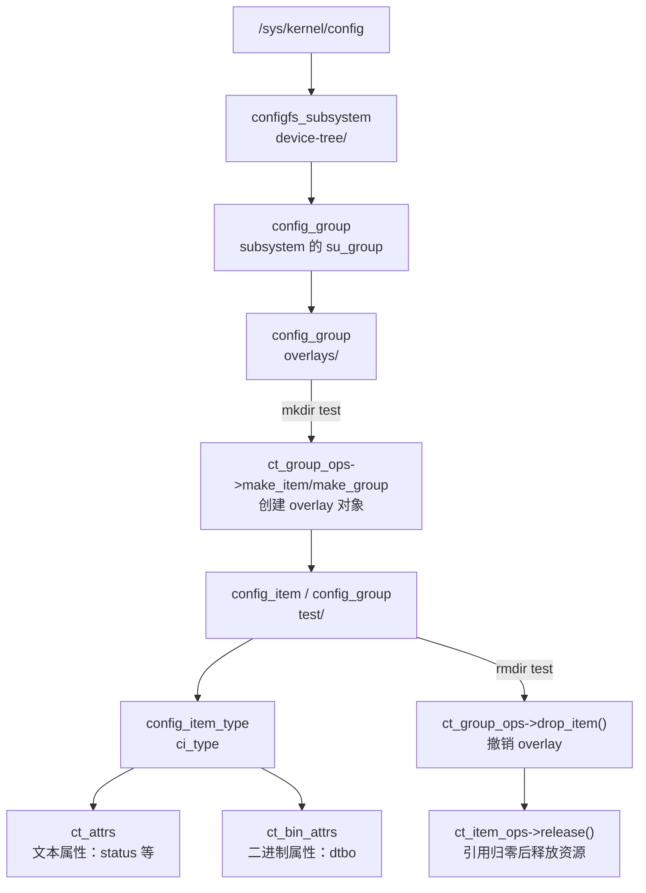

# Linux设备树插件开发入门教程

## 目录

1. [什么是设备树插件](#1-什么是设备树插件)
2. [设备树插件的使用](#2-设备树插件的使用)
3. [configfs文件系统](#3-configfs文件系统)
4. [configfs虚拟文件系统的数据结构](#4-configfs虚拟文件系统的数据结构)
5. [注册configfs_subsystem和config_group](#5-注册configfs_subsystem和config_group)
6. [实现configfs动态item](#6-实现configfs动态item)
7. [实现item属性文件](#7-实现item属性文件)
8. [实现configfs多级目录](#8-实现configfs多级目录)
9. [设备树插件的配置与移植](#9-设备树插件的配置与移植)

---

# 1 什么是设备树插件

设备树插件（Device Tree Plugin）通常也叫 **Overlay（覆盖层）**，本质上是一段可以在运行时或启动阶段叠加到基础设备树上的增量配置。

可以把它理解成：

- 基础设备树（base DTB）是“主配置”
- 设备树插件（DTBO）是“补丁包”
- 插件加载后，会把新增或修改的节点合并到当前设备树

它不是重新写一整份设备树，而是只描述“变化的部分”。

## 1.1 设备树插件和普通设备树的区别

普通设备树（`.dts/.dtb`）通常描述整块板卡的完整硬件信息；
设备树插件（`.dtso/.dtbo`）只描述某个功能模块的差异信息。

常见差异如下：

- 普通设备树：全量描述，通常跟随内核或固件一起发布
- 设备树插件：增量描述，按需加载和卸载
- 普通设备树：改动后常常需要替换或重编完整 DTB
- 设备树插件：只更新对应插件，不必每次动整棵树；但运行时卸载仍受驱动和资源依赖限制

## 1.2 设备树插件解决了哪些问题

设备树插件主要解决的是“硬件变化频繁、但不希望频繁重做整板配置”的问题。

### 1.2.1 避免每次都重编整份设备树

在没有插件时，哪怕只是新增一个小外设，也常常要改基础 `.dts` 再重编 `dtb`。

有了插件后：

- 仅为新增外设写一个 `.dtso`
- 编译为 `.dtbo`
- 在引导阶段或运行时加载

这样改动范围更小，验证周期更短。

### 1.2.2 支持“同一底板 + 多种可选模块”

很多产品会有可选外设，比如：

- 不同型号的摄像头
- 不同接口的显示屏
- 可插拔扩展板（传感器、GPIO 扩展、CAN 模块）

如果全写进一份基础设备树，配置会变得臃肿且难维护。

使用插件可以做到：

- 底板保持一份稳定 base DTB
- 每种扩展模块对应一个独立 DTBO
- 按 SKU 或实际插接情况选择加载

### 1.2.3 降低板级差异对驱动代码的影响

驱动理想状态是“只关心资源获取，不关心板级拼装细节”。

插件把板级差异继续留在设备树层：

- 哪个 GPIO 连接到设备
- 使用哪一路中断
- 挂在哪条 I2C/SPI 总线

这样可以减少“为了板级差异改驱动”的情况，提升驱动复用性。

### 1.2.4 便于快速试错与调试

在硬件调试早期，节点状态、引脚配置、时序相关属性经常要反复调整。

插件模式通常更适合快速迭代：

- 修改小、回滚快
- 功能边界清晰
- 出问题时更容易定位到具体插件

### 1.2.5 提升版本管理和协作效率

把不同功能拆成多个插件后，团队协作更清楚：

- 摄像头团队维护 camera 插件
- 显示团队维护 panel 插件
- 底板团队维护 base DTB

代码评审时也更容易聚焦在单一功能改动。

## 1.3 设备树插件的常见写法

前面讲了“为什么需要插件”，这一节讲“插件怎么写”。

设备树插件的核心写法可以概括为三类：

- `/plugin/;`：声明当前文件是插件
- `&{...} { ... };`：定位已有节点并覆盖/新增内容
- `/ { fragment@x { ... } };`：用标准 fragment 结构做 overlay

### 1.3.1 先声明这是插件文件

```dts
/dts-v1/;
/plugin/;
```

说明：

- `/dts-v1/;`：设备树语法版本声明
- `/plugin/;`：告诉编译器这是 Overlay 文件，而不是完整板级树

### 1.3.2 模板一：`&{/path} { { ... }; };`

这类写法是“按路径定位节点后再修改”。你给出的 `&{}{{};};` 可以理解为这个通用模板。

```dts
&{/soc/i2c@ff150000} {
    status = "okay";

    touch@38 {
        compatible = "goodix,gt911";
        reg = <0x38>;
        status = "okay";
    };
};
```

要点：

- 花括号中是绝对路径
- 外层节点可覆盖属性，内层可新增子节点

### 1.3.3 模板二：`&xxx { { ... }; };`

这类写法是“按 label 定位节点后再修改”。你给出的 `&xxx {{};};` 就是这个模板。

```dts
&i2c1 {
    status = "okay";

    eeprom@50 {
        compatible = "atmel,24c02";
        reg = <0x50>;
        status = "okay";
    };
};
```

要点：

- `xxx` 必须是基础设备树中已存在的 label
- 一般优先使用该写法，可读性和可维护性更好

### 1.3.4 模板三：`/ { fragment@x { ... } };`

这类写法是标准 Overlay 结构。你提到的 `/{fragment}` 可以理解为这种形式。

```dts
/dts-v1/;
/plugin/;

/ {
    fragment@0 {
        target = <&spi0>;
        __overlay__ {
            status = "okay";

            oled@0 {
                compatible = "solomon,ssd1306";
                reg = <0>;
                spi-max-frequency = <10000000>;
                status = "okay";
            };
        };
    };
};
```

`target` 也可替换为 `target-path`：

```dts
fragment@1 {
    target-path = "/soc/serial@ff1a0000";
    __overlay__ {
        status = "okay";
    };
};
```

### 1.3.5 三种写法的选择建议

- 优先 `&label`：简洁、可读性高
- 没有 label 时用 `&{/path}`：定位直接
- 工具链或平台文档要求时用 `fragment@x`：兼容性更强

## 1.4 设备树插件如何编译为 dtbo（并与 dtb 区分）

写完插件后，下一步就是编译。这里最关键的是明确“输出物语义”。

### 1.4.1 编译目标区别

- 普通设备树：dts -> dtb
- 设备树插件：dtso（或 overlay dts）-> dtbo

其中：

- dtb 通常表示完整基础树
- dtbo 通常表示可叠加插件

### 1.4.2 典型编译命令

```bash
dtc -@ -I dts -O dtb -o panel.dtbo panel.dtso
```

参数说明：

- `-@`：生成符号信息，便于 overlay 引用目标节点
- `-I dts`：输入文本设备树
- `-O dtb`：输出二进制 blob
- `-o *.dtbo`：用 dtbo 后缀明确这是插件输出

如果插件使用 `&i2c1`、`&spi0` 这类 label 引用基础设备树节点，基础 DTB 同样应使用 `-@` 编译，或由内核构建系统以等效方式保留 `__symbols__`。否则加载时无法解析目标 label。

### 1.4.3 为什么要明确区分 dtb 和 dtbo

区分不是“命名习惯问题”，而是“加载角色问题”：

- dtb：系统启动时使用的基础硬件描述
- dtbo：对基础树做增量叠加的功能描述

工程收益：

- 基础板级配置和可选功能插件解耦
- 升级某个外设时只替换对应 dtbo
- 问题排查时更容易定位责任边界

## 1.5 一个直观例子

假设你的主板默认只启用 I2C0，后续要新增一个 I2C 触摸屏。

传统方式：

1. 修改基础板级 dts
2. 重编完整 dtb
3. 整体替换并回归测试

插件方式：

1. 新建触摸屏插件 dtso
2. 只描述触摸屏节点和必要引用
3. 编译为 dtbo 并按需加载

差异点在于：插件方式把新增功能做成可独立交付单元。

## 1.6 本章小结

本章核心结论：

- 设备树插件是对基础设备树的增量覆盖机制
- 它适合处理可选硬件、板级差异和快速迭代场景
- 它的主要价值是降低耦合、缩小改动面、提升复用和维护效率

# 2 设备树插件的使用

这一章重点讲三件事：

- 使用设备树插件前，内核应如何配置
- 内核配置完成后，如何按步骤加载和卸载单个 dtbo
- 如何加载多个 dtbo，并观察系统目录变化

## 2.1 使用前的内核配置

要在运行时加载设备树插件，通常需要以下能力：

- `CONFIG_OF`：设备树基础支持
- `CONFIG_OF_OVERLAY`：Overlay 叠加机制
- `CONFIG_CONFIGFS_FS`：configfs 文件系统
- `CONFIG_OF_CONFIGFS`：通过 configfs 管理 overlay

在很多平台中，`OF_CONFIGFS` 可能通过模块方式提供（例如 `dtbocfg.ko`）。

### 2.1.1 检查 configfs 是否可用

先加载模块（如果你的平台是模块方式）：

```bash
insmod dtbocfg.ko
```

再确认 `configfs` 文件系统是否已注册：

```bash
cat /proc/filesystems | grep configfs
```

若看到 `nodev   configfs`，说明 configfs 已就绪。

还应确认 configfs 已挂载，且设备树 overlay 的 configfs 支持已启用。仅看到 `configfs` 并不表示一定存在 `device-tree/overlays` 子系统。

### 2.1.2 挂载与目录检查

如果系统尚未挂载 configfs，可执行：

```bash
mount -t configfs none /sys/kernel/config
```

然后检查 overlay 根目录：

```bash
ls /sys/kernel/config/device-tree/overlays/
```

说明：

- 该目录只有在相关功能可用时才会出现
- 该目录下每个子目录代表一个已创建的 overlay 管理对象

## 2.2 单个 dtbo 的加载步骤

以下步骤对应你给出的图片流程。

### 2.2.1 准备测试 dtso 代码

示例目标：在 `rk-485-ctl` 节点下新增子节点 `overlay_node`，并设置 `status = "okay"`。

```dts
/dts-v1/;
/plugin/;

&{/rk-485-ctl} {
    overlay_node {
        status = "okay";
    };
};
```

编译：

```bash
dtc -@ -I dts -O dtb -o overlay.dtbo overlay.dtso
```

### 2.2.2 在 overlays 下创建实例目录

进入 overlays 根目录后创建一个实例（如 `test`）：

```bash
cd /sys/kernel/config/device-tree/overlays/
mkdir test
ls
```

此时变化：

- `/sys/kernel/config/device-tree/overlays/` 下新增 `test/`
- `test/` 目录内会出现 `dtbo`、`status` 等控制文件
- `/proc/device-tree/` 暂时无新增节点变化（因为还未写入 dtbo 并使能）

### 2.2.3 写入 dtbo 并使能

进入 `test` 目录：

```bash
cd test
ls
```

写入插件二进制：

```bash
cat /overlay.dtbo > dtbo
```

你截图所用平台在写入 dtbo 后，还要求写 `status` 使能：

```bash
echo 1 > status
```

需要特别区分：`status` 文件是该 RK356x 平台 `dtbocfg.ko` 提供的接口，不是所有 Linux 内核都具备的通用 configfs overlay 文件。

在主线 Linux 常见实现中，创建实例目录后通常会看到 `dtbo` 和/或 `path`，向 `dtbo` 写入完整 dtbo 数据时就会触发应用，不需要再写 `status`。可先用下面命令确认当前平台实际提供的接口：

```bash
ls -l /sys/kernel/config/device-tree/overlays/test/
```

此时变化：

- RK356x 示例中，`/sys/kernel/config/device-tree/overlays/test/status` 被写入 `1`
- `/proc/device-tree/` 中出现或更新 overlay 产生的节点
- 例如可检查：

```bash
ls /proc/device-tree/rk-485-ctl/overlay_node/
cat /proc/device-tree/rk-485-ctl/overlay_node/status
```

若加载成功，通常能看到 `overlay_node`，`status` 的原始字节内容为 `okay`。设备树字符串通常以 `\0` 结尾，终端显示可能与普通文本略有差异。

## 2.3 删除已加载的 overlay

当你不再需要该插件时，可删除实例目录：

```bash
cd /sys/kernel/config/device-tree/overlays/
rmdir test
```

此时变化：

- `/sys/kernel/config/device-tree/overlays/test/` 被移除
- 对应 overlay 从活动树中撤销
- `/proc/device-tree/` 中由该 overlay 新增的节点会随之消失或恢复到叠加前状态

对于当前示例，撤销该 overlay 使用 `rmdir test/` 即可。若 `rmdir` 返回“Device or resource busy”或类似错误，说明后加载的 overlay 依赖它，或该 overlay 创建的设备仍被驱动占用；应先卸载依赖它的后加载 overlay，再排查相关设备驱动。

## 2.4 加载多个 dtbo 文件

这一节对应你给出的“加载多个 dtbo”流程。

### 2.4.1 准备第二个 dtso

示例：第二个插件修改同一目标节点中 `overlay_node` 的 `status`。

```dts
/dts-v1/;
/plugin/;

&{/rk-485-ctl} {
    overlay_node {
        status = "disabled";
    };
};
```

编译：

```bash
dtc -@ -I dts -O dtb -o overlay2.dtbo overlay2.dtso
```

### 2.4.2 创建第二个实例并加载

```bash
cd /sys/kernel/config/device-tree/overlays/
mkdir test1
cd test1
cat /overlay2.dtbo > dtbo
echo 1 > status
```

如果当前内核没有 `status` 文件，写入 `dtbo` 后即可检查 `/proc/device-tree/`，不要执行 `echo 1 > status`。

此时变化：

- `/sys/kernel/config/device-tree/overlays/` 下同时存在 `test/` 与 `test1/`（如果第一个未删除）
- 两个实例各自维护自己的 `dtbo` 和 `status`
- `/proc/device-tree/rk-485-ctl/overlay_node/status` 会体现当前已成功应用的 overlay 结果

可验证：

```bash
cat /proc/device-tree/rk-485-ctl/overlay_node/status
```

本例中，若第二个插件可以合法叠加到第一个插件创建的节点，结果会看到 `disabled`。但不能把“后加载一定覆盖前加载”当作通用规则：overlay 是否可叠加、能否卸载，取决于内核版本、目标节点和 overlay 间的依赖关系。

## 2.5 目录变化总览（重点）

为避免调试时混乱，这里把两个关键目录的职责再明确一次。

### 2.5.1 `/sys/kernel/config/device-tree/overlays/xxx`

这是“控制面”：

- `mkdir xxx`：创建一个 overlay 实例
- `cat xxx.dtbo > xxx/dtbo`：写入插件内容
- 某些厂商内核的 `echo 1 > xxx/status`：触发应用；主线常见实现则在写入 `dtbo` 时触发
- `rmdir xxx`：撤销并删除实例

### 2.5.2 `/proc/device-tree/...`

这是“结果面”：

- 反映当前生效后的设备树视图
- overlay 加载后，这里可见新增节点或属性变化
- overlay 卸载后，这里会回退到卸载前状态

简化理解：

- 在 `/sys/kernel/config/...` 做动作
- 在 `/proc/device-tree/...` 看结果

## 2.6 使用注意事项

1. 多个 overlay 之间如果修改同一节点同一属性，结果与叠加顺序相关。
2. 建议每个 overlay 目录名和 dtbo 文件名保持语义一致，便于排障。
3. 卸载多个 overlay 时，建议按“后加载先卸载”的顺序执行。
4. 设备树节点的 `status` 常见值是 `"okay"` 或 `"disabled"`；不要写成 `"disable"`。
5. configfs 中的 `status` 控制文件与设备树节点的 `status` 属性不是同一个概念：前者是厂商 overlay 加载接口，后者是设备节点的启用状态。

## 2.7 本章小结

本章你已经可以完成：

- 内核 overlay/configfs 能力检查与准备
- 单个 dtbo 的创建、加载、验证、删除
- 多个 dtbo 的叠加加载和结果验证
- 区分控制目录与结果目录，并据此定位问题

# 3 configfs文件系统

这一章先用 sysfs 建立直觉，再讲 configfs（你说的 configs，一般就是指 configfs）。

核心结论先给出：

- sysfs：把内核已有对象和状态导出给用户空间
- configfs：由用户空间主动创建/配置内核对象

## 3.1 先看 sysfs：导出内核对象给用户空间

sysfs 的典型特点是“内核先有对象，用户空间再看到对应文件”。

在 GPIO 旧接口（sysfs GPIO）中，内核已经注册的 GPIO 线可通过导出操作暴露给用户空间。GPIO 编号必须以目标板的实际 GPIO 编号为准，且该 GPIO 不能已被其他驱动独占。

### 3.1.1 GPIO 导出示例

```bash
cd /sys/class/gpio
echo 23 > export
ls /sys/class/gpio
```

执行后通常可看到新增目录：

- `/sys/class/gpio/gpio23/`

该目录内常见文件：

- `direction`
- `value`
- `edge`
- `active_low`

这就是“内核对象被导出为文件接口”的典型形式。

### 3.1.2 直接控制 GPIO 方向和电平

例如把 GPIO23 配置为输出并拉高：

```bash
echo out > /sys/class/gpio/gpio23/direction
echo 1 > /sys/class/gpio/gpio23/value
```

读取电平：

```bash
cat /sys/class/gpio/gpio23/value
```

不再使用时可以取消导出：

```bash
echo 23 > /sys/class/gpio/unexport
```

取消后，`/sys/class/gpio/gpio23/` 目录会消失。

### 3.1.3 sysfs 的本质

从这个例子可以看到：

1. 内核已经管理 GPIO 控制器与 GPIO 线。
2. 用户空间通过 sysfs 文件节点读写属性。
3. 读写文件本质是在操作内核对象的属性。

## 3.2 再看 configfs：用户空间配置内核对象

configfs 的英文常被解释为 Userspace-driven kernel object configuration。

可把它翻译成：用户空间驱动的内核对象配置机制。

和 sysfs 对比：

- sysfs：内核导出对象给用户空间
- configfs：用户空间创建/配置对象，内核接收并生效

这就是你总结的那句话：configfs 就是从用户空间直接配置内核对象。注意名称是 `configfs`，不是 `configs`。

## 3.3 设备树插件场景下的 configfs

在 overlay 场景里，`/sys/kernel/config/device-tree/overlays/` 就是 configfs 的具体应用。

### 3.3.1 用户空间动作

```bash
cd /sys/kernel/config/device-tree/overlays/
mkdir test
cat /overlay.dtbo > test/dtbo
echo 1 > test/status
```

最后一条命令只适用于提供 `status` 文件的厂商实现；主线常见实现中，写入 `test/dtbo` 即已触发加载。

这些动作代表：

1. 创建一个 overlay 内核对象实例（`test`）。
2. 给该对象写入 dtbo 数据。
3. 触发内核应用该 overlay。

### 3.3.2 内核结果变化

overlay 应用后，可在 `/proc/device-tree/` 观察最终设备树结果。

例如：

```bash
ls /proc/device-tree/rk-485-ctl/
cat /proc/device-tree/rk-485-ctl/overlay_node/status
```

所以：

- `/sys/kernel/config/device-tree/overlays/` 是“配置入口”（configfs）
- `/proc/device-tree/` 是“结果视图”（当前生效树）

## 3.4 为什么设备树插件更常选择 configfs

结合前两章可以总结为：

1. overlay 需要“由用户空间主动创建并加载”对象。
2. configfs 天然适合“创建/配置/销毁”这类流程。
3. sysfs 更像“导出已有对象属性”，不强调用户空间创建对象本身。

因此在运行时动态加载 dtbo 的方案里，configfs 更贴合模型。

## 3.5 注意事项

1. GPIO 的 sysfs 接口在新内核中已逐步被字符设备接口（`/dev/gpiochipN`）替代，教学与旧平台调试仍常见。
2. 在 overlay 测试中，建议固定命名规则：目录名、dtbo 文件名、节点名保持一致，便于排错。
3. 对同一节点同一属性进行多 overlay 覆盖时，最终结果与加载顺序相关。

## 3.6 本章小结

本章建立了一个清晰对照：

- sysfs 示例（`/sys/class/gpio`）说明“导出内核对象给用户空间”
- configfs 机制说明“用户空间创建并配置内核对象”
- 设备树插件 overlay 正是 configfs 模型在内核中的典型落地

# 4 configfs虚拟文件系统的数据结构

这一章从内核实现角度理解 configfs 的数据结构。下面仍统一使用正确名称 `configfs`；有些资料写作 configs，通常也是指 configfs。

设备树插件的目录操作并不是普通文件系统操作。比如：

```bash
mkdir /sys/kernel/config/device-tree/overlays/test
```

这个命令会让 configfs 根据驱动注册的回调创建一个内核对象；随后目录中的 `dtbo`、`status` 等属性文件，都是由该对象的类型信息导出的。

## 4.1 四个核心对象

理解 configfs 时，先记住下面四层：

- `configfs_subsystem`：顶层子系统
- `config_group`：容器目录
- `config_item`：一个具体目录对象
- `config_item_type`：对象类型及其操作集合

它们构成“内核对象 - 目录 - 属性文件 - 回调函数”之间的映射。

## 4.2 `struct configfs_subsystem`

`configfs_subsystem` 表示一个注册到 configfs 根目录下的子系统。

典型定义如下：

```c
struct configfs_subsystem {
    struct config_group su_group;
    struct mutex su_mutex;
};
```

成员说明：

- `su_group`：子系统本身也是一个 group，因此可以作为目录容器使用。
- `su_mutex`：保护该子系统内部对象和目录操作的并发访问。

以设备树插件为例，驱动可注册名为 `device-tree` 的 subsystem，于是出现：

```text
/sys/kernel/config/device-tree/
```

这里的 `device-tree` 就对应一个 configfs 子系统根目录。

## 4.3 `struct config_group`

`config_group` 表示一个可以容纳子对象的目录，也就是“容器”。

典型定义如下：

```c
struct config_group {
    struct config_item cg_item;
    struct list_head cg_children;
    struct configfs_subsystem *cg_subsys;
    struct list_head default_groups;
    struct list_head group_entry;
};
```

成员说明：

- `cg_item`：group 自身首先也是一个 item，所以它也能拥有名称和类型。
- `cg_children`：保存该 group 下已创建的子 item/group。
- `cg_subsys`：指向所属的 configfs 子系统。
- `default_groups`：保存默认创建的子 group。
- `group_entry`：用于把当前 group 挂入父 group 的链表。

设备树插件中的目录关系可以这样理解：

```text
device-tree/          -> configfs_subsystem 的根 group
overlays/             -> config_group，负责容纳 overlay 实例
overlays/test/        -> mkdir 动态创建的 overlay 对象
```

## 4.4 `struct config_item`

`config_item` 表示 configfs 中一个具体的对象，通常会对应一个目录。

典型定义如下：

```c
struct config_item {
    char *ci_name;
    char ci_namebuf[CONFIGFS_ITEM_NAME_LEN];
    struct kref ci_kref;
    struct list_head ci_entry;
    struct config_item *ci_parent;
    struct config_group *ci_group;
    const struct config_item_type *ci_type;
    struct dentry *ci_dentry;
};
```

关键成员说明：

- `ci_name`、`ci_namebuf`：对象名称，也就是目录名，例如 `test`。
- `ci_kref`：引用计数，保证对象仍被使用时不会提前释放。
- `ci_parent`：父 item，表达目录层级关系。
- `ci_group`：如果当前对象是 group，可关联到对应的 group 对象。
- `ci_type`：指向对象类型，决定该目录支持哪些属性和操作。
- `ci_dentry`：关联 VFS dentry，使该对象呈现为文件系统目录。

当用户执行下面命令时：

```bash
mkdir /sys/kernel/config/device-tree/overlays/test
```

内核通常会为 `test` 创建或初始化对应的 configfs item，并把它加入 `overlays` group 的 `cg_children` 链表中。

## 4.5 `struct config_item_type`

`config_item_type` 不直接表示一个目录，而是描述“这一类目录该如何工作”。

典型定义如下：

```c
struct config_item_type {
    struct module *ct_owner;
    const struct configfs_item_operations *ct_item_ops;
    const struct configfs_group_operations *ct_group_ops;
    const struct configfs_attribute **ct_attrs;
    const struct configfs_bin_attribute **ct_bin_attrs;
};
```

成员说明：

- `ct_owner`：所属模块，用于模块引用计数保护。
- `ct_item_ops`：item 级操作，例如释放对象、建立或删除链接。
- `ct_group_ops`：group 级操作，例如 `mkdir` 时创建子对象。
- `ct_attrs`：普通文本属性文件，例如可读写的字符串或数值属性。
- `ct_bin_attrs`：二进制属性文件，适合写入 dtbo 这类二进制数据。

对应设备树插件：

- `dtbo` 通常属于二进制属性，通常通过 `ct_bin_attrs` 导出。
- `status` 若平台提供，通常属于普通属性，通常通过 `ct_attrs` 导出。
- 在 `overlays/` 下执行 `mkdir test` 时，configfs 会调用该 group 类型中的 `ct_group_ops` 回调创建 overlay item。

## 4.6 `configfs_item_operations`

`configfs_item_operations` 定义单个 item 的生命周期和链接操作。不同内核版本的字段可能略有差异，核心形式如下：

```c
struct configfs_item_operations {
    void (*release)(struct config_item *item);
    int (*allow_link)(struct config_item *src,
                      struct config_item *target);
    void (*drop_link)(struct config_item *src,
                      struct config_item *target);
};
```

### 4.6.1 `release()`：最终资源回收

```c
void (*release)(struct config_item *item);
```

`release()` 是最重要的 item 回调。它在 config_item 的引用计数归零时调用，驱动应在这里释放 item 对应的私有内存和资源。

设备树插件驱动中的典型工作包括：

- 将 `config_item *item` 转换回驱动私有 overlay 结构体。
- 若 overlay 已应用，撤销或释放 overlay 相关资源。
- 释放 dtbo 缓冲区、节点引用及私有结构体内存。

示例：

```c
static void overlay_release(struct config_item *item)
{
    struct overlay_item *overlay;

    overlay = to_overlay_item(item);
    kfree(overlay->dtbo_data);
    kfree(overlay);
}
```

注意：`release()` 不是普通的“删除目录通知”。它表示对象已经没有任何引用，可以真正销毁。因此不能在对象仍可能被访问时提前释放其内存。

### 4.6.2 `allow_link()` 与 `drop_link()`：符号链接管理

```c
int (*allow_link)(struct config_item *src, struct config_item *target);
void (*drop_link)(struct config_item *src, struct config_item *target);
```

configfs 允许部分对象以符号链接表达关联关系：

- `allow_link()`：创建符号链接前调用；驱动可检查 `src` 和 `target` 是否允许关联。返回 `0` 表示允许，负错误码表示拒绝。
- `drop_link()`：删除已建立的符号链接时调用；驱动在这里清理双方的关联状态。

设备树 overlay 的基本加载流程通常不依赖这两个回调，但在需要描述对象依赖或关联关系的 configfs 子系统中很常见。

## 4.7 `configfs_group_operations`

`configfs_group_operations` 定义 group 如何创建和删除其下的子对象。典型形式如下：

```c
struct configfs_group_operations {
    struct config_item *(*make_item)(struct config_group *group,
                                     const char *name);
    struct config_group *(*make_group)(struct config_group *group,
                                       const char *name);
    void (*drop_item)(struct config_group *group,
                      struct config_item *item);
};
```

### 4.7.1 `make_item()` 与 `make_group()`：处理 `mkdir`

```c
struct config_item *(*make_item)(struct config_group *group,
                                 const char *name);
struct config_group *(*make_group)(struct config_group *group,
                                   const char *name);
```

当用户在 group 目录下执行 `mkdir` 时，configfs 根据对象类型调用其中一个创建回调：

- `make_item()`：创建普通 item。
- `make_group()`：创建既是 item 又是容器的 group。

例如执行：

```bash
mkdir /sys/kernel/config/device-tree/overlays/test
```

`overlays` 对应的 group 会收到名称 `test`。驱动分配并初始化 overlay 私有对象，再返回其内嵌的 `config_item` 或 `config_group`。如果返回错误指针，`mkdir` 会失败。

### 4.7.2 `drop_item()`：处理 `rmdir`

```c
void (*drop_item)(struct config_group *group,
                  struct config_item *item);
```

用户执行：

```bash
rmdir /sys/kernel/config/device-tree/overlays/test
```

configfs 会调用父 group 的 `drop_item()`，通知驱动该子对象正被删除。驱动应在这里完成“撤销业务对象”的动作，例如撤销已应用的设备树 overlay、解除设备绑定或释放与父 group 的关系。对于由 `make_item()` 动态分配的 item，驱动还应在该回调中调用 `config_item_put(item)` 交还引用。

`config_item_put()` 会减少 item 引用；只有引用最终归零，才会调用 `configfs_item_operations->release()` 释放对象内存。

因此应明确区分：

- `drop_item()`：处理 `rmdir` 的业务撤销动作。
- `release()`：引用归零后的最终内存回收动作。

### 4.7.3 `drop_item()` 与 `release()` 的调用顺序

如果同一个对象同时具备以下回调：

```c
struct configfs_group_operations *ct_group_ops;
struct configfs_item_operations *ct_item_ops;
```

并且：

- `ct_group_ops->drop_item` 已实现。
- `ct_item_ops->release` 已实现。

用户执行 `rmdir` 时，优先进入 `drop_item()`，用于撤销该对象对应的业务功能；例如撤销设备树 overlay、解除硬件资源关联。

在动态 item 的常见写法中，`drop_item()` 内调用 `config_item_put()` 减少 item 引用计数。只有引用计数归零后，才会继续调用 `release()`，用于释放 `kzalloc()` 申请的私有内存。

因此这里的“优先级”应理解为：

```text
rmdir
    -> drop_item()：优先执行，处理业务撤销
    -> config_item_put()：交还 item 引用
    -> release()：引用归零后执行，处理最终内存释放
```

不能理解为“实现了 `drop_item()` 后 `release()` 就永远不会执行”。对于动态 `kzalloc()` 创建的 item，仍必须实现 `release()`，否则会发生内存泄漏。

## 4.8 `mkdir` 与 `rmdir` 的内核动作

### 4.8.1 `mkdir test`

用户空间执行：

```bash
mkdir /sys/kernel/config/device-tree/overlays/test
```

内核主要执行过程：

1. 在 `overlays` 对应的 `config_group` 中接收创建请求。
2. 根据 `config_item_type->ct_group_ops` 调用 `make_item()` 或 `make_group()`。
3. 驱动分配或初始化 overlay 对应的 `config_item/config_group`。
4. 将新对象加入父 group 的 `cg_children`。
5. 根据新对象 `ci_type` 中的 `ct_attrs`、`ct_bin_attrs` 创建 `dtbo`、`status` 等属性文件。

### 4.8.2 `rmdir test`

用户空间执行：

```bash
rmdir /sys/kernel/config/device-tree/overlays/test
```

内核主要执行过程：

1. 确认目录对象可被删除，且没有未处理的依赖。
2. 调用父 group 的 `configfs_group_operations->drop_item()` 撤销业务对象。
3. 动态 item 的 `drop_item()` 中调用 `config_item_put(item)` 交还引用。
4. configfs 移除目录及父子关联。
5. 引用计数归零后，调用 `configfs_item_operations->release()` 释放最终内存和资源。

注意：`rmdir` 实际能否成功由具体驱动和 overlay 依赖决定；不能把所有资源回收都简单理解为 configfs 核心自动完成。

## 4.9 层级关系流程图

下面的流程图描述设备树 overlay 在 configfs 中的典型层级，以及用户操作如何进入内核回调：



从图中可以得到一条主线：

```text
subsystem 提供顶层入口
    -> group 组织目录容器
    -> item 表示具体目录对象
    -> item_type 决定属性文件和 mkdir/rmdir 回调
```

## 4.10 本章小结

- `configfs_subsystem`：一个 configfs 子系统的顶层入口。
- `config_group`：可容纳子对象的目录容器。
- `config_item`：一个具体对象，通常对应一个目录。
- `config_item_type`：定义对象支持的属性文件和操作回调。
- `make_item()`/`make_group()`：处理 `mkdir`，创建子对象。
- `drop_item()`：处理 `rmdir`，撤销业务对象。
- `release()`：引用归零后，最终释放对象资源。
- 设备树插件通过这些结构，把 `mkdir`、写 `dtbo`、`rmdir` 转换为内核中 overlay 对象的创建、应用和释放。

# 5 注册configfs_subsystem和config_group

这一章讲如何在驱动模块中注册一个 configfs 子系统和一个 group。最终目标是在：

```text
/sys/kernel/config/
```

下面创建自己的目录，例如：

```text
/sys/kernel/config/myconfigfs/
/sys/kernel/config/myconfigfs/mygroup/
```

先记住总流程：

```text
填写 item_type 和 subsystem 结构体
    -> 初始化 subsystem 的 su_group
    -> 注册 subsystem
    -> 初始化 group（名称和 item_type）
    -> 将 group 注册到 subsystem 的 su_group
```

## 5.1 注册 subsystem 需要的结构体

### 5.1.1 `struct config_item_type`

注册 subsystem 前，先准备根目录对应的类型。根目录也是一个 `config_group`，而 group 内嵌 `config_item`，因此也需要 `config_item_type`。

```c
static const struct config_item_type myconfig_item_type = {
    .ct_owner = THIS_MODULE,
    .ct_item_ops = NULL,
    .ct_group_ops = NULL,
    .ct_attrs = NULL,
};
```

成员说明：

- `.ct_owner`：指向当前模块，避免对象仍在使用时模块被卸载。
- `.ct_item_ops`：根目录的 item 操作集合；本例不需要时可设为 `NULL`。
- `.ct_group_ops`：根目录下如果不允许用户用 `mkdir` 动态创建对象，可设为 `NULL`。
- `.ct_attrs`：根目录的文本属性；没有属性时可设为 `NULL`。

### 5.1.2 `struct configfs_subsystem`

再定义 configfs 子系统对象：

```c
static struct configfs_subsystem myconfigfs_subsystem = {
    .su_group = {
        .cg_item = {
            .ci_namebuf = "myconfigfs",
            .ci_type = &myconfig_item_type,
        },
    },
};
```

该结构体的含义是：将名为 `myconfigfs` 的顶层 group 作为一个 configfs subsystem 注册。注册成功后会出现目录：

```text
/sys/kernel/config/myconfigfs/
```

## 5.2 注册 subsystem 的 API

### 5.2.1 `config_group_init()`

```c
void config_group_init(struct config_group *group);
```

作用：初始化一个 `config_group` 的内部链表、引用计数及基础状态。

参数说明：

- `group`：要初始化的 group。对 subsystem 而言，传入 `&myconfigfs_subsystem.su_group`。

调用时机：在注册 subsystem 前调用。

### 5.2.2 `configfs_register_subsystem()`

```c
int configfs_register_subsystem(struct configfs_subsystem *subsys);
```

作用：将一个 configfs subsystem 注册到 `/sys/kernel/config/` 根目录下。

参数说明：

- `subsys`：要注册的子系统。

返回值说明：

- `0`：注册成功。
- `< 0`：注册失败，返回负错误码，例如目录重名或资源申请失败。

### 5.2.3 `configfs_unregister_subsystem()`

```c
void configfs_unregister_subsystem(struct configfs_subsystem *subsys);
```

作用：注销子系统，并删除对应的 configfs 根目录。

调用时机：模块退出时调用。调用前必须先注销其下的 group 和其他子对象。

## 5.3 subsystem 注册示例

下面的代码对应“只注册一个 subsystem”的最小示例：

```c
#include <linux/configfs.h>
#include <linux/module.h>

static const struct config_item_type myconfig_item_type = {
    .ct_owner = THIS_MODULE,
};

static struct configfs_subsystem myconfigfs_subsystem = {
    .su_group = {
        .cg_item = {
            .ci_namebuf = "myconfigfs",
            .ci_type = &myconfig_item_type,
        },
    },
};

static int __init myconfigfs_init(void)
{
    int ret;

    config_group_init(&myconfigfs_subsystem.su_group);

    ret = configfs_register_subsystem(&myconfigfs_subsystem);
    if (ret)
        return ret;

    return 0;
}

static void __exit myconfigfs_exit(void)
{
    configfs_unregister_subsystem(&myconfigfs_subsystem);
}

module_init(myconfigfs_init);
module_exit(myconfigfs_exit);

MODULE_LICENSE("GPL");
```

加载模块后可验证：

```bash
ls /sys/kernel/config/myconfigfs/
```

本例的根目录没有属性文件，也没有可创建的子对象，因此目录通常为空。

## 5.4 注册 group 需要的结构体

要在 subsystem 下注册固定 group，除 subsystem 的类型外，还需要“当前 group 自己的 item_type”。

### 5.4.1 group 对应的 `config_item_type`

```c
static const struct config_item_type mygroup_config_item_type = {
    .ct_owner = THIS_MODULE,
    .ct_item_ops = NULL,
    .ct_group_ops = NULL,
    .ct_attrs = NULL,
};
```

这个 item_type 决定 `mygroup/` 目录的属性文件和子目录操作。当前示例不提供属性，也不支持动态 `mkdir`，所以相关成员为 `NULL`。

### 5.4.2 `struct config_group`

定义一个固定注册的 group：

```c
static struct config_group mygroup;
```

`mygroup` 必须在注册前初始化名称和类型。不能只声明后直接调用 `configfs_register_group()`。

## 5.5 注册 group 的 API

### 5.5.1 `config_group_init_type_name()`

```c
void config_group_init_type_name(struct config_group *group,
                                 const char *name,
                                 const struct config_item_type *type);
```

作用：一次完成 group 的内部初始化、目录名设置和 item_type 绑定。

参数说明：

- `group`：要初始化的 group。
- `name`：目录名称，例如 `"mygroup"`。
- `type`：group 对应的 `config_item_type`。

调用时机：在 `configfs_register_group()` 前调用。

### 5.5.2 `configfs_register_group()`

```c
int configfs_register_group(struct config_group *parent_group,
                            struct config_group *group);
```

作用：把一个已经初始化的 group 注册到父 group 下。

参数说明：

- `parent_group`：父目录对应的 group；本例传入 `&myconfigfs_subsystem.su_group`。
- `group`：要注册的子 group；本例传入 `&mygroup`。

返回值说明：

- `0`：注册成功。
- `< 0`：注册失败，例如同名目录已经存在。

### 5.5.3 `configfs_unregister_group()`

```c
void configfs_unregister_group(struct config_group *group);
```

作用：注销一个已注册的 group。

调用时机：模块退出时先调用它，再调用 `configfs_unregister_subsystem()`。

## 5.6 subsystem 加固定 group 的完整示例

下面示例对应图片中的流程。它先注册 `myconfigfs` subsystem，再将 `mygroup` 注册到其下：

```c
#include <linux/configfs.h>
#include <linux/module.h>

static const struct config_item_type myconfig_item_type = {
    .ct_owner = THIS_MODULE,
};

static const struct config_item_type mygroup_config_item_type = {
    .ct_owner = THIS_MODULE,
};

static struct configfs_subsystem myconfigfs_subsystem = {
    .su_group = {
        .cg_item = {
            .ci_namebuf = "myconfigfs",
            .ci_type = &myconfig_item_type,
        },
    },
};

static struct config_group mygroup;

static int __init myconfigfs_group_init(void)
{
    int ret;

    config_group_init(&myconfigfs_subsystem.su_group);

    ret = configfs_register_subsystem(&myconfigfs_subsystem);
    if (ret)
        return ret;

    config_group_init_type_name(&mygroup, "mygroup",
                                &mygroup_config_item_type);

    ret = configfs_register_group(&myconfigfs_subsystem.su_group,
                                  &mygroup);
    if (ret) {
        configfs_unregister_subsystem(&myconfigfs_subsystem);
        return ret;
    }

    return 0;
}

static void __exit myconfigfs_group_exit(void)
{
    configfs_unregister_group(&mygroup);
    configfs_unregister_subsystem(&myconfigfs_subsystem);
}

module_init(myconfigfs_group_init);
module_exit(myconfigfs_group_exit);

MODULE_LICENSE("GPL");
```

加载模块后可验证：

```bash
ls /sys/kernel/config/myconfigfs/
```

预期看到：

```text
mygroup
```

## 5.7 注册与注销顺序

推荐创建顺序：

1. 填写 subsystem 的 `config_item_type` 和 `configfs_subsystem`。
2. 调用 `config_group_init()` 初始化 `subsys->su_group`。
3. 调用 `configfs_register_subsystem()` 注册 subsystem。
4. 填写 group 的 `config_item_type` 和 `config_group`。
5. 调用 `config_group_init_type_name()` 初始化 group 的名称和类型。
6. 调用 `configfs_register_group()` 将 group 注册到 `subsys->su_group`。

推荐注销顺序必须相反：

1. 调用 `configfs_unregister_group()` 注销子 group。
2. 调用 `configfs_unregister_subsystem()` 注销 subsystem。

核心原则：先注册父目录，再注册子目录；先注销子目录，再注销父目录。

## 5.8 本章小结

- subsystem 注册使用 `config_group_init()` 和 `configfs_register_subsystem()`。
- subsystem 注销使用 `configfs_unregister_subsystem()`。
- group 注册前需用 `config_group_init_type_name()` 绑定目录名和 item_type。
- group 使用 `configfs_register_group()` 注册到 subsystem 的 `su_group`。
- 退出时必须先注销 group，再注销 subsystem。

# 6 实现configfs动态item

上一章已经创建了 subsystem 和固定 group：

```text
/sys/kernel/config/myconfigfs/mygroup/
```

但此时在 `mygroup/` 下执行下面命令通常会失败：

```bash
mkdir /sys/kernel/config/myconfigfs/mygroup/test
```

原因是上一章的 `mygroup_config_item_type` 中：

```c
.ct_group_ops = NULL,
```

configfs 不知道用户执行 `mkdir test` 后要创建什么内核对象。要支持动态目录，必须为 group 提供 `configfs_group_operations`，并实现 `.make_item` 回调。

## 6.1 实现思路

整个过程如下：

1. 定义自己的 `struct myitem`，在其中内嵌 `struct config_item`。
2. 实现 item 的 `release()`，在引用归零后释放 `myitem` 内存。
3. 定义 item 对应的 `config_item_type`，绑定 `.ct_item_ops`。
4. 实现 group 的 `make_item()`，使用 `kzalloc()` 分配 `myitem`。
5. 在 `make_item()` 中调用 `config_item_init_type_name()`，设置 item 名称和类型。
6. 定义 `configfs_group_operations`，填入 `.make_item`。
7. 将 group 的 `.ct_group_ops` 指向该 operations 结构体。

## 6.2 自定义 item 结构体

为了保存自己的私有数据，通常在 `config_item` 外再包一层结构体：

```c
struct myitem {
    struct config_item item;
};
```

关系如下：

```text
struct myitem
    -> struct config_item item
        -> ci_namebuf：目录名，例如 test
        -> ci_type：item 的类型与操作集合
```

configfs 只认识 `struct config_item`，而驱动可通过它找回外层的 `struct myitem`。

## 6.3 实现 item 的 `release()`

### 6.3.1 为什么要实现 `release()`

`make_item()` 使用 `kzalloc()` 动态分配内存，因此必须有对应释放路径。

当用户执行：

```bash
rmdir /sys/kernel/config/myconfigfs/mygroup/test
```

configfs 删除该 item 并减少其引用计数；当引用计数最终归零时，会调用该 item 的 `release()`。

### 6.3.2 `container_of()` 找回外层结构体

`release()` 的参数是内嵌成员 `struct config_item *`，不能直接 `kfree(item)`，因为 `item` 只是 `struct myitem` 中的一个成员。

应使用 `container_of()` 找到外层结构体地址：

```c
static void myitem_release(struct config_item *item)
{
    struct myitem *my_item;

    my_item = container_of(item, struct myitem, item);
    kfree(my_item);
}
```

`container_of(item, struct myitem, item)` 的含义是：已知成员变量 `item` 的地址，计算其所属 `struct myitem` 对象的首地址。

### 6.3.3 定义 item 操作和类型

```c
static const struct configfs_item_operations myitem_ops = {
    .release = myitem_release,
};

static const struct config_item_type myitem_type = {
    .ct_owner = THIS_MODULE,
    .ct_item_ops = &myitem_ops,
};
```

这里的 `.ct_item_ops` 很关键：它把 item 类型和 `release()` 回调关联起来。

## 6.4 实现 group 的 `make_item()`

`make_item()` 在用户于 group 目录下执行 `mkdir` 时调用。

函数原型：

```c
struct config_item *(*make_item)(struct config_group *group,
                                 const char *name);
```

参数说明：

- `group`：父目录对应的 `config_group`，本例中就是 `mygroup`。
- `name`：用户在 `mkdir` 中输入的目录名，例如 `test`。

返回值说明：

- 成功：返回新建 item 的 `struct config_item *`。
- 失败：返回 `ERR_PTR(-ENOMEM)` 等错误指针。

实现示例：

```c
static struct config_item *mygroup_make_item(struct config_group *group,
                                             const char *name)
{
    struct myitem *my_item;

    my_item = kzalloc(sizeof(*my_item), GFP_KERNEL);
    if (!my_item)
        return ERR_PTR(-ENOMEM);

    config_item_init_type_name(&my_item->item, name, &myitem_type);

    return &my_item->item;
}
```

关键点：

- `kzalloc()` 分配并清零整个外层 `myitem` 结构体。
- `config_item_init_type_name()` 初始化内嵌的 `config_item`，并设置目录名和 `myitem_type`。
- 该函数只完成“创建内核对象并返回”，configfs 核心后续负责把对象加入父 group 并创建对应目录。
- 当前示例没有属性文件，因此新目录只作为一个可创建、可删除的 item 目录存在。

## 6.5 将 `make_item()` 绑定到 group

先定义 group operations：

```c
static const struct configfs_group_operations mygroup_ops = {
    .make_item = mygroup_make_item,
};
```

再修改上一章 `mygroup` 对应的 item type：

```c
static const struct config_item_type mygroup_config_item_type = {
    .ct_owner = THIS_MODULE,
    .ct_group_ops = &mygroup_ops,
};
```

至此，`mygroup/` 收到 `mkdir test` 请求时，configfs 才能找到 `mygroup_make_item()`。

## 6.6 单独案例：在 `drop_item()` 中调用 `config_item_put()`

前面的 `release()` 是最终释放函数，但 `rmdir test` 时，先进入的是父 group 的 `.drop_item` 回调。

对于本章这种由 `make_item()` 动态分配的 item，`drop_item()` 的典型职责是：确认当前删除的是自己的 `myitem`，然后调用 `config_item_put()` 交还该 item 的引用。

```c
static void mygroup_drop_item(struct config_group *group,
                              struct config_item *item)
{
    struct myitem *my_item;

    my_item = container_of(item, struct myitem, item);
    config_item_put(&my_item->item);
}
```

参数说明：

- `group`：item 所属的父 group，本例是 `mygroup`；当前最小示例中未使用。
- `item`：待删除的内嵌 `struct config_item`。
- `my_item`：通过 `container_of()` 找回的驱动私有外层结构体。

### 6.6.1 `config_item_put()` 与 `release()` 的关系

`config_item_put()` 不直接 `kfree()` 内存，它只减少 `item` 的引用计数：

```text
rmdir test
    -> mygroup_drop_item()
    -> container_of() 找回 myitem
    -> config_item_put(&my_item->item)
    -> 引用计数归零
    -> myitem_release()
    -> kfree(my_item)
```

因此，`drop_item()` 与 `release()` 不是二选一：

- `drop_item()`：删除目录时的 group 回调，负责交还或处理该 item 的引用。
- `release()`：最后一个引用被 `config_item_put()` 释放后执行，负责真正的内存回收。

将 `drop_item()` 加入 group operations：

```c
static const struct configfs_group_operations mygroup_ops = {
    .make_item = mygroup_make_item,
    .drop_item = mygroup_drop_item,
};
```

注意：一旦驱动实现了 `.drop_item`，应由该回调调用 `config_item_put()` 完成动态 item 的引用释放；不要在 `drop_item()` 中直接 `kfree()`，否则可能绕过 configfs 的引用计数并产生释放后使用问题。

## 6.7 第6章完整案例：subsystem、group和动态item

从本章开始，完整案例必须保留第 5 章已经创建的 subsystem 和 group。下面是一份可独立编译的模块代码，加载后依次创建：

```text
/sys/kernel/config/myconfigfs/
└── mygroup/
    └── test/              # 用户执行 mkdir test 后动态创建
```

```c
#include <linux/configfs.h>
#include <linux/err.h>
#include <linux/module.h>
#include <linux/slab.h>

struct myitem {
    struct config_item item;
};

static void myitem_release(struct config_item *item)
{
    struct myitem *my_item;

    my_item = container_of(item, struct myitem, item);
    kfree(my_item);
}

static const struct configfs_item_operations myitem_ops = {
    .release = myitem_release,
};

static const struct config_item_type myitem_type = {
    .ct_owner = THIS_MODULE,
    .ct_item_ops = &myitem_ops,
};

static struct config_item *mygroup_make_item(struct config_group *group,
                                             const char *name)
{
    struct myitem *my_item;

    my_item = kzalloc(sizeof(*my_item), GFP_KERNEL);
    if (!my_item)
        return ERR_PTR(-ENOMEM);

    config_item_init_type_name(&my_item->item, name, &myitem_type);

    return &my_item->item;
}

static void mygroup_drop_item(struct config_group *group,
                              struct config_item *item)
{
    struct myitem *my_item;

    my_item = container_of(item, struct myitem, item);
    config_item_put(&my_item->item);
}

static const struct configfs_group_operations mygroup_ops = {
    .make_item = mygroup_make_item,
    .drop_item = mygroup_drop_item,
};

static const struct config_item_type mygroup_config_item_type = {
    .ct_owner = THIS_MODULE,
    .ct_group_ops = &mygroup_ops,
};

static const struct config_item_type myconfig_item_type = {
    .ct_owner = THIS_MODULE,
};

static struct configfs_subsystem myconfigfs_subsystem = {
    .su_group = {
        .cg_item = {
            .ci_namebuf = "myconfigfs",
            .ci_type = &myconfig_item_type,
        },
    },
};

static struct config_group mygroup;

static int __init myconfigfs_init(void)
{
    int ret;

    config_group_init(&myconfigfs_subsystem.su_group);

    ret = configfs_register_subsystem(&myconfigfs_subsystem);
    if (ret)
        return ret;

    config_group_init_type_name(&mygroup, "mygroup",
                                &mygroup_config_item_type);

    ret = configfs_register_group(&myconfigfs_subsystem.su_group,
                                  &mygroup);
    if (ret) {
        configfs_unregister_subsystem(&myconfigfs_subsystem);
        return ret;
    }

    return 0;
}

static void __exit myconfigfs_exit(void)
{
    configfs_unregister_group(&mygroup);
    configfs_unregister_subsystem(&myconfigfs_subsystem);
}

module_init(myconfigfs_init);
module_exit(myconfigfs_exit);

MODULE_LICENSE("GPL");
```

这个完整模块的关系是：

1. `myconfigfs_subsystem` 注册为 `/sys/kernel/config/myconfigfs/`。
2. `mygroup` 注册为 `myconfigfs/` 下的固定容器目录。
3. `mygroup_ops.make_item` 接收 `mkdir test` 并创建 `struct myitem`。
4. `mygroup_ops.drop_item` 接收 `rmdir test`，调用 `config_item_put()`。
5. 引用归零后，`myitem_release()` 释放 `myitem`。

`group` 参数在当前最小示例中没有使用。实际驱动中可通过它找到父 group 私有数据，进行数量限制、名称校验或资源分配。

## 6.8 验证流程

加载更新后的模块后执行：

```bash
cd /sys/kernel/config/myconfigfs/mygroup/
mkdir test
ls
```

预期结果：

```text
test
```

删除 item：

```bash
rmdir test
```

执行 `rmdir test` 后，目录消失；当该 item 的引用计数归零时，内核进入 `myitem_release()`，通过 `container_of()` 找到 `struct myitem`，最后通过 `kfree()` 释放 `kzalloc()` 申请的内存。

## 6.9 本章小结

- 固定 group 注册成功，不代表该目录天然支持 `mkdir`。
- 要支持动态创建 item，必须为 group 配置 `.ct_group_ops` 和 `.make_item`。
- `make_item()` 使用 `kzalloc()` 创建外层私有结构体，并用 `config_item_init_type_name()` 初始化内嵌 item。
- `drop_item()` 中使用 `config_item_put()` 递减动态 item 的引用计数。
- `release()` 使用 `container_of()` 找回外层结构体，并用 `kfree()` 回收内存。
- `mkdir test` 触发 `make_item()`；`rmdir test` 先触发 `drop_item()`，引用归零后再触发 `release()`。

# 7 实现item属性文件

第 6 章的 `mkdir test` 只能创建空目录：

```text
/sys/kernel/config/myconfigfs/mygroup/test/
```

要在 item 目录下创建属性文件，需要在 item 的 `config_item_type` 中填写 `.ct_attrs`。configfs 会在创建 item 时遍历这个属性数组，并在目录中生成对应的属性文件。

例如，若 `test` 的 item type 配置了 `read` 和 `write` 属性，目录结构可以是：

```text
/sys/kernel/config/myconfigfs/mygroup/test/
├── read
└── write
```

## 7.1 `ct_attrs` 属性数组

`ct_attrs` 的类型是：

```c
const struct configfs_attribute **ct_attrs;
```

它是一个“属性指针数组”，最后一个元素必须是 `NULL`，用于告诉 configfs 数组结束。

```c
static struct configfs_attribute *myitem_attrs[] = {
    &my_read_attr,
    &my_write_attr,
    NULL,
};
```

然后把它绑定到 item type：

```c
static const struct config_item_type myitem_type = {
    .ct_owner = THIS_MODULE,
    .ct_item_ops = &myitem_ops,
    .ct_attrs = myitem_attrs,
};
```

如果数组末尾漏写 `NULL`，configfs 继续向后读取无效指针，可能导致内核异常。因此 `NULL` 结尾是必须遵守的规则。

## 7.2 `show()` 与 `store()` 的调用关系

属性文件的读写会进入驱动提供的回调：

- `cat read`：触发只读属性的 `show()`。
- `echo data > write`：触发只写属性的 `store()`。
- 对可读写属性：`cat` 调用 `show()`，`echo` 调用 `store()`。

configfs 属性回调的常用原型如下：

```c
ssize_t my_read_show(struct config_item *item, char *page);
ssize_t my_write_store(struct config_item *item,
                       const char *page, size_t count);
```

参数说明：

- `item`：当前被访问的 item，例如目录 `test` 对应的 `config_item`。
- `page`：内核传递的读缓冲区（show）或写入数据缓冲区（store）。
- `count`：用户本次写入的字节数，包含 `echo` 默认附带的换行符。

返回值说明：

- `show()`：返回实际写入 `page` 的字节数。
- `store()`：成功时通常返回 `count`，失败时返回负错误码。

不同 Linux 内核版本对 configfs 属性回调的内部封装有差异，但 `CONFIGFS_ATTR_*` 宏生成的属性文件最终仍按上述语义调用对应的 `xxx_show()`、`xxx_store()` 函数。

本章属性示例使用下面的 item 私有数据。它是在第 6 章 `struct myitem` 基础上增加 `size` 和 `addr` 成员：

```c
struct myitem {
    struct config_item item;
    size_t size;
    void *addr;
};
```

## 7.3 案例一：用宏定义创建只读属性

configfs 提供属性定义宏，常用的有：

- `CONFIGFS_ATTR_RO(prefix, name)`：只读属性，需要实现 `prefix_name_show()`。
- `CONFIGFS_ATTR_WO(prefix, name)`：只写属性，需要实现 `prefix_name_store()`。
- `CONFIGFS_ATTR(prefix, name)`：可读可写属性，需要同时实现 `prefix_name_show()` 和 `prefix_name_store()`。

宏通过 `##` 连接符把 `prefix`、`name` 与 `show/store` 拼接成固定函数名。因此：

```c
CONFIGFS_ATTR_RO(my, read);
```

要求实现的函数名必须是：

```c
my_read_show()
```

只读属性示例：

```c
static ssize_t my_read_show(struct config_item *item, char *page)
{
    struct myitem *my_item;

    my_item = container_of(item, struct myitem, item);

    return scnprintf(page, PAGE_SIZE, "%d\n", my_item->size);
}

CONFIGFS_ATTR_RO(my, read);
```

宏会生成名为 `my_read_attr` 的 `struct configfs_attribute` 对象，属性文件名是 `read`，权限是只读。

因此在属性数组中使用：

```c
static struct configfs_attribute *myitem_attrs[] = {
    &my_read_attr,
    NULL,
};
```

用户空间验证：

```bash
cat /sys/kernel/config/myconfigfs/mygroup/test/read
```

### 7.3.1 为什么 `show()` 不直接使用 `memcpy()`

`show()` 应返回“实际输出长度”，而不是内部数据长度。上例用 `scnprintf()` 将整数格式化为文本并自动限制不超过 `PAGE_SIZE`。

如果要导出二进制数据，应使用 `ct_bin_attrs` 和 `configfs_bin_attribute`，而不是把二进制数据直接作为普通文本属性从 `show()` 返回。

## 7.4 案例二：用结构体方式创建只写属性

除了宏，也可以手动填充 `struct configfs_attribute`。这种方式适合需要显式指定属性名、权限或项目中不使用宏的情况。

实现只写属性的 `store()`：

```c
static ssize_t my_write_store(struct config_item *item,
                              const char *page, size_t count)
{
    struct myitem *my_item;
    void *new_addr;

    my_item = container_of(item, struct myitem, item);

    new_addr = kmemdup(page, count, GFP_KERNEL);
    if (!new_addr)
        return -ENOMEM;

    kfree(my_item->addr);
    my_item->addr = new_addr;
    my_item->size = count;

    return count;
}
```

手动定义只写属性：

```c
static struct configfs_attribute my_write_attr = {
    .ca_owner = THIS_MODULE,
    .ca_name = "write",
    .ca_mode = 0200,
    .show = NULL,
    .store = my_write_store,
};
```

其中：

- `.ca_name = "write"`：创建名为 `write` 的属性文件。
- `.ca_mode = 0200`：仅所有者可写，对应只写属性。
- `.show = NULL`：不提供读取回调，因此属性不可读。
- `.store = my_write_store`：将写入属性文件的操作关联到 `my_write_store()`。

手动方式不依赖 `CONFIGFS_ATTR_WO()` 的固定命名规则，回调函数名称可自行定义；宏方式则要求函数名符合 `prefix_name_show/store` 格式。

将只读和只写属性放入同一数组：

```c
static struct configfs_attribute *myitem_attrs[] = {
    &my_read_attr,
    &my_write_attr,
    NULL,
};
```

## 7.5 `kmemdup()` 函数详解

原型：

```c
void *kmemdup(const void *src, size_t len, gfp_t gfp);
```

作用：分配 `len` 字节的内核内存，并将 `src` 指向的 `len` 字节数据完整复制到新内存中。

可以把它理解为：

```c
void *buffer;

buffer = kmalloc(len, gfp);
if (buffer)
    memcpy(buffer, src, len);
```

参数说明：

- `src`：源数据地址。本例中是 configfs 传给 `store()` 的 `page`。
- `len`：复制字节数。本例使用 `count`。
- `gfp`：内存分配标志。进程上下文中的 `store()` 通常使用 `GFP_KERNEL`。

返回值说明：

- 非 `NULL`：成功，返回独立的新内存地址。
- `NULL`：分配失败。

### 7.5.1 为什么不能直接保存 `page`

`page` 是 configfs 在本次 `store()` 调用期间传入的缓冲区，函数返回后不应继续保存其地址。

因此需要 `kmemdup(page, count, GFP_KERNEL)` 获得独立副本，再保存到 `my_item->addr`。

### 7.5.2 `kmemdup()` 与字符串的区别

`kmemdup()` 按字节复制，不会自动追加 `\0`。所以：

- 适合保存任意原始数据，包括 `echo` 写入的文本和二进制数据。
- 不能直接把结果当作 C 字符串使用，除非你自己额外分配一个字节并补上 `\0`。

本例仅记录 `size` 并保存原始字节，因此使用 `kmemdup()` 是合适的。

## 7.6 在 `release()` 中释放属性数据

新增了 `addr` 后，item 销毁时需要先释放数据缓冲区，再释放外层结构体：

```c
static void myitem_release(struct config_item *item)
{
    struct myitem *my_item;

    my_item = container_of(item, struct myitem, item);
    kfree(my_item->addr);
    kfree(my_item);
}
```

对应关系：

```text
my_write_store()：kmemdup() 分配 my_item->addr
myitem_release()：kfree(my_item->addr)
```

创建与释放必须成对，避免内存泄漏。

## 7.7 完整属性绑定片段

将第 6 章中的 `myitem_type` 更新为：

```c
static const struct config_item_type myitem_type = {
    .ct_owner = THIS_MODULE,
    .ct_item_ops = &myitem_ops,
    .ct_attrs = myitem_attrs,
};
```

当执行 `mkdir test` 时，configfs 会：

1. 调用 `mygroup_make_item()` 创建 `myitem`。
2. 根据 `myitem_type.ct_attrs` 遍历 `myitem_attrs`。
3. 在 `test/` 下创建 `read` 和 `write` 属性文件。
4. `cat read` 时进入 `my_read_show()`。
5. `echo data > write` 时进入 `my_write_store()`。

## 7.8 基于第6章的整体案例：动态item加宏属性

下面代码在第 6 章“动态创建 item”的基础上，使用宏定义创建：

- `read`：只读属性，使用 `CONFIGFS_ATTR_RO(my, read)`。
- `write`：只写属性，使用 `CONFIGFS_ATTR_WO(my, write)`。

下面是一份可独立编译的完整模块。它保留第 5 章的 subsystem/group、第 6 章的动态 item 生命周期，并在 item 下新增本章的 `read` 和 `write` 属性：

```c
#include <linux/configfs.h>
#include <linux/err.h>
#include <linux/kernel.h>
#include <linux/module.h>
#include <linux/slab.h>

struct myitem {
    struct config_item item;
    size_t size;
    void *addr;
};

static void myitem_release(struct config_item *item)
{
    struct myitem *my_item;

    my_item = container_of(item, struct myitem, item);
    kfree(my_item->addr);
    kfree(my_item);
}

static ssize_t my_read_show(struct config_item *item, char *page)
{
    struct myitem *my_item;

    my_item = container_of(item, struct myitem, item);

    return scnprintf(page, PAGE_SIZE, "%zu\n", my_item->size);
}

static ssize_t my_write_store(struct config_item *item,
                              const char *page, size_t count)
{
    struct myitem *my_item;
    void *new_addr;

    my_item = container_of(item, struct myitem, item);

    new_addr = kmemdup(page, count, GFP_KERNEL);
    if (!new_addr)
        return -ENOMEM;

    kfree(my_item->addr);
    my_item->addr = new_addr;
    my_item->size = count;

    return count;
}

/* 宏按固定命名规则关联 my_read_show() 和 my_write_store()。 */
CONFIGFS_ATTR_RO(my, read);
CONFIGFS_ATTR_WO(my, write);

static struct configfs_attribute *myitem_attrs[] = {
    &my_read_attr,
    &my_write_attr,
    NULL,
};

static const struct configfs_item_operations myitem_ops = {
    .release = myitem_release,
};

static const struct config_item_type myitem_type = {
    .ct_owner = THIS_MODULE,
    .ct_item_ops = &myitem_ops,
    .ct_attrs = myitem_attrs,
};

static struct config_item *mygroup_make_item(struct config_group *group,
                                             const char *name)
{
    struct myitem *my_item;

    my_item = kzalloc(sizeof(*my_item), GFP_KERNEL);
    if (!my_item)
        return ERR_PTR(-ENOMEM);

    config_item_init_type_name(&my_item->item, name, &myitem_type);

    return &my_item->item;
}

static void mygroup_drop_item(struct config_group *group,
                              struct config_item *item)
{
    struct myitem *my_item;

    my_item = container_of(item, struct myitem, item);
    config_item_put(&my_item->item);
}

static const struct configfs_group_operations mygroup_ops = {
    .make_item = mygroup_make_item,
    .drop_item = mygroup_drop_item,
};

static const struct config_item_type mygroup_config_item_type = {
    .ct_owner = THIS_MODULE,
    .ct_group_ops = &mygroup_ops,
};

static const struct config_item_type myconfig_item_type = {
    .ct_owner = THIS_MODULE,
};

static struct configfs_subsystem myconfigfs_subsystem = {
    .su_group = {
        .cg_item = {
            .ci_namebuf = "myconfigfs",
            .ci_type = &myconfig_item_type,
        },
    },
};

static struct config_group mygroup;

static int __init myconfigfs_init(void)
{
    int ret;

    config_group_init(&myconfigfs_subsystem.su_group);

    ret = configfs_register_subsystem(&myconfigfs_subsystem);
    if (ret)
        return ret;

    config_group_init_type_name(&mygroup, "mygroup",
                                &mygroup_config_item_type);

    ret = configfs_register_group(&myconfigfs_subsystem.su_group,
                                  &mygroup);
    if (ret) {
        configfs_unregister_subsystem(&myconfigfs_subsystem);
        return ret;
    }

    return 0;
}

static void __exit myconfigfs_exit(void)
{
    configfs_unregister_group(&mygroup);
    configfs_unregister_subsystem(&myconfigfs_subsystem);
}

module_init(myconfigfs_init);
module_exit(myconfigfs_exit);

MODULE_LICENSE("GPL");
```

加载模块后，先由模块初始化函数创建：

```text
/sys/kernel/config/myconfigfs/mygroup/
```

之后 `mkdir test` 才会进入 `mygroup_make_item()`，并让 configfs 依据 `myitem_type.ct_attrs` 在 `test/` 下创建 `read`、`write` 两个属性文件。

### 7.8.1 验证步骤

模块加载并完成第 5 章的 subsystem/group 注册后，执行：

```bash
cd /sys/kernel/config/myconfigfs/mygroup/
mkdir test
ls test
```

预期看到：

```text
read  write
```

先读取初始长度：

```bash
cat test/read
```

初始值为 `0`。写入一段数据并再次读取长度：

```bash
echo hello > test/write
cat test/read
```

`echo hello` 实际写入 `hello\n` 共 6 个字节，因此 `read` 通常输出 `6`。

最后删除动态 item：

```bash
rmdir test
```

删除过程会进入 `mygroup_drop_item()`，调用 `config_item_put()`；引用归零后进入 `myitem_release()`，依次释放 `addr` 和 `myitem`。

## 7.9 本章小结

- item 的 `.ct_attrs` 决定其目录下有哪些普通属性文件。
- 属性数组必须以 `NULL` 结束。
- `CONFIGFS_ATTR_RO/WO` 宏通过连接符生成固定的属性和回调名称。
- `cat` 对应 `show()`，`echo` 对应 `store()`。
- `kmemdup()` 会复制原始字节，不会自动补 `\0`。
- `kmemdup()` 申请的 `addr` 必须在 `release()` 中用 `kfree()` 释放。

# 8 实现configfs多级目录

第 6、7 章的 `make_item()` 创建的是普通 item。普通 item 对应一个叶子目录，不能继续在其下执行 `mkdir`。

如果希望得到下面这种多级目录：

```text
/sys/kernel/config/myconfigfs/mygroup/
└── group-a/
    └── group-b/
        └── group-c/
```

则应实现 `configfs_group_operations` 中的 `.make_group`。

## 8.1 `make_group()` 的原型

```c
struct config_group *(*make_group)(struct config_group *group,
                                   const char *name);
```

参数说明：

- `group`：执行 `mkdir` 的父 group。
- `name`：新目录名称，例如 `group-a`。

返回值说明：

- 成功：返回新建子目录对应的 `struct config_group *`。
- 失败：返回 `ERR_PTR(-ENOMEM)` 等错误指针。

`config_group` 内嵌 `config_item`，因此 group 既是一个 item，又是一个可以继续容纳子 item/group 的容器。

## 8.2 问题一：`mkdir` 时如何选择 item 或 group

先给出结论：**同一个父 group 不能仅凭一条 `mkdir name` 命令，让 configfs 自动判断要创建 item 还是 group。**

configfs 根据父 group 的 `config_item_type->ct_group_ops` 选择创建回调：

- 只实现 `.make_item`：该父目录下 `mkdir` 创建普通 item。
- 实现 `.make_group`：该父目录下 `mkdir` 创建子 group；在常见内核实现中，`make_group` 的处理优先于 `make_item`。

因此下面写法不是“按名称自动二选一”：

```c
static const struct configfs_group_operations mygroup_ops = {
    .make_item = mygroup_make_item,
    .make_group = mygroup_make_group,
};
```

当父 group 提供了 `.make_group` 时，`mkdir test` 会走 `make_group()`，不会根据 `test` 这个名字改走 `make_item()`。

### 8.2.1 推荐方案：用固定容器目录区分类型

最清晰的设计是提供两个固定容器目录：

```text
/sys/kernel/config/myconfigfs/
└── mygroup/
    ├── items/       # 只实现 make_item
    └── groups/      # 只实现 make_group
```

用户空间的行为就明确了：

```bash
mkdir /sys/kernel/config/myconfigfs/mygroup/items/item0
mkdir /sys/kernel/config/myconfigfs/mygroup/groups/group0
```

这样不需要从目录名称猜测类型，接口语义也稳定。

### 8.2.2 可选方案：名称约定

如果业务上必须在同一个目录入口中区分类型，只能由驱动自行规定名称规则，例如 `grp-xxx` 都创建 group，其他名称创建 item。

但 configfs 的标准 `make_item`/`make_group` 选择本身不提供这种“根据名称二选一”的分派机制。要实现它，通常需要重新设计为明确的父容器目录，或始终创建 group 后在其内部再区分子对象。

## 8.3 问题二：如何递归创建 group

递归的关键是：**每个由 `make_group()` 创建出来的新 group，都绑定同一个支持 `.make_group` 的 `config_item_type`。**

这样新 group 也拥有同样的 `ct_group_ops`，因此可以继续响应其下的 `mkdir`：

```text
mkdir group-a
    -> mygroup_make_group() 创建 group-a

mkdir group-a/group-b
    -> group-a 也绑定 mygroup_type
    -> 再次进入 mygroup_make_group() 创建 group-b
```

## 8.4 自定义递归 group 结构体

动态 group 需要在 `struct config_group` 外包一层私有结构体：

```c
struct mygroup_node {
    struct config_group group;
};
```

其中 `group.cg_item` 是 configfs 识别的 item。释放时要通过 `group.cg_item` 找回外层结构体。

## 8.5 `make_group()` 和 `release()` 实现

### 8.5.1 `release()`

```c
static void mygroup_node_release(struct config_item *item)
{
    struct mygroup_node *node;

    node = container_of(item, struct mygroup_node, group.cg_item);
    kfree(node);
}
```

这里不能直接 `kfree(item)`，因为 `item` 是 `struct mygroup_node` 中嵌套的 `group.cg_item` 成员。

### 8.5.2 `make_group()`

```c
static struct config_group *mygroup_make_group(struct config_group *group,
                                               const char *name)
{
    struct mygroup_node *node;

    node = kzalloc(sizeof(*node), GFP_KERNEL);
    if (!node)
        return ERR_PTR(-ENOMEM);

    config_group_init_type_name(&node->group, name, &mygroup_node_type);

    return &node->group;
}
```

`config_group_init_type_name()` 同时完成：

1. 初始化 `node->group`。
2. 设置目录名称为 `name`。
3. 将 `node->group.cg_item.ci_type` 绑定为 `mygroup_node_type`。

第 3 步正是递归的关键，因为 `mygroup_node_type` 中还会指向包含 `.make_group` 的 operations。

### 8.5.3 `drop_item()`

无论被删除的是普通 item 还是动态 group，父 group 的 `.drop_item` 收到的都是 `struct config_item *`。对于动态 group，可直接交还该引用：

```c
static void mygroup_drop_item(struct config_group *group,
                              struct config_item *item)
{
    config_item_put(item);
}
```

引用归零后，configfs 将调用该 item type 的 `release()`；对于动态 group，就是 `mygroup_node_release()`。

## 8.6 完整案例：可递归创建 group 的模块

下面是一份独立完整模块，包含 subsystem、固定根 group、动态 group、递归 `make_group()`、`drop_item()` 和 `release()`。

```c
#include <linux/configfs.h>
#include <linux/err.h>
#include <linux/module.h>
#include <linux/slab.h>

struct mygroup_node {
    struct config_group group;
};

static void mygroup_node_release(struct config_item *item)
{
    struct mygroup_node *node;

    node = container_of(item, struct mygroup_node, group.cg_item);
    kfree(node);
}

static const struct configfs_item_operations mygroup_node_item_ops = {
    .release = mygroup_node_release,
};

static struct config_group *mygroup_make_group(struct config_group *group,
                                               const char *name);

static void mygroup_drop_item(struct config_group *group,
                              struct config_item *item)
{
    config_item_put(item);
}

static const struct configfs_group_operations mygroup_node_ops = {
    .make_group = mygroup_make_group,
    .drop_item = mygroup_drop_item,
};

static const struct config_item_type mygroup_node_type = {
    .ct_owner = THIS_MODULE,
    .ct_item_ops = &mygroup_node_item_ops,
    .ct_group_ops = &mygroup_node_ops,
};

/* 固定注册的根 mygroup 不是 kzalloc 对象，因此不能绑定 release。 */
static const struct config_item_type mygroup_root_type = {
    .ct_owner = THIS_MODULE,
    .ct_group_ops = &mygroup_node_ops,
};

static struct config_group *mygroup_make_group(struct config_group *group,
                                               const char *name)
{
    struct mygroup_node *node;

    node = kzalloc(sizeof(*node), GFP_KERNEL);
    if (!node)
        return ERR_PTR(-ENOMEM);

    config_group_init_type_name(&node->group, name, &mygroup_node_type);

    return &node->group;
}

static const struct config_item_type myconfig_item_type = {
    .ct_owner = THIS_MODULE,
};

static struct configfs_subsystem myconfigfs_subsystem = {
    .su_group = {
        .cg_item = {
            .ci_namebuf = "myconfigfs",
            .ci_type = &myconfig_item_type,
        },
    },
};

static struct config_group mygroup;

static int __init myconfigfs_init(void)
{
    int ret;

    config_group_init(&myconfigfs_subsystem.su_group);

    ret = configfs_register_subsystem(&myconfigfs_subsystem);
    if (ret)
        return ret;

    config_group_init_type_name(&mygroup, "mygroup", &mygroup_root_type);

    ret = configfs_register_group(&myconfigfs_subsystem.su_group,
                                  &mygroup);
    if (ret) {
        configfs_unregister_subsystem(&myconfigfs_subsystem);
        return ret;
    }

    return 0;
}

static void __exit myconfigfs_exit(void)
{
    configfs_unregister_group(&mygroup);
    configfs_unregister_subsystem(&myconfigfs_subsystem);
}

module_init(myconfigfs_init);
module_exit(myconfigfs_exit);

MODULE_LICENSE("GPL");
```

### 8.6.1 验证递归目录

加载模块后执行：

```bash
cd /sys/kernel/config/myconfigfs/mygroup/
mkdir group-a
mkdir group-a/group-b
mkdir group-a/group-b/group-c
find . -type d
```

预期目录：

```text
.
./group-a
./group-a/group-b
./group-a/group-b/group-c
```

删除时必须先删除最深层目录：

```bash
rmdir group-a/group-b/group-c
rmdir group-a/group-b
rmdir group-a
```

不能直接删除仍包含子目录的 group；这是文件系统层次和对象依赖共同决定的。

## 8.7 本章小结

- `make_item()` 创建叶子 item，通常不能继续 `mkdir`。
- `make_group()` 创建可容纳子对象的 group。
- 同一父 group 的 `mkdir` 类型由其 operations 预先决定，不能仅按目录名自动选择 item 或 group。
- 建议使用 `items/` 和 `groups/` 两个容器目录清晰区分对象类型。
- 递归创建 group 的关键是：新 group 绑定同一个含 `.make_group` 的 item type。
- 删除动态 group 时，`drop_item()` 调用 `config_item_put()`，最终由 `release()` 回收外层内存。

# 9 设备树插件的配置与移植

前面章节已经解释了设备树插件和 configfs 的实现机制。本章只关注实际使用：

1. 内核应打开哪些配置。
2. 如何确认目标系统支持运行时加载 dtbo。
3. 如何把 GitHub 上的设备树插件驱动移植到自己的内核工程。

## 9.1 配置内核支持

### 9.1.1 打开 configfs

按图片中的 menuconfig 路径进入：

```text
File systems
    -> Pseudo filesystems
        -> Userspace-driven configuration filesystem
```

勾选后对应的配置通常是：

```text
CONFIG_CONFIGFS_FS=y
```

也可编译为模块：

```text
CONFIG_CONFIGFS_FS=m
```

configfs 是运行时管理 overlay 的用户空间入口。运行后，通常挂载在：

```text
/sys/kernel/config/
```

### 9.1.2 打开设备树 Overlay 支持

按图片中的 menuconfig 路径进入：

```text
Device Drivers
    -> Device Tree and Open Firmware support
        -> Device Tree overlays
```

对应核心配置通常是：

```text
CONFIG_OF=y
CONFIG_OF_OVERLAY=y
```

不同内核版本或厂商内核中，configfs 的设备树 overlay 接口配置名称可能不同，常见为以下之一：

```text
CONFIG_OF_CONFIGFS=y
CONFIG_OF_CONFIGFS=m
```

部分旧版或厂商内核不提供该通用配置项，而是提供独立模块，例如 RK356x 镜像中常见的 `dtbocfg.ko`。应以当前内核树的 `Kconfig` 和实际生成的模块为准。

### 9.1.3 不要混淆 Overlayfs 与设备树 Overlay

图片中的：

```text
File systems -> Overlay filesystem support
```

对应 `CONFIG_OVERLAY_FS`。它是用于叠加两个文件系统目录的 Overlayfs，常用于容器、只读根文件系统等场景。

它**不是**设备树插件所需的设备树 Overlay，不能代替：

```text
CONFIG_OF_OVERLAY
```

设备树插件运行时加载需要关注的是 configfs、Device Tree overlays 以及平台提供的 configfs-overlay 接口；通常不需要为了设备树插件专门打开 `CONFIG_OVERLAY_FS`。

## 9.2 编译、启动与检查

修改配置后，重新编译并部署内核、模块和基础 DTB。若基础 DTB 中的节点需要被插件用 `&label` 引用，基础 DTS 编译时还必须保留符号信息。

内核构建中通常通过：

```bash
make ARCH=arm64 CROSS_COMPILE=aarch64-linux-gnu- dtbs
```

生成基础 DTB；单独使用 `dtc` 时应带 `-@`：

```bash
dtc -@ -I dts -O dtb -o base.dtb base.dts
```

启动新内核后，先检查 configfs 是否已挂载：

```bash
mount | grep configfs
```

若没有输出，可手动挂载：

```bash
mount -t configfs none /sys/kernel/config
```

然后检查设备树 overlay 入口：

```bash
ls /sys/kernel/config/device-tree/overlays/
```

预期结果：

- 能看到该目录：说明内核已提供 configfs 设备树 overlay 接口。
- 找不到 `device-tree/overlays`：检查 `CONFIG_OF_OVERLAY`、configfs-overlay 配置或厂商模块是否已加载。

如果平台使用独立模块，例如 `dtbocfg.ko`，先加载它：

```bash
insmod dtbocfg.ko
```

再重新检查上述目录。

## 9.3 从 GitHub 移植设备树插件驱动

“移植设备树插件驱动”通常包含两部分：

- 驱动代码：使内核具备 configfs 下的设备树 overlay 管理入口。
- 设备树插件源码：为目标硬件生成 dtbo。

不要只复制一个 `.c` 文件就直接编译。必须确认该驱动适配的内核版本、内核 API、目标 SoC 和基础设备树标签是否与自己的工程一致。

### 9.3.1 获取源码并确认版本

在主机上获取 GitHub 项目：

```bash
git clone https://github.com/<owner>/<repository>.git
cd <repository>
git log -1 --oneline
```

优先检查项目中的：

- `README.md`：支持的内核版本、SoC 和编译方式。
- `Kconfig`：该驱动依赖哪些内核配置。
- `Makefile`：目标模块名与对象文件。
- `.dts`、`.dtso`：插件要引用哪些基础设备树节点。
- 代码中的 `#include`、`of_*`、configfs API：与当前内核版本是否兼容。

若仓库对应的内核版本与当前版本差距很大，先做 API 适配，不要直接把编译错误压掉。设备树 overlay 的 configfs 接口在不同内核和厂商分支中差异较大。

### 9.3.2 放入内核源码树

假设驱动目录名为 `my_dtbo_driver`，可放入内核源码树的合适位置，例如：

```text
drivers/of/my_dtbo_driver/
```

目录结构示例：

```text
drivers/of/my_dtbo_driver/
├── Kconfig
├── Makefile
└── my_dtbo_driver.c
```

再在父目录中包含它。

父目录 `drivers/of/Kconfig` 增加：

```text
source "drivers/of/my_dtbo_driver/Kconfig"
```

父目录 `drivers/of/Makefile` 增加：

```makefile
obj-$(CONFIG_MY_DTBO_DRIVER) += my_dtbo_driver/
```

子目录 `Kconfig` 示例：

```text
config MY_DTBO_DRIVER
    tristate "My Device Tree overlay configfs driver"
    depends on OF_OVERLAY && CONFIGFS_FS
    help
      Provide runtime Device Tree overlay management through configfs.
```

子目录 `Makefile` 示例：

```makefile
obj-$(CONFIG_MY_DTBO_DRIVER) += my_dtbo_driver.o
```

名称 `CONFIG_MY_DTBO_DRIVER`、目录名和源文件名要与实际 GitHub 项目保持一致；上面仅展示内核树的集成方式。

### 9.3.3 配置并编译驱动

重新进入内核配置：

```bash
make ARCH=arm64 menuconfig
```

在对应菜单中将 `MY_DTBO_DRIVER` 选为：

- `y`：编译进内核，启动后直接可用。
- `m`：编译为 `.ko` 模块，可使用 `insmod` 加载。

编译内核和模块：

```bash
make ARCH=arm64 CROSS_COMPILE=aarch64-linux-gnu- -j$(nproc)
make ARCH=arm64 CROSS_COMPILE=aarch64-linux-gnu- modules
make ARCH=arm64 CROSS_COMPILE=aarch64-linux-gnu- dtbs
```

如果驱动编译为模块，还应执行：

```bash
make ARCH=arm64 CROSS_COMPILE=aarch64-linux-gnu- modules_install
depmod -a
```

`modules_install` 和 `depmod` 通常在目标根文件系统中执行，或安装到目标根文件系统的暂存目录后再部署。

### 9.3.4 编译并部署 dtbo

驱动能加载不等于插件已经可用。还需要编译与目标硬件匹配的插件：

```bash
dtc -@ -I dts -O dtb -o my-device.dtbo my-device.dtso
```

将 `my-device.dtbo` 复制到目标系统，例如：

```bash
scp my-device.dtbo root@<target-ip>:/lib/firmware/
```

若是模块方式，先加载驱动：

```bash
modprobe my_dtbo_driver
```

或在无模块依赖信息时使用：

```bash
insmod /lib/modules/$(uname -r)/extra/my_dtbo_driver.ko
```

检查驱动日志和 configfs 入口：

```bash
dmesg | tail -n 50
ls /sys/kernel/config/device-tree/overlays/
```

最后按照第 2 章的方式创建实例、写入 dtbo 并验证：

```bash
cd /sys/kernel/config/device-tree/overlays/
mkdir my-device
cat /lib/firmware/my-device.dtbo > my-device/dtbo
```

如果当前平台目录内存在 `status` 文件，再执行：

```bash
echo 1 > my-device/status
```

然后在 `/proc/device-tree/` 中检查插件新增或修改的节点。卸载时：

```bash
cd /sys/kernel/config/device-tree/overlays/
rmdir my-device
```

## 9.4 移植检查清单

部署前至少确认以下事项：

1. 内核已启用 `CONFIG_OF`、`CONFIG_OF_OVERLAY`、`CONFIG_CONFIGFS_FS`。
2. 设备树 configfs-overlay 接口或厂商模块已实际加载。
3. 基础 DTB 带有插件所需的符号信息，或插件使用 `target-path`。
4. dtbo 使用 `dtc -@` 编译。
5. GitHub 驱动与当前内核版本的 configfs/OF API 已适配。
6. `.dtso` 中的节点路径、`compatible`、GPIO、中断和时钟资源与目标板硬件一致。
7. 先在测试板验证 `mkdir -> 写 dtbo -> 检查 /proc/device-tree -> rmdir` 的完整链路。

## 9.5 本章小结

- 设备树插件需要 configfs 和 Device Tree Overlay 支持。
- `CONFIG_OVERLAY_FS` 是 Overlayfs，与设备树 Overlay 不同，通常不是必需配置。
- 驱动移植应同时检查内核配置、驱动 API、基础 DTB 符号和 dtbo 内容。
- 最终验证以 configfs 加载结果和 `/proc/device-tree/` 的实际变化为准。


