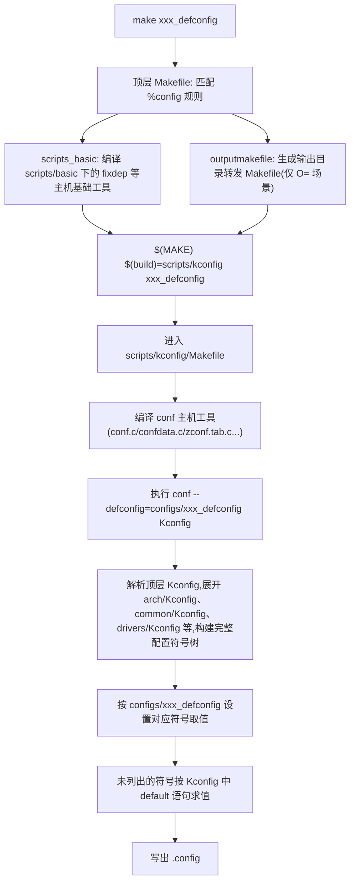
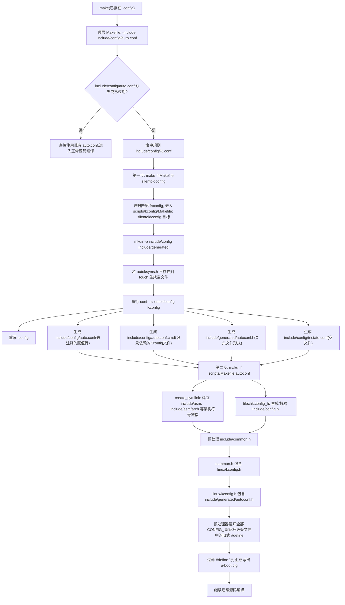
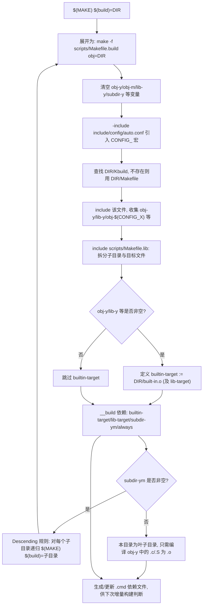
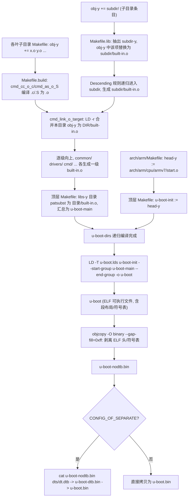

# 1 U-Boot 构建体系概述

U-Boot 的配置与编译体系沿用了 Linux 内核的 Kbuild/Kconfig 框架，整体构建过程可以分为两个阶段：

- **配置阶段**：执行 `make xxx_defconfig`，根据某个具体单板的默认配置文件（`configs/xxx_defconfig`）和顶层 `Kconfig` 描述的全部配置项，生成一份完整的 `.config`。`.config` 是纯文本形式，保留大量注释，供人阅读和 `menuconfig` 等图形化工具修改。
- **编译阶段**：执行 `make`（或 `make all`）实际编译源码之前，构建系统会先把 `.config` 转换成若干种“机器可用”的形式——供 Makefile `include` 的 `auto.conf`、供 C 代码 `#include` 的 `autoconf.h`，最终再经过预处理器展开，生成汇总了全部宏定义的 `u-boot.cfg`。

这两个阶段都由 `scripts/kconfig/` 目录下的主机工具 `conf` 驱动，`conf` 是由 `Kconfig`/`*_defconfig` 描述文件生成配置的核心程序。本章按“`make xxx_defconfig` 生成 `.config`”和“`make` 编译时生成 `u-boot.cfg`”两条主线，结合顶层 `Makefile`、`scripts/kconfig/Makefile`、`scripts/Makefile.autoconf` 中的具体规则，说明整个生成链路。

# 2 make xxx_defconfig 生成 .config

## 2.1 顶层 Makefile 中的 %config 规则

顶层 `Makefile` 使用模式规则统一处理所有以 `config` 结尾的目标（`defconfig`、`menuconfig`、`silentoldconfig` 等都会匹配到这一规则）：

```makefile
%config: scripts_basic outputmakefile FORCE
	$(Q)$(MAKE) $(build)=scripts/kconfig $@
```

执行 `make xxx_defconfig` 时，`$@` 就是 `xxx_defconfig`，该规则依赖两个前置目标：

- `scripts_basic`：先编译构建过程本身要用到的主机工具。
- `outputmakefile`：当使用 `O=` 指定独立输出目录时，在输出目录下生成一个转发用的 `Makefile`，保证在输出目录中直接执行 `make` 也能正确回到源码顶层 `Makefile`。

两者满足后，真正的动作只有一条：递归调用 `$(MAKE) $(build)=scripts/kconfig xxx_defconfig`，即进入 `scripts/kconfig` 目录，以 `xxx_defconfig` 为目标继续构建。

## 2.2 scripts_basic：准备基础主机工具

```makefile
scripts_basic:
	$(Q)$(MAKE) $(build)=scripts/basic
	$(Q)rm -f .tmp_quiet_recordmcount
```

`scripts_basic` 进入 `scripts/basic` 目录，编译出 `fixdep` 等基础主机工具。`fixdep` 用于生成精确的头文件依赖关系（`.d` 文件），后续无论是配置阶段还是源码编译阶段的增量构建都要依赖它。需要注意的是，这一步编译的是 `fixdep` 等通用基础工具，而不是配置阶段真正使用的 `conf` 工具——`conf` 是在进入 `scripts/kconfig` 目录后才编译出来的。

## 2.3 进入 scripts/kconfig 并编译 conf 工具

`$(MAKE) $(build)=scripts/kconfig xxx_defconfig` 会读取 `scripts/kconfig/Makefile`。该 Makefile 中定义了 `conf` 主机程序的编译规则，把 `conf.c`、`confdata.c`、`expr.c`、`zconf.tab.c` 等源文件编译并链接成主机可执行文件 `conf`：

```makefile
$(obj)/conf: $(obj)/conf.o $(obj)/zconf.tab.o
	$(Q)$(HOSTCC) $(HOSTCFLAGS) $(HOST_EXTRACFLAGS) -o $@ $^
```

`conf` 就是解析 `Kconfig` 语法、读写 `.config` 的核心工具，`defconfig`、`menuconfig`、`oldconfig`、`silentoldconfig` 等一系列配置目标最终都靠这一个可执行文件完成，只是调用时传入的选项不同。

## 2.4 defconfig 目标：合并 Kconfig 与 xxx_defconfig 生成 .config

`conf` 编译完成后，`scripts/kconfig/Makefile` 中的 `%_defconfig` 模式规则被触发：

```makefile
%_defconfig: $(obj)/conf
	$(Q)$< $(silent) --defconfig=configs/$@ $(Kconfig)
```

该规则执行 `conf --defconfig=configs/xxx_defconfig Kconfig`，具体处理逻辑如下：

1. `conf` 解析顶层 `Kconfig`，顶层 `Kconfig` 通过 `source` 语句展开 `arch/Kconfig`、`arch/arm/Kconfig`、`common/Kconfig`、`drivers/Kconfig` 等一系列子 `Kconfig` 文件，从而在内存中构建出全部配置符号（`CONFIG_*`）及其类型、依赖关系、默认值组成的完整配置树。
2. `conf` 按顺序读取 `configs/xxx_defconfig` 文件，该文件只是配置树中一小部分“非默认”配置项的取值列表（例如 `CONFIG_ARM=y`、`CONFIG_TARGET_MX6ULL_14X14_EVK=y` 等），`conf` 将这些取值应用到对应符号上。
3. 对于 `xxx_defconfig` 中没有出现的符号，`conf` 按 `Kconfig` 中该符号的 `default` 语句（并结合 `depends on`/`select` 等依赖关系）自动求值。
4. 最终把全部符号连同注释、帮助信息一起写出到源码根目录下的 `.config` 文件。

`.config` 生成完成后，`make xxx_defconfig` 即结束，此时源码目录下还没有任何 `include/generated`、`include/config` 下的中间文件，也没有生成 `u-boot.cfg`；这些文件要等到执行编译目标（例如直接 `make`）时才会生成，即本章第 3 部分的内容。

## 2.5 make xxx_defconfig 流程图



# 3 make 编译时生成 u-boot.cfg

`.config` 生成之后，直接执行 `make`（或指定其他编译目标）会先让配置数据“落地”为编译系统真正可用的几种形式，最后再把全部宏展开为 `u-boot.cfg`。这一过程由顶层 `Makefile` 中 `include/config/%.conf` 规则触发。

## 3.1 include/config/%.conf 规则与两次子 make

顶层 `Makefile` 在需要读取当前配置时会 `-include include/config/auto.conf`，一旦该文件缺失或已过期（比对 `.config`、`Kconfig` 的修改时间），就会命中如下规则：

```makefile
include/config/%.conf: $(KCONFIG_CONFIG) include/config/auto.conf.cmd
	$(Q)$(MAKE) -f $(srctree)/Makefile silentoldconfig
	@# If the following part fails, include/config/auto.conf should be
	@# deleted so "make silentoldconfig" will be re-run on the next build.
	$(Q)$(MAKE) -f $(srctree)/scripts/Makefile.autoconf || \
		{ rm -f include/config/auto.conf; false; }
```

`$(KCONFIG_CONFIG)` 默认就是 `.config`，`include/config/auto.conf.cmd` 中记录了上一次生成 `auto.conf` 时读取过的全部 `Kconfig` 文件列表，任何一个 `Kconfig` 文件被修改都会使这条规则的依赖关系失效，从而在下一次 `make` 时自动重新执行。规则本身分两步：

1. `make -f Makefile silentoldconfig`：调用顶层 `Makefile` 的 `silentoldconfig` 目标，把 `.config` 规范化并生成一批中间文件。
2. `make -f scripts/Makefile.autoconf`：在第一步成功的前提下，进一步生成 `include/config.h` 并建立架构相关的符号链接；若第一步或第二步失败，就删除 `include/config/auto.conf`，保证下次构建会重新走一遍 `silentoldconfig`，不会残留一份不完整的配置。

## 3.2 silentoldconfig：规范化 .config 并生成中间文件

`silentoldconfig` 同样匹配顶层 `Makefile` 的 `%config` 模式规则，因此会再次以 `$(MAKE) $(build)=scripts/kconfig silentoldconfig` 的形式进入 `scripts/kconfig/Makefile`，命中其中的 `silentoldconfig` 目标：

```makefile
silentoldconfig: $(obj)/conf
	$(Q)mkdir -p include/config include/generated
	$(Q)test -e include/generated/autoksyms.h || \
	touch include/generated/autoksyms.h
	$< $(silent) --$@ $(Kconfig)
```

该目标依赖 `$(obj)/conf`（若 `conf` 还未编译则先编译），随后执行以下动作：

1. 创建 `include/config`、`include/generated` 两个目录，用于存放后续生成的配置文件与头文件。
2. 若 `include/generated/autoksyms.h` 尚不存在，则创建一个空文件；该文件对应 Linux 内核 Kbuild 中的符号裁剪特性，在 U-Boot 中并不实际使用，仅为兼容 Kconfig 前端逻辑而保留为空文件。
3. 执行 `conf --silentoldconfig Kconfig`：`conf` 重新读取 `.config`，与当前 `Kconfig` 描述的最新符号树做比对，若出现新增、废弃或依赖关系变化的符号，会按默认值静默补全（不与用户交互），并据此重写 `.config`，同时生成如下一组文件：

- `include/config/auto.conf`：内容取自 `.config`，但去掉了大量帮助文本和注释，只保留形如 `CONFIG_XXX=y` 的赋值行，供 Makefile 用 `include` 语句直接引入，参与构建逻辑判断（例如决定哪些目录、哪些源文件要参与编译）。
- `include/config/auto.conf.cmd`：记录生成 `auto.conf` 时实际读取过的全部 `Kconfig` 文件路径，构成 `auto.conf` 的依赖规则；这些 `Kconfig` 文件中任意一个发生变化，都会使 `include/config/%.conf` 规则在下次 `make` 时被重新触发。
- `include/generated/autoconf.h`：内容与 `auto.conf` 对应，但形式是 C 语言头文件，例如 `#define CONFIG_XXX 1`，供 C 源码中的 `#ifdef CONFIG_XXX` 使用。
- `include/config/tristate.conf`：空文件。该文件对应 Linux 内核中三态（`y`/`m`/`n`）符号的处理逻辑，U-Boot 不支持模块（`m`）形式的可加载配置，因此此文件始终为空，仅为保持 Kconfig 前端行为一致而生成。

## 3.3 scripts/Makefile.autoconf：符号链接与 include/config.h

`silentoldconfig` 成功后，`include/config/%.conf` 规则接着执行第二个子 make：`make -f scripts/Makefile.autoconf`。这一步主要完成两件事：

```makefile
include/config.h: scripts/Makefile.autoconf create_symlink FORCE
	$(call filechk,config_h)
```

- `create_symlink`：根据 `.config` 中选定的 `ARCH`、`SOC` 等信息，建立 `include/asm -> arch/<arch>/include/asm`、`include/asm/arch -> arch/<arch>/mach-<soc>/include/mach` 等一批符号链接文件。这些链接把与具体架构、具体 SoC 相关的头文件目录“挂接”到统一的 `include/asm` 路径下，使得源码中 `#include <asm/xxx.h>`、`#include <asm/arch/xxx.h>` 这类不带具体架构名的写法能够正确解析到当前配置所选平台的头文件，是配置结果影响头文件搜索路径的关键一步。
- `$(call filechk,config_h)`：借助 Kbuild 的 `filechk` 机制生成/校验 `include/config.h`。`filechk` 会先把要写入的内容生成到一个临时文件，再与已存在的 `include/config.h` 逐字节比较，只有内容确实发生变化时才用新内容覆盖旧文件；内容不变则保持原文件不动，从而避免仅因时间戳刷新就触发所有依赖 `include/config.h` 的目标文件被无谓地重新编译。

至此，`.config` 中的配置信息已经完整体现为可供 Makefile 使用的 `auto.conf`、可供 C 代码使用的 `autoconf.h`，以及决定头文件搜索路径的架构符号链接。

## 3.4 头文件宏展开生成 u-boot.cfg

`include/config.h` 就绪后，构建系统会对 `include/common.h` 做一次完整的预处理器展开，把其中涉及的全部宏定义汇总、落盘为 `u-boot.cfg`。这条包含链是：

```
include/common.h
    -> #include <linux/kconfig.h>
        -> #include <generated/autoconf.h>   （内容来自 .config）
```

`include/common.h` 是 U-Boot 早期版本中几乎每个源文件都会包含的全局头文件，它间接包含 `linux/kconfig.h`，而 `linux/kconfig.h` 又包含前面生成的 `include/generated/autoconf.h`。编译器对 `common.h` 执行预处理（`-E`）时，会把 `autoconf.h` 中的 `#define CONFIG_XXX 1`、板级头文件中遗留的旧式 `#define CONFIG_XXX` 等宏全部展开并罗列出来，构建脚本再对预处理输出做过滤，只保留形如 `#define` 的行，最终汇总写出为 `u-boot.cfg`。

`u-boot.cfg` 本质上是把“Kconfig 新体系（`.config`/`autoconf.h`）”与“旧体系遗留在板级头文件中的宏定义”合并展开后的一份平铺快照，后续需要统一查看或处理全部生效宏（例如配置迁移工具、SPL 阶段裁剪等场景）时，可以直接读取这一份文件，而不必再分别解析 `.config`、`autoconf.h` 以及各级头文件。

## 3.5 make 编译时生成 u-boot.cfg 流程图



# 4 scripts/Makefile.build 分析

`.config` 转换出的 `auto.conf`、`autoconf.h`、`u-boot.cfg` 只是解决了"用哪些配置"的问题，真正把成百上千个源码目录组织起来、递归编译成目标文件的工作，由 `scripts/Makefile.build` 承担。顶层 `Makefile` 本身并不直接编译任何 `.c`/`.S` 文件，而是通过反复递归调用这一个脚本，逐级进入 `common/`、`drivers/`、`arch/arm/cpu/` 等目录完成编译。

## 4.1 build 变量：统一的递归调用入口

`scripts/Kbuild.include` 中定义了一个关键变量：

```makefile
build := -f $(srctree)/scripts/Makefile.build obj
```

顶层 `Makefile`、`scripts/kconfig/Makefile` 等各处出现的 `$(MAKE) $(build)=DIR` 写法，展开后就是：

```makefile
$(MAKE) -f scripts/Makefile.build obj=DIR
```

也就是说，"进入某个目录编译"在 U-Boot 构建体系里从来不是 `cd DIR && make` 意义上的目录切换，而是**在当前工作目录不变的前提下，重新以 `scripts/Makefile.build` 为规则文件发起一次子 `make`，把目标目录名通过 `obj` 变量传进去**。前面章节中 `%config: ... $(MAKE) $(build)=scripts/kconfig $@` 正是这一机制的具体应用：`obj=scripts/kconfig`，规则文件仍是 `Makefile.build`。

## 4.2 变量初始化与目录描述文件的加载

`scripts/Makefile.build` 开头先把 `obj-y`、`obj-m`、`lib-y`、`subdir-y`、`extra-y` 等一系列变量清空：

```makefile
obj-y :=
obj-m :=
lib-y :=
...
subdir-y :=
subdir-m :=
```

这一步是必要的：每次递归调用都是一次全新的 `make` 进程，若不清空，父目录残留的变量取值可能被子目录意外继承，导致编译对象串目录。清空之后，脚本依次执行：

```makefile
-include include/config/auto.conf
-include $(prefix)/include/autoconf.mk
include scripts/Kbuild.include

kbuild-dir := $(if $(filter /%,$(src)),$(src),$(srctree)/$(src))
kbuild-file := $(if $(wildcard $(kbuild-dir)/Kbuild),$(kbuild-dir)/Kbuild,$(kbuild-dir)/Makefile)
include $(kbuild-file)

include scripts/Makefile.lib
```

- `-include include/config/auto.conf`：引入第 3 章生成的 `auto.conf`，使目标目录的 `Makefile` 中可以直接书写 `obj-$(CONFIG_XXX) += yyy.o` 这样依赖配置的写法。
- `kbuild-file`：优先寻找目标目录下的 `Kbuild` 文件，不存在则退回该目录的 `Makefile`。`include $(kbuild-file)` 把 `common/Makefile`、`drivers/mmc/Makefile` 这类目录级描述文件"吸入"当前这次 `make` 进程，其中定义的 `obj-y`、`lib-y`、`obj-$(CONFIG_XXX)` 等变量就此生效。
- `include scripts/Makefile.lib`：对上一步收集到的 `obj-y`/`lib-y` 做进一步整理（拆分子目录、拼接路径前缀等），具体处理逻辑将在第 5 章结合 `built-in.o` 的生成详细展开。

## 4.3 __build 伪目标：本级目录要完成的全部工作

变量收集完毕后，`Makefile.build` 根据 `obj-y`、`lib-y` 等变量是否非空，决定本级目录需要生成哪些产物：

```makefile
ifneq ($(strip $(lib-y) $(lib-m) $(lib-)),)
lib-target := $(obj)/lib.a
endif

ifneq ($(strip $(obj-y) $(obj-m) $(obj-) $(subdir-m) $(lib-target)),)
builtin-target := $(obj)/built-in.o
endif

__build: $(if $(KBUILD_BUILTIN),$(builtin-target) $(lib-target) $(extra-y)) \
	 $(if $(KBUILD_MODULES),$(obj-m) $(modorder-target)) \
	 $(subdir-ym) $(always)
	@:
```

`__build` 是本次子 `make` 的默认目标，它把当前目录要完成的任务归纳为四类依赖：

- `builtin-target`（即 `$(obj)/built-in.o`）：当本目录存在 `obj-y` 等非空内容时才会定义，是本目录参与最终链接的汇总目标文件。
- `lib-target`：若目录使用 `lib-y` 描述（打包为静态库而非直接参与链接），生成 `lib.a`。
- `subdir-ym`：本目录下需要继续递归的子目录集合。
- `always`：无条件需要生成的辅助产物。

由于 `__build` 本身没有实际命令（`@:` 表示空操作），它的作用只是把上述几类依赖串联起来，触发 make 的依赖求解，真正的编译、打包、链接动作分别在各自的模式规则中完成。

## 4.4 Descending：对子目录的递归下钻

`obj-y` 中形如 `init/`、`board/xxx/` 这种以斜杠结尾的条目，会在 `scripts/Makefile.lib` 中被识别为子目录并归入 `subdir-y`（详见第 5 章）。`Makefile.build` 末尾用一条极短的规则完成对这些子目录的递归：

```makefile
# Descending
PHONY += $(subdir-ym)
$(subdir-ym):
	$(Q)$(MAKE) $(build)=$@
```

即对 `subdir-ym`（`subdir-y` 与 `subdir-m` 的合集）中的每一个目录 `$@`，再次执行 `$(MAKE) $(build)=$@`，也就是重新以 `scripts/Makefile.build` 为规则文件、以该子目录为新的 `obj`，递归执行 4.1～4.3 节的全部逻辑。这正是"进入目录进行编译"在 Makefile 层面的完整含义：**同一份 `Makefile.build` 脚本，通过不断改变 `obj` 变量的取值，一层层向下展开整个目录树**，直至到达没有子目录、只有源文件的叶子目录为止。

## 4.5 增量构建：targets 与 .cmd 文件

`Makefile.build` 结尾还负责让增量构建生效：

```makefile
targets := $(wildcard $(sort $(targets)))
cmd_files := $(wildcard $(foreach f,$(targets),$(dir $(f)).$(notdir $(f)).cmd))

ifneq ($(cmd_files),)
  include $(cmd_files)
endif
```

编译规则中大量使用 `if_changed`/`if_changed_dep` 这类宏（定义在 `scripts/Kbuild.include`），它们在生成目标文件的同时，把本次实际执行的编译命令行连同头文件依赖，记录到同目录下的隐藏文件 `.<目标名>.cmd` 中。下一次 `make` 时，`Makefile.build` 会把这些 `.cmd` 文件 `include` 进来，一旦发现某个目标对应的源文件、头文件或编译选项发生了变化，就会重新触发该目标的重建；否则直接跳过，这是 U-Boot 编译具备高效增量构建能力的基础。

## 4.6 scripts/Makefile.build 目录递归流程图



# 5 make 编译出 u-boot.bin：obj-y、head-y 如何汇聚为 built-in.o

`scripts/Makefile.build` 解决了"进入哪些目录"的问题，本章接着说明"目录里的源文件如何一步步合并成最终镜像"，即 `obj-y`、`head-y` 经过逐级目录的 `built-in.o` 合并，最终被链接为 `u-boot`（ELF），再由 `objcopy` 转换为 `u-boot.bin` 的完整过程。

## 5.1 obj-y 中的子目录条目：拆分为 subdir-y 并回写为 built-in.o

以 [common/Makefile](<C:/Users/h564659/Desktop/CTF/001_Material/99_Linux/01、例程源码/01、例程源码/03、正点原子Uboot和Linux出厂源码/uboot-imx-2016.03-2.1.0-g0ae7e33-v1.7/common/Makefile>) 为例，其中的 `obj-y` 既包含目标文件，也包含子目录：

```makefile
obj-y += init/
obj-y += main.o
obj-y += exports.o
obj-y += hash.o
```

`scripts/Makefile.lib` 对这份 `obj-y` 做了两处关键处理：

```makefile
__subdir-y	:= $(patsubst %/,%,$(filter %/, $(obj-y)))
subdir-y	+= $(__subdir-y)
obj-y		:= $(patsubst %/, %/built-in.o, $(obj-y))
```

- 第一步用 `$(filter %/, $(obj-y))` 挑出所有以 `/` 结尾的条目（即子目录，如 `init/`），去掉末尾斜杠后并入 `subdir-y`——这正是第 4 章 Descending 规则要递归进入的目录列表。
- 第二步把 `obj-y` 中原本的 `init/` **原地替换为 `init/built-in.o`**。也就是说，子目录本身不会出现在最终的目标文件列表里，取而代之的是"该子目录递归编译完成后应当产出的 `built-in.o`"。

于是 `obj-y` 在处理后实际变为：`init/built-in.o main.o exports.o hash.o ...`，子目录的编译结果与本目录的普通目标文件被放进了同一份列表参与后续链接。

## 5.2 单个源文件如何编译为 .o

对于 `obj-y` 中的普通条目（如 `main.o`），`Makefile.build` 提供标准的模式规则完成从源文件到目标文件的编译：

```makefile
quiet_cmd_cc_o_c = CC $(quiet_modtag)  $@
cmd_cc_o_c = $(CC) $(c_flags) -c -o $@ $<

$(obj)/%.o: $(src)/%.c FORCE
	$(call if_changed_dep,cc_o_c)

quiet_cmd_as_o_S = AS $(quiet_modtag)  $@
cmd_as_o_S       = $(CC) $(a_flags) -c -o $@ $<

$(obj)/%.o: $(src)/%.S FORCE
	$(call if_changed_dep,as_o_S)
```

`.c` 文件由 `$(CC) -c` 编译，`.S` 汇编文件同样通过 `$(CC) -c`（内部会调用汇编器）编译，两者都使用 `if_changed_dep`，因此每个 `.o` 都会连带生成对应的 `.cmd` 依赖记录，支撑第 4.5 节所述的增量构建。

## 5.3 built-in.o 的合并规则：同目录 .o 汇总为一个可重定位对象

本目录 `obj-y` 列表中的所有 `.o`（包含直接源文件编译出的 `.o`，也包含来自子目录、已经代换为 `子目录/built-in.o` 的条目）齐备后，触发 `built-in.o` 的合并规则：

```makefile
ifdef builtin-target
quiet_cmd_link_o_target = LD      $@
# If the list of objects to link is empty, just create an empty built-in.o
cmd_link_o_target = $(if $(strip $(obj-y)),\
		      $(LD) $(ld_flags) -r -o $@ $(filter $(obj-y), $^) \
		      $(cmd_secanalysis),\
		      rm -f $@; $(AR) rcs$(KBUILD_ARFLAGS) $@)

$(builtin-target): $(obj-y) FORCE
	$(call if_changed,link_o_target)
endif
```

关键点在于 `$(LD) ... -r -o $@ $(obj-y)`：链接器以 `-r`（生成可重定位目标文件，而非最终可执行文件）方式，把 `$(obj-y)` 列出的所有 `.o` 合并成**同目录下的一个 `built-in.o`**。由于子目录的条目已经在 5.1 节被替换为 `子目录/built-in.o`，这一步实际上把"本目录自身的目标文件"与"各级子目录递归合并后的 `built-in.o`"再次合并为一个更大的 `built-in.o`，逐级向上汇聚。若 `obj-y` 为空，则直接用 `$(AR)` 创建一个空归档，保证目标始终存在，不会因为某个目录暂时没有代码而中断整条依赖链。

由于第 4 章 Descending 规则保证了子目录必须先于父目录的 `built-in.o` 规则完成（`$(builtin-target): $(obj-y) FORCE`，而 `obj-y` 中含有子目录的 `built-in.o`），因此整个源码树的编译呈现出清晰的**自底向上合并**特征：叶子目录先产出自己的 `built-in.o`，逐级向上合并，最终 `common/`、`drivers/`、`arch/arm/cpu/armv7/` 等一级目录各自都拥有一份汇总了自身及全部子目录代码的 `built-in.o`。

## 5.4 顶层 Makefile：libs-y 与 head-y 汇总为 u-boot-main、u-boot-init

顶层 `Makefile` 中列出了参与链接的一级目录清单（节选）：

```makefile
libs-y += lib/
libs-y += fs/
libs-y += net/
libs-y += disk/
libs-y += drivers/
libs-y += cmd/
libs-y += common/
libs-y += $(if $(BOARDDIR),board/$(BOARDDIR)/)
...
libs-y := $(sort $(libs-y))

u-boot-dirs	:= $(patsubst %/,%,$(filter %/, $(libs-y))) tools examples
libs-y		:= $(patsubst %/, %/built-in.o, $(libs-y))

u-boot-init := $(head-y)
u-boot-main := $(libs-y)
```

这段逻辑与 5.1 节 `Makefile.lib` 的处理如出一辙：`libs-y` 中每一个以 `/` 结尾的目录名，一方面被抽出目录名汇入 `u-boot-dirs`（供顶层递归下降使用），另一方面把自身替换为 `目录/built-in.o` 并入 `u-boot-main`，即最终参与链接的目标文件列表。

`head-y` 由具体架构的 `arch/$(ARCH)/Makefile` 定义，对 ARM 而言：

```makefile
head-y := arch/arm/cpu/$(CPU)/start.o
```

即处理器复位后执行的第一段汇编代码 `start.o`（对 imx6ull 而言 `CPU=armv7`，对应 `arch/arm/cpu/armv7/start.o`）。`head-y` 被单独保存为 `u-boot-init`，不与其余目标文件混在一起打包进某个 `built-in.o`，因为它在最终链接时必须处于最前面，作为 U-Boot 的入口点。

## 5.5 顶层目录的递归编译入口

```makefile
PHONY += $(u-boot-dirs)
$(u-boot-dirs): prepare scripts
	$(Q)$(MAKE) $(build)=$@

$(sort $(u-boot-init) $(u-boot-main)): $(u-boot-dirs) ;
```

顶层 `Makefile` 对 `u-boot-dirs` 中的每一个一级目录，同样通过 `$(MAKE) $(build)=$@` 进入 `scripts/Makefile.build`，重复第 4 章描述的整套流程，使该目录（及其全部子目录）编译出自己的 `built-in.o`。第二条规则则显式声明：`u-boot-init`、`u-boot-main` 中列出的所有目标文件（`start.o` 以及各个 `xxx/built-in.o`）都依赖于对应目录被构建完成，避免 make 在这些文件尚未生成前就试图链接。

## 5.6 链接为 u-boot（ELF）

各一级目录的 `built-in.o` 与 `start.o` 就绪后，顶层 `Makefile` 执行最终链接：

```makefile
quiet_cmd_u-boot__ ?= LD      $@
      cmd_u-boot__ ?= $(LD) $(LDFLAGS) $(LDFLAGS_u-boot) -o $@ \
      -T u-boot.lds $(u-boot-init)                             \
      --start-group $(u-boot-main) --end-group                 \
      $(PLATFORM_LIBS) -Map u-boot.map

u-boot:	$(u-boot-init) $(u-boot-main) u-boot.lds FORCE
	$(call if_changed,u-boot__)
```

- `-T u-boot.lds`：使用链接脚本控制各段（`.text`、`.data`、`.bss` 等）的布局与起始地址；`u-boot.lds` 本身由 `arch/arm/cpu/u-boot.lds.S`（或板级/CPU 级同名文件）经预处理器展开 `#include`、宏定义后生成。
- `$(u-boot-init)`：紧跟在 `-T u-boot.lds` 之后，第一个参与链接，保证 `start.o` 位于镜像最前面、其复位入口地址与链接脚本约定的入口一致。
- `--start-group $(u-boot-main) --end-group`：把全部一级目录的 `built-in.o` 放入一个链接组，允许其中的目标文件相互交叉引用符号（U-Boot 各子系统之间存在大量双向依赖，`--start-group/--end-group` 让链接器反复扫描该组直至所有符号解析完成）。
- 生成的 `u-boot` 是一个带调试信息、段布局完整的 **ELF** 可执行文件，尚不能直接烧写到 Flash 或 SD 卡运行。

## 5.7 由 ELF 到裸二进制：u-boot.bin

```makefile
quiet_cmd_objcopy = OBJCOPY $@
cmd_objcopy = $(OBJCOPY) --gap-fill=0xff $(OBJCOPYFLAGS) \
	$(OBJCOPYFLAGS_$(@F)) $< $@

OBJCOPYFLAGS_u-boot-nodtb.bin := -O binary \
		$(if $(CONFIG_X86_RESET_VECTOR),-R .start16 -R .resetvec)

u-boot-nodtb.bin: u-boot FORCE
	$(call if_changed,objcopy)

u-boot.bin: u-boot-nodtb.bin FORCE
	$(call if_changed,copy)
```

`objcopy -O binary` 把 `u-boot` 这个 ELF 文件中真正需要加载执行的段按链接地址顺序抽取出来，剥离 ELF 文件头、符号表、调试信息等，`--gap-fill=0xff` 保证段之间的空隙用 `0xff` 填充，最终得到一份可以被 BootROM/SPL 直接搬运执行的纯二进制文件 `u-boot-nodtb.bin`。若配置中启用了独立设备树（`CONFIG_OF_SEPARATE`），还会把 `dts/dt.dtb` 拼接在其后组成 `u-boot-dtb.bin`；否则如上所示直接把 `u-boot-nodtb.bin` 拷贝为 `u-boot.bin`。至此，`make` 的默认目标 `all`（依赖 `ALL-y`，其中包含 `u-boot.bin`）执行完毕，得到最终可以烧写到板子的 U-Boot 镜像。

## 5.8 从 obj-y/head-y 到 u-boot.bin 流程图



# 6 全流程小结

| 阶段 | 触发命令 | 核心工具/脚本 | 关键产物 | 产物用途 |
| --- | --- | --- | --- | --- |
| 配置阶段 | `make xxx_defconfig` | `scripts/kconfig` 下编译出的 `conf` | `.config` | 保留注释、供人阅读和 `menuconfig` 等交互式修改 |
| 编译前处理 | `make`（触发 `silentoldconfig`） | 同一个 `conf`，加 `--silentoldconfig` | `include/config/auto.conf`、`auto.conf.cmd`、`include/generated/autoconf.h`、`tristate.conf` | 分别供 Makefile `include` 和 C 代码 `#include` 使用，驱动构建判断与条件编译 |
| 编译前处理 | 同上，`scripts/Makefile.autoconf` | `filechk`、`create_symlink` | `include/config.h`、架构相关符号链接 | 确定架构头文件搜索路径，为宏展开做准备 |
| 宏展开 | 同上 | 编译器预处理器 | `u-boot.cfg` | 汇总 `.config` 与板级头文件中全部生效宏，供统一查看/后续工具使用 |
| 目录递归 | `make`（默认目标 `all`） | `scripts/Makefile.build`（经 `$(build)=DIR` 反复递归调用） | 各级目录下的 `.o`、`.cmd` 依赖文件 | 把 Kbuild 风格的 `obj-y`/`lib-y` 描述转换为实际的编译动作，并支撑增量构建 |
| 逐级合并 | 同上 | `$(LD) -r`（`cmd_link_o_target`） | 各级目录的 `built-in.o` | 把子目录的目标文件自底向上汇聚，最终形成一级目录的汇总目标文件 |
| 最终链接 | 同上 | `$(LD)`（`cmd_u-boot__`），链接脚本 `u-boot.lds` | `u-boot`（ELF） | 按链接脚本布局各段，`head-y`（`start.o`）置于最前作为入口 |
| 镜像转换 | 同上 | `objcopy -O binary` | `u-boot-nodtb.bin`/`u-boot.bin` | 剥离 ELF 头与符号表，得到可直接烧写、可被 BootROM/SPL 加载执行的裸二进制镜像 |

整个构建过程呈现出清晰的层次：`conf` 工具解决"选什么配置"，`silentoldconfig`/`Makefile.autoconf` 把配置转换为 Makefile 与 C 代码都可用的形式，`scripts/Makefile.build` 通过 `$(build)=DIR` 的反复递归把整棵源码目录树纳入编译范围，`obj-y`/`head-y` 描述的目标文件经由 `built-in.o` 自底向上合并，最终经链接、`objcopy` 转换得到可烧写运行的 `u-boot.bin`。
