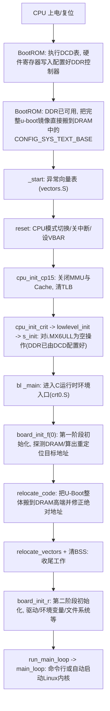
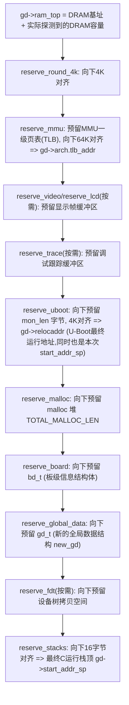
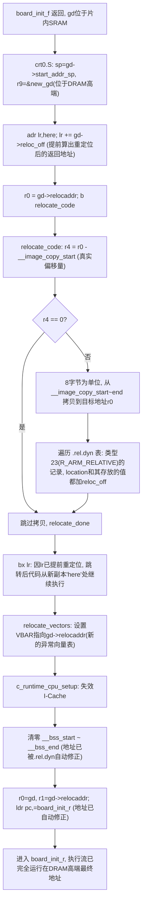
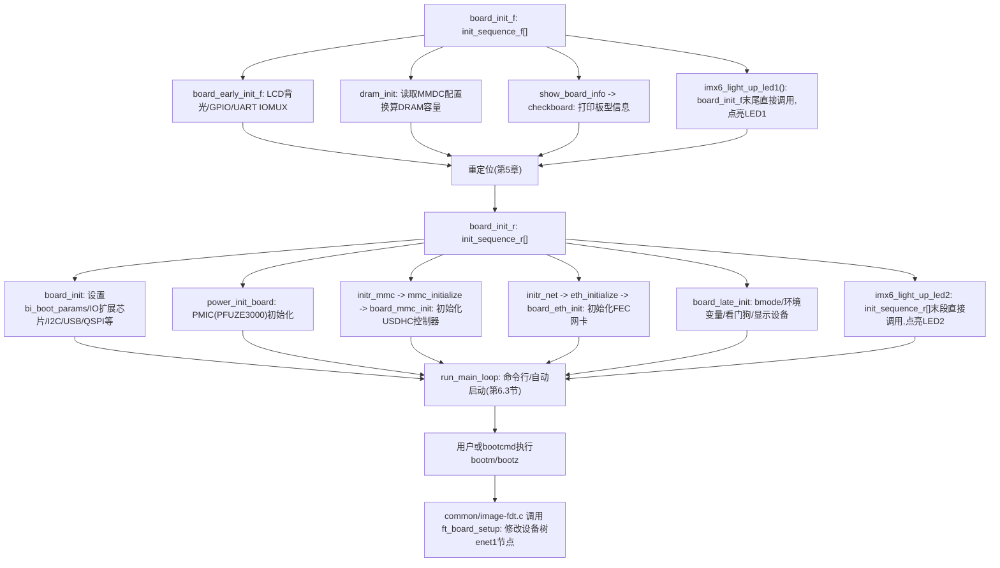

# 1 U-Boot 启动流程概述

## 1.1 两阶段执行模型：为什么要"分两次"做初始化

U-Boot（以及绝大多数 bootloader）在启动过程中会出现一个特殊现象：同一份代码，会先在一个"临时"的地方运行一遍简化的初始化，然后把自己整体搬到另一个地方，再运行一遍完整的初始化。这两次初始化在 U-Boot 源码里分别叫做：

- **board_init_f**（`f` 表示 *pre-relocation*，"重定位之前"）：此时 DDR 是否可用、可用多大都还不确定，C 运行环境非常简陋，只有一个借用片内 SRAM 搭建的临时栈和临时的全局数据结构，连 `bss` 段（未初始化的全局变量区）都还没有清零，因此这一阶段只能做最基本的探测性工作：初始化时钟、探测 DRAM 容量、打通串口打印、并且**计算出自己最终应该运行在 DRAM 的什么位置**。
- **board_init_r**（`r` 表示 *post-relocation*，"重定位之后"）：U-Boot 已经把自己完整地复制到了 DRAM 中事先计算好的最终位置，`bss` 段已清零，`malloc` 堆已经在 DRAM 里正式建立，这时才具备了运行几乎全部命令、驱动、文件系统代码的完整能力，进而进入命令行或自动启动 Linux 内核。

连接这两个阶段的关键动作就是**重定位**（relocation）——把 U-Boot 自身的代码、只读数据、可读写数据从当前所在的位置，原样搬运到新算出来的目标位置，并且修正代码内部所有引用了"旧地址"的绝对地址，让程序在新地址下依然能够正确运行。这是本文重点讲解的内容，将在第 5 章详细展开。

## 1.2 从上电到命令行的整体流程

在深入细节之前，先建立一个全局印象：CPU 上电后，会经过"硬件复位向量 → 汇编阶段初始化 → 第一阶段 C 语言初始化 → 重定位 → 第二阶段 C 语言初始化 → 命令行/自动启动"这样一条主线。



后续章节按照这条主线，从链接脚本讲起，逐步深入到 `start.S`、`board_init_f`、重定位、`board_init_r`，最后给出一张完整的汇总流程图。

# 2 链接脚本与入口地址：编译期"假设"的运行环境

在阅读汇编代码之前，必须先理解 U-Boot 是"以什么地址为前提"被编译出来的，这由链接脚本 `arch/arm/cpu/u-boot.lds` 决定。链接脚本回答的问题是：各个段（代码段、数据段……）在最终镜像里的先后顺序是什么，以及编译器/链接器在生成代码时，应该假设自己最终运行在哪个地址上。

## 2.1 链接地址是如何确定的

前一篇 [03_uboot_makefile分析.md](<C:/Users/h564659/Desktop/L/Linux/002_notes/002_Linux移植/uboot/03_uboot_makefile分析.md>) 中已经说明，顶层 `Makefile` 链接 `u-boot` 时使用的命令是：

```makefile
cmd_u-boot__ ?= $(LD) $(LDFLAGS) $(LDFLAGS_u-boot) -o $@ \
      -T u-boot.lds $(u-boot-init)                             \
      --start-group $(u-boot-main) --end-group                 \
      $(PLATFORM_LIBS) -Map u-boot.map
```

其中 `LDFLAGS_u-boot` 里包含了一条关键选项：

```makefile
ifneq ($(CONFIG_SYS_TEXT_BASE),)
LDFLAGS_u-boot += -Ttext $(CONFIG_SYS_TEXT_BASE)
endif
```

`-Ttext CONFIG_SYS_TEXT_BASE` 告诉链接器："`.text` 段（以及紧随其后的其它段）的起始运行地址是 `CONFIG_SYS_TEXT_BASE`"。这是一个**纯粹的编译期假设**——链接器并不知道镜像实际会被加载到哪里，它只是按这个假设去计算代码里所有全局变量、函数地址等符号的具体数值。以正点原子 `mx6ull_14x14_ddr512_emmc` 配置为例，`include/configs/mx6_common.h` 中定义：

```c
#ifndef CONFIG_SYS_TEXT_BASE
#define CONFIG_SYS_TEXT_BASE    0x87800000
#endif
```

即链接器认为 U-Boot 会从 DRAM 中的 `0x87800000` 地址开始运行（i.MX6ULL 的 DRAM 起始地址 `CONFIG_SYS_SDRAM_BASE` 为 `0x80000000`，`0x87800000` 大约位于 DRAM 起始处往后 120MB 的位置）。后面会看到，这个地址只是一个"临时的、编译期假设的运行地址"，U-Boot 真正最终运行的地址要等到运行时探测完 DRAM 容量后才能算出来，两者通常并不相同，这正是需要重定位的根本原因之一。

## 2.2 u-boot.lds 的段布局与关键符号

`u-boot.lds`（节选，已略去与 SPL/安全扩展相关的部分）：

```ld
ENTRY(_start)
SECTIONS
{
    . = 0x00000000;

    . = ALIGN(4);
    .text :
    {
        *(.__image_copy_start)
        *(.vectors)
        CPUDIR/start.o (.text*)
        *(.text*)
    }

    . = ALIGN(4);
    .rodata : { *(SORT_BY_ALIGNMENT(SORT_BY_NAME(.rodata*))) }

    . = ALIGN(4);
    .data : {
        *(.data*)
    }

    . = ALIGN(4);
    .u_boot_list : {
        KEEP(*(SORT(.u_boot_list*)));
    }

    .image_copy_end :
    {
        *(.__image_copy_end)
    }

    .rel_dyn_start :
    {
        *(.__rel_dyn_start)
    }

    .rel.dyn : {
        *(.rel*)
    }

    .rel_dyn_end :
    {
        *(.__rel_dyn_end)
    }

    _image_binary_end = .;

    .bss_start __rel_dyn_start (OVERLAY) : {
        KEEP(*(.__bss_start));
        __bss_base = .;
    }
    .bss __bss_base (OVERLAY) : {
        *(.bss*)
         . = ALIGN(4);
         __bss_limit = .;
    }
    .bss_end __bss_limit (OVERLAY) : {
        KEEP(*(.__bss_end));
    }
}
```

这份链接脚本有几个初学者容易困惑、但对理解重定位至关重要的细节：

**（1）`. = 0x00000000;` 与 `-Ttext` 并不矛盾。** 链接脚本里的地址是"相对于本次链接的基地址"的偏移，而 `-Ttext` 命令行参数指定的正是这个基地址。两者叠加后，`.text` 段的实际链接地址就是 `CONFIG_SYS_TEXT_BASE + 0`，`.rodata`、`.data` 等后续段依次向后排列。也就是说，链接脚本只负责规定"段与段之间的相对顺序和对齐方式"，而"整体挪到哪个绝对地址"则由 `-Ttext` 决定——这种分工使得同一份链接脚本可以配合不同的 `CONFIG_SYS_TEXT_BASE` 复用在不同板子上。

**（2）`.text` 段内部的排列顺序极其讲究**，依次是：

1. `*(.__image_copy_start)`：一个空的标记段，链接器会在这里放置符号 `__image_copy_start`，标记"整个需要被搬移的镜像"的起始位置。
2. `*(.vectors)`：ARM 异常向量表（对应 `arch/arm/lib/vectors.S`），必须紧跟在 `__image_copy_start` 之后，即位于整个镜像的最开头。因为 ARM 处理器复位后固定从向量基地址取指令执行，异常向量表只有位于地址最前端（或者被写入 `VBAR` 寄存器指向的地址），CPU 才能正确找到 `reset` 入口。
3. `CPUDIR/start.o (.text*)`：紧接着放置 `start.S` 编译出的 `start.o` 的代码，`CPUDIR` 会被预处理器替换为具体 CPU 目录（如 `arch/arm/cpu/armv7`）。这样可以保证 `reset` 标号等启动代码在最终镜像中处于确定、靠前的位置。
4. `*(.text*)`：其余所有目标文件的代码段，顺序由链接器根据链接顺序决定，不再特别讲究。

**（3）几个"标记符号"专门为重定位服务**：`__image_copy_start`/`__image_copy_end`/`_image_binary_end` 圈出了"需要原样搬运的字节范围"（代码 + 只读数据 + 已初始化的可读写数据，`bss` 不需要搬运，因为 `bss` 本来就是全 0，到目的地重新清零即可）；`__rel_dyn_start`/`__rel_dyn_end` 圈出了 `.rel.dyn` 重定位表的范围，这张表记录了镜像内所有需要在重定位时被修正的绝对地址的位置；`__bss_start`/`__bss_end`（通过 `OVERLAY` 技巧与 `.rel_dyn` 共用地址区间，因为两者在运行时不会同时需要）标记了 `bss` 段的范围。这些符号会被大量用在 `relocate_code`、清 `bss` 等汇编代码里，本文后续章节会反复引用，这里先列一张速查表：

| 链接符号                                | 含义                                                 |
| ----------------------------------- | -------------------------------------------------- |
| `_start`                            | 镜像入口地址，即异常向量表第一条指令的位置                              |
| `__image_copy_start`                | 需要整体搬运的镜像起始地址（等同于 `_start`）                        |
| `__image_copy_end`                  | 需要整体搬运的镜像结束地址（`.data`/`.u_boot_list` 结束处，不含 `bss`） |
| `__rel_dyn_start` / `__rel_dyn_end` | `.rel.dyn` 重定位表的起止地址                               |
| `_image_binary_end`                 | 整个镜像文件（含重定位表）在磁盘/Flash 上的结束位置                      |
| `__bss_start` / `__bss_end`         | 未初始化全局变量区（`bss`）的起止地址，运行时需清零                       |

## 2.3 结合具体开发板理解这些地址

以正点原子 i.MX6ULL DDR512、eMMC 启动的配置为例（`mx6ull_14x14_ddr512_emmc_defconfig`），几个关键地址如下：

| 配置项                                                 | 数值                                                     | 含义                         |
| --------------------------------------------------- | ------------------------------------------------------ | -------------------------- |
| `CONFIG_SYS_SDRAM_BASE` | `0x80000000`                                           | DRAM 起始物理地址                |
| `CONFIG_SYS_TEXT_BASE`                              | `0x87800000`                                           | 链接地址，即"编译期假设"的运行地址         |
| `CONFIG_SYS_INIT_RAM_ADDR`（`IRAM_BASE_ADDR`）        | `0x00900000`                                           | i.MX6ULL 片内 SRAM（OCRAM）基地址 |
| `CONFIG_SYS_INIT_RAM_SIZE`（`IRAM_SIZE`）             | `0x00040000`（256KB）                                    | 片内 SRAM 容量                 |
| `CONFIG_SYS_INIT_SP_ADDR`                           | `IRAM_BASE_ADDR + IRAM_SIZE - GENERATED_GBL_DATA_SIZE` | 重定位之前使用的临时栈顶地址，位于片内 SRAM 内 |

这里体现出一个重要事实：**`CONFIG_SYS_TEXT_BASE` 只是编译期"拍脑袋"选定的一个临时运行地址**（一般选在 DRAM 起始处往后一段距离，只要不与很早期还未初始化完成的区域冲突即可），BootROM 会把整个镜像原样加载到这个地址并跳转执行；而重定位之后 U-Boot 真正长期运行的地址，是在 `board_init_f` 阶段实际探测到 DRAM 总容量之后，从 DRAM 最顶端往下预留出一系列区域计算出来的（见第 4 章），二者在数值上通常并不相等——这正是重定位存在的第一个原因：**最终运行地址依赖运行时才能知道的 DRAM 容量，在编译/链接阶段根本无法确定**。

# 3 上电复位：从 BootROM 到 _start

## 3.1 BootROM 做了什么

i.MX6ULL 芯片内部固化了一段 BootROM 代码，上电后最先执行。BootROM 会读取芯片的 BOOT 模式选择引脚，确定从哪种介质（SD 卡、eMMC、NAND、SPI Flash 等）读取启动镜像；随后按照镜像开头的 IVT（Image Vector Table，镜像向量表）中记录的信息完成加载与跳转。这里必须澄清一个初学者极易搞混的问题：**BootROM 到底是把镜像先搬到片内 SRAM，还是直接搬到 DRAM？**答案取决于具体的启动方案，i.MX6ULL 这颗芯片、在不使用 SPL 的前提下，走的是"直接搬到 DRAM"这条路径，但前提是 DRAM 必须在镜像被复制之前就已经变得可用——这正是 DCD 机制要解决的问题。

### 3.1.1 两种截然不同的启动方案

多数支持外部 DDR 的 SoC，在"BootROM 之后、DDR 就绪之前"这个阶段，实际上有两种常见做法：

- **两级（SPL）方案**：BootROM 先把一个体积很小的引导程序（SPL，Secondary Program Loader）搬运到片内 SRAM 中执行；SPL 运行在 SRAM 里，用软件（C 代码）初始化时钟、配置 DDR 控制器，DDR 变得可用之后，SPL 再把完整的 U-Boot 从存储介质读出来搬到 DRAM 里并跳转过去。这种方案下，"镜像先被搬到 SRAM"确实会发生，但被搬到 SRAM 的只是体积很小的 SPL，而不是完整的 U-Boot。
- **单级（DCD）方案**：不经过 SPL，BootROM 自己在硬件层面完成 DDR 控制器的配置，配置完成后，DDR 立即可用，BootROM 直接把完整的 U-Boot 镜像搬到 DRAM 中的目标地址，一次到位。

本文所依据的 `mx6ull_14x14_ddr512_emmc_defconfig` 配置**没有启用 `CONFIG_SPL`**（可在其 `configs/mx6ull_14x14_ddr512_emmc_defconfig` 内容及 `board/freescale/mx6ullevk/Kconfig` 中确认，均不涉及 SPL 相关选项），因此走的正是第二种方案：**BootROM 并没有把整个 U-Boot 镜像搬运到片内 SRAM，而是直接把它搬运到了 DRAM 里。**

### 3.1.2 DCD：BootROM 在加载镜像之前先替开发者"敲寄存器"

i.MX 系列 SoC 的 IVT 格式支持在镜像头部附带一张 **DCD（Device Configuration Data，设备配置数据）表**，这张表本质上就是一份"地址-数值"的列表，记录了一批需要写入的寄存器地址和对应的数值。BootROM 在读到这张表后，会**用硬件固化的逻辑，逐条把表里的数值写入对应寄存器**——这是纯粹的寄存器读写操作，不需要任何软件运行环境（不需要栈、不需要 C 运行时），因此可以在跳转到 `_start` 之前，由 BootROM 自己完成。

以本文所用配置对应的 `board/freescale/mx6ullevk/imximage-ddr512.cfg` 为例（节选）：

```text
/* Enable all clocks */
DATA 4 0x020c4068 0xffffffff
DATA 4 0x020c406c 0xffffffff
...
/* IOMUX 配置 DDR 引脚电气特性 */
DATA 4 0x020E04B4 0x000C0000
DATA 4 0x020E04AC 0x00000000
...
/* MMDC (DDR 控制器) 初始化与校准序列 */
DATA 4 0x021B0800 0xA1390003
DATA 4 0x021B0004 0x0002002D
DATA 4 0x021B0008 0x1B333030
...
DATA 4 0x021B0004 0x0002552D
DATA 4 0x021B001C 0x00000000
```

这张表依次完成了：打开各模块时钟、配置 DDR 相关引脚（`IOMUXC`）的电气特性（驱动强度、上下拉等）、最终按照板子上实际焊接的 DDR3 颗粒的时序参数，一步步初始化并校准 MMDC（i.MX 系列的 DDR 控制器）。DCD 表全部执行完毕后，DDR 控制器已经被正确配置，DRAM 变成了一段可以正常读写的内存——**这一切都发生在 CPU 执行 `_start` 的第一条指令之前**，第 3.2 节及以后看到的一切代码，都已经是在"DRAM 已经可用"的前提下运行的。

正因为如此，本文第 3.6 节会看到：像本配置这样使用 DCD 方案的板子，其汇编阶段的 `lowlevel_init` 里实际上**不需要**再用软件去初始化 DDR——这项工作已经由 DCD 提前做完了。

### 3.1.3 DCD 执行完毕后：BootROM 直接把镜像搬进 DRAM

DCD 执行完毕、确认 DRAM 可用后，BootROM 才继续按照 IVT 中记录的加载地址和入口地址信息，把镜像的其余部分（也就是完整的 `u-boot.bin`）从存储介质**直接搬运到 DRAM 中的 `CONFIG_SYS_TEXT_BASE`**（即前文例子中的 `0x87800000`）处，然后跳转到入口地址（即 `_start`）开始执行。

需要特别强调：DCD 只负责"让 DDR 控制器工作起来"，它并不负责、也没有能力"告诉 BootROM 这块板子上到底焊了多大容量的 DDR 颗粒"——DCD 表里的寄存器数值（行地址位数、列地址位数、位宽等）本身就是电路设计者按照实际焊接的具体型号 DDR 颗粒手工计算好、写死在配置文件里的；至于"这些数值最终意味着多少字节的可用容量"，要等到软件运行起来后，由 `dram_init()` 主动读取 DDR 控制器的配置寄存器换算出来（详见第 4.4 节）。换句话说，**DCD 解决的是"DDR 能不能用"的问题，而不是"DDR 有多大"的问题**，这两者是两个独立的问题，不能混为一谈。

对使用者而言，可以把 BootROM 在本配置下的完整工作简化理解为："硬件先按 DCD 表把 DDR 控制器配置好，让 DRAM 变得可读写；然后把 `u-boot.bin` 从 SD 卡/eMMC 直接搬到 DRAM 里链接脚本假设的那个地址，再跳过去执行"——从这一刻起，程序才真正开始运行，控制权交给 U-Boot 自己的第一行代码。

## 3.2 _start：异常向量表

`_start` 定义在 `arch/arm/lib/vectors.S` 中，是整个镜像的第一条指令，紧跟在链接脚本安排的 `__image_copy_start` 之后：

```armasm
    .section ".vectors", "ax"

_start:
    b    reset
    ldr    pc, _undefined_instruction
    ldr    pc, _software_interrupt
    ldr    pc, _prefetch_abort
    ldr    pc, _data_abort
    ldr    pc, _not_used
    ldr    pc, _irq
    ldr    pc, _fiq
```

这是标准的 ARM 异常向量表：CPU 复位后固定从这个基地址开始取指令执行第一条 `b reset`；其余 7 条分别对应未定义指令、软件中断（`swi`）、预取指令异常、数据访问异常、保留、`IRQ`、`FIQ` 七种异常。除了复位向量直接使用 `b`（PC 相对跳转，跳转范围有限但足够）外，其余异常都使用 `ldr pc, =xxx`（先从紧随其后的字面量池里取出异常处理函数的绝对地址，再赋值给 `pc`），这样即使异常处理函数被链接到很远的地址，也能正确跳转过去。

## 3.3 reset：切换处理器模式、关闭中断、设置向量基址

`arch/arm/cpu/armv7/start.S` 中的 `reset` 标号是真正意义上的启动代码起点：

```armasm
reset:
    /* Allow the board to save important registers */
    b    save_boot_params
save_boot_params_ret:
    /*
     * disable interrupts (FIQ and IRQ), also set the cpu to SVC32 mode,
     * except if in HYP mode already
     */
    mrs    r0, cpsr
    and    r1, r0, #0x1f        @ mask mode bits
    teq    r1, #0x1a        @ test for HYP mode
    bicne    r0, r0, #0x1f        @ clear all mode bits
    orrne    r0, r0, #0x13        @ set SVC mode
    orr    r0, r0, #0xc0        @ disable FIQ and IRQ
    msr    cpsr,r0

    /* Set V=0 in CP15 SCTLR register - for VBAR to point to vector */
    mrc    p15, 0, r0, c1, c0, 0
    bic    r0, #CR_V
    mcr    p15, 0, r0, c1, c0, 0

    /* Set vector address in CP15 VBAR register */
    ldr    r0, =_start
    mcr    p15, 0, r0, c12, c0, 0    @Set VBAR

    bl    cpu_init_cp15
    bl    cpu_init_crit

    bl    _main
```

依次完成：

1. **跳转到 `save_boot_params`**（见 3.4 节）。
2. **读取 `CPSR`（当前程序状态寄存器）**，判断当前是否处于 `HYP`（虚拟化）模式；若不是，则清除模式位并强制设置为 `SVC32`（管理模式，U-Boot 运行的特权模式），同时把 `CPSR` 中的 `F` 位和 `I` 位置 1，**关闭 `FIQ` 和 `IRQ` 中断**——启动阶段还没有建立中断处理机制，必须先屏蔽中断，避免异常发生时跳到一个尚未初始化的向量表而跑飞。
3. **配置向量基址寄存器 `VBAR`**：现代 ARM 核心（带安全扩展）支持把异常向量表重定位到任意地址，不必固定在 `0x00000000`。这里先清除 `SCTLR`（系统控制寄存器）的 `V` 位使 `VBAR` 生效，再把 `_start` 的地址写入 `VBAR`，告诉 CPU "以后发生异常时，请到 `_start` 这里查表"。

## 3.4 save_boot_params：留给上一级引导程序的钩子

```armasm
ENTRY(save_boot_params)
    b    save_boot_params_ret        @ back to my caller
ENDPROC(save_boot_params)
    .weak    save_boot_params
```

`save_boot_params` 被声明为弱符号（`.weak`），默认实现什么都不做，直接跳回调用点。它存在的意义是：当 U-Boot 是被 SPL（Secondary Program Loader）或者其它上一级引导程序带参数拉起时，`r0`~`r3` 寄存器里可能带有上一级传递过来的信息（例如启动设备类型），具体 SoC/单板如果需要保存这些信息，可以自行提供一个同名的强符号函数覆盖掉这个默认实现——由于此时栈指针还未初始化，这个函数必须完全用寄存器操作，不能有任何压栈操作。

## 3.5 cpu_init_cp15：清空缓存、关闭 MMU 与 Cache

```armasm
ENTRY(cpu_init_cp15)
    mov    r0, #0
    mcr    p15, 0, r0, c8, c7, 0    @ invalidate TLBs
    mcr    p15, 0, r0, c7, c5, 0    @ invalidate icache
    mcr    p15, 0, r0, c7, c5, 6    @ invalidate BP array
    mcr     p15, 0, r0, c7, c10, 4    @ DSB
    mcr     p15, 0, r0, c7, c5, 4    @ ISB

    mrc    p15, 0, r0, c1, c0, 0
    bic    r0, r0, #0x00002000    @ clear bits 13 (--V-)
    bic    r0, r0, #0x00000007    @ clear bits 2:0 (-CAM)
    orr    r0, r0, #0x00000002    @ set bit 1 (--A-) Align
    orr    r0, r0, #0x00000800    @ set bit 11 (Z---) BTB
    orr    r0, r0, #0x00001000    @ set bit 12 (I) I-cache
    mcr    p15, 0, r0, c1, c0, 0
ENDPROC(cpu_init_cp15)
```

这段代码通过协处理器 `CP15` 完成两件事：先**失效**（invalidate）TLB（页表缓存）、I-Cache（指令缓存）和分支预测器数组，清除掉复位前可能残留的陈旧内容；再读取系统控制寄存器 `SCTLR`，关闭 MMU（地址映射）、关闭 D-Cache（数据缓存），但保留（或打开）I-Cache 与对齐检查、分支预测。此时 DRAM 控制器可能还没有初始化完成，如果贸然打开 MMU/D-Cache 去访问尚未就绪的内存，会直接导致系统挂死，所以这里的原则是"能关的都先关掉，只留最基础、最安全的功能"。

## 3.6 cpu_init_crit 与 lowlevel_init：这一步究竟有没有做 DDR 初始化

```armasm
ENTRY(cpu_init_crit)
    b    lowlevel_init        @ go setup pll,mux,memory
ENDPROC(cpu_init_crit)
```

`cpu_init_crit` 只是一层封装，直接跳转到 `lowlevel_init`：

```armasm
ENTRY(lowlevel_init)
	ldr	sp, =CONFIG_SYS_INIT_SP_ADDR
	bic	sp, sp, #7 /* 8-byte alignment for ABI compliance */
	sub	sp, sp, #GD_SIZE
	bic	sp, sp, #7
	mov	r9, sp
	push	{ip, lr}
	bl	s_init
	pop	{ip, pc}
ENDPROC(lowlevel_init)
```

这是 `arch/arm/cpu/armv7/lowlevel_init.S` 提供的通用实现：先在片内 SRAM 上搭建一个极简的临时栈（并预留出一段空间给 `r9` 指向的临时 `gd`），然后调用 `s_init()`，返回后再恢复现场。源码注释明确写道：`s_init` **只应该做绝对必要的最基础工作，不应该在这里初始化 DRAM、不应该使用 global_data、不应该清 BSS、不应该启动控制台**——也就是说，`lowlevel_init` 这一层设计上就不是专门用来做 DDR 初始化的，DDR 初始化是否需要在这里发生，完全取决于 `s_init()` 针对具体 SoC 的实现。

对 i.MX6 系列而言，`s_init()` 定义在 `arch/arm/cpu/armv7/mx6/soc.c` 中：

```c
void s_init(void)
{
	struct anatop_regs *anatop = (struct anatop_regs *)ANATOP_BASE_ADDR;
	struct mxc_ccm_reg *ccm = (struct mxc_ccm_reg *)CCM_BASE_ADDR;
	...
	if (is_cpu_type(MXC_CPU_MX6SX) || is_cpu_type(MXC_CPU_MX6UL) ||
	    is_cpu_type(MXC_CPU_MX6ULL) || is_cpu_type(MXC_CPU_MX6SLL))
		return;

	/* 以下代码只针对 MX6Q/MX6DL 等老款芯片，修复 PFD 时钟门控的硬件缺陷 */
	...
}
```

**对 i.MX6ULL（`MXC_CPU_MX6ULL`）而言，`s_init()` 进入函数后立即 `return`，什么都没有做**。函数体后半段那一大段修复 PFD（Phase Fractional Divider）时钟门控问题的代码，只是历史上为 MX6Q/MX6DL/MX6SL 等老型号芯片准备的勘误补丁，MX6ULL 并不需要。也就是说，**对本文所讨论的这颗芯片、这份配置而言，`lowlevel_init`（及其调用的 `s_init`）实际上是一个空操作，既没有配置时钟 PLL，也没有初始化 DDR 控制器**——这与第 3.1 节的结论相互印证：DDR 控制器的初始化工作，早在 BootROM 执行 DCD 表的阶段就已经完成，轮不到、也不需要 `lowlevel_init` 再做一遍。

需要特别强调的是：此时 C 语言运行环境（栈、全局变量）尚未正式建立，`lowlevel_init` 及其调用的所有代码必须完全用汇编或者不依赖完整 C 运行时的方式实现（这里临时借用片内 SRAM 搭了一个极简的栈）。对于确实需要在这一步做软件 DDR 初始化的其它 SoC/配置（例如启用了 `CONFIG_SPL_BUILD` 的 i.MX 变体，其 `board_init_f()` 会调用 `spl_dram_init()`），`s_init` 或等价函数就必须在这里完成 DDR 初始化，因为那些方案里并不存在 DCD 这样的硬件捷径，DDR 能否用上，完全依赖软件在这一阶段的初始化是否成功。

## 3.7 bl _main：进入 C 运行时环境

`reset` 流程的最后一步是 `bl _main`，`_main` 定义在 `arch/arm/lib/crt0.S` 中，是从纯汇编阶段迈向"具备 C 语言运行能力"阶段的分界点，也是第 4 章的起点。

# 4 board_init_f：重定位前的第一阶段初始化

## 4.1 crt0.S 前半段：借片内 SRAM 搭建临时 C 运行环境

```armasm
ENTRY(_main)

    ldr    sp, =(CONFIG_SYS_INIT_SP_ADDR)
    bic    sp, sp, #7    /* 8-byte alignment for ABI compliance */
    mov    r0, sp
    bl    board_init_f_alloc_reserve
    mov    sp, r0
    /* set up gd here, outside any C code */
    mov    r9, r0
    bl    board_init_f_init_reserve

    mov    r0, #0
    bl    board_init_f
```

这几行代码建立了 U-Boot 生命周期中的**第一个、也是最简陋的 C 运行环境**：

1. `ldr sp, =(CONFIG_SYS_INIT_SP_ADDR)`：把栈指针设置为 `CONFIG_SYS_INIT_SP_ADDR`——注意这是**片内 SRAM（OCRAM）里的地址**（`IRAM_BASE_ADDR + IRAM_SIZE - GENERATED_GBL_DATA_SIZE`），而不是 DRAM 地址，因为 DRAM 虽然经过 `lowlevel_init` 初始化，但其容量还未被软件正式探测确认，出于稳妥考虑，第一阶段的栈和全局数据统一放在容量小但一定可靠的片内 SRAM 中。
2. `bl board_init_f_alloc_reserve`：在栈顶地址的基础上，先预留一块"早期 malloc 区"（`CONFIG_SYS_MALLOC_F_LEN`），再预留一块 `gd_t`（全局数据结构 `global_data`）大小的空间，返回预留区域的起始地址（也就是新的栈顶）。
3. `mov sp, r0` / `mov r9, r0`：把栈指针下移到预留区域之下，同时把 `r9` 寄存器固定指向这块预留区域的起始地址——**在 U-Boot 的 ARM 汇编代码里，`r9` 寄存器专门用来存放全局数据结构 `gd` 的地址**，这是一条贯穿全文的重要约定。
4. `bl board_init_f_init_reserve`：把 `gd_t` 结构体清零并做基本初始化，记录早期 malloc 区的起始地址到 `gd->malloc_base`。
5. `mov r0, #0` / `bl board_init_f`：以 `boot_flags = 0` 为参数，调用 `board_init_f`，正式开始第一阶段的初始化序列。

## 4.2 initcall_run_list：用函数指针数组驱动一长串初始化

`common/board_f.c` 中的 `board_init_f` 函数本身非常短：

```c
void board_init_f(ulong boot_flags)
{
    gd->flags = boot_flags;
    gd->have_console = 0;

    if (initcall_run_list(init_sequence_f))
        hang();
}
```

真正的初始化逻辑被组织成一个函数指针数组 `init_sequence_f[]`，`initcall_run_list()` 只是简单地按顺序依次调用数组里的每一个函数，只要某个函数返回非 0（表示失败），就立刻调用 `hang()` 挂起系统。这种"数组 + 统一驱动函数"的写法贯穿 U-Boot 初始化代码的始终（`board_init_r` 的 `init_sequence_r[]` 也是同样的机制），好处是：增删一个初始化步骤只需要在数组里加一行，不需要改动驱动逻辑本身，而且可以通过条件编译（`#ifdef`）非常方便地按配置裁剪初始化流程。

## 4.3 board_init_f 中的几个关键步骤

`init_sequence_f[]` 数组里有上百个可能的初始化函数（大多数被 `#ifdef` 包裹，只在特定架构/配置下生效），以下挑出与本文主线关系最密切的几个：

- **`setup_mon_len`**：计算需要被重定位搬运的整个镜像长度：`gd->mon_len = (ulong)&__bss_end - (ulong)_start;`——即从镜像起始 `_start` 到 `bss` 结束处的总长度（`bss` 虽然不需要拷贝，但需要预留同样大小的空间）。
- **`initf_malloc`**：为早期阶段建立一个非常小的临时 `malloc` 堆（位于前面预留的"早期 malloc 区"里），供设备树解析（`fdtdec`）等在正式堆建立之前就需要动态内存的代码使用。
- **`arch_cpu_init`**：架构/SoC 相关的进一步初始化。
- **`timer_init`**：初始化定时器，为后续 `udelay`、超时判断等提供时基。
- **`env_init`**：环境变量子系统的早期初始化（此时还不能真正从 Flash/eMMC 读取环境变量，只是准备默认值）。
- **`serial_init`**、**`console_init_f`**：初始化串口硬件并建立第一阶段的控制台，使得此后的 `printf` 能够正常输出到串口——这也是为什么在开发板上刚上电不久就能在串口终端看到 U-Boot 版本信息的原因。
- **`dram_init`**：真正去探测/确认 DRAM 控制器的配置，得到实际可用的 DRAM 容量并记录到 `gd->ram_size`——这一步具体是怎么"探测"出容量的，是很多初学者好奇但容易被一带而过的细节，第 4.4 节专门展开。

这些步骤执行完毕后，`gd` 里已经具备了"这块板子到底有多少 DRAM"这一关键信息，为下一步计算重定位目标地址做好了准备。

## 4.4 dram_init：U-Boot 如何知道 DDR 到底有多大

第 3.1 节说明了 DCD 机制解决的是"DDR 控制器能不能正常工作"的问题，但**DCD 本身并不会主动告诉软件"这块板子到底有多少字节的 DRAM"**——这是两个独立的问题：前者是硬件配置是否生效，后者是软件需要主动去查询或探测的具体数值。`dram_init()` 正是负责回答第二个问题的函数，U-Boot 里实际存在两种解决思路，一种是通用的、几乎不依赖具体芯片的"探测法"，另一种是 i.MX 系列专用的、更直接的"读配置法"。

### 4.4.1 通用方法：地址回绕探测法（get_ram_size）

多数不具备"控制器配置寄存器可回读"这一便利条件的架构/芯片，会使用 `common/memsize.c` 中提供的通用函数 `get_ram_size()` 来实测内存容量，其原理利用了一个朴素的硬件事实：**如果实际物理内存容量小于探测时假设的最大范围，那么向"假设范围内、但物理上并不存在"的地址写入数据，会因为内存控制器地址译码位数不够，被"折叠"（wrap-around）回某个更低的、真实存在的地址，读出来的值会和写入时不一致。**

```c
long get_ram_size(long *base, long maxsize)
{
	volatile long *addr;
	long save[32];
	long cnt, val, size;
	int i = 0;

	/* 第一步：从 maxsize/2 开始，按 2 的幂逐级减半的偏移量，
	 * 依次在 base+cnt 处写入互不相同的"哨兵值" ~cnt，并提前保存原值 */
	for (cnt = (maxsize / sizeof(long)) >> 1; cnt > 0; cnt >>= 1) {
		addr = base + cnt;
		save[i++] = *addr;
		*addr = ~cnt;
	}

	/* 第二步：保存 base 处（偏移量 0）的原值，再写入已知值 0 */
	addr = base;
	save[i] = *addr;
	*addr = 0;

	/* 第三步：立即读回 base 处，如果读到的不是刚写入的 0，
	 * 说明 base 这个地址本身都不能正常读写（无内存/总线异常），直接判定容量为 0 */
	if ((val = *addr) != 0) {
		/* 恢复现场后返回 0 */
		...
		return 0;
	}

	/* 第四步：从最小偏移量开始，依次读回之前写入的"哨兵值"，
	 * 一旦读到的值不等于当初写入的 ~cnt，说明这个偏移量地址
	 * 已经和 base 地址"回绕"到了同一块物理存储单元上——
	 * 此时的 cnt * sizeof(long) 就是实际探测到的内存容量 */
	for (cnt = 1; cnt < maxsize / sizeof(long); cnt <<= 1) {
		addr = base + cnt;
		val = *addr;
		*addr = save[--i];	/* 边探测边恢复原始内容 */
		if (val != ~cnt) {
			size = cnt * sizeof(long);
			/* 恢复剩余现场后返回 size */
			...
			return size;
		}
	}
	return maxsize;
}
```

用一个具体例子理解这套逻辑：假设某芯片实际只焊接了 64MB 内存，但探测时以 `maxsize = 128MB` 作为上限试探。第一步会在 64MB、32MB、16MB……等偏移量处依次写入各自的哨兵值；由于物理内存只有 64MB，写入 64MB 偏移量处的操作，因为地址线不够、会不多不少地"绕回"到偏移量 0 处，把原本要写到偏移 0（base）的位置提前覆盖掉；随后第二步再把 `0` 写入 base，第四步中读到偏移量 64MB 处的值时，由于这个地址实际上和 base 是同一块物理存储单元，读出来的会是最后写入 base 的 `0`，而不是当初写入的哨兵值 `~64MB`，二者不相等，`get_ram_size()` 就此判定实际容量恰好是 64MB。这种方法完全不依赖任何"控制器已经被谁配置成什么样子"的先验知识，纯粹靠物理读写验证，因此具备很强的通用性，代价是需要真正对内存做一遍读写操作，速度比直接读寄存器慢，且要求内存控制器已经处于可用状态。

### 4.4.2 i.MX6ULL 的专用方法：直接读取 MMDC 配置寄存器（imx_ddr_size）

i.MX6ULL 并没有使用上述通用探测法，而是使用了架构相关的 `imx_ddr_size()`（定义在 `arch/arm/imx-common/cpu.c`），board 级的 `dram_init()` 直接调用它：

```c
int dram_init(void)
{
	gd->ram_size = imx_ddr_size();
	return 0;
}

unsigned imx_ddr_size(void)
{
	struct esd_mmdc_regs *mem = (struct esd_mmdc_regs *)MEMCTL_BASE;
	unsigned ctl = readl(&mem->ctl);
	unsigned misc = readl(&mem->misc);
	int bits = 11 + 0 + 0 + 1;      /* row + col + bank + width 的基础偏移量 */

	bits += ESD_MMDC_CTL_GET_ROW(ctl);
	bits += col_lookup[ESD_MMDC_CTL_GET_COLUMN(ctl)];
	bits += bank_lookup[ESD_MMDC_MISC_GET_BANK(misc)];
	bits += ESD_MMDC_CTL_GET_WIDTH(ctl);
	bits += ESD_MMDC_CTL_GET_CS1(ctl);

	/* The MX6 can do only 3840 MiB of DRAM */
	if (bits == 32)
		return 0xf0000000;

	return 1 << bits;
}
```

这个函数完全没有对内存做任何读写探测，而是直接读取 MMDC（i.MX 系列的 DDR 控制器）的两个配置寄存器：`MDCTL`（对应结构体里的 `ctl`）和 `MDMISC`（对应 `misc`）。这两个寄存器里保存着当前 DDR 芯片的行地址位数、列地址位数、位宽、Bank 数量、是否使用第二片选（CS1，双 rank）等几何参数，`imx_ddr_size()` 把这几项参数按位提取出来后累加，得到总的地址位宽 `bits`，最终 `1 << bits` 就是以字节为单位的总容量。

这里的关键在于：**`MDCTL`/`MDMISC` 里的这些几何参数，正是第 3.1 节所述 DCD 表在 BootROM 阶段写入 MMDC 的**。以本文使用的两个真实配置为例，`board/freescale/mx6ullevk/imximage-ddr512.cfg`（对应 512MB 内存的板子）与 `imximage-ddr256.cfg`（对应 256MB 内存的板子）里的 DCD 表几乎完全一致，唯一的差异就在于对 `MDCTL` 寄存器（地址 `0x021B0000`）的写入值：

| 配置文件 | 写入 `MDCTL`(0x021B0000) 的值 | `GET_ROW` 结果 |
| --- | --- | --- |
| `imximage-ddr512.cfg` | `0x84180000` | `4` |
| `imximage-ddr256.cfg` | `0x83180000` | `3` |

行地址位数相差 1 位，直接对应容量相差一倍（`2^(n+1) = 2 × 2^n`），与 512MB 和 256MB 恰好是 2 倍关系完全吻合。这正说明：DCD 表按照电路设计者实际焊接的具体 DDR3 颗粒型号，把行/列/Bank/位宽等几何参数写入了 MMDC；`dram_init()` 无需重新探测，只需要如实读回 MMDC 当前被配置成什么样子，再按公式换算成字节数即可——**前提是 DCD 表里的参数必须与板子上实际焊接的颗粒完全匹配，这是电路设计和 DCD 配置阶段就需要保证的正确性，`imx_ddr_size()` 本身并不会做任何校验，如果 DCD 配置错误（比如实际焊了 256MB 颗粒却按 512MB 的 DCD 参数配置），算出来的 `gd->ram_size` 就会是一个错误的数值**。

### 4.4.3 两种方法的对比

| | 通用探测法（`get_ram_size`） | i.MX 专用读配置法（`imx_ddr_size`） |
| --- | --- | --- |
| 是否需要真正读写内存 | 是，需要多轮写入/读回验证 | 否，只读取控制器配置寄存器 |
| 是否依赖控制器已被正确配置 | 不依赖，纯粹靠地址回绕现象探测 | 依赖，要求 DCD/软件已把控制器配置为与实际芯片匹配的参数 |
| 速度 | 较慢（多轮内存访问） | 很快（两次寄存器读取 + 位运算） |
| 出错时的表现 | 探测算法本身具有自纠正能力，容量偏差通常能被正确探测出来 | 如果 DCD 配置参数与实际焊接颗粒不符，会得到错误但"看似正常"的容量数值，不会主动报错 |

不难看出，i.MX 系列选择"读配置法"是因为 DCD 机制本来就必须在 BootROM 阶段把 DDR 参数配置正确（否则 DDR 根本无法正常工作，镜像连加载都做不到），既然这份配置信息已经确定无误地写入了硬件寄存器，软件直接读回来使用即可，没有必要再重新做一遍成本更高的地址探测。

## 4.5 自顶向下规划内存：如何算出 relocaddr

`init_sequence_f[]` 数组接下来的一长串函数（`setup_dest_addr`、`reserve_*` 系列）负责从 DRAM 的最高地址开始，按照"先来后到"的顺序，一段一段地从高地址往低地址预留内存，这个过程直接决定了 U-Boot 最终会被重定位到哪里。核心代码片段：

```c
static int setup_dest_addr(void)
{
    gd->ram_top = CONFIG_SYS_SDRAM_BASE;
    gd->ram_top += get_effective_memsize();
    gd->ram_top = board_get_usable_ram_top(gd->mon_len);
    gd->relocaddr = gd->ram_top;
    return 0;
}

static int reserve_round_4k(void)
{
    gd->relocaddr &= ~(4096 - 1);
    return 0;
}

static int reserve_mmu(void)
{
    gd->arch.tlb_size = PGTABLE_SIZE;
    gd->relocaddr -= gd->arch.tlb_size;
    gd->relocaddr &= ~(0x10000 - 1);    /* 64KB 对齐 */
    gd->arch.tlb_addr = gd->relocaddr;
    return 0;
}

static int reserve_trace(void)
{
#ifdef CONFIG_TRACE
    gd->relocaddr -= CONFIG_TRACE_BUFFER_SIZE;
#endif
    return 0;
}

static int reserve_uboot(void)
{
    /* reserve memory for U-Boot code, data & bss, round down to 4kB */
    gd->relocaddr -= gd->mon_len;
    gd->relocaddr &= ~(4096 - 1);
    gd->start_addr_sp = gd->relocaddr;
    return 0;
}

static int reserve_malloc(void)
{
    gd->start_addr_sp = gd->start_addr_sp - TOTAL_MALLOC_LEN;
    return 0;
}

static int reserve_board(void)
{
    gd->start_addr_sp -= sizeof(bd_t);
    gd->bd = (bd_t *)map_sysmem(gd->start_addr_sp, sizeof(bd_t));
    return 0;
}

static int reserve_global_data(void)
{
    gd->start_addr_sp -= sizeof(gd_t);
    gd->new_gd = (gd_t *)map_sysmem(gd->start_addr_sp, sizeof(gd_t));
    return 0;
}

static int reserve_stacks(void)
{
    gd->start_addr_sp -= 16;
    gd->start_addr_sp &= ~0xf;
    return arch_reserve_stacks();
}
```

把这一系列步骤串起来，就得到了一张从 DRAM 顶端往下逐段预留的内存布局图：



其中最关键的两个结果是：

- **`gd->relocaddr`**：`reserve_uboot` 执行完毕后就固定下来，是 U-Boot 代码本身（`.text`/`.rodata`/`.data`/`.bss`）重定位后的**最终起始地址**，位于 DRAM 靠近顶端的位置。
- **`gd->start_addr_sp`**：在 `gd->relocaddr` 的基础上继续向下预留 `malloc` 堆、板级信息结构体 `bd_t`、新的全局数据结构 `gd_t`、（可能的）设备树拷贝，最终得到的是**重定位完成后 C 语言运行栈的栈顶地址**。

不难看出这种"自顶向下"的内存规划带来的好处：**U-Boot 本身以及它运行所需的全部数据结构，都被安排在 DRAM 最顶端一小块区域内，而 DRAM 剩余的、低地址的绝大部分连续空间完全空闲**，可以放心地用来加载 Linux 内核镜像、设备树、根文件系统（`initrd`）等，不必担心与 U-Boot 自身发生地址冲突——这正是重定位存在的第二个原因：**把 bootloader 自身"挤"到内存的一角，为将要加载的操作系统腾出尽可能大、尽可能规整的可用空间**。

## 4.6 setup_reloc：计算偏移量并准备新的全局数据

```c
static int setup_reloc(void)
{
    gd->reloc_off = gd->relocaddr - CONFIG_SYS_TEXT_BASE;
    memcpy(gd->new_gd, (char *)gd, sizeof(gd_t));
    return 0;
}
```

`gd->reloc_off`（重定位偏移量）是"最终运行地址"与"链接地址"之差，即 `gd->relocaddr - CONFIG_SYS_TEXT_BASE`。这个偏移量是整个重定位机制的核心数值——第 5 章将会看到，重定位的本质就是"把镜像搬到新位置，再把镜像内部所有引用了旧绝对地址的地方，统一加上这个偏移量"。此外，这里把当前（位于片内 SRAM 的）`gd` 结构体完整复制一份到 `gd->new_gd`（前面在 DRAM 里预留出来的位置），供重定位之后使用。

## 4.7 board_init_f 返回：ARM 架构并不在 C 代码里做重定位

`init_sequence_f[]` 数组执行到 `setup_reloc` 之后就结束了（ARM 架构不会执行数组末尾的 `jump_to_copy`，因为 x86/ARC 等架构才需要在 C 代码里主动调用 `relocate_code`，源码注释也明确写道：`/* ARM calls relocate_code from its crt0.S */`）。`board_init_f` 正常 `return`，执行流回到 `crt0.S` 中 `bl board_init_f` 的下一条指令，由汇编代码接管，正式开始重定位。

# 5 重定位：U-Boot 如何把自己"搬家"到 DRAM 顶部

这是本文最核心的部分。经过第 4 章的铺垫，此刻已经具备了重定位所需的全部信息：`gd->relocaddr`（目标地址）、`gd->reloc_off`（地址偏移量）、`gd->start_addr_sp`（重定位后的新栈顶）、`gd->new_gd`（重定位后的新全局数据结构位置）。

## 5.1 为什么必须重定位：能不能"一步到位"，直接把镜像加载到最终位置

这是初学者最自然的疑问：既然 BootROM（或者更早的 DCD 机制）已经能够把镜像加载到 DRAM 里运行了，为什么不干脆把镜像直接加载到它"应该待"的最终位置，一步到位地运行，从而彻底省掉重定位这一整套"先复制、再修正地址"的麻烦操作？回答这个问题，需要先看清楚"最终位置"这个数值到底是由谁、在什么时候决定的。

### 5.1.1 两个只有运行时才能拿到的数字

`gd->relocaddr` 这个"最终位置"，由第 4.4、4.5 两节的内容可知，是下面这个式子算出来的（简化表示）：

```
relocaddr ≈ (DRAM 起始地址 + 实际探测到的 DRAM 容量) - 一系列预留区域 - mon_len
```

这个式子里有两个数字，**都只有代码已经在某个地方运行起来之后才能拿到**：

- **实际探测到的 DRAM 容量**：由 `dram_init()`（第 4.4 节）在运行时读取 MMDC 配置寄存器算出来，编译、链接这份 `u-boot.bin` 的那一刻，编译器和链接器根本不知道这行代码将来会跑在一块焊了 256MB 内存还是 512MB 内存的板子上。
- **`gd->mon_len`（镜像自身的长度）**：由 `setup_mon_len` 计算，等于 `__bss_end - _start`，这是一个只有在**链接完成之后**才能确定的数值——而这恰恰是"计算最终地址"这件事本身就需要用到的输入。

这就构成了一个先有鸡还是先有蛋的悖论：**要想让链接器把代码直接链接到"最终地址"，链接器必须提前知道最终地址是多少；但最终地址的计算公式里，包含了"链接完成后镜像本身有多大"和"运行时才能探测到的实际内存容量"这两个在链接阶段根本不存在的数字。** 只要 DRAM 容量存在任何不确定性（哪怕只是同一个板型存在 256MB / 512MB 两种内存配置的差异），"编译期直接算出最终地址、链接到那里、一步到位"这条路在逻辑上就走不通，必须先运行起来，用实际探测到的数据反过来计算最终地址，再把镜像"挪"过去。

### 5.1.2 一个真实的例子：同一个 CONFIG_SYS_TEXT_BASE，服务于两种不同的 DRAM 容量

这一点并非纸上谈兵，本文所依据的正点原子 i.MX6ULL 源码里就能找到直接证据。`board/freescale/mx6ullevk/` 目录下同时存在 `imximage-ddr512.cfg` 和 `imximage-ddr256.cfg` 两份 DCD 配置文件，分别对应焊接了 512MB 与 256MB DDR3 颗粒的两种板级硬件变体（`configs/mx6ull_14x14_ddr512_emmc_defconfig` 与 `configs/mx6ull_14x14_ddr256_emmc_defconfig`）。逐行比较这两份 DCD 表，绝大部分寄存器配置完全相同，唯一的差异只有一处——写入 MMDC 的 `MDCTL` 寄存器（地址 `0x021B0000`）的数值不同：

```
imximage-ddr512.cfg: DATA 4 0x021B0000 0x84180000   (ROW = 4)
imximage-ddr256.cfg: DATA 4 0x021B0000 0x83180000   (ROW = 3)
```

行地址位数相差 1 位，换算成容量正好相差一倍，与 512MB/256MB 的实际差异完全吻合（第 4.4.2 节已详细解释这一换算关系）。而这两个配置**共享同一份 `include/configs/mx6ullevk.h`，因而共享同一个 `CONFIG_SYS_TEXT_BASE = 0x87800000`**——也就是说，同一个链接地址，需要同时兼容"DRAM 顶端在 `0x80000000 + 256MB`"和"DRAM 顶端在 `0x80000000 + 512MB`"这两种截然不同的实际情况。如果没有重定位机制、要求代码必须直接运行在最终地址，就意味着这两种硬件配置必须各自维护一个专门重新计算、重新链接过的 `CONFIG_SYS_TEXT_BASE`，链接地址本身也就失去了作为"通用配置常量"存在的意义——而现实中这样的容量变体、乃至更极端的"同一片 SoC 被设计进几十种不同内存配置单板"的情况非常普遍，靠人工为每一种变体单独调整链接地址是不可维护的。重定位机制的存在，恰恰是为了让 `CONFIG_SYS_TEXT_BASE` 只需要承担"一个安全的、能够被加载执行的临时落脚点"这一件事，而把"最终精确停在哪里"这件事交给运行时的 `setup_dest_addr`/`reserve_uboot` 去动态计算，二者各司其职。

### 5.1.3 即便是"DCD 已经让 DRAM 直接可用"的单级方案，也无法跳过重定位

第 3.1 节说明了本配置走的是 DCD 单级方案，BootROM 在跳转前就已经让 DRAM 变得可用，看起来似乎具备了"一步到位"的硬件条件。但这里需要分清楚两件事：**DCD 决定的是"BootROM 把镜像放在 DRAM 的哪个固定地址上"（即 `CONFIG_SYS_TEXT_BASE`，这个地址被写死在 IVT 头部里，镜像制作时就已经确定，不能动态改变），而不是"这个地址恰好等于软件运行起来后计算出的最终地址"**。IVT/DCD 这套机制的职责仅仅是"让 DRAM 变得可读写、并把镜像放到一个固定选定的位置"，它没有任何手段在烧录镜像的那一刻就预知"运行时探测到的实际内存容量减去这份镜像自身长度之后，应该落在哪个精确地址"——这仍然是一个只能在软件运行起来之后才能求解的问题。因此，纵使是 DCD 这种更"讨巧"的单级启动方案，依然无法回避重定位这一步，它只是省去了另一种更彻底的两级（SPL）方案里"先用一段小程序在片内 SRAM 里跑起来去初始化 DRAM"这个前置子问题而已——两种方案省去的是不同的麻烦，但"最终地址是运行时才能确定的"这一根本矛盾，两者都无法回避。

### 5.1.4 relocate_code 对"恰好不需要搬家"情形的优雅处理

值得一提的是，重定位这套机制并不要求"源地址"和"目标地址"必须不同才能工作。回顾第 5.3 节即将展开的 `relocate_code`：

```armasm
ENTRY(relocate_code)
	ldr	r1, =__image_copy_start
	subs	r4, r0, r1		/* r4 <- relocation offset */
	beq	relocate_done		/* skip relocation */
	...
```

如果某种极端情况下，运行时算出来的 `gd->relocaddr` 恰好与链接地址 `CONFIG_SYS_TEXT_BASE` 完全相等（`r4 == 0`），代码会直接跳到 `relocate_done`，把整个拷贝和地址修正过程整体跳过——这说明"重定位"这套机制在设计上已经把"不需要搬家"当作了一种自然的特殊情形来处理，而不是需要单独维护一套"有时候重定位、有时候不重定位"的分支逻辑。既然无论如何都要保留这套通用机制来应对"链接地址与最终地址不一致"的普遍情况（如 5.1.1、5.1.2 节所述，这在实践中是常态而非特例），那么让所有配置统一走一遍这套逻辑、由它自动判断是否需要真正搬家，远比为每种板子单独判断"是否可以偷懒跳过重定位"更简单可靠，这也是 U-Boot 选择让重定位成为所有 ARM 配置默认必经步骤的实际工程考量。

### 5.1.5 归纳

综合以上几点，重定位无法被"一步到位"替代，根本原因可以归纳为一句话：**决定"最终地址"的两个关键数字——实际探测到的 DRAM 容量、以及镜像自身编译链接后的长度——本质上都是运行时事实，而不是编译期常量，任何试图在编译/烧录阶段就把镜像直接放到"最终地址"的方案，都需要先解决"如何在代码运行之前就预知运行时才会产生的数据"这一无法成立的悖论。**

## 5.2 crt0.S：为跳转做准备——一个"提前算好"的返回地址

`board_init_f` 返回后，`crt0.S` 立即为重定位跳转做准备：

```armasm
    ldr    sp, [r9, #GD_START_ADDR_SP]    /* sp = gd->start_addr_sp */
    bic    sp, sp, #7    /* 8-byte alignment for ABI compliance */
    ldr    r9, [r9, #GD_BD]        /* r9 = gd->bd */
    sub    r9, r9, #GD_SIZE        /* new GD is below bd */

    adr    lr, here
    ldr    r0, [r9, #GD_RELOC_OFF]        /* r0 = gd->reloc_off */
    add    lr, lr, r0
    ldr    r0, [r9, #GD_RELOCADDR]        /* r0 = gd->relocaddr */
    b    relocate_code
here:
    bl    relocate_vectors
    bl    c_runtime_cpu_setup
```

（`GD_START_ADDR_SP`、`GD_BD`、`GD_RELOC_OFF`、`GD_RELOCADDR`、`GD_SIZE` 是构建过程中自动生成在 `asm-offsets.h` 里的偏移量常量，让汇编代码可以直接按字节偏移访问 C 语言结构体 `gd_t` 的各个字段，而不必在汇编里手写魔术数字。）

这段代码做了三件事：

1. **切换到重定位之后要使用的新栈**：`sp` 直接设置为 `gd->start_addr_sp`（第 4.5 节算出的、位于 DRAM 高端的新栈顶），并且把 `r9`（全局约定的 `gd` 指针寄存器）重新指向 `gd->bd` 往下 `GD_SIZE` 字节处——也就是前面 `reserve_global_data` 预留出来的 `new_gd` 所在位置。从这一刻起，虽然代码还在旧地址（片内 SRAM/临时位置）执行，但**栈和 `gd` 已经提前切换到了新家**。
2. **计算一个"重定位之后"的返回地址，这是整段代码最精妙的地方**：`adr lr, here` 先取得当前代码里 `here` 标号在**当前运行位置**下的地址，然后 `add lr, lr, r0` 把 `gd->reloc_off`（重定位偏移量）加上去，得到的是 `here` 标号**在重定位完成之后、新副本里对应的地址**。换句话说，此时 `lr` 寄存器里存放的是一个"还没发生、但已经预先计算好"的未来地址。
3. **准备好 `relocate_code` 的入参并跳转**：`r0` 被设置为目标地址 `gd->relocaddr`，然后 `b relocate_code`（跳转但不通过 `bl`，因为 `lr` 已经被手工设置好，不需要 `bl` 自动保存返回地址）。

## 5.3 relocate_code：整体拷贝镜像

`arch/arm/lib/relocate.S` 中的 `relocate_code` 正是完成"搬家"动作的核心函数：

```armasm
ENTRY(relocate_code)
    ldr    r1, =__image_copy_start    /* r1 <- SRC &__image_copy_start */
    subs    r4, r0, r1        /* r4 <- relocation offset */
    beq    relocate_done        /* skip relocation */
    ldr    r2, =__image_copy_end    /* r2 <- SRC &__image_copy_end */

copy_loop:
    ldmia    r1!, {r10-r11}        /* copy from source address [r1]    */
    stmia    r0!, {r10-r11}        /* copy to   target address [r0]    */
    cmp    r1, r2            /* until source end address [r2]    */
    blo    copy_loop
    ...
```

- `r1 = __image_copy_start`：注意这里的 `__image_copy_start` 是一个**编译期确定的绝对地址常量**（等于 `CONFIG_SYS_TEXT_BASE`），代表镜像当前实际所在的源地址。
- `r4 = r0 - r1`：`r0`（目标地址 `gd->relocaddr`）减去 `r1`（源地址），得到的正是重定位偏移量 `reloc_off`。如果这个差值恰好为 0（说明当前运行地址与目标地址本来就相同，例如某些不需要移动的场景），直接跳到 `relocate_done`，跳过整个拷贝过程。
- `copy_loop`：以 8 字节（两个寄存器 `r10`、`r11`）为单位，用 `ldmia`/`stmia`（批量加载/存储并自动递增地址）循环把 `__image_copy_start` 到 `__image_copy_end` 之间的全部内容，从源地址搬运到目标地址，直至源地址到达 `__image_copy_end`。这一步把代码段、只读数据段、已初始化数据段"原样"复制了一份到 DRAM 高端，但复制过来的这份副本里，所有内部记录的绝对地址仍然是按照旧的链接地址（`CONFIG_SYS_TEXT_BASE`）算出来的，还没有被修正——这就是接下来 `.rel.dyn` 表要解决的问题。

## 5.4 .rel.dyn 重定位表：修正镜像内部的绝对地址

```armasm
    /*
     * fix .rel.dyn relocations
     */
    ldr    r2, =__rel_dyn_start    /* r2 <- SRC &__rel_dyn_start */
    ldr    r3, =__rel_dyn_end    /* r3 <- SRC &__rel_dyn_end */
fixloop:
    ldmia    r2!, {r0-r1}        /* (r0,r1) <- (SRC location,fixup) */
    and    r1, r1, #0xff
    cmp    r1, #23            /* relative fixup? */
    bne    fixnext

    /* relative fix: increase location by offset */
    add    r0, r0, r4
    ldr    r1, [r0]
    add    r1, r1, r4
    str    r1, [r0]
fixnext:
    cmp    r2, r3
    blo    fixloop
```

镜像里有一部分代码/数据本身存放的就是"某个绝对地址的数值"，比如某个函数指针数组里保存的函数入口地址、某个全局变量里保存的另一个全局变量的地址等——这些数值是链接器在编译期按 `CONFIG_SYS_TEXT_BASE` 计算好、直接硬编码进镜像的。一旦镜像被整体搬到了新地址，这些硬编码的旧地址就全部失效了，必须逐一修正。为此，链接器在生成镜像时，会把每一处"存放了绝对地址"的位置记录进 `.rel.dyn` 段，形成一张重定位表，表里的每一条记录由两个 32 位字组成：`(location, type)`，`location` 是这个绝对地址值在镜像里的存放位置，`type` 的低 8 位是重定位类型（`23` 即 `R_ARM_RELATIVE`，表示"该位置存放的是一个需要跟随镜像整体偏移量一起修正的相对地址"）。

`fixloop` 的处理逻辑是：

1. 依次取出表里的每一条 `(location, type)` 记录；
2. 只处理类型为 `23`（`R_ARM_RELATIVE`）的记录，其余类型直接跳过；
3. **第一次加偏移**：`add r0, r0, r4`——`location` 本身也是按旧地址记录的，需要先加上 `reloc_off`，才能定位到"这个待修正的地址值，在新副本里究竟存放在哪个位置"；
4. **第二次加偏移**：`ldr r1, [r0]` 取出这个位置当前存放的（旧）绝对地址值，`add r1, r1, r4` 给这个值本身也加上 `reloc_off`，`str r1, [r0]` 写回——这样这个位置存放的数值就变成了"修正后的、在新地址空间下依然正确"的绝对地址。

简单来说，这张表和这段代码本质上实现了一种**极简、一次性的位置无关代码（PIC）修正机制**：它不像操作系统里的动态链接器那样需要在每次函数调用时都做间接寻址，而是只在启动时对整个镜像做一次性的"批量地址平移"，之后这些地址就固定下来正常使用，不再有任何额外开销——这正是 U-Boot 能够被灵活重定位到运行时才确定的地址，而运行效率几乎不受影响的关键所在。

## 5.5 bx lr：执行流的"瞬间搬家"

```armasm
relocate_done:
    bx    lr
ENDPROC(relocate_code)
```

拷贝和修正全部完成后，`relocate_code` 执行 `bx lr` 返回。这里之所以说是"执行流瞬间搬家"，是因为 `lr` 寄存器里保存的地址，早在 5.2 节就已经被计算为"`here` 标号在重定位之后新副本中的地址"，而不是"`here` 标号在当前旧位置的地址"。因此这一次 `bx lr` 跳转，CPU 实际上是从旧地址的执行流，直接跳到了刚刚拷贝完成的新副本里对应的位置——**代码本体、执行的指令流，从这一条跳转指令开始，彻底转移到了 DRAM 高端的新家**，此后再也不会执行旧位置（片内 SRAM 附近或者旧的 `CONFIG_SYS_TEXT_BASE` 位置）的任何代码。

## 5.6 relocate_vectors：异常向量表随之迁移

跳转到新副本后的第一件事：

```armasm
    bl    relocate_vectors
```

`relocate_vectors`（`arch/arm/lib/relocate.S`）针对支持 `VBAR` 的处理器（i.MX6ULL 基于的 Cortex-A7 支持），逻辑很简单：

```armasm
ENTRY(relocate_vectors)
#ifdef CONFIG_HAS_VBAR
    ldr    r0, [r9, #GD_RELOCADDR]    /* r0 = gd->relocaddr */
    mcr     p15, 0, r0, c12, c0, 0  /* Set VBAR */
#else
    /* 不支持 VBAR 的处理器，需要把向量表内容拷贝到 0x00000000 或 0xFFFF0000 */
    ...
#endif
    bx    lr
ENDPROC(relocate_vectors)
```

由于重定位后的镜像本身就已经在开头位置（`gd->relocaddr` 处）包含了完整的异常向量表（因为链接脚本把 `.vectors` 段安排在紧跟 `__image_copy_start` 之后，整体一起被搬运了过来），支持 `VBAR` 的处理器只需要把 `VBAR` 寄存器重新指向新地址 `gd->relocaddr` 即可，不需要额外拷贝；不支持 `VBAR` 的老式处理器，则需要把向量表内容再拷贝一份到 ARM architecture 固定的向量基地址（`0x00000000` 或 `0xFFFF0000`，取决于 `SCTLR` 的 `V` 位）。

## 5.7 c_runtime_cpu_setup 与清 BSS："auto-relocated" 是什么意思

```armasm
    bl    c_runtime_cpu_setup    /* we still call old routine here */
    ...
    ldr    r0, =__bss_start    /* this is auto-relocated! */
    ldr    r1, =__bss_end        /* this is auto-relocated! */
    mov    r2, #0x00000000        /* prepare zero to clear BSS */

clbss_l:cmp    r0, r1            /* while not at end of BSS */
    strlo    r2, [r0]        /* clear 32-bit BSS word */
    addlo    r0, r0, #4        /* move to next */
    blo    clbss_l
```

`c_runtime_cpu_setup`（定义在 `start.S` 里）在支持的处理器上失效一次 I-Cache，为即将开始的、大量依赖 C 语言运行环境的代码做最后的收尾准备。

紧接着是清零 `bss` 段的代码，注释里特意写了 `/* this is auto-relocated! */`（这是"自动重定位过的"）——这句注释的含义是：`ldr r0, =__bss_start` 这类写法在编译时会生成一条 `.rel.dyn` 表记录（因为 `__bss_start` 是一个绝对地址常量），所以它已经在 5.4 节的 `fixloop` 里被自动修正过，此刻取到的 `__bss_start`/`__bss_end` 已经是**重定位之后、位于 DRAM 高端新位置的正确地址**，代码本身完全不需要手工加上 `reloc_off`，可以像"什么都没发生过"一样直接使用这些符号——这正是 5.4 节重定位表机制发挥作用的直接体现。清零 `bss` 之后，所有未显式初始化的全局变量、静态变量都被置为 0，C 语言标准所要求的"全局变量默认初始化为 0"这一语义才真正被满足。

## 5.8 跳转到 board_init_r：进入第二阶段

```armasm
    mov     r0, r9                  /* gd_t */
    ldr    r1, [r9, #GD_RELOCADDR]    /* dest_addr */
    ldr    pc, =board_init_r    /* this is auto-relocated! */
```

`crt0.S` 最后把 `r0` 设置为 `gd` 指针、`r1` 设置为 `gd->relocaddr`，然后 `ldr pc, =board_init_r` 直接跳转到 `board_init_r` 函数——同样，`board_init_r` 的地址也是一个"自动重定位过"的绝对地址常量，跳转过去之后，执行流正式进入 C 语言的 `board_init_r`，开始第二阶段初始化，而且从此往后再也不需要关心重定位的问题：因为整个镜像已经完整地、原地址一致地运行在最终位置了。

## 5.9 重定位全过程流程图



# 6 board_init_r：重定位后的第二阶段初始化

## 6.1 init_sequence_r：与第一阶段相同的驱动机制

`board_init_r` 的结构与 `board_init_f` 完全对称，同样是"数组 + `initcall_run_list` 驱动"：

```c
void board_init_r(gd_t *new_gd, ulong dest_addr)
{
    if (initcall_run_list(init_sequence_r))
        hang();

    /* NOTREACHED - run_main_loop() does not return */
    hang();
}
```

`init_sequence_r[]` 数组比 `init_sequence_f[]` 更长，涵盖了几乎所有驱动子系统、命令系统、文件系统、网络协议栈的初始化，这里只挑选与主线密切相关、按执行顺序排列的关键步骤说明。

## 6.2 关键步骤串讲

- **`initr_reloc`**：设置 `gd->flags |= GD_FLG_RELOC`，正式向系统内其它模块宣告"重定位已经完成"，此后一些需要区分"重定位前/后"行为的代码可以通过检查这个标志位来判断当前所处阶段。
- **`initr_caches`**：ARM 架构下正式使能 MMU 和 Cache（此时 DDR、页表、异常向量都已就绪，可以安全地开启缓存以提升性能）。
- **`initr_malloc`**：在 DRAM 中前面预留好的 `TOTAL_MALLOC_LEN` 区域上，正式建立完整的 `malloc` 堆，替代第一阶段那个非常小的临时堆，此后代码可以放心使用大块动态内存。
- **`board_init`**：单板级别的初始化，例如配置内存片选、GPIO 等板级相关的硬件资源。
- **`initr_serial`**、**`initr_announce`**：重新确认串口控制台可用，打印 U-Boot 版本等信息（这也是为什么串口终端上通常会看到两段"U-Boot 202x.xx"之类信息的原因，一段来自重定位前，一段来自重定位后）。
- **`initr_flash`**、**`initr_mmc`**、**`initr_nand`** 等：按配置初始化具体的存储介质驱动。
- **`initr_env`**：真正从 Flash/eMMC/SD 卡等持久化介质中读取保存的环境变量（`bootcmd`、`bootargs`、`ipaddr` 等），覆盖掉编译期写死的默认值——这也是为什么 `setenv`/`saveenv` 保存下来的环境变量在下次开机后依然生效。
- **`interrupt_init`**、**`initr_enable_interrupts`**：初始化中断控制器并重新打开中断（第 3.3 节里为了安全起见关闭的中断，在这里被重新打开）。
- **`board_late_init`**：单板级别的收尾初始化，很多单板会在这里做一些依赖于环境变量、依赖于前面全部驱动都已就绪的定制逻辑。

## 6.3 run_main_loop：进入命令行或自动启动

```c
static int run_main_loop(void)
{
    for (;;)
        main_loop();
    return 0;
}
```

`init_sequence_r[]` 数组的最后一项是 `run_main_loop`，它调用 `main_loop()` 进入 U-Boot 的命令行主循环：读取环境变量 `bootdelay` 决定的倒计时，若用户在倒计时内通过串口按下任意键，则进入交互式命令行，等待用户输入 `tftp`、`mmc`、`bootz`、`saveenv` 等命令；若倒计时结束仍无按键，则自动执行环境变量 `bootcmd` 中保存的命令序列（例如本系列第一篇文档中提到的 `tftp` 下载内核、`bootz` 启动 Linux 的组合命令），完成从 bootloader 到操作系统的最终交接。至此，U-Boot 自身的启动流程全部结束。

# 7 完整启动流程全景图与关键符号速查

## 7.1 全景流程图

```mermaid
flowchart TD
    subgraph S1["BootROM 阶段"]
        A1["上电复位"] --> A1b["BootROM执行DCD表: 硬件寄存器写入配置IOMUX与MMDC(DDR控制器)"]
        A1b --> A2["DDR已可用, BootROM把完整镜像直接搬到DRAM中CONFIG_SYS_TEXT_BASE并跳转"]
    end
    subgraph S2["纯汇编阶段 (start.S)"]
        B1["_start: 异常向量表"] --> B2["reset: 切SVC模式/关中断/设VBAR"]
        B2 --> B3["cpu_init_cp15: 关MMU/Cache, 清TLB"]
        B3 --> B4["lowlevel_init->s_init: 对i.MX6ULL为空操作(DDR已由DCD配置)"]
        B4 --> B5["bl _main"]
    end
    subgraph S3["board_init_f 阶段 (临时栈在片内SRAM)"]
        C1["搭建临时栈与临时gd"] --> C2["init_sequence_f[]: 时钟/串口/dram_init等"]
        C2 --> C3["自顶向下预留内存, 算出 gd->relocaddr / start_addr_sp"]
        C3 --> C4["setup_reloc: reloc_off = relocaddr - CONFIG_SYS_TEXT_BASE"]
    end
    subgraph S4["重定位阶段 (relocate.S)"]
        D1["切换sp/gd到DRAM高端新位置"] --> D2["relocate_code: 整体拷贝镜像"]
        D2 --> D3[".rel.dyn 表: 修正镜像内绝对地址(R_ARM_RELATIVE)"]
        D3 --> D4["bx lr: 执行流跳转到新副本"]
        D4 --> D5["relocate_vectors + 清BSS"]
    end
    subgraph S5["board_init_r 阶段 (完全运行在最终地址)"]
        E1["initr_reloc/initr_caches/initr_malloc"] --> E2["board_init/initr_serial/initr_env"]
        E2 --> E3["各类外设与文件系统驱动初始化"]
        E3 --> E4["run_main_loop -> main_loop"]
    end
    A2 --> B1
    B5 --> C1
    C4 --> D1
    D5 --> E1
    E4 --> F1["命令行 或 自动执行bootcmd启动Linux内核"]
```



## 7.2 关键符号/变量速查表

| 名称                                  | 类别      | 含义                                             |
| ----------------------------------- | ------- | ---------------------------------------------- |
| `CONFIG_SYS_TEXT_BASE`              | 编译期配置   | 链接地址，BootROM 把镜像加载到的临时运行地址（示例板卡为 `0x87800000`） |
| `CONFIG_SYS_INIT_SP_ADDR`           | 编译期配置   | 重定位前使用的临时栈顶地址，位于片内 SRAM                        |
| `_start` / `__image_copy_start`     | 链接符号    | 镜像起始地址，等于当前运行/加载地址                             |
| `__image_copy_end`                  | 链接符号    | 需要整体搬运的镜像结束地址（不含 `bss`）                        |
| `__rel_dyn_start` / `__rel_dyn_end` | 链接符号    | `.rel.dyn` 重定位表的起止地址                           |
| `__bss_start` / `__bss_end`         | 链接符号    | 未初始化全局变量区的起止地址                                 |
| `gd`（`r9` 寄存器）                      | 运行时全局数据 | 指向 `struct global_data`，贯穿整个启动流程传递状态           |
| `gd->mon_len`                       | 运行时变量   | 需要被重定位搬运的镜像总长度（`__bss_end - _start`）           |
| `gd->ram_top`                       | 运行时变量   | 探测到的 DRAM 可用空间顶端地址                             |
| `gd->relocaddr`                     | 运行时变量   | 重定位的目标地址，即 U-Boot 最终运行地址                       |
| `gd->reloc_off`                     | 运行时变量   | 重定位偏移量，`relocaddr - CONFIG_SYS_TEXT_BASE`      |
| `gd->start_addr_sp`                 | 运行时变量   | 重定位完成后 C 运行栈的栈顶地址                              |
| `gd->new_gd`                        | 运行时变量   | 重定位后全局数据结构的新存放位置                               |
| `R_ARM_RELATIVE`（类型 `23`）           | 重定位类型   | `.rel.dyn` 表中"随镜像整体偏移量一起修正"的记录类型               |

从链接脚本里"假设"的运行地址，到 `start.S` 里一步步关闭中断、清理缓存、初始化 DDR，再到 `board_init_f` 计算出真正的目标地址、`relocate_code` 把整个镜像连同其内部全部绝对地址一起"平移"过去，最后在 `board_init_r` 里完成外设驱动、环境变量、文件系统的初始化并进入命令行——这就是 U-Boot 从上电到可以交互操作的完整启动流程，其中重定位机制是整个流程里技术含量最高、也最容易让初学者困惑的一环，其本质可以归纳为一句话：**先算好要搬到哪、要挪多远，把镜像整体复制过去，再把镜像内部所有写死的旧地址统一加上这个偏移量，最后让程序从新地址的对应位置继续往下执行**。

# 8 单板级文件 mx6ullevk.c 分析：从编译选中到运行时调用

前面几章沿着 `start.S`→`board_init_f`→重定位→`board_init_r` 这条主线，反复出现了 `arch_cpu_init`、`board_early_init_f`、`dram_init`、`board_init`、`board_late_init` 等一批"弱符号钩子"（weak hook），但这些钩子的具体实现分散在各个单板目录下，并未展开说明。本章以正点原子 i.MX6ULL EVK 板级文件 `board/freescale/mx6ullevk/mx6ullevk.c` 为例，分两条线索完整讲清楚一个单板级 C 文件在 U-Boot 体系里的位置：一是**编译期**，这个文件在什么条件下才会参与编译；二是**运行期**，前几章讲过的启动流程具体在哪些时间点跳进这个文件、调用了哪些函数、做了什么事情。

## 8.1 编译期：mx6ullevk.c 何时参与编译

这部分内容衔接 [03_uboot_makefile分析.md](<c:/Users/h564659/Desktop/L/Linux/002_notes/002_Linux移植/uboot/03_uboot_makefile分析.md>) 里讲过的 `.config`/`auto.conf` 生成机制与 `libs-y`/目录递归编译机制，说明的是同一套体系在具体单板上的落地过程。

### 8.1.1 defconfig 选中的是芯片型号，不是目录名

`configs/mx6ull_14x14_ddr512_emmc_defconfig` 里唯一和板子直接相关的一行是：

```
CONFIG_TARGET_MX6ULL_14X14_EVK=y
```

这一行只表示"选中了 MX6ULL 14x14 EVK 这个目标"，并没有直接告诉构建系统去哪个目录寻找 C 文件——目录的确定要经过接下来几步 Kconfig/Makefile 联动才能完成。

### 8.1.2 Kconfig 按 TARGET 条件确定 BOARDDIR

`arch/arm/cpu/armv7/mx6/Kconfig` 定义了 `TARGET_MX6ULL_14X14_EVK` 这个符号，并在文件末尾无条件 `source` 了所有受支持单板各自的 Kconfig 文件（包括 `board/freescale/mx6ullevk/Kconfig`）。真正起作用的是后者内部的条件保护：

```kconfig
if TARGET_MX6ULL_14X14_EVK || TARGET_MX6ULL_9X9_EVK

config SYS_BOARD
	default "mx6ullevk"

config SYS_VENDOR
	default "freescale"

config SYS_CONFIG_NAME
	default "mx6ullevk"

endif
```

只有 `TARGET_MX6ULL_14X14_EVK` 或 `TARGET_MX6ULL_9X9_EVK` 为 `y` 时，这个 `if` 块才生效，`CONFIG_SYS_BOARD` 才会取到 `"mx6ullevk"`、`CONFIG_SYS_VENDOR` 才会取到 `"freescale"`，二者随后被写入 `.config`／`include/config/auto.conf`。

### 8.1.3 顶层构建系统把 BOARDDIR 纳入递归编译范围

顶层 `config.mk` 把这两个字符串拼接成 `BOARDDIR`：

```makefile
BOARD := $(CONFIG_SYS_BOARD:"%"=%)
ifneq ($(CONFIG_SYS_VENDOR),)
VENDOR := $(CONFIG_SYS_VENDOR:"%"=%)
endif
...
ifdef VENDOR
BOARDDIR = $(VENDOR)/$(BOARD)
```

代入后得到 `BOARDDIR = freescale/mx6ullevk`。顶层 `Makefile` 紧接着执行：

```makefile
libs-y += $(if $(BOARDDIR),board/$(BOARDDIR)/)
```

这正是 03 号文档第 5.4 节讲过的 `libs-y`——`board/freescale/mx6ullevk/` 被并入 `u-boot-dirs`，触发 `$(MAKE) $(build)=board/freescale/mx6ullevk` 对该目录的递归编译。

### 8.1.4 该目录 Makefile 无条件编译 mx6ullevk.o

```makefile
# board/freescale/mx6ullevk/Makefile
obj-y  := mx6ullevk.o
```

只要构建系统走到了这个目录，`mx6ullevk.o` 就无条件参与编译——这里没有任何 `#ifdef`/`obj-$(CONFIG_XXX)` 之类的条件，目录一旦被选中，文件就一定参与编译。至此，从"选择哪个 defconfig"到"这个 .c 文件是否被编译"的完整链条闭合。

### 8.1.5 四种自行验证的方法

不熟悉整条链条时，也可以用下面几种更直接的方式确认某个板级文件是否会参与某次编译：

- **查看 `.config` 里的两行**：搜索 `CONFIG_SYS_BOARD`、`CONFIG_SYS_VENDOR`，其取值即对应哪个板级目录被选中。
- **反查哪些 defconfig 会触发该目录**：例如执行 `grep -rl "CONFIG_TARGET_MX6ULL_14X14_EVK=y\|CONFIG_TARGET_MX6ULL_9X9_EVK=y" configs/`，可以列出所有会用到 `mx6ullevk.c` 的 defconfig（本机源码里能匹配到 `mx6ull_14x14_ddr512_emmc_defconfig`、`mx6ull_14x14_ddr256_emmc_defconfig`、`mx6ull_9x9_evk_defconfig` 等十余个）。
- **`make V=1` 观察真实编译命令**：执行 `make V=1 ARCH=arm CROSS_COMPILE=arm-linux-gnueabihf- -j12` 后在滚动输出里搜索 `mx6ullevk.o`，能直接看到 `CC board/freescale/mx6ullevk/mx6ullevk.o` 这类命令行，是最没有歧义的证据。
- **查看链接产物 `u-boot.map`**：搜索该文件里定义的函数名（如 `dram_init`、`board_init`），能在符号地址表中找到对应条目，说明它不仅被编译，还被链接进了最终镜像。

## 8.2 运行时：启动流程在哪些时间点跳进 mx6ullevk.c

第 4、6 两章已经详细讲过 `init_sequence_f[]`／`init_sequence_r[]` 是由函数指针数组驱动的初始化序列，数组里大量条目实际上是**弱符号（`__weak`）钩子**——U-Boot 通用代码给出一个什么都不做（或做最基础事情）的默认实现，单板文件可以定义一个同名的非 `__weak` 强符号函数覆盖掉默认实现。链接器在解析符号时优先使用强符号，因此只要 `mx6ullevk.c` 里出现了某个钩子函数的实现，运行到对应位置时就会调用这份单板专属实现，而不是通用默认实现。

### 8.2.1 board_init_f 阶段：board_early_init_f 与 dram_init

`board_early_init_f`：`init_sequence_f[]` 数组中有 `#if defined(CONFIG_BOARD_EARLY_INIT_F)\n\tboard_early_init_f,` 这一项，本配置启用了 `CONFIG_BOARD_EARLY_INIT_F`，因此会在第一阶段较早时机被调用（详见第 4.3 节的时机说明）。

`dram_init`：`init_sequence_f[]` 中的 `dram_init` 项在第 4.4 节已详细展开，`mx6ullevk.c` 里的实现只有一行：

```c
int dram_init(void)
{
	gd->ram_size = imx_ddr_size();
	return 0;
}
```

直接调用第 4.4.2 节分析过的 `imx_ddr_size()`，读取 DCD 已配置好的 MMDC 寄存器换算出容量。

### 8.2.2 board_init_r 阶段：一系列板级钩子集中调用

第 6.2 节列出过 `init_sequence_r[]` 里若干关键步骤，其中直接命中 `mx6ullevk.c` 实现的包括：

- **`board_init`**：`init_sequence_r[]` 中 `#if defined(CONFIG_ARM) || defined(CONFIG_NDS32)\n\tboard_init,\t/* Setup chipselects */` 一项，是重定位完成后第一个被调用的板级钩子。
- **`power_init_board`**：`common/board_r.c` 中声明为 `__weak int power_init_board(void)`，`init_sequence_r[]` 无条件包含这一项，`mx6ullevk.c` 提供了强符号实现。
- **`board_late_init`**：`init_sequence_r[]` 末段 `#ifdef CONFIG_BOARD_LATE_INIT\n\tboard_late_init,`，是整条初始化序列里较晚才执行的板级收尾钩子。

### 8.2.3 通过驱动子系统间接调用：board_mmc_init 与 board_eth_init

除了直接出现在 `init_sequence_r[]` 数组里的钩子外，还有一类函数是被具体的驱动子系统在初始化过程中间接调用的：

- **`board_mmc_init`**：`init_sequence_r[]` 中的 `initr_mmc` 调用 `mmc_initialize(gd->bd)`（`drivers/mmc/mmc.c`），其内部 `mmc_probe()` 会调用 `board_mmc_init(bis)`，本文件提供了强符号实现来初始化 USDHC 控制器。
- **`board_eth_init`**：`init_sequence_r[]` 中的 `initr_net` 调用 `eth_initialize()`（`net/eth_legacy.c`），其内部逻辑是"如果 `board_eth_init` 被单板重写了就调用它，否则退回 CPU 通用实现"，本文件提供了强符号实现来初始化 FEC 网卡。

### 8.2.4 通过通用打印逻辑间接调用：checkboard

`init_sequence_f[]` 中的 `show_board_info` 项（`common/board_info.c`）在打印完设备树 `model` 属性后，固定调用一次 `checkboard()`——这也是一个 `__weak` 钩子，`mx6ullevk.c` 提供了实现，用来打印板型信息（区分 9x9 与 14x14 两种版型）。

### 8.2.5 与初始化序列无关：ft_board_setup 在执行 bootm/bootz 时才被调用

`ft_board_setup` 是个例外，它不属于 `init_sequence_f[]`/`init_sequence_r[]` 里的任何一项，而是在用户（或 `bootcmd`）真正执行 `bootm`/`bootz` 命令、U-Boot 准备把设备树传递给 Linux 内核之前，由 `common/image-fdt.c` 调用：

```c
fdt_ret = ft_board_setup(blob, gd->bd);
```

也就是说，这个函数的调用时机是第 6.3 节所述"命令行/自动启动"阶段，而不是 `board_init_f`/`board_init_r` 的初始化序列里，调用时机明显晚于其它钩子。

### 8.2.6 调用时间线小结



## 8.3 mx6ullevk.c 里各函数具体做了什么

按照上一节调用顺序，逐一说明每个函数的实际内容。

### 8.3.1 board_early_init_f：显示背光引脚与串口 IOMUX

```c
int board_early_init_f(void)
{
	imx_iomux_v3_setup_multiple_pads(lcd_backlight_pads, ARRAY_SIZE(lcd_backlight_pads));
	gpio_direction_output(IMX_GPIO_NR(1, 8), 0);
	setup_iomux_uart();

	return 0;
}
```

配置 LCD 背光控制引脚的复用与初始电平，并调用 `setup_iomux_uart()` 完成串口引脚的 `IOMUX` 配置——这是第 4.3 节提到"为什么刚上电不久就能在串口终端看到打印"的直接原因之一：串口引脚必须先被正确复用为 UART 功能，`serial_init`/`console_init_f` 才能真正把字符发送出去。

### 8.3.2 dram_init：换算 DRAM 容量

内容已在第 4.4.2 节详细分析，此处不再重复：直接读取 MMDC 配置寄存器计算 `gd->ram_size`。

### 8.3.3 checkboard：区分板型打印信息

```c
int checkboard(void)
{
	if (is_mx6ull_9x9_evk())
		puts("Board: MX6ULL 9x9 EVK\n");
	else
		puts("Board: I.MX6U ALPHA|MINI\n");

	return 0;
}
```

同一份 `mx6ullevk.c` 同时支持 14x14 和 9x9 两种封装尺寸的评估板（这也是 8.1.2 节 Kconfig 条件里出现 `TARGET_MX6ULL_9X9_EVK` 的原因），运行时通过 `is_mx6ull_9x9_evk()` 判断具体是哪一种封装，打印相应的板型信息。

### 8.3.4 board_init：外设 IOMUX 与子系统初始化入口

```c
int board_init(void)
{
	gd->bd->bi_boot_params = PHYS_SDRAM + 0x100;

	imx_iomux_v3_setup_multiple_pads(leds_pads, ARRAY_SIZE(leds_pads));
	imx_iomux_v3_setup_multiple_pads(iox_pads, ARRAY_SIZE(iox_pads));
	iox74lv_init();

#ifdef CONFIG_SYS_I2C_MXC
	setup_i2c(0, CONFIG_SYS_I2C_SPEED, 0x7f, &i2c_pad_info1);
#endif
#ifdef	CONFIG_FEC_MXC
	setup_fec(CONFIG_FEC_ENET_DEV);
#endif
#ifdef CONFIG_USB_EHCI_MX6
	setup_usb();
#endif
#ifdef CONFIG_FSL_QSPI
	board_qspi_init();
#endif
#ifdef CONFIG_NAND_MXS
	setup_gpmi_nand();
#endif

	return 0;
}
```

依次完成：设置传给 Linux 内核的启动参数地址 `bi_boot_params`（`PHYS_SDRAM + 0x100`，即内核约定的设备树/`ATAGS` 存放位置）；配置 LED 引脚与 IO 扩展芯片（`iox74lv`）；随后按当前配置启用的外设逐一初始化 I2C、FEC 网卡时钟、USB、QSPI、NAND GPMI 控制器的引脚复用与前置设置——这些 `#ifdef` 分支说明 `board_init` 承担的是"按需搭建外设可用的引脚/时钟环境"这一职责，具体某个外设是否真的被初始化，取决于该配置是否启用了对应的 `CONFIG_XXX`。

### 8.3.5 power_init_board：PMIC 初始化

```c
int power_init_board(void)
{
	if (is_mx6ull_9x9_evk()) {
		...
		ret = power_pfuze3000_init(I2C_PMIC);
		...
	}
	return 0;
}
```

只有 9x9 封装的评估板才会执行 PFUZE3000 电源管理芯片的探测与配置（读取芯片 ID、关闭低功耗模式、调整某路输出电压的斜率与待机电压等），14x14 封装的板子这里直接返回，说明两种封装板级供电电路设计不同，14x14 版本不依赖软件配置外部 PMIC。

### 8.3.6 board_mmc_init 与相关辅助函数：USDHC 控制器初始化

```c
int board_mmc_init(bd_t *bis)
{
	...
	for (i = 0; i < CONFIG_SYS_FSL_USDHC_NUM; i++) {
		switch (i) {
		case 0:
			imx_iomux_v3_setup_multiple_pads(usdhc1_pads, ARRAY_SIZE(usdhc1_pads));
			gpio_direction_input(USDHC1_CD_GPIO);
			usdhc_cfg[0].sdhc_clk = mxc_get_clock(MXC_ESDHC_CLK);
			break;
		case 1:
			...
			usdhc_cfg[1].sdhc_clk = mxc_get_clock(MXC_ESDHC2_CLK);
			break;
		}
		ret = fsl_esdhc_initialize(bis, &usdhc_cfg[i]);
	}
	...
}
```

按 `CONFIG_SYS_FSL_USDHC_NUM` 依次配置每一路 USDHC（i.MX 系列的 SD/eMMC 控制器）的引脚复用、卡检测 GPIO 方向、时钟频率，最终调用 `fsl_esdhc_initialize()` 把控制器注册为 U-Boot 的 MMC 设备。配套的三个小函数各自承担一个具体职责：`board_mmc_getcd()` 根据控制器基地址读取对应的卡检测 GPIO 电平，判断卡是否插入；`board_mmc_get_env_dev()`/`mmc_map_to_kernel_blk()` 则处理 eMMC 烧录了 `USDHC1` 熔丝（fuse）后设备编号需要与常规编号互换的特殊情况，保证环境变量存储设备号、传给内核的块设备号始终指向正确的物理控制器。

### 8.3.7 board_eth_init：FEC 网卡初始化

```c
int board_eth_init(bd_t *bis)
{
	setup_iomux_fec(CONFIG_FEC_ENET_DEV);

	return fecmxc_initialize_multi(bis, CONFIG_FEC_ENET_DEV,
				       CONFIG_FEC_MXC_PHYADDR, IMX_FEC_BASE);
}
```

先配置 FEC（Fast Ethernet Controller）相关引脚的复用，再调用 `fecmxc_initialize_multi()` 完成 FEC 控制器的注册与探测，使得 `tftp`/`ping`/`dhcp` 等网络命令（参见 [01_Uboot命令_cop.md](<c:/Users/h564659/Desktop/L/Linux/002_notes/002_Linux移植/uboot/01_Uboot命令_cop.md>) 第 3.2 节）具备可用的网络设备。`board_phy_config` 则负责 PHY 芯片相关的额外寄存器配置，在 PHY 驱动探测阶段被调用。

### 8.3.8 board_late_init：运行时环境的收尾设置

```c
int board_late_init(void)
{
#ifdef CONFIG_CMD_BMODE
	add_board_boot_modes(board_boot_modes);
#endif
#ifdef CONFIG_ENV_VARS_UBOOT_RUNTIME_CONFIG
	setenv("board_name", "EVK");
	if (is_mx6ull_9x9_evk())
		setenv("board_rev", "9X9");
	else
		setenv("board_rev", "14X14");
#endif
	set_wdog_reset((struct wdog_regs *)WDOG1_BASE_ADDR);
	select_display_dev();

	return 0;
}
```

注册 `bmode` 命令支持的启动模式列表；把板名、板型版本写入运行时环境变量（供脚本或 `printenv` 查看）；配置看门狗寄存器，使其在系统复位后按预期方式工作；调用 `select_display_dev()` 按当前接入的屏幕类型选择显示配置。这是所有板级钩子里执行时机最晚的一个，因此适合放置依赖"前面全部驱动都已初始化完毕"的收尾逻辑。

### 8.3.9 imx6_light_up_led1 / imx6_light_up_led2：阶段完成指示灯

```c
int imx6_light_up_led1(void) {
	gpio_direction_output(CONFIG_LED1, 0);
	return 0;
}

int imx6_light_up_led2(void) {
	gpio_direction_output(CONFIG_LED2, 0);
	return 0;
}
```

这两个函数分别在 `board_init_f()` 函数体末尾、`init_sequence_r[]` 数组末段被直接调用（并非通过 `__weak` 覆盖机制，而是这两个阶段驱动函数本身写死的调用），用来点亮板载的两颗指示灯，直观地表示"第一阶段初始化已完成"与"第二阶段初始化已完成"，是排查启动异常时非常实用的硬件级调试手段——如果 LED1 亮但 LED2 不亮，说明故障发生在重定位之后、`board_init_r` 执行期间。

### 8.3.10 ft_board_setup：为内核修正设备树网络节点

```c
int ft_board_setup(void *blob, bd_t *bd)
{
	off = fdt_path_offset(blob, FDT_PATH_ENET1);
	...
	if (!getenv("enet1"))
		return 0;

	err = fdt_setprop(blob, off, "reg", &phy_value, sizeof(phy_value));
	...
	return 0;
}
```

在执行 `bootm`/`bootz` 即将把设备树传递给 Linux 内核之前，按需修改设备树里 `ethernet1` 节点的 `reg` 属性——这类"启动内核前最后一次修正设备树"的钩子，是 U-Boot 与 Linux 内核之间传递运行时才能确定的硬件信息（例如根据环境变量决定是否启用某个网口）的标准做法。

## 8.4 小结

`mx6ullevk.c` 本身并不包含启动流程的主干逻辑（主干逻辑始终在 `common/board_f.c`、`common/board_r.c`、`arch/arm/lib/crt0.S` 等通用代码里），它只是通过一批同名的 `__weak` 钩子函数，在通用启动流程运行到特定节点时"插入"具体单板的引脚、时钟、外设配置代码。理解这一机制的关键在于分清两个层面：**编译期**由 Kconfig 的 `TARGET_XXX` 条件和 `CONFIG_SYS_BOARD`/`CONFIG_SYS_VENDOR` 变量决定这个文件是否会被纳入编译；**运行期**由通用代码里各个钩子的调用位置（`init_sequence_f[]`、`init_sequence_r[]`，或者像 `ft_board_setup` 这样在具体命令执行时才被调用）决定这份单板实现具体在启动时间线的哪个点被执行。掌握了这套"编译期选择、运行期插入"的模式，理解任何一块新单板的移植代码时，都可以按同样的方法：先确认它属于哪个 `BOARDDIR`，再逐一核对它覆盖了哪些通用钩子、分别在启动流程的哪个阶段被调用。
