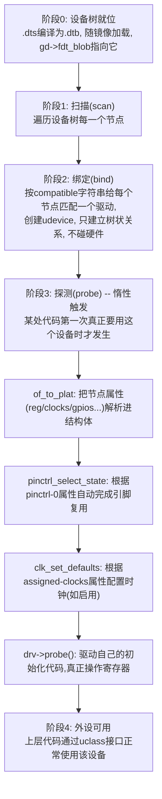
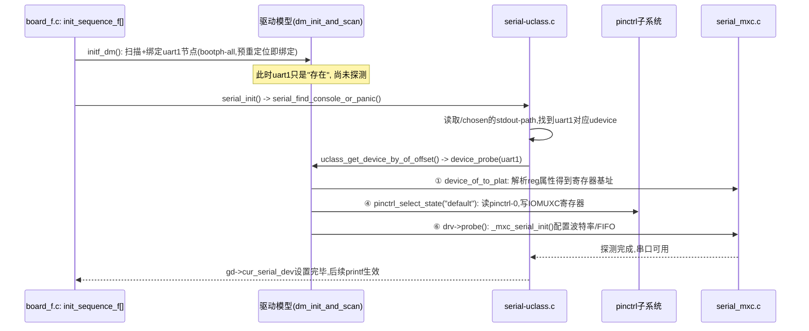
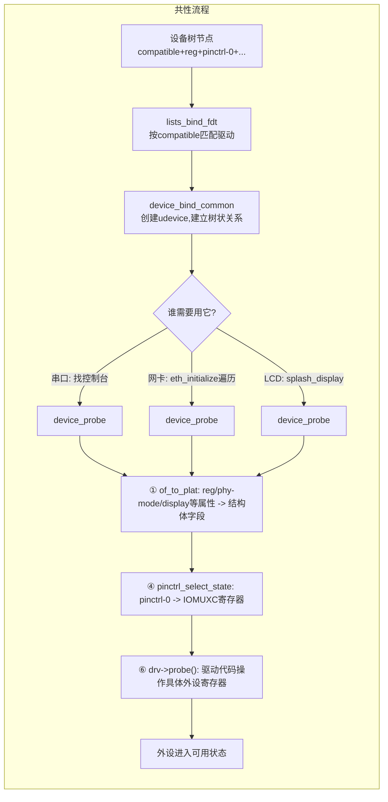

# 1 版本背景与核心变化

## 1.1 分析对象

本章分析的源码是 U-Boot **2024.04** 版本（LF_v2024.04，NXP 官方 `uboot-imx` 分支），源码路径为 `\\wsl.localhost\Ubuntu\home\tf\linux\imux6ll\uboot\uboot-imx`，对应单板配置为 `configs/mx6ull_alientek_emmc_defconfig`（正点原子 i.MX6ULL 板卡，对应 [04_uboot启动流程分析.md](<C:/Users/h564659/Desktop/L/Linux/002_notes/002_Linux移植/uboot/04_uboot启动流程分析.md>) 中分析的同一款硬件），设备树为 `arch/arm/dts/imx6ull-14x14-evk-emmc.dts`。这份 defconfig 与 [04_uboot启动流程分析.md](<C:/Users/h564659/Desktop/L/Linux/002_notes/002_Linux移植/uboot/04_uboot启动流程分析.md>) 第 8 章分析的 2016.03 版本 defconfig 出自同一片 SoC、同一块板子，因此本章大量内容会以"新旧对照"的方式展开，帮助理解 U-Boot 从"纯 C 代码手工初始化外设"演进到"设备树驱动一切"这一核心变化。

## 1.2 新旧模型的本质差异

[04_uboot启动流程分析.md](<C:/Users/h564659/Desktop/L/Linux/002_notes/002_Linux移植/uboot/04_uboot启动流程分析.md>) 第 8 章分析的 2016.03 版本 `mx6ullevk.c` 中，`board_early_init_f()`、`board_init()` 里包含大量形如下面的手工代码：

```c
/* 2016.03 版本：手工调用 IOMUX 设置函数，手工列出引脚数组 */
int board_early_init_f(void)
{
	imx_iomux_v3_setup_multiple_pads(lcd_backlight_pads, ARRAY_SIZE(lcd_backlight_pads));
	gpio_direction_output(IMX_GPIO_NR(1, 8), 0);
	setup_iomux_uart();
	return 0;
}
```

而在 2024.04 版本的同一块板子上，`board/freescale/mx6ullevk/mx6ullevk.c` 里对应的函数变成了：

```c
/* 2024.04 版本：board_early_init_f 已经不再手工配置串口引脚 */
int board_early_init_f(void)
{
	return 0;
}
```

`setup_iomux_uart()`、LED/IO 扩展芯片/I2C/USB 的引脚复用代码全部消失了，`board_init()` 里也只剩下 `setup_fec()`（网卡时钟选择，涉及 SoC 级模拟锁相环，devicetree 里没有建模）、QSPI、NAND 这几项**设备树覆盖不到或不适合覆盖的**收尾逻辑。这不是代码被删掉了、功能缺失了，而是这些工作被转移到了一套通用机制里自动完成——**驱动模型（Driver Model，简称 DM）+ 设备树（Device Tree，简称 DT）**。本章要讲清楚的，正是这套机制具体是如何把"设备树里的一段描述文本"转换成"引脚被正确复用、寄存器被正确写入、外设真正可用"这一整个过程。

## 1.3 总体框架：从设备树到可用外设的转换分几步

在深入代码细节之前，先建立一个整体框架。设备树本身只是一段静态的、纯文本式的描述数据（编译后是 `.dtb` 二进制），它自己不会做任何事情；把这段描述数据转换为"可以调用的、能操作硬件的外设"，需要经过下面四个阶段：



- **阶段0（就位）**：编译期，板级 `.dts` 描述了这块板子有哪些外设、接在哪个地址、用哪个引脚，`dtc` 编译器把它翻译成二进制 `.dtb`；U-Boot 启动后通过 `fdtdec_setup()` 找到这份 `.dtb`，记录到全局数据 `gd->fdt_blob`，后续所有设备树相关操作都基于这个指针展开。
- **阶段1（扫描）+ 阶段2（绑定）**：这是"轻量级"的一步，U-Boot 递归遍历设备树的每一个节点，只要节点被标记为可用（`status = "okay"` 或未写 `status`），就尝试给它匹配一个驱动，创建一个 `struct udevice` 实例并挂到设备树对应的树形结构里——**这一步不会读写任何硬件寄存器**，纯粹是在内存里建立"这个节点应该由哪个驱动管"这层软件关系。
- **阶段3（探测）**：这是真正"把描述转换为资源"的一步，只有在某处代码第一次真正需要使用这个设备时才会触发（"惰性"，lazy），依次完成：解析设备树属性为 C 结构体字段（`of_to_plat`）、根据 `pinctrl-0` 属性自动完成引脚复用（这是取代 2016 版本手工 `imx_iomux_v3_setup_multiple_pads()` 的核心机制）、根据 `assigned-clocks` 属性配置时钟树（如果启用了对应框架）、最后调用驱动自己写的 `probe()` 函数去操作具体外设寄存器。
- **阶段4（可用）**：探测完成后，设备进入"已激活"状态，上层代码（命令行、其它驱动）可以通过统一的 `uclass_xxx` 接口拿到这个设备并正常使用。

后续第 2、3 章分别详细展开"设备树如何被读入并扫描/绑定"和"探测阶段的通用生命周期"，第 4~6 章以串口、LCD 显示、以太网三个具体外设为例，逐行对照真实源码走一遍这套流程。

# 2 设备树的读入与扫描绑定

## 2.1 fdtdec_setup：找到并确认这份设备树

`common/board_f.c` 的 `init_sequence_f[]` 中，`fdtdec_setup` 是第一阶段初始化里较早执行的一步：

```c
static const init_fnc_t init_sequence_f[] = {
	setup_mon_len,
#ifdef CONFIG_OF_CONTROL
	fdtdec_setup,
#endif
	...
	initf_dm,
	...
};
```

`lib/fdtdec.c` 中的 `fdtdec_setup()` 依次尝试几种可能的设备树来源：

```c
int fdtdec_setup(void)
{
	int ret = -ENOENT;

	if (CONFIG_IS_ENABLED(BLOBLIST)) {
		ret = bloblist_maybe_init();
		if (!ret) {
			gd->fdt_blob = bloblist_find(BLOBLISTT_CONTROL_FDT, 0);
			...
		}
	}

	if (ret) {
		if (IS_ENABLED(CONFIG_OF_SEPARATE)) {
			gd->fdt_blob = fdt_find_separate();
			gd->fdt_src = FDTSRC_SEPARATE;
		} else { /* embed dtb in ELF file for testing / development */
			gd->fdt_blob = dtb_dt_embedded();
			gd->fdt_src = FDTSRC_EMBED;
		}
	}
	...
}
```

`mx6ull_alientek_emmc_defconfig` 既未启用 `CONFIG_OF_SEPARATE`，也没有走 bloblist 分支，因此落到 `dtb_dt_embedded()` 路径——设备树在编译阶段就被内嵌进了 U-Boot 镜像本身（对应 `CONFIG_DEFAULT_DEVICE_TREE="imx6ull-14x14-evk-emmc"` 编译出的 `.dtb`），`gd->fdt_blob` 指向这段内嵌的二进制数据。此后整个 U-Boot 运行期间，**所有涉及设备树的操作都通过 `gd->fdt_blob`（或其上层封装 `ofnode`）访问，不再需要用户关心它具体存放在哪个物理地址**。

## 2.2 ofnode：屏蔽"扁平树"与"实时树"差异的统一接口

U-Boot 内部实际存在两种设备树的内存表示形式：

- **扁平设备树（flat tree）**：直接在 `.dtb` 的二进制格式上用 `fdt_xxx()` 系列函数（libfdt）做偏移量计算来访问，节省内存但每次查找都要重新扫描二进制结构。
- **实时设备树（live tree，`CONFIG_OF_LIVE`）**：启动后把 `.dtb` 完整展开成一棵由 `struct device_node`/`struct property` 构成的、类似 Linux 内核风格的链表树，访问速度更快，但需要额外内存和展开时间。

为了让上层驱动代码不必关心底层到底用的是哪一种表示，U-Boot 引入了 `ofnode` 这一层统一的节点句柄类型，`ofnode_xxx()`/`dev_read_xxx()` 系列函数内部会根据 `CONFIG_OF_LIVE` 是否开启，自动分派到扁平树或实时树各自的实现。本章后续所有涉及"读取某个属性"的代码（如 `dev_read_addr()`、`ofnode_read_u32()`）都是通过这层接口完成的，具体走哪条路径对驱动作者是透明的。

## 2.3 dm_init_and_scan：两次扫描，衔接重定位前后

[04_uboot启动流程分析.md](<C:/Users/h564659/Desktop/L/Linux/002_notes/002_Linux移植/uboot/04_uboot启动流程分析.md>) 已经详细讲过 U-Boot 的启动分为 `board_init_f`（重定位前）与 `board_init_r`（重定位后）两个阶段。设备树的扫描绑定也完全对应这个两阶段模型，在两处各执行一次：

**第一次（`board_init_f` 阶段）**：`common/board_f.c` 的 `initf_dm()`：

```c
static int initf_dm(void)
{
#if defined(CONFIG_DM) && CONFIG_IS_ENABLED(SYS_MALLOC_F)
	int ret;

	ret = dm_init_and_scan(true);
	...
#endif
	return 0;
}
```

**第二次（`board_init_r` 阶段）**：`common/board_r.c` 的 `initr_dm()`：

```c
static int initr_dm(void)
{
	int ret;

	oftree_reset();

	/* Save the pre-reloc driver model and start a new one */
	gd->dm_root_f = gd->dm_root;
	gd->dm_root = NULL;

	ret = dm_init_and_scan(false);
	...
	return 0;
}
```

两次调用的关键区别在于传入的 `pre_reloc_only` 参数：第一次传 `true`，第二次传 `false`。`initr_dm()` 里还有一个容易被忽略但很关键的动作：**把重定位前建立的整棵驱动模型树（`gd->dm_root`）保存到 `gd->dm_root_f` 后直接丢弃（`gd->dm_root = NULL`），重新执行一遍完整扫描**——这意味着重定位前绑定的那些设备实例，重定位后并不会被"继承"或"平移"，而是在新的内存空间里重新绑定一份完整的。这是设备树驱动模型版本的"重定位"应对方式：与其像 2016 版本那样把少量全局变量、函数指针小心翼翼地做地址修正，不如干脆重新跑一遍代价不高的扫描绑定过程，简单可靠。

## 2.4 dm_scan_fdt_node：递归遍历设备树节点

`drivers/core/root.c` 中的 `dm_scan_fdt_node()` 是真正执行遍历动作的函数：

```c
static int dm_scan_fdt_node(struct udevice *parent, ofnode parent_node,
			    bool pre_reloc_only)
{
	int ret = 0, err = 0;
	ofnode node;

	if (!ofnode_valid(parent_node))
		return 0;

	for (node = ofnode_first_subnode(parent_node);
	     ofnode_valid(node);
	     node = ofnode_next_subnode(node)) {
		const char *node_name = ofnode_get_name(node);

		if (!ofnode_is_enabled(node)) {
			pr_debug("   - ignoring disabled device\n");
			continue;
		}
		err = lists_bind_fdt(parent, node, NULL, NULL, pre_reloc_only);
		...
	}
	...
}
```

逻辑很直白：对 `parent_node` 下的每一个直接子节点，先检查 `ofnode_is_enabled()`（对应设备树里的 `status` 属性，值为 `"disabled"` 的节点会被直接跳过，例如第 3 章 UART2 若 `status = "disabled"` 就不会被绑定），确认可用后调用 `lists_bind_fdt()` 尝试绑定驱动。整棵设备树是从根节点开始逐层递归的（`dm_scan_fdt()` 以 `ofnode_root()` 为起点调用本函数，本函数内部对每个子节点又会被上层递归调用处理其子树），因此设备树里定义的父子总线层级关系，会被完整映射为 U-Boot 内部 `udevice` 之间的父子关系。

`pre_reloc_only` 参数的作用体现在 `lists_bind_fdt()` 内部（见 2.6 节）：为 `true` 时只绑定被标记为"重定位前需要"的节点，为 `false` 时绑定全部节点——这正是 2.3 节两次扫描分别传入 `true`/`false` 的原因。

## 2.5 dm_extended_scan：设备树里还有几个"特殊角落"

```c
int dm_extended_scan(bool pre_reloc_only)
{
	int ret, i;
	const char * const nodes[] = {
		"/chosen",
		"/clocks",
		"/firmware"
	};

	ret = dm_scan_fdt(pre_reloc_only);
	...
	for (i = 0; i < ARRAY_SIZE(nodes); i++) {
		ret = dm_scan_fdt_ofnode_path(nodes[i], pre_reloc_only);
		...
	}
	return ret;
}
```

除了从根节点开始的常规遍历外，`/chosen`、`/clocks`、`/firmware` 这几个路径需要被单独再扫描一次——这些节点本身不是总线的子设备，而是设备树规范里的"特殊容器"节点，其下也可能挂着需要绑定驱动的子节点（例如某些固定时钟 `fixed-clock` 就声明在 `/clocks` 下面），因此需要额外处理。

## 2.6 lists_bind_fdt：compatible 字符串匹配算法

`drivers/core/lists.c` 中的 `lists_bind_fdt()` 是整个绑定机制的核心，它要解决的问题是："给定一个设备树节点，如何从 U-Boot 编译进去的所有驱动里，找到与它匹配的那一个？"匹配的依据就是设备树节点的 `compatible` 属性与驱动声明的 `of_match` 表：

```c
int lists_bind_fdt(struct udevice *parent, ofnode node, struct udevice **devp,
		   struct driver *drv, bool pre_reloc_only)
{
	struct driver *driver = ll_entry_start(struct driver, driver);
	const int n_ents = ll_entry_count(struct driver, driver);
	...
	compat_list = ofnode_get_property(node, "compatible", &compat_length);
	...

	/*
	 * Walk through the compatible string list, attempting to match each
	 * compatible string in order such that we match in order of priority
	 * from the first string to the last.
	 */
	for (i = 0; i < compat_length; i += strlen(compat) + 1) {
		compat = compat_list + i;

		id = NULL;
		for (entry = driver; entry != driver + n_ents; entry++) {
			ret = driver_check_compatible(entry->of_match, &id, compat);
			if (!ret)
				break;
		}
		if (entry == driver + n_ents)
			continue;

		if (pre_reloc_only) {
			if (!ofnode_pre_reloc(node) &&
			    !(entry->flags & DM_FLAG_PRE_RELOC)) {
				return 0;
			}
		}

		ret = device_bind_with_driver_data(parent, entry, name,
						   id ? id->data : 0, node, &dev);
		...
		break;
	}
	...
}
```

关键要点：

- `ll_entry_start(struct driver, driver)`／`ll_entry_count(...)` 是 U-Boot 的"链接器列表"（linker list）机制，所有用 `U_BOOT_DRIVER(xxx) = { ... };` 宏声明的驱动结构体，都会被链接器自动收集到一段连续内存区域里，这里通过遍历这段区域拿到"全部已编译进镜像的驱动"。
- **外层循环遍历设备树节点 `compatible` 属性里的每一个字符串**（一个节点可以同时列出多个 compatible 字符串，从最具体到最通用排列），**内层循环遍历全部驱动**，对每个驱动调用 `driver_check_compatible()` 逐一比对它的 `of_match` 表。只要某个 compatible 字符串命中了某个驱动的 `of_match` 表项，就立即停止匹配、执行绑定。
- 这个"外层节点字符串优先、内层驱动次之"的顺序，解释了一个容易让人疑惑的现象——第 5 章会看到 LCDIF 节点的 `compatible = "fsl,imx6ul-lcdif", "fsl,imx28-lcdif";` 中，第一个字符串 `"fsl,imx6ul-lcdif"` 在任何驱动的 `of_match` 表里都找不到匹配，但代码不会就此放弃，而是继续尝试第二个字符串 `"fsl,imx28-lcdif"`，这个字符串命中了 `mxs_video` 驱动的 `of_match` 表，于是绑定成功。这是设备树 compatible 属性"多级兼容性回退"设计的直接体现：不同代际的芯片只要寄存器布局兼容，新芯片就可以直接复用老芯片的驱动，不需要重新造轮子。
- `pre_reloc_only` 在这里被真正使用：如果为 `true` 且这个节点既没有被标记为 `bootph-all`（见 2.7 节），驱动本身也没有声明 `DM_FLAG_PRE_RELOC` 标志，就直接放弃这次绑定（`return 0`，不算错误，只是这个节点这一轮先不处理，等第二次全量扫描时再处理）。
- `device_bind_with_driver_data()` 才是真正创建 `udevice` 实例的地方（见 2.8 节）。

## 2.7 bootph-all：告诉扫描器"这个节点提前需要"

2016 版本的老代码里，某些板级 `.dts` 会看到 `u-boot,dm-pre-reloc;` 这样的属性；2024.04 版本已经把这套标记体系升级为更细粒度的 `bootph-*` 属性族。以 `arch/arm/dts/imx6ull-14x14-evk-u-boot.dtsi` 为例：

```dts
&pinctrl_uart1 {
	bootph-all;
};

&rngb {
	bootph-all;
};
```

`bootph-all` 表示"这个节点在启动的所有阶段（含重定位之前）都需要被绑定"。`drivers/core/ofnode.c` 中的 `ofnode_pre_reloc()` 正是读取这一属性来做判断的：

```c
bool ofnode_pre_reloc(ofnode node)
{
	if (ofnode_read_bool(node, "bootph-all"))
		return true;
	if (ofnode_read_bool(node, "bootph-some-ram"))
		return true;

	if (ofnode_read_bool(node, "bootph-pre-ram") ||
	    ofnode_read_bool(node, "bootph-pre-sram"))
		return gd->flags & GD_FLG_RELOC;
	...
}
```

`pinctrl_uart1` 这个引脚配置子节点被标记了 `bootph-all`，意味着即便在重定位之前的第一次扫描（`pre_reloc_only=true`）中，它也会被正常绑定——这是因为串口控制台需要在重定位之前就能打印信息（对照 [04_uboot启动流程分析.md](<C:/Users/h564659/Desktop/L/Linux/002_notes/002_Linux移植/uboot/04_uboot启动流程分析.md>) 第 4.3 节"为什么刚上电不久就能看到串口打印"），要让重定位前的串口驱动正常工作，与它配套的引脚配置节点自然也必须提前可用。

## 2.8 device_bind_with_driver_data：绑定阶段真正创建了什么

`drivers/core/device.c` 中 `device_bind_common()`（被 `device_bind_with_driver_data()` 调用）的核心动作：

```c
static int device_bind_common(struct udevice *parent, const struct driver *drv,
			      const char *name, void *plat,
			      ulong driver_data, ofnode node,
			      uint of_plat_size, struct udevice **devp)
{
	struct udevice *dev;
	...
	dev = calloc(1, sizeof(struct udevice));
	...
	dev_set_plat(dev, plat);
	dev->driver_data = driver_data;
	dev->name = name;
	dev_set_ofnode(dev, node);
	dev->parent = parent;
	dev->driver = drv;
	dev->uclass = uc;
	...
}
```

绑定阶段做的事情可以归纳为一句话：**在内存里分配一个 `struct udevice`，把它与"匹配到的驱动"（`dev->driver`）、"对应的设备树节点"（`dev->node`，通过 `dev_set_ofnode` 设置）、"父设备"（`dev->parent`）、"所属 uclass"（`dev->uclass`）这几项关系记录下来，此外不做任何寄存器读写**。这正是第 1.3 节强调的"绑定是轻量级的"——设备树里哪怕描述了几十个外设节点，只要它们在这一轮扫描中匹配到了驱动，就都会各自拿到一个 `udevice` 结构体，但只要没人真正去使用它们，它们的 `probe()` 函数就永远不会被调用，对应的硬件寄存器也就永远不会被触碰。这一设计避免了"设备树里存在但当前用不上的外设也要被强制初始化"的浪费。

# 3 探测（probe）阶段的通用生命周期

## 3.1 惰性探测：谁来触发 probe

绑定阶段结束后，`udevice` 只是"存在"，并不代表"可用"。真正让设备从"存在"变为"可用"的 `device_probe()` 调用，几乎全部是通过 `uclass_get_device()`/`uclass_first_device()`/`uclass_get_device_by_seq()` 等一系列 `uclass_xxx` 接口函数间接触发的。`drivers/core/uclass.c` 中的 `uclass_get_device_tail()` 是这些接口的共同收口点：

```c
int uclass_get_device_tail(struct udevice *dev, int ret, struct udevice **devp)
{
	if (ret)
		return ret;

	assert(dev);
	ret = device_probe(dev);
	if (ret)
		return ret;

	*devp = dev;

	return 0;
}
```

也就是说，任何驱动或上层代码只要调用了 `uclass_get_device(UCLASS_XXX, index, &dev)` 这一类函数去"要一个设备"，就会自动触发该设备的探测（如果尚未探测过）。第 4~6 章会具体展示：串口是被"寻找控制台"的代码触发，网卡是被 `eth_initialize()` 遍历触发，LCD 是被 `splash_display()` 间接触发——**没有一处需要单板代码手动调用 `xxx_probe()`**，这与 2016 版本板级文件里遍布的手工调用形成鲜明对比。

## 3.2 device_probe：探测的完整生命周期

`drivers/core/device.c` 中的 `device_probe()` 是整个转换过程里信息量最大的一个函数，完整节选如下：

```c
int device_probe(struct udevice *dev)
{
	const struct driver *drv;
	int ret;

	if (dev_get_flags(dev) & DM_FLAG_ACTIVATED)
		return 0;                              /* 已经探测过，直接返回 */

	ret = device_notify(dev, EVT_DM_PRE_PROBE);
	drv = dev->driver;

	ret = device_of_to_plat(dev);                  /* ① 解析设备树属性 */

	/* Ensure all parents are probed */
	if (dev->parent) {
		ret = device_probe(dev->parent);       /* ② 递归探测父设备 */
		if (dev_get_flags(dev) & DM_FLAG_ACTIVATED)
			return 0;
	}

	dev_or_flags(dev, DM_FLAG_ACTIVATED);

	if (CONFIG_IS_ENABLED(POWER_DOMAIN) && ...)
		ret = dev_power_domain_on(dev);        /* ③ 电源域开启（若启用） */

	if (dev->parent && device_get_uclass_id(dev) != UCLASS_PINCTRL) {
		ret = pinctrl_select_state(dev, "default"); /* ④ 引脚复用！ */
	}

	if (CONFIG_IS_ENABLED(IOMMU) && ...)
		ret = dev_iommu_enable(dev);

	ret = device_get_dma_constraints(dev);

	ret = uclass_pre_probe_device(dev);

	if (dev->parent && dev->parent->driver->child_pre_probe)
		ret = dev->parent->driver->child_pre_probe(dev);

	if (dev_has_ofnode(dev) && !(dev->driver->flags & DM_FLAG_IGNORE_DEFAULT_CLKS)) {
		ret = clk_set_defaults(dev, CLK_DEFAULTS_PRE); /* ⑤ 时钟默认值 */
	}

	if (drv->probe) {
		ret = drv->probe(dev);                 /* ⑥ 驱动自己的 probe */
	}

	ret = uclass_post_probe_device(dev);

	ret = device_notify(dev, EVT_DM_POST_PROBE);

	return 0;
	...
}
```

按执行顺序逐项说明：

- **① `device_of_to_plat(dev)`**：调用驱动的 `of_to_plat` 回调（如果驱动定义了这个回调），把设备树节点里的属性（`reg`、`clocks`、`gpios` 等）解析出来，填进这个设备专属的一份"平台数据"结构体（`dev_get_plat(dev)`）。这一步是"把设备树文本转换为 C 结构体字段"的关键步骤，第 4~6 章每个驱动的 `xxx_of_to_plat()` 函数就是做这件事。
- **② 递归探测父设备**：`device_probe(dev->parent)`——任何设备被探测之前，必须先确保它的父设备（总线/控制器）已经探测完成。例如 LCD 显示的父设备链条最终会牵涉到 `iomuxc` 引脚控制器，串口/网卡的父设备通常是根总线，这一递归保证了整棵驱动树是**自底向上、按依赖顺序**逐级激活的，不会出现子设备先于总线控制器初始化的乱序问题。
- **③ 电源域**：若芯片/配置启用了电源域管理（本板未启用），在这里打开对应电源域。
- **④ `pinctrl_select_state(dev, "default")`——这是本章最核心的一步**：自动读取设备树里的 `pinctrl-names`/`pinctrl-0` 属性，把对应的引脚复用配置写入 IOMUXC 寄存器。这正是取代 2016 版本手工 `imx_iomux_v3_setup_multiple_pads()` 调用的机制，详见第 3.3 节。
- **⑤ `clk_set_defaults(dev, CLK_DEFAULTS_PRE)`**：处理设备树里的 `assigned-clocks`/`assigned-clock-rates` 属性（若启用了 `CONFIG_CLK` 时钟框架），在驱动 `probe()` 真正运行前把相关时钟设置为设备树里声明的默认频率/父时钟。本文分析的这块板子未启用 `CONFIG_CLK`，因此这一步对本文三个案例实际不生效，具体外设的时钟使能仍由架构相关的直接寄存器代码完成（详见第 6.6 节的对比说明）。
- **⑥ `drv->probe(dev)`**：终于轮到驱动自己写的初始化代码登场，这才是真正去读写该外设专属寄存器、让硬件进入工作状态的一步。

## 3.3 pinctrl_select_state：设备树属性转换为 IOMUXC 寄存器写入

`drivers/pinctrl/pinctrl-uclass.c` 中的 `pinctrl_select_state_full()` 完成"从 `pinctrl-0` 属性到具体寄存器动作"的转换：

```c
static int pinctrl_select_state_full(struct udevice *dev, const char *statename)
{
	char propname[32];
	const fdt32_t *list;
	uint32_t phandle;
	struct udevice *config;
	int state, size, i, ret;

	state = dev_read_stringlist_search(dev, "pinctrl-names", statename);
	...
	snprintf(propname, sizeof(propname), "pinctrl-%d", state);
	list = dev_read_prop(dev, propname, &size);
	...
	size /= sizeof(*list);
	for (i = 0; i < size; i++) {
		phandle = fdt32_to_cpu(*list++);
		ret = uclass_get_device_by_phandle_id(UCLASS_PINCONFIG, phandle, &config);
		...
		ret = pinctrl_config_one(config);
		...
	}
	return 0;
}
```

处理流程：

1. 在待探测设备（例如 `uart1`）的 `pinctrl-names` 属性里查找 `"default"` 这个状态名对应的索引 `state`（通常是 0）。
2. 拼出属性名 `pinctrl-0`，读取它的值——这是一个 **phandle（设备树里"指向另一个节点"的引用句柄）列表**，对应设备树里 `pinctrl-0 = <&pinctrl_uart1>;` 这样的写法。
3. 对列表里的每个 phandle，通过 `uclass_get_device_by_phandle_id()` 找到（并顺带触发探测）它所指向的 `UCLASS_PINCONFIG` 类型设备——也就是设备树里 `pinctrl_uart1: uart1grp { fsl,pins = <...>; };` 这个子节点本身也被绑定成了一个 `udevice`。
4. 调用 `pinctrl_config_one(config)` 真正应用这份配置。

```c
static int pinctrl_config_one(struct udevice *config)
{
	struct udevice *pctldev;
	const struct pinctrl_ops *ops;

	pctldev = config;
	for (;;) {
		pctldev = dev_get_parent(pctldev);
		if (!pctldev)
			return -EINVAL;
		if (pctldev->uclass->uc_drv->id == UCLASS_PINCTRL)
			break;
	}

	ops = pinctrl_get_ops(pctldev);
	return ops->set_state(pctldev, config);
}
```

`pinctrl_config_one()` 沿着父设备链一路向上找到真正的引脚控制器（`iomuxc` 节点对应的 `udevice`，其 uclass 是 `UCLASS_PINCTRL`），调用它的 `set_state()` 回调。i.MX 系列的实现在 `drivers/pinctrl/nxp/pinctrl-imx.c` 的 `imx_pinctrl_set_state()` 里，逐个解析 `fsl,pins` 属性（一个按 `(mux_reg, conf_reg, input_reg, mux_mode, input_val, config_val)` 六元组打平的数组，与 Linux 内核 i.MX pinctrl 绑定文档完全一致的格式），对每一组直接执行：

```c
/* 设置复用模式 */
writel(mux_mode, info->base + mux_reg);
/* 设置输入选择寄存器（如需要） */
writel(input_val, info->base + input_reg);
/* 设置电气特性配置（上下拉、驱动强度等） */
writel(config_val, info->base + conf_reg);
```

这三行 `writel` 直接对应 2016 版本 `imx_iomux_v3_setup_pad()` 里手写的寄存器操作，只不过驱动此刻不再需要在 C 代码里罗列 `MX6_PAD_UART1_TX_DATA__UART1_DCE_TX` 这类宏，而是从设备树节点解析出等价的数值。至此，"设备树里一段 `pinctrl-0 = <&pinctrl_uart1>;` 描述"就被完整转换成了"IOMUXC 寄存器被正确写入"这一实际硬件效果，而且这一切都发生在 `device_probe()` 内部、驱动自身的 `probe()` 函数被调用**之前**——这正是为什么第 4~6 章看到的各驱动 `probe()` 函数本身完全不包含任何引脚配置代码的原因。

# 4 案例一：UART 串口（serial_mxc.c）

## 4.1 设备树描述

`arch/arm/dts/imx6ul.dtsi` 中 `uart1` 节点的基础定义：

```dts
uart1: serial@2020000 {
	compatible = "fsl,imx6ul-uart", "fsl,imx6q-uart";
	reg = <0x02020000 0x4000>;
	interrupts = <GIC_SPI 26 IRQ_TYPE_LEVEL_HIGH>;
	clocks = <&clks IMX6UL_CLK_UART1_IPG>, <&clks IMX6UL_CLK_UART1_SERIAL>;
	clock-names = "ipg", "per";
	status = "disabled";
};
```

板级 `arch/arm/dts/imx6ul-14x14-evk.dtsi` 覆盖启用：

```dts
&uart1 {
	pinctrl-names = "default";
	pinctrl-0 = <&pinctrl_uart1>;
	status = "okay";
};
```

对应的引脚配置子节点：

```dts
pinctrl_uart1: uart1grp {
	fsl,pins = <
		MX6UL_PAD_UART1_TX_DATA__UART1_DCE_TX 0x1b0b1
		MX6UL_PAD_UART1_RX_DATA__UART1_DCE_RX 0x1b0b1
	>;
};
```

顶层 `arch/arm/dts/imx6ul-14x14-evk.dtsi` 还在 `/chosen` 节点里指定了控制台：

```dts
chosen {
	stdout-path = &uart1;
};
```

## 4.2 驱动侧：兼容性匹配与结构定义

`drivers/serial/serial_mxc.c` 中的驱动声明：

```c
static const struct udevice_id mxc_serial_ids[] = {
	{ .compatible = "fsl,imx21-uart" },
	{ .compatible = "fsl,imx53-uart" },
	{ .compatible = "fsl,imx6sx-uart" },
	{ .compatible = "fsl,imx6ul-uart" },
	{ .compatible = "fsl,imx7d-uart" },
	{ .compatible = "fsl,imx6q-uart" },
	{ }
};

U_BOOT_DRIVER(serial_mxc) = {
	.name	= "serial_mxc",
	.id	= UCLASS_SERIAL,
	.of_match = mxc_serial_ids,
	.of_to_plat = mxc_serial_of_to_plat,
	.plat_auto	= sizeof(struct mxc_serial_plat),
	.probe = mxc_serial_probe,
	.ops	= &mxc_serial_ops,
	.flags = DM_FLAG_PRE_RELOC,
};
```

`uart1` 节点的 `compatible` 列表第一项 `"fsl,imx6ul-uart"` 就直接命中了 `mxc_serial_ids` 表，第 2.6 节描述的匹配算法在第一轮外层循环就成功，不需要回退到第二个字符串。`.flags = DM_FLAG_PRE_RELOC` 表示这个驱动本身允许在重定位之前被绑定（配合 `pinctrl_uart1` 节点的 `bootph-all` 标记，两者共同保证了串口能在第一次预重定位扫描中就绪）。

## 4.3 of_to_plat：把 reg 属性解析为寄存器基址

```c
static int mxc_serial_of_to_plat(struct udevice *dev)
{
	struct mxc_serial_plat *plat = dev_get_plat(dev);
	fdt_addr_t addr;

	addr = dev_read_addr(dev);
	if (addr == FDT_ADDR_T_NONE)
		return -EINVAL;

	plat->reg = (struct mxc_uart *)addr;

	plat->use_dte = fdtdec_get_bool(gd->fdt_blob, dev_of_offset(dev),
					"fsl,dte-mode");
	return 0;
}
```

`dev_read_addr(dev)` 内部按第 2.2 节所述的 `ofnode` 统一接口，读取节点的 `reg = <0x02020000 0x4000>;` 属性，返回起始地址 `0x02020000`，直接转换成 `struct mxc_uart *` 指针存进 `plat->reg`——这一步把设备树里的一串十六进制数值，变成了 C 代码里可以直接用 `->` 操作符访问寄存器字段的结构体指针。`fsl,dte-mode` 这个可选属性（决定串口工作在 DCE 还是 DTE 模式）同样被解析进 `plat->use_dte`。

## 4.4 probe：真正初始化 UART 硬件

```c
static int mxc_serial_probe(struct udevice *dev)
{
	struct mxc_serial_plat *plat = dev_get_plat(dev);

	_mxc_serial_init(plat->reg, plat->use_dte);

	return 0;
}
```

`probe()` 函数本身极其简短，直接把 `of_to_plat` 阶段解析好的寄存器基址交给 `_mxc_serial_init()` 完成波特率发生器、FIFO、收发使能等寄存器配置。**注意这个函数完全不包含任何引脚复用代码**——`pinctrl_uart1` 的配置早已在 `device_probe()` 第 3.2 节所述的第④步（先于第⑥步 `drv->probe()`）自动完成。

## 4.5 谁触发了这次探测

串口设备的探测由"寻找控制台"这一逻辑触发，`drivers/serial/serial-uclass.c` 中的 `serial_find_console_or_panic()`：

```c
static int serial_check_stdout(const void *blob, struct udevice **devp)
{
	int node = -1;
	const char *str;

	str = fdtdec_get_chosen_prop(blob, "stdout-path");
	...
	node = fdt_path_offset_namelen(blob, str, namelen);
	...
	if (!uclass_get_device_by_of_offset(UCLASS_SERIAL, node, devp))
		return 0;
	...
}
```

这段代码读取 `/chosen` 节点的 `stdout-path` 属性（本板设备树中为 `stdout-path = &uart1;`），解析出对应的设备树偏移量，再调用 `uclass_get_device_by_of_offset()`——这个函数内部最终仍会走到第 3.1 节的 `uclass_get_device_tail()`，从而触发 `device_probe()`。也就是说，**串口是被"设备树里 `/chosen` 节点指定了它是控制台"这一事实驱动着完成探测的**，`serial_init()` 只是在恰当的时机调用了 `serial_find_console_or_panic()`，本身不需要知道具体是哪个 UART 控制器。

## 4.6 与 2016 版本对照

| | 2016.03 版本 | 2024.04 版本 |
| --- | --- | --- |
| 引脚配置代码位置 | `board_early_init_f()` 手工调用 `setup_iomux_uart()` | 无需单板代码，`device_probe()` 自动执行 `pinctrl_select_state()` |
| 寄存器基址来源 | C 代码里硬编码的宏（如 `UART1_BASE`） | 设备树 `reg` 属性，`dev_read_addr()` 解析 |
| 确定哪个是控制台 | 编译期 `CONFIG_CONS_INDEX` 等宏 | 运行期解析设备树 `/chosen/stdout-path` |
| 谁调用初始化函数 | `board_f.c` 数组里的 `serial_init` 直接调用固定函数 | `serial_find_console_or_panic()` 通过 uclass 接口惰性触发 |

## 4.7 时序小结



# 5 案例二：LCD 显示（mxsfb.c / lcdif）

## 5.1 设备树描述

`arch/arm/dts/imx6ul.dtsi` 中 `lcdif` 节点的基础定义：

```dts
lcdif: lcdif@21c8000 {
	compatible = "fsl,imx6ul-lcdif", "fsl,imx28-lcdif";
	reg = <0x021c8000 0x4000>;
	interrupts = <GIC_SPI 5 IRQ_TYPE_LEVEL_HIGH>;
	clocks = <&clks IMX6UL_CLK_LCDIF_PIX>, <&clks IMX6UL_CLK_LCDIF_APB>,
		 <&clks IMX6UL_CLK_DUMMY>;
	clock-names = "pix", "axi", "disp_axi";
	status = "disabled";
};
```

板级 `arch/arm/dts/imx6ul-14x14-evk.dtsi` 覆盖启用，并直接在设备树里描述了显示屏的时序参数：

```dts
&lcdif {
	pinctrl-names = "default";
	pinctrl-0 = <&pinctrl_lcdif_dat &pinctrl_lcdif_ctrl>;
	display = <&display0>;
	status = "okay";

	display0: display@0 {
		bits-per-pixel = <24>;
		bus-width = <24>;

		display-timings {
			native-mode = <&timing0>;

			timing0: timing0 {
				clock-frequency = <31000000>;
				hactive = <800>;
				vactive = <480>;
				hfront-porch = <40>;
				hback-porch = <88>;
				hsync-len = <48>;
				vback-porch = <32>;
				vfront-porch = <13>;
				vsync-len = <3>;
				hsync-active = <0>;
				vsync-active = <0>;
				de-active = <1>;
				pixelclk-active = <0>;
			};
		};
	};
};
```

这里体现出设备树描述硬件的一个重要特点：**不仅描述了控制器本身（LCDIF 寄存器地址），还把这块具体屏幕的电气时序参数（800×480 分辨率、各种消隐时间、24 位色深）也一起写进了设备树**，而不是像 2016 版本那样把这些"魔术数字"硬编码在 C 代码里（对照 [04_uboot启动流程分析.md](<C:/Users/h564659/Desktop/L/Linux/002_notes/002_Linux移植/uboot/04_uboot启动流程分析.md>) 第 8 章 2016 版本 `display_timings` 结构体的写法，二者信息完全对应，只是承载介质从 C 结构体变成了设备树节点）。

## 5.2 驱动侧：一次"降级匹配"的直接例证

`drivers/video/mxsfb.c` 中的驱动声明：

```c
static const struct udevice_id mxs_video_ids[] = {
	{ .compatible = "fsl,imx23-lcdif" },
	{ .compatible = "fsl,imx28-lcdif" },
	{ .compatible = "fsl,imx6sx-lcdif" },
	{ .compatible = "fsl,imx7ulp-lcdif" },
	{ .compatible = "fsl,imxrt-lcdif" },
	{ .compatible = "fsl,imx8mm-lcdif" },
	{ .compatible = "fsl,imx8mn-lcdif" },
	{ /* sentinel */ }
};

U_BOOT_DRIVER(mxs_video) = {
	.name	= "mxs_video",
	.id	= UCLASS_VIDEO,
	.of_match = mxs_video_ids,
	.bind	= mxs_video_bind,
	.probe	= mxs_video_probe,
	.remove = mxs_video_remove,
	.flags	= DM_FLAG_PRE_RELOC | DM_FLAG_OS_PREPARE,
	.priv_auto   = sizeof(struct mxsfb_priv),
};
```

注意 `mxs_video_ids` 表里**并没有** `"fsl,imx6ul-lcdif"` 这一项，而 `lcdif` 节点的 `compatible` 属性是 `"fsl,imx6ul-lcdif", "fsl,imx28-lcdif"` 两项。按照第 2.6 节描述的匹配算法：外层循环第一次尝试 `"fsl,imx6ul-lcdif"`，遍历全部驱动均未命中，`continue` 进入下一次外层循环；第二次尝试 `"fsl,imx28-lcdif"`，命中了 `mxs_video_ids` 表的第二项，匹配成功。这是一个完全真实的"设备树多级兼容性回退"案例：i.MX6UL/ULL 的 LCDIF 控制器在寄存器布局上与更早的 i.MX28 芯片兼容，因此复用同一份驱动，无需为每个新芯片单独编写 LCDIF 驱动代码。

## 5.3 bind：预留帧缓冲区（此时不能读取屏幕参数）

```c
static int mxs_video_bind(struct udevice *dev)
{
	struct video_uc_plat *plat = dev_get_uclass_plat(dev);

	/* Max size supported by LCDIF, because in bind, we can't probe panel */
	plat->size = ALIGN(1920 * 1080 * 4 * 2, MMU_SECTION_SIZE);
	plat->align = MMU_SECTION_SIZE;

	return 0;
}
```

`bind()` 回调是绑定阶段（第 2.8 节）里少数允许驱动自定义的钩子之一，但正如源码注释所说——**绑定阶段发生在探测之前，此时还无法读取真正接入的面板参数**，因此这里只能按最大可能分辨率（1920×1080，32 位色，双缓冲）预留一块足够大的帧缓冲内存，等真正探测时再按需使用其中一部分。这个内存预留会被上层的 `video_reserve()`（第一阶段内存布局机制，与 [04_uboot启动流程分析.md](<C:/Users/h564659/Desktop/L/Linux/002_notes/002_Linux移植/uboot/04_uboot启动流程分析.md>) 第 4.4 节"自顶向下规划内存"完全同源）纳入统一的内存预留序列。

## 5.4 探测阶段：从设备树读取显示参数

```c
static int mxs_of_get_timings(struct udevice *dev,
			      struct display_timing *timings, u32 *bpp)
{
	int ret = 0;
	u32 display_phandle;
	ofnode display_node;

	ret = ofnode_read_u32(dev_ofnode(dev), "display", &display_phandle);
	...
	display_node = ofnode_get_by_phandle(display_phandle);
	...
	ret = ofnode_read_u32(display_node, "bits-per-pixel", bpp);
	...
	ret = ofnode_decode_display_timing(display_node, 0, timings);
	...
	return ret;
}

static int mxs_video_probe(struct udevice *dev)
{
	struct video_uc_plat *plat = dev_get_uclass_plat(dev);
	struct video_priv *uc_priv = dev_get_uclass_priv(dev);
	struct mxsfb_priv *priv = dev_get_priv(dev);
	struct display_timing timings;
	u32 bpp = 0;
	int ret;

	priv->reg_base = dev_read_addr(dev);
	...
	ret = mxs_of_get_timings(dev, &timings, &bpp);
	...
	ret = mxs_probe_common(dev, &timings, bpp, plat->base, enable_bridge);
	...
	uc_priv->xsize = timings.hactive.typ;
	uc_priv->ysize = timings.vactive.typ;
	...
}
```

这里出现了与串口不同的处理方式：LCDIF 驱动**没有实现 `of_to_plat` 回调**，而是把设备树解析工作直接放在了 `probe()` 函数内部完成。`ofnode_read_u32(dev_ofnode(dev), "display", &display_phandle)` 读取 `display = <&display0>;` 这一 phandle 引用，`ofnode_get_by_phandle()` 顺着这个引用跳转到 `display0` 子节点，再用 `ofnode_decode_display_timing()` 把 `display-timings/timing0` 子节点下的一整套时序属性（`hactive`、`vactive`、`hfront-porch` 等）解析进 `struct display_timing` 结构体——这一过程与第 4 章串口 `dev_read_addr()` 解析 `reg` 属性是完全相同的思路，只是这里读取的是嵌套更深、字段更多的一组属性。

`priv->reg_base = dev_read_addr(dev)` 仍然是从 `lcdif` 节点自身的 `reg` 属性拿到寄存器基址；`mxs_probe_common()` 内部的 `mxs_lcd_init()` 会依据 `timings` 里的分辨率、时序参数，计算出 LCDIF 控制器 `VDCTRL` 等一系列寄存器该填什么值，最终 `writel(LCDIF_CTRL_RUN, &regs->hw_lcdif_ctrl_set);` 让控制器真正开始扫描输出。

## 5.5 谁触发了这次探测

本板配置里 `CONFIG_SYS_CONSOLE_IS_IN_ENV=y`，`common/stdio.c` 的 `stdio_add_devices()` 中：

```c
int stdio_add_devices(void)
{
	...
	if (IS_ENABLED(CONFIG_VIDEO)) {
		...
		if (!IS_ENABLED(CONFIG_SYS_CONSOLE_IS_IN_ENV)) {
			/* 本板此分支不生效，因为 CONFIG_SYS_CONSOLE_IS_IN_ENV=y */
			for (ret = uclass_first_device_check(UCLASS_VIDEO, &vdev); ...)
				;
		}
		if (IS_ENABLED(CONFIG_SPLASH_SCREEN) && IS_ENABLED(CONFIG_CMD_BMP))
			splash_display();
	}
	...
}
```

由于配置里同时启用了 `CONFIG_SPLASH_SCREEN=y` 与 `CONFIG_CMD_BMP=y`，真正触发 LCDIF 探测的是 `splash_display()`（`common/splash.c`），其内部调用：

```c
ret = uclass_get_device(UCLASS_VIDEO_CONSOLE, 0, &dev);
```

`UCLASS_VIDEO_CONSOLE`（虚拟终端）设备是绑定在 `lcdif` 设备之下的子设备，`device_probe()` 第 3.2 节所述的"②递归探测父设备"逻辑，会先把父设备（即 `mxs_video` 对应的 `lcdif` 节点）探测完成，再探测视频终端本身——这正是本例里 `mxs_video_probe()` 被间接调用的真实路径。

## 5.6 与 2016 版本对照

2016 版本的对应代码在单板文件里手工调用（详见 [04_uboot启动流程分析.md](<C:/Users/h564659/Desktop/L/Linux/002_notes/002_Linux移植/uboot/04_uboot启动流程分析.md>) 第 8.3.1、8.3.4 节）：LCD 背光引脚复用写在 `board_early_init_f()`，`display_timings` 时序参数写死在 C 结构体常量里，没有任何"惰性触发"概念——只要 `board_init_f()`/`board_init()` 执行到对应位置，不管后面用不用得上屏幕，配置代码都会执行一遍。

| | 2016.03 版本 | 2024.04 版本 |
| --- | --- | --- |
| 屏幕时序参数存放位置 | C 代码里的 `struct display_timing` 静态初始化 | 设备树 `display-timings` 子节点 |
| 背光/控制引脚复用 | 单板文件手工调用 `imx_iomux_v3_setup_multiple_pads()` | `pinctrl-0` 属性 + 自动 `pinctrl_select_state()` |
| 何时执行初始化 | `board_early_init_f()`/`board_init()` 执行到即触发，与是否用到屏幕无关 | 只有 `splash_display()` 等真正需要显示时才触发探测 |
| 更换屏幕参数的方式 | 修改 C 代码重新编译 | 修改设备树 `display-timings` 节点，理论上无需改动驱动代码 |

# 6 案例三：以太网（fec_mxc.c）

## 6.1 设备树描述

`arch/arm/dts/imx6ul.dtsi` 中 `fec1` 节点：

```dts
fec1: ethernet@2188000 {
	compatible = "fsl,imx6ul-fec", "fsl,imx6q-fec";
	reg = <0x02188000 0x4000>;
	interrupt-names = "int0", "pps";
	interrupts = <GIC_SPI 118 IRQ_TYPE_LEVEL_HIGH>, <GIC_SPI 119 IRQ_TYPE_LEVEL_HIGH>;
	clocks = <&clks IMX6UL_CLK_ENET>, <&clks IMX6UL_CLK_ENET_AHB>,
		 <&clks IMX6UL_CLK_ENET_PTP>, <&clks IMX6UL_CLK_ENET_REF>,
		 <&clks IMX6UL_CLK_ENET_REF>;
	clock-names = "ipg", "ahb", "ptp", "enet_clk_ref", "enet_out";
	fsl,num-tx-queues = <1>;
	fsl,num-rx-queues = <1>;
	fsl,stop-mode = <&gpr 0x10 3>;
	fsl,magic-packet;
	status = "disabled";
};
```

板级 `arch/arm/dts/imx6ul-14x14-evk.dtsi` 覆盖启用（节选）：

```dts
&fec1 {
	pinctrl-names = "default";
	pinctrl-0 = <&pinctrl_enet1>;
	phy-mode = "rmii";
	phy-handle = <&ethphy0>;
	status = "okay";
};
```

`phy-mode`（PHY 接口类型：MII/RMII/RGMII 等）与 `phy-handle`（指向 MDIO 总线上具体 PHY 芯片节点的 phandle）是网卡类设备树节点里两个关键的、区别于普通外设的属性，分别决定了控制器与 PHY 芯片之间用哪种电气协议通信、具体通过哪个 MDIO 地址访问 PHY。

## 6.2 驱动侧：of_to_plat 解析出比串口更丰富的属性

`drivers/net/fec_mxc.c`：

```c
static const struct udevice_id fecmxc_ids[] = {
	{ .compatible = "fsl,imx28-fec" },
	{ .compatible = "fsl,imx6q-fec" },
	{ .compatible = "fsl,imx6sl-fec" },
	{ .compatible = "fsl,imx6sx-fec" },
	{ .compatible = "fsl,imx6ul-fec" },
	...
	{ }
};

static int fecmxc_of_to_plat(struct udevice *dev)
{
	int ret = 0;
	struct eth_pdata *pdata = dev_get_plat(dev);
	struct fec_priv *priv = dev_get_priv(dev);

	pdata->iobase = dev_read_addr(dev);
	priv->eth = (struct ethernet_regs *)pdata->iobase;

	pdata->phy_interface = dev_read_phy_mode(dev);
	if (pdata->phy_interface == PHY_INTERFACE_MODE_NA)
		return -EINVAL;

#ifdef CONFIG_DM_REGULATOR
	device_get_supply_regulator(dev, "phy-supply", &priv->phy_supply);
#endif

#if CONFIG_IS_ENABLED(DM_GPIO)
	ret = gpio_request_by_name(dev, "phy-reset-gpios", 0,
				   &priv->phy_reset_gpio, GPIOD_IS_OUT | GPIOD_IS_OUT_ACTIVE);
	...
#endif

	return 0;
}

U_BOOT_DRIVER(fecmxc_gem) = {
	.name	= "fecmxc",
	.id	= UCLASS_ETH,
	.of_match = fecmxc_ids,
	.of_to_plat = fecmxc_of_to_plat,
	.probe	= fecmxc_probe,
	.remove	= fecmxc_remove,
	.ops	= &fecmxc_ops,
	.priv_auto	= sizeof(struct fec_priv),
	.plat_auto	= sizeof(struct eth_pdata),
};
```

对照第 4 章串口的 `of_to_plat`，网卡这里解析的属性明显更丰富，体现了设备树描述能力的通用性：

- `dev_read_addr(dev)` 解析 `reg` 属性得到寄存器基址，与串口同理。
- `dev_read_phy_mode(dev)` 专门解析 `phy-mode` 属性，转换为内部枚举值 `PHY_INTERFACE_MODE_RMII` 等，供后续代码判断走 MII/RMII/RGMII 中的哪种时序。
- `device_get_supply_regulator(dev, "phy-supply", ...)`——如果设备树里给这个网口的 PHY 芯片声明了供电调节器（regulator，本板未使用此属性，但接口通用支持），会在这里解析并记录，供 `probe()` 阶段决定是否需要先给 PHY 上电。
- `gpio_request_by_name(dev, "phy-reset-gpios", ...)`——如果设备树给 PHY 复位引脚声明了 GPIO（同样是可选属性），在这里申请该 GPIO 资源，为 `probe()` 阶段执行硬件复位序列做准备。

这几个属性全部是**可选的**（`ret < 0` 时函数并不返回错误，而是继续往下走），这是设备树驱动的典型写法：驱动代码要同时兼容"提供了这个资源"和"没有提供这个资源"两种情况，具体某块板子接不接、需不需要，完全由设备树内容决定，不需要用条件编译区分不同板级变体。

## 6.3 probe：时钟、复位、MDIO 总线、PHY 接口类型

```c
static int fecmxc_probe(struct udevice *dev)
{
	struct eth_pdata *pdata = dev_get_plat(dev);
	struct fec_priv *priv = dev_get_priv(dev);
	struct mii_dev *bus = NULL;
	...
	ret = board_interface_eth_init(dev, pdata->phy_interface);
	...
	if (CONFIG_IS_ENABLED(CLK_CCF)) {
		ret = clk_get_by_name(dev, "ipg", &priv->ipg_clk);
		ret = clk_enable(&priv->ipg_clk);
		ret = clk_get_by_name(dev, "ahb", &priv->ahb_clk);
		ret = clk_enable(&priv->ahb_clk);
		...
	}

	ret = fec_alloc_descs(priv);

#ifdef CONFIG_DM_REGULATOR
	if (priv->phy_supply)
		ret = regulator_set_enable_if_allowed(priv->phy_supply, true);
#endif
#if CONFIG_IS_ENABLED(DM_GPIO)
	fec_gpio_reset(priv);
#endif

	/* Reset chip. */
	writel(readl(&priv->eth->ecntrl) | FEC_ECNTRL_RESET, &priv->eth->ecntrl);
	...
	fec_reg_setup(priv);

#ifdef CONFIG_DM_ETH_PHY
	bus = eth_phy_get_mdio_bus(dev);
#endif
	...
	priv->interface = pdata->phy_interface;
	switch (priv->interface) {
	case PHY_INTERFACE_MODE_RMII:
		priv->xcv_type = RMII;
		break;
	...
	}
	...
}
```

`probe()` 里的动作大致按顺序展开：若启用了 `CLK_CCF`（通用时钟框架，本板未启用，故这段不生效，与第 3.2 节⑤的说明一致）则获取并使能 `ipg`/`ahb` 时钟；分配收发描述符环；若解析到了 `phy_supply`/GPIO 复位资源，就先给 PHY 上电、执行复位时序；随后写 `FEC_ECNTRL_RESET` 复位控制器本身寄存器；建立 MDIO 总线（供后续扫描/读写 PHY 寄存器）；最后依据 `of_to_plat` 阶段解析出的 `phy_interface` 值，设置控制器的收发时序模式（`MII100`/`RMII`/`RGMII`）。整个过程里，从"设备树写了什么"到"控制器该按哪种电气模式工作"，是靠 `pdata->phy_interface` 这一个字段串联起来的。

## 6.4 谁触发了这次探测：与 2016 版本手工钩子的直接对比

`net/eth-uclass.c` 中的 `eth_initialize()`：

```c
int eth_initialize(void)
{
	int num_devices = 0;
	struct udevice *dev;

	eth_common_init();

	uclass_first_device_check(UCLASS_ETH, &dev);
	...
	do {
		...
		eth_write_hwaddr(dev);
		...
		uclass_next_device_check(&dev);
	} while (dev);
	...
}
```

`uclass_first_device_check()`/`uclass_next_device_check()` 依次遍历 `UCLASS_ETH` 这个 uclass 下**全部已绑定的网卡设备**（本板设备树里 `fec1`、`fec2` 两个节点都会被绑定，具体哪个 `status = "okay"` 就参与遍历），对每一个都触发一次探测（`uclass_first_device_check` 内部同样走到 `uclass_get_device_tail()` → `device_probe()`）。

对照 [04_uboot启动流程分析.md](<C:/Users/h564659/Desktop/L/Linux/002_notes/002_Linux移植/uboot/04_uboot启动流程分析.md>) 第 8.2.3 节分析过的 2016 版本机制——彼时 `eth_initialize()` 内部的逻辑是"如果单板文件重写了弱符号 `board_eth_init()` 就调用它，否则调用 CPU 通用实现"，只支持一块板子提供一个手工编写的初始化入口；而 2024.04 版本的 `eth_initialize()` **完全不再引用任何 `board_eth_init` 这样的钩子**，转而遍历设备树里绑定出来的全部网卡设备逐一探测——这意味着一块板子上有几个网口、每个网口具体是什么型号的控制器，都由设备树描述决定，`eth_initialize()` 本身的代码不需要因为板子不同而改变一行。这也解释了为什么 2024.04 版本的 `mx6ullevk.c` 里已经找不到 `board_eth_init()`/`board_mmc_init()` 这两个函数的定义（第 1.2 节列出的对比中已提及）。

`drivers/mmc/mmc.c` 里 MMC 子系统的 `mmc_probe()` 在启用 `CONFIG_DM_MMC` 时也是同样的写法：

```c
#if CONFIG_IS_ENABLED(DM_MMC)
static int mmc_probe(struct bd_info *bis)
{
	struct uclass *uc;
	struct udevice *dev;

	uclass_get(UCLASS_MMC, &uc);
	for (i = 0; ; i++) {
		ret = uclass_get_device_by_seq(UCLASS_MMC, i, &dev);
		if (ret == -ENODEV)
			break;
	}
	uclass_foreach_dev(dev, uc) {
		ret = device_probe(dev);
		...
	}
	return 0;
}
#else
static int mmc_probe(struct bd_info *bis)
{
	if (board_mmc_init(bis) < 0)
		cpu_mmc_init(bis);
	return 0;
}
#endif
```

两个分支被同一份源码文件保留了下来，直观地展示了"驱动模型开启前后"两种截然不同的探测方式：`#else` 分支正是 2016 版本一直在用的、依赖单板 `board_mmc_init()` 手工钩子的旧路径；`#if CONFIG_IS_ENABLED(DM_MMC)` 分支则是本文重点分析的、完全由设备树驱动的新路径。本板配置启用了 `CONFIG_FSL_USDHC=y`（对应的 `DM_MMC` 会被自动选中），走的正是新路径。

## 6.5 与 2016 版本对照

| | 2016.03 版本 | 2024.04 版本 |
| --- | --- | --- |
| 网口/MMC控制器的初始化入口 | 单板文件手工实现 `board_eth_init()`/`board_mmc_init()` 弱符号 | 通用代码 `eth_initialize()`/`mmc_probe()` 遍历 uclass 下全部已绑定设备 |
| 增加一个网口/一路 MMC 的方式 | 修改单板 C 文件，增加对应的初始化调用 | 在设备树里增加一个 `status = "okay"` 的节点 |
| PHY 接口类型（RMII/RGMII等） | C 代码里硬编码 | 设备树 `phy-mode` 属性，`dev_read_phy_mode()` 解析 |
| PHY 复位/供电 | 单板代码手工控制 GPIO/电源 | 设备树 `phy-reset-gpios`/`phy-supply` 可选属性，驱动通用代码统一处理 |

# 7 三个案例的共性总结

## 7.1 统一的转换路径

尽管 UART、LCD、以太网三者在硬件行为上截然不同，但它们在 U-Boot 驱动模型下走过的转换路径高度一致，均严格遵循第 1.3 节给出的框架：



## 7.2 三个案例的差异点小结

| 维度 | UART (serial_mxc) | LCD (mxsfb) | 以太网 (fec_mxc) |
| --- | --- | --- | --- |
| compatible 匹配方式 | 首选字符串直接命中 | 首选字符串未命中，回退到第二字符串命中 | 首选字符串直接命中 |
| 属性解析位置 | `of_to_plat` 回调 | 直接写在 `probe()` 内（`mxs_of_get_timings`） | `of_to_plat` 回调，字段数量明显更多 |
| 涉及的特殊设备树属性 | `fsl,dte-mode` | `display` phandle + 嵌套 `display-timings` | `phy-mode`、`phy-handle`、可选 `phy-reset-gpios`/`phy-supply` |
| 触发探测的场景 | 寻找控制台（`/chosen/stdout-path`） | 显示 Splash 图片（`splash_display`） | 网络子系统初始化遍历（`eth_initialize`） |
| 与老版本手工钩子的对应关系 | 取代 `setup_iomux_uart()` | 取代 `board_early_init_f()` 里的背光/引脚代码 | 取代 `board_eth_init()`/`board_mmc_init()` 弱符号 |

## 7.3 全文核心结论

设备树驱动模型把"外设初始化"这件事拆解成了两个正交的关注点：**"有什么、接在哪、怎么连"这一硬件描述性信息，全部下沉到设备树里，用统一的属性命名规范（`reg`、`compatible`、`pinctrl-0`、`clocks`、`phy-mode` 等）描述**；**"如何解析这些描述、如何在恰当时机把它们转换成寄存器操作"这一套逻辑，则被收敛进一小撮通用代码里（`lists_bind_fdt`、`device_probe`、`pinctrl_select_state` 等），只需实现一次，被所有驱动、所有单板复用**。这正是 [04_uboot启动流程分析.md](<C:/Users/h564659/Desktop/L/Linux/002_notes/002_Linux移植/uboot/04_uboot启动流程分析.md>) 第 8 章里 2016 版本单板文件充斥着手工 IOMUX 数组、手工寄存器操作，而 2024.04 版本同一块板子的单板文件却"瘦身"到只剩寥寥数十行的根本原因：**不是功能变少了，而是原本分散在每一块单板 C 文件里的重复劳动，被统一收编进了"设备树描述 + 驱动模型解析"这一套可复用的机制中**。理解了绑定（bind，建立树状关系）与探测（probe，惰性触发、转换为硬件动作）这两个阶段的分工，以及 `of_to_plat`→`pinctrl_select_state`→`drv->probe()` 这一固定顺序，就掌握了阅读任何一个新版本 U-Boot 外设驱动源码的钥匙。
