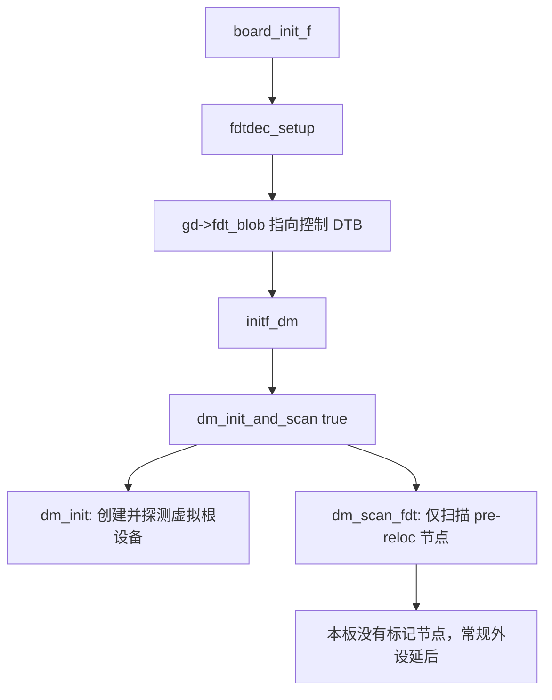
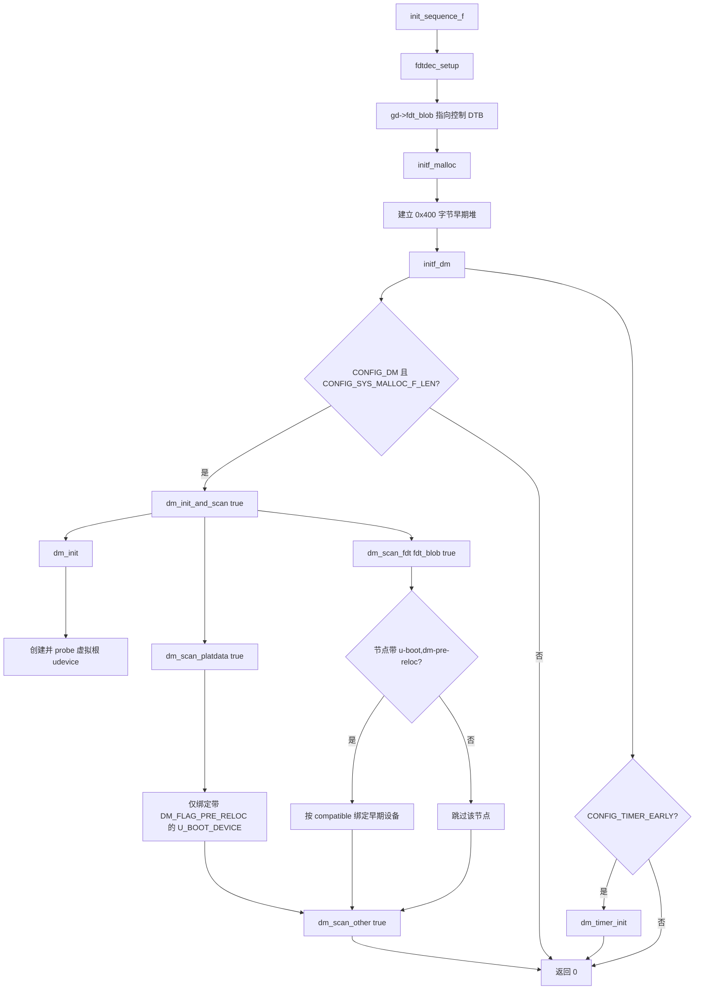

# 1 U-Boot 2017.03 设备树驱动模型分析

## 1.1 分析对象与版本范围

本章分析的源码为 NXP i.MX6ULL 平台使用的 U-Boot `v2017.03`，单板配置为 `configs/mx6ull_alientek_emmc_defconfig`，默认控制设备树为 `arch/arm/dts/imx6ull-alientek-emmc.dts`。

本章只完整分析重定位前的 `initf_dm()`：从控制设备树就位，到创建早期虚拟根设备，再到受限扫描。`initr_dm()` 的重定位后完整扫描将在后续章节单独分析。核心调用链如下：

```text
board_init_f()
  -> fdtdec_setup()
  -> initf_dm()
    -> dm_init_and_scan(true)
  -> dm_init()
  -> device_bind_by_name()
  -> lists_driver_lookup_name()
  -> device_bind_common()
  -> dm_scan_fdt()
```

2017.03 使用扁平设备树（Flat Device Tree，FDT）接口。设备树节点在驱动模型中以 `int of_offset` 保存其在二进制 DTB 中的节点偏移；驱动读取属性时，通常通过 `gd->fdt_blob` 与 `fdt_getprop()`、`fdtdec_xxx()` 等接口完成。

## 1.2 绑定、探测与初始化的区分

驱动模型中存在三个必须区分的动作：

- **扫描（scan）**：遍历静态平台注册信息或设备树节点。
- **绑定（bind）**：为节点创建 `struct udevice`，建立父子关系与 uclass 关系，记录匹配到的驱动。
- **探测（probe）**：分配运行期私有数据、解析设备树属性、选择 pinctrl 状态，并调用驱动的 `.probe()` 操作硬件。

`initf_dm()` 建立的是重定位前的受限驱动模型。除了虚拟根设备外，普通设备通常只在后续被访问时才由 `device_probe()` 惰性探测。因此，`dm_init_and_scan(true)` 成功并不表示所有外设寄存器都已经完成初始化。



# 2 控制设备树就位：fdtdec_setup

## 2.1 fdtdec_setup 的调用时机

`common/board_f.c` 中的 `init_sequence_f[]` 是 `board_init_f()` 按顺序执行的初始化函数表。对于启用了 `CONFIG_OF_CONTROL` 的配置，`fdtdec_setup` 位于早期初始化阶段：

```c
static const init_fnc_t init_sequence_f[] = {
    setup_mon_len,
#ifdef CONFIG_OF_CONTROL
    fdtdec_setup,
#endif
    initf_malloc,
    ...
    initf_dm,
    ...
};
```

执行顺序说明：

1. `setup_mon_len` 计算当前 U-Boot 镜像长度。
2. `fdtdec_setup` 找到控制 DTB，设置全局指针 `gd->fdt_blob`。
3. `initf_malloc` 建立重定位前的小型 malloc 区域。
4. `initf_dm` 仅在满足条件时执行重定位前设备模型扫描。

设备树必须先于 DM 初始化就位，因为 DM 扫描和驱动匹配都需要读取 `gd->fdt_blob`。

## 2.2 fdtdec_setup 逐句分析

`lib/fdtdec.c` 中的 2017.03 实现如下：

```c
int fdtdec_setup(void)
{
#if CONFIG_IS_ENABLED(OF_CONTROL)
# ifdef CONFIG_OF_EMBED
    /* Get a pointer to the FDT */
    gd->fdt_blob = __dtb_dt_begin;
# elif defined CONFIG_OF_SEPARATE
#  ifdef CONFIG_SPL_BUILD
    /* FDT is at end of BSS unless it is in a different memory region */
    if (IS_ENABLED(CONFIG_SPL_SEPARATE_BSS))
        gd->fdt_blob = (ulong *)&_image_binary_end;
    else
        gd->fdt_blob = (ulong *)&__bss_end;
#  else
    /* FDT is at end of image */
    gd->fdt_blob = (ulong *)&_end;
#  endif
# elif defined(CONFIG_OF_HOSTFILE)
    if (sandbox_read_fdt_from_file()) {
        puts("Failed to read control FDT\n");
        return -1;
    }
# endif
# ifndef CONFIG_SPL_BUILD
    /* Allow the early environment to override the fdt address */
    gd->fdt_blob = (void *)getenv_ulong("fdtcontroladdr", 16,
                        (uintptr_t)gd->fdt_blob);
# endif
#endif
    return fdtdec_prepare_fdt();
}
```

### 2.2.1 `CONFIG_OF_CONTROL`

```c
#if CONFIG_IS_ENABLED(OF_CONTROL)
```

`CONFIG_OF_CONTROL=y` 表示 U-Boot 启用控制设备树。该板的 defconfig 已启用此选项，因此预处理器保留整个 `#if` 块。

控制设备树用于 U-Boot 自身的驱动模型，与 `bootm` 启动 Linux 时传递给内核的设备树是两个不同的使用场景；二者可能来自同一份 DTS，也可能不是同一个 DTB。

### 2.2.2 `CONFIG_OF_EMBED` 分支

```c
# ifdef CONFIG_OF_EMBED
    gd->fdt_blob = __dtb_dt_begin;
```

`CONFIG_OF_EMBED` 表示 DTB 嵌入 ELF 的数据段。链接脚本导出 `__dtb_dt_begin` 符号，符号地址就是内嵌 DTB 的起始地址。这一分支只赋值指针，不复制 DTB，也不解析具体节点。

### 2.2.3 `CONFIG_OF_SEPARATE` 分支

本板使用的是 `CONFIG_OF_SEPARATE`，即 DTB 单独生成，随后附加到 U-Boot 镜像末尾。非 SPL 构建时执行：

```c
#  else
    /* FDT is at end of image */
    gd->fdt_blob = (ulong *)&_end;
#  endif
```

- `_end` 是链接脚本提供的 U-Boot 镜像结尾符号。
- 因为 DTB 位于镜像正文之后，所以 `_end` 的地址就是 DTB 起始地址。
- 强制转换为 `ulong *` 只用于保存地址；后续一般按 `void *` 或 FDT 指针使用。

SPL 构建时，DTB 位于 BSS 尾部或 `_image_binary_end` 后。此板没有启用 SPL，相关分支不会编译进最终镜像。

### 2.2.4 `CONFIG_OF_HOSTFILE` 分支

```c
# elif defined(CONFIG_OF_HOSTFILE)
    if (sandbox_read_fdt_from_file()) {
        puts("Failed to read control FDT\n");
        return -1;
    }
```

该分支仅适用于 sandbox 等从宿主机文件系统读取 DTB 的构建目标。读取失败时打印错误并返回 `-1`，调用者会停止初始化流程。本板不进入此分支。

### 2.2.5 `fdtcontroladdr` 环境变量覆盖

```c
gd->fdt_blob = (void *)getenv_ulong("fdtcontroladdr", 16,
                    (uintptr_t)gd->fdt_blob);
```

这行只在非 SPL U-Boot 中编译。

- `getenv_ulong("fdtcontroladdr", 16, default)` 读取环境变量 `fdtcontroladdr`，按十六进制转换为无符号长整型。
- 若变量不存在或不能转换，返回第三个参数指定的默认值，即前面确定的 DTB 地址。
- 转换为 `(void *)` 后再次保存到 `gd->fdt_blob`。

因此，默认使用镜像尾部的控制 DTB；调试或特殊启动场景中，可通过环境变量改用内存中的另一份 DTB。

### 2.2.6 `fdtdec_prepare_fdt()`

```c
return fdtdec_prepare_fdt();
```

设备树地址设置完成后，`fdtdec_prepare_fdt()` 校验 DTB 头部，确认 magic、总大小和版本等基础格式合法，并完成 FDT 访问前的准备。返回值为：

- `0`：控制 DTB 可用。
- `< 0`：DTB 缺失或格式错误，`board_init_f()` 的初始化函数表将停止执行。

## 2.3 设备树的预留与重定位

`fdtdec_setup()` 设置的地址最初可能位于 Flash 或镜像加载区。`common/board_f.c` 后续通过 `reserve_fdt()` 为其在 SDRAM 顶部预留新空间：

```c
static int reserve_fdt(void)
{
#ifndef CONFIG_OF_EMBED
    if (gd->fdt_blob) {
        gd->fdt_size = ALIGN(fdt_totalsize(gd->fdt_blob) + 0x1000, 32);
        gd->start_addr_sp -= gd->fdt_size;
        gd->new_fdt = map_sysmem(gd->start_addr_sp, gd->fdt_size);
    }
#endif
    return 0;
}
```

`fdt_totalsize()` 读取 DTB 声明的总长度；额外保留 `0x1000` 字节供后续修补设备树；`ALIGN(..., 32)` 保证地址和长度满足对齐要求。重定位过程中，U-Boot 会将内容复制到 `gd->new_fdt`，并更新 `gd->fdt_blob`。从此处开始，所有 DM 代码都通过重定位后的 `gd->fdt_blob` 访问设备树。

# 3 initf_dm：重定位前驱动模型初始化

## 3.1 initf_dm：重定位前的受限扫描

`common/board_f.c` 中：

```c
static int initf_dm(void)
{
#if defined(CONFIG_DM) && defined(CONFIG_SYS_MALLOC_F_LEN)
    int ret;

    ret = dm_init_and_scan(true);
    if (ret)
        return ret;
#endif
#ifdef CONFIG_TIMER_EARLY
    ret = dm_timer_init();
    if (ret)
        return ret;
#endif

    return 0;
}
```

调用流程如下：



本板中 `CONFIG_DM` 和 `CONFIG_SYS_MALLOC_F_LEN=0x400` 均成立，因此一定进入 `dm_init_and_scan(true)`。目标 DTS 没有 `u-boot,dm-pre-reloc` 属性，图中的设备树分支会落在“跳过该节点”；早期虚拟根设备仍会被创建并探测。

逐句说明：

- `CONFIG_DM` 启用驱动模型基础设施。
- `CONFIG_SYS_MALLOC_F_LEN` 定义重定位前临时堆的大小。重定位前无法使用正式 malloc，DM 创建 `udevice`、`uclass` 需要动态内存，因此必须具备这个临时堆。
- `dm_init_and_scan(true)` 传入 `true`，表示仅扫描重定位前必需的设备。
- 返回值非零时立即返回错误，阻止后续早期初始化继续进行。
- `CONFIG_TIMER_EARLY` 启用时，`dm_timer_init()` 会主动取得并探测早期定时器。
- 无论是否启用上述配置，函数最终都返回 `0`。

本板最终生成的配置 `include/generated/autoconf.h` 定义了：

```c
#define CONFIG_SYS_MALLOC_F_LEN 0x400
```

因此第一段 `#if defined(CONFIG_DM) && defined(CONFIG_SYS_MALLOC_F_LEN)` 会参与编译，`initf_dm()` 确实调用 `dm_init_and_scan(true)`。其中 `0x400` 即 1024 字节，是重定位前 DM 可使用的临时动态内存上限。

`true` 会开启重定位前过滤。`dm_scan_fdt_node()` 对每个候选 DT 节点执行：

```c
if (pre_reloc_only &&
    !fdt_getprop(blob, offset, "u-boot,dm-pre-reloc", NULL))
    continue;
```

本板的 `imx6ull-alientek-emmc.dts` 及其包含的 i.MX6ULL DTS 文件没有添加 `u-boot,dm-pre-reloc` 属性。因此，早期扫描仍会创建并探测虚拟根设备，也会遍历静态平台注册表中的 `U_BOOT_DEVICE()` 条目；但只有带 `DM_FLAG_PRE_RELOC` 的静态驱动才会被绑定。常规设备树节点中的 GPIO、MMC、FEC 等外设则不会在这一轮绑定。重定位后的 `initr_dm()` 再以 `false` 参数重新创建一棵完整 DM 树并扫描所有已启用的 DT 节点。


## 3.2 dm_init_and_scan：创建根节点并扫描设备来源

### 3.2.1 函数实现

`drivers/core/root.c` 中：

```c
int dm_init_and_scan(bool pre_reloc_only)
{
    int ret;

    ret = dm_init();
    if (ret) {
        debug("dm_init() failed: %d\n", ret);
        return ret;
    }
    ret = dm_scan_platdata(pre_reloc_only);
    if (ret) {
        debug("dm_scan_platdata() failed: %d\n", ret);
        return ret;
    }

    if (CONFIG_IS_ENABLED(OF_CONTROL) && !CONFIG_IS_ENABLED(OF_PLATDATA)) {
        ret = dm_scan_fdt(gd->fdt_blob, pre_reloc_only);
        if (ret) {
            debug("dm_scan_fdt() failed: %d\n", ret);
            return ret;
        }
    }

    ret = dm_scan_other(pre_reloc_only);
    if (ret)
        return ret;

    return 0;
}
```

参数说明：

- `pre_reloc_only`：`true` 时仅允许绑定重定位前需要的驱动/节点；`false` 时扫描完整设备集合。

逐句说明：

1. `int ret;` 保存每个子过程的返回值。
2. `dm_init()` 创建并探测虚拟根设备。没有根设备就没有统一的设备树模型起点。
3. `if (ret)` 判断根设备创建是否失败；失败时 `debug()` 记录错误并返回。
4. `dm_scan_platdata(pre_reloc_only)` 扫描由 `U_BOOT_DEVICE()`/`U_BOOT_DEVICES()` 静态注册的设备。这条路径不依赖 DTB。
5. 第二个 `if (ret)` 以相同方式处理静态平台数据绑定错误。
6. `CONFIG_OF_CONTROL && !CONFIG_OF_PLATDATA` 条件成立时，说明当前使用原始 DTB，而不是把 DT 属性预生成 C 平台数据。
7. `dm_scan_fdt(gd->fdt_blob, pre_reloc_only)` 从控制设备树根节点开始扫描，匹配 `compatible` 并绑定设备。
8. 第三个错误处理块确保 DT 扫描失败会中断后续初始化。
9. `dm_scan_other()` 是弱函数扩展点，默认实现只返回 `0`，架构代码可覆盖它以绑定额外设备。
10. 最后的 `return 0` 表示所有扫描来源均处理成功。

### 3.2.2 dm_init：创建虚拟根设备

```c
int dm_init(void)
{
    int ret;

    if (gd->dm_root) {
        dm_warn("Virtual root driver already exists!\n");
        return -EINVAL;
    }
    INIT_LIST_HEAD(&DM_UCLASS_ROOT_NON_CONST);

    ret = device_bind_by_name(NULL, false, &root_info,
                              &DM_ROOT_NON_CONST);
    if (ret)
        return ret;
#if CONFIG_IS_ENABLED(OF_CONTROL)
    DM_ROOT_NON_CONST->of_offset = 0;
#endif
    ret = device_probe(DM_ROOT_NON_CONST);
    if (ret)
        return ret;

    return 0;
}
```

- `gd->dm_root` 非空表示已经存在根设备；重复创建会导致两棵树并存，因此返回 `-EINVAL`。
- `INIT_LIST_HEAD(&DM_UCLASS_ROOT_NON_CONST)` 初始化全局 uclass 链表头。
- `device_bind_by_name()` 按驱动名字创建虚拟根设备，结果写入 `gd->dm_root`。
- `DM_ROOT_NON_CONST` 的宏定义为 `(((gd_t *)gd)->dm_root)`，所以 `&DM_ROOT_NON_CONST` 等价于 `&gd->dm_root`。
- 根设备不是由某个普通 FDT 节点匹配得到的，绑定时先传入 `of_offset = -1`；随后手动赋值为 `0`，使其关联 FDT 根节点。
- `device_probe(DM_ROOT_NON_CONST)` 立即探测根设备，为其分配 `root_priv`。根驱动没有真实硬件 `.probe()` 回调，但必须进入已激活状态，供所有子设备的递归 probe 路径使用。

## 3.3 device_bind_by_name：按驱动名称实例化根设备

### 3.3.1 root_info 与 root_driver

`drivers/core/root.c` 定义：

```c
static const struct driver_info root_info = {
    .name = "root_driver",
};

U_BOOT_DRIVER(root_driver) = {
    .name = "root_driver",
    .id = UCLASS_ROOT,
    .priv_auto_alloc_size = sizeof(struct root_priv),
};
```

`root_info` 是设备实例化所需的简化描述，`root_driver` 是已编译进镜像的驱动定义。二者通过同一个字符串 `"root_driver"` 关联。

`struct driver_info` 定义在 `include/dm/platdata.h`：

```c
struct driver_info {
    const char *name;
    const void *platdata;
#if CONFIG_IS_ENABLED(OF_PLATDATA)
    uint platdata_size;
#endif
};
```

- `name`：待查找的驱动名。
- `platdata`：非设备树场景下传递给该设备的平台数据。本例未设置，默认为 `NULL`。
- `platdata_size`：仅启用 `OF_PLATDATA` 时存在。本板不使用此字段。

### 3.3.2 device_bind_by_name 逐句分析

`drivers/core/device.c` 中：

```c
int device_bind_by_name(struct udevice *parent, bool pre_reloc_only,
            const struct driver_info *info, struct udevice **devp)
{
    struct driver *drv;
    uint platdata_size = 0;

    drv = lists_driver_lookup_name(info->name);
    if (!drv)
        return -ENOENT;
    if (pre_reloc_only && !(drv->flags & DM_FLAG_PRE_RELOC))
        return -EPERM;

#if CONFIG_IS_ENABLED(OF_PLATDATA)
    platdata_size = info->platdata_size;
#endif
    return device_bind_common(parent, drv, info->name,
            (void *)info->platdata, 0, -1, platdata_size, devp);
}
```

参数说明：

- `parent`：新设备的父设备。根设备传入 `NULL`。
- `pre_reloc_only`：是否要求驱动具有 `DM_FLAG_PRE_RELOC` 标志。根设备调用传入 `false`。
- `info`：描述待实例化设备的 `driver_info`，根设备传入 `&root_info`。
- `devp`：输出参数，成功后返回新建的 `struct udevice *`。根设备传入 `&gd->dm_root`。

逐句说明：

1. `struct driver *drv;` 保存找到的驱动结构体地址。
2. `uint platdata_size = 0;` 默认没有静态平台数据。
3. `lists_driver_lookup_name(info->name)` 用字符串 `"root_driver"` 在链接器列表中查找 `struct driver`。
4. `if (!drv)` 表示所有已编译驱动中都没有该名字，返回 `-ENOENT`。
5. `pre_reloc_only && !(drv->flags & DM_FLAG_PRE_RELOC)` 仅在早期扫描时有效。若驱动没有早期标记，返回 `-EPERM`，表示该驱动不能在重定位前绑定。
6. `OF_PLATDATA` 分支把结构体中的平台数据长度赋给局部变量；本板未启用该功能，变量保持 `0`。
7. 最后一行调用通用绑定函数，所有真正的 `udevice` 创建动作都在其中完成。

该调用等价于：

```c
device_bind_common(
    NULL,              /* root 没有父设备 */
    drv,               /* 查到的 root_driver */
    "root_driver",    /* 新设备名称 */
    NULL,              /* root_info 没有平台数据 */
    0,                 /* 无匹配表附带的 driver_data */
    -1,                /* 此刻尚未关联 FDT 节点 */
    0,                 /* 没有 OF_PLATDATA 长度 */
    &gd->dm_root);     /* 返回新建的根 udevice */
```

## 3.4 lists_driver_lookup_name：从链接器列表查找 U_BOOT_DRIVER

### 3.4.1 U_BOOT_DRIVER 的链接器列表机制

驱动通过宏注册：

```c
U_BOOT_DRIVER(root_driver) = {
    .name = "root_driver",
    .id = UCLASS_ROOT,
    .priv_auto_alloc_size = sizeof(struct root_priv),
};
```

`U_BOOT_DRIVER()` 不会在运行期执行一个普通注册函数。它会把 `struct driver` 实例放入名为 `driver` 的链接器列表 section。链接完成后，同类结构体在镜像内形成一段连续区域。

这正是 `lists_driver_lookup_name()` 能够遍历“全部已编译驱动”的原因。驱动是否能被查找到取决于两件事：源文件是否被 Makefile 编译，以及驱动结构体是否通过 `U_BOOT_DRIVER()` 放入链接器列表。

### 3.4.2 查找函数逐句分析

`drivers/core/lists.c` 中：

```c
struct driver *lists_driver_lookup_name(const char *name)
{
    struct driver *drv =
        ll_entry_start(struct driver, driver);
    const int n_ents = ll_entry_count(struct driver, driver);
    struct driver *entry;

    for (entry = drv; entry != drv + n_ents; entry++) {
        if (!strcmp(name, entry->name))
            return entry;
    }

    /* Not found */
    return NULL;
}
```

#### 3.4.2.1 `ll_entry_start()`：取得首元素地址

```c
struct driver *drv = ll_entry_start(struct driver, driver);
```

宏参数含义：

- 第一个 `driver`：列表中每个元素的类型，即 `struct driver`。
- 第二个 `driver`：链接器列表名。

宏展开后得到 `driver` 列表首地址，并把该地址解释为 `struct driver *`。这里并不创建驱动，也不复制驱动结构体；仅仅取得链接器已经排布好的内存区起点。

#### 3.4.2.2 `ll_entry_count()`：计算元素数目

```c
const int n_ents = ll_entry_count(struct driver, driver);
```

`ll_entry_count()` 使用链接器提供的列表起止地址计算该 section 的总字节数，再除以 `sizeof(struct driver)`，得到元素个数。概念上等价于：

```c
n_ents = (list_end_address - list_start_address) /
         sizeof(struct driver);
```

因此 `drv + n_ents` 是列表末尾后一项的地址，符合 C 数组的半开区间写法 `[drv, drv + n_ents)`。

#### 3.4.2.3 遍历与 `strcmp()` 比较

```c
for (entry = drv; entry != drv + n_ents; entry++) {
    if (!strcmp(name, entry->name))
        return entry;
}
```

- `entry = drv`：从第一个 `struct driver` 开始。
- `entry != drv + n_ents`：未越过最后一个元素时继续循环。
- `entry++`：指针增加 `sizeof(struct driver)` 字节，自动移动到下一个驱动结构体。
- `strcmp(name, entry->name)`：比较两个以 `\0` 结束的 C 字符串。
- `strcmp()` 返回 `0` 表示完全相等，因此 `!strcmp(...)` 为真时，说明查找名与当前驱动的 `.name` 相同。
- `return entry`：把匹配驱动结构体地址返回给调用者。例如查找 `"root_driver"` 时，返回 `U_BOOT_DRIVER(root_driver)` 的地址。
- 循环结束仍未匹配时，返回 `NULL`，上层转换为 `-ENOENT`。

此函数按**驱动名**查找，适合 root 设备和 `U_BOOT_DEVICE()` 静态设备；设备树节点则使用 `lists_bind_fdt()` 按 `compatible` 与 `.of_match` 表匹配。这两条路径最终都会进入 `device_bind_common()`。

## 3.5 device_bind_common：创建 udevice 实例

### 3.5.1 函数职责

`device_bind_common()` 是 DM 绑定阶段的中心函数。DM 框架本身不调用驱动 `.probe()`，因而不执行标准的硬件探测流程；驱动的 `.bind()` 回调理论上可以包含任意自定义代码，但应只完成设备模型组织工作。该函数负责完成以下内存和关系管理工作：

- 分配 `struct udevice`。
- 关联 driver、uclass、父设备与设备树节点偏移。
- 按驱动/uclass要求分配平台数据。
- 把设备放入父设备子链表和 uclass 设备链表。
- 依次执行驱动、父驱动、uclass 的 bind 回调。
- 成功时设置 `DM_FLAG_BOUND`，失败时按反向顺序清理资源。

### 3.5.2 参数说明

```c
static int device_bind_common(struct udevice *parent, const struct driver *drv,
                  const char *name, void *platdata,
                  ulong driver_data, int of_offset,
                  uint of_platdata_size, struct udevice **devp);
```

- `parent`：父设备。普通 DT 节点对应的父总线设备；根设备为 `NULL`。
- `drv`：已匹配的 `struct driver`。
- `name`：新建 `udevice` 的名称。
- `platdata`：已有的平台数据指针；可以为 `NULL`。
- `driver_data`：驱动匹配表的附加数据，常来自 `.of_match` 表项的 `.data`。
- `of_offset`：节点在 `gd->fdt_blob` 中的偏移；静态根设备初始传 `-1`。
- `of_platdata_size`：已生成平台数据的实际长度。
- `devp`：成功时接收新设备指针的输出参数。

### 3.5.3 输入检查、uclass 获取与 udevice 分配

```c
if (devp)
    *devp = NULL;
if (!name)
    return -EINVAL;

ret = uclass_get(drv->id, &uc);
if (ret) {
    debug("Missing uclass for driver %s\n", drv->name);
    return ret;
}

dev = calloc(1, sizeof(struct udevice));
if (!dev)
    return -ENOMEM;
```

逐句说明：

1. `if (devp)` 检查输出参数是否有效。
2. `*devp = NULL` 先清空调用者的输出位置，避免调用失败时保留旧的悬空指针。
3. `if (!name)` 拒绝无名称设备，因为驱动模型中的设备必须有名称。
4. `uclass_get(drv->id, &uc)` 按驱动的 `.id` 获取所属类别。例如根驱动的 `.id` 是 `UCLASS_ROOT`；FEC 网卡驱动的 `.id` 是 `UCLASS_ETH`。
5. 该 uclass 尚不存在时，`uclass_get()` 会创建 `struct uclass` 并加入全局 uclass 链表。
6. `ret` 非零表示找不到对应 `UCLASS_DRIVER()` 或内存分配失败，记录调试信息并返回。
7. `calloc(1, sizeof(struct udevice))` 分配并清零设备实例。清零确保未显式赋值的指针和状态标志从零开始。
8. 分配失败返回 `-ENOMEM`；此时尚未创建任何需要释放的对象。

### 3.5.4 初始化链表与基础字段

```c
INIT_LIST_HEAD(&dev->sibling_node);
INIT_LIST_HEAD(&dev->child_head);
INIT_LIST_HEAD(&dev->uclass_node);
#ifdef CONFIG_DEVRES
INIT_LIST_HEAD(&dev->devres_head);
#endif
dev->platdata = platdata;
dev->driver_data = driver_data;
dev->name = name;
dev->of_offset = of_offset;
dev->parent = parent;
dev->driver = drv;
dev->uclass = uc;

dev->seq = -1;
dev->req_seq = -1;
```

链表字段的职责：

- `sibling_node`：本设备作为“子设备”时挂入父设备 `child_head` 的节点。
- `child_head`：本设备自己的子设备链表头。
- `uclass_node`：本设备挂入所属 uclass `dev_head` 的节点。
- `devres_head`：启用 `CONFIG_DEVRES` 时，管理该设备申请的资源。

基础字段逐项保存传入实参，使后续 `device_probe()` 和驱动回调能知道“谁是父设备、谁是驱动、设备树节点在哪里”。

`seq` 是最终分配的设备序号，`req_seq` 是从 DT aliases 解析到的期望序号。两者初始化为 `-1` 表示尚未分配。

### 3.5.5 根据 aliases 记录期望序号

```c
if (CONFIG_IS_ENABLED(OF_CONTROL) && CONFIG_IS_ENABLED(DM_SEQ_ALIAS)) {
    if (uc->uc_drv->flags & DM_UC_FLAG_SEQ_ALIAS) {
        if (uc->uc_drv->name && of_offset != -1) {
            fdtdec_get_alias_seq(gd->fdt_blob,
                    uc->uc_drv->name, of_offset,
                    &dev->req_seq);
        }
    }
}
```

这一段只为支持序号别名的 uclass 执行：

1. `OF_CONTROL` 保证可读取设备树。
2. `DM_SEQ_ALIAS` 启用别名序号功能。
3. `DM_UC_FLAG_SEQ_ALIAS` 表示当前 uclass（如串口、I2C、SPI、以太网等）采用 aliases 管理编号。
4. uclass 有名字且设备关联了有效 FDT 节点（`of_offset != -1`）时，调用 `fdtdec_get_alias_seq()`。
5. 函数查找类似 `aliases { ethernet0 = &fec1; };` 的关联，结果保存在 `dev->req_seq`。

根设备的 `of_offset` 为 `-1`，且 `UCLASS_ROOT` 不需要 aliases，因此本段对根设备没有实际动作。

### 3.5.6 驱动平台数据分配

```c
if (drv->platdata_auto_alloc_size) {
    bool alloc = !platdata;

    if (CONFIG_IS_ENABLED(OF_PLATDATA)) {
        if (of_platdata_size) {
            dev->flags |= DM_FLAG_OF_PLATDATA;
            if (of_platdata_size < drv->platdata_auto_alloc_size)
                alloc = true;
        }
    }
    if (alloc) {
        dev->flags |= DM_FLAG_ALLOC_PDATA;
        dev->platdata = calloc(1, drv->platdata_auto_alloc_size);
        if (!dev->platdata) {
            ret = -ENOMEM;
            goto fail_alloc1;
        }
        if (CONFIG_IS_ENABLED(OF_PLATDATA) && platdata) {
            memcpy(dev->platdata, platdata, of_platdata_size);
        }
    }
}
```

该段处理 `dev->platdata`，它保存设备的静态配置数据。逐句说明：

- `drv->platdata_auto_alloc_size` 非零时，驱动要求 DM 自动为每个设备实例分配平台数据。
- `bool alloc = !platdata`：调用者没有提供平台数据时，默认需要分配。
- `OF_PLATDATA` 分支处理由设备树工具生成的 C 平台数据。已有数据长度不足以容纳驱动要求的结构体时，仍需要分配更大的区域。
- `DM_FLAG_OF_PLATDATA` 标记数据源来自 OF_PLATDATA。
- `DM_FLAG_ALLOC_PDATA` 标记此内存由 DM 分配，失败或解绑时需要由 DM 释放。
- `calloc()` 分配并清零指定字节数。
- 分配失败时跳到 `fail_alloc1`，最终释放 `dev`。
- 已有 OF_PLATDATA 时，`memcpy()` 把已有字段复制到新分配的更大空间。

根驱动没有设置 `.platdata_auto_alloc_size`，这一整段对根设备会跳过。

### 3.5.7 uclass 平台数据与父设备平台数据

```c
size = uc->uc_drv->per_device_platdata_auto_alloc_size;
if (size) {
    dev->flags |= DM_FLAG_ALLOC_UCLASS_PDATA;
    dev->uclass_platdata = calloc(1, size);
    if (!dev->uclass_platdata) {
        ret = -ENOMEM;
        goto fail_alloc2;
    }
}

if (parent) {
    size = parent->driver->per_child_platdata_auto_alloc_size;
    if (!size) {
        size = parent->uclass->uc_drv->
                per_child_platdata_auto_alloc_size;
    }
    if (size) {
        dev->flags |= DM_FLAG_ALLOC_PARENT_PDATA;
        dev->parent_platdata = calloc(1, size);
        if (!dev->parent_platdata) {
            ret = -ENOMEM;
            goto fail_alloc3;
        }
    }
}
```

`uclass_platdata` 与 `parent_platdata` 的所有权不同：

- `uclass_platdata`：同类设备共享的框架为每个实例准备的数据。大小由 uclass 的 `per_device_platdata_auto_alloc_size` 决定。
- `parent_platdata`：父驱动或父 uclass 为每个子设备准备的数据。I2C/SPI 等总线常使用这类数据保存从设备地址、片选等信息。

执行顺序为：先分配 uclass 数据，再在父设备存在时决定子设备数据大小。父驱动优先指定 `per_child_platdata_auto_alloc_size`；若其为零，再使用父 uclass 的同名字段。任意分配失败都跳转到相应失败标签，按已分配顺序的反方向回收。

根设备没有 `parent`，所以第二段完全跳过；`UCLASS_ROOT` 也没有声明每设备平台数据大小，因此第一段同样跳过。

### 3.5.8 连接设备树关系与 uclass 关系

```c
/* put dev into parent's successor list */
if (parent)
    list_add_tail(&dev->sibling_node, &parent->child_head);

ret = uclass_bind_device(dev);
if (ret)
    goto fail_uclass_bind;
```

这两步维护两种互不替代的索引：

1. 父子树关系：有 `parent` 时，`sibling_node` 挂入 `parent->child_head`。以后可按设备树层级遍历子设备。
2. uclass 分类关系：`uclass_bind_device()` 把 `dev->uclass_node` 挂入 `uc->dev_head`。以后可按类别查找，例如遍历全部 `UCLASS_ETH` 设备。

根设备没有父节点，因此只进入第二步。`uclass_bind_device()` 成功后，虚拟根设备成为 `UCLASS_ROOT` 设备链表中的成员。

### 3.5.9 bind 回调顺序

```c
if (drv->bind) {
    ret = drv->bind(dev);
    if (ret)
        goto fail_bind;
}
if (parent && parent->driver->child_post_bind) {
    ret = parent->driver->child_post_bind(dev);
    if (ret)
        goto fail_child_post_bind;
}
if (uc->uc_drv->post_bind) {
    ret = uc->uc_drv->post_bind(dev);
    if (ret)
        goto fail_uclass_post_bind;
}
```

绑定回调的顺序固定：

1. 当前设备驱动的 `.bind(dev)`。
2. 父设备驱动的 `.child_post_bind(dev)`。
3. 当前 uclass 的 `.post_bind(dev)`。

这些回调仍属于 bind 阶段，不应依赖硬件已初始化。常见用途是为子节点继续创建逻辑设备，或触发对子设备树的递归扫描。根驱动没有 `.bind`，且没有父设备；`UCLASS_ROOT` 也没有 `.post_bind`，因此根设备会跳过三段回调。

### 3.5.10 输出结果与绑定状态

```c
if (parent)
    dm_dbg("Bound device %s to %s\n", dev->name, parent->name);
if (devp)
    *devp = dev;

dev->flags |= DM_FLAG_BOUND;

return 0;
```

- 有父设备时输出调试日志，说明新设备已绑定至哪个父设备。
- `*devp = dev` 把新建实例返回调用者。对根设备而言，这一步使 `gd->dm_root` 指向新的 `struct udevice`。
- `DM_FLAG_BOUND` 表示绑定成功；此时尚未设置 `DM_FLAG_ACTIVATED`。
- 返回 `0` 表示绑定阶段完成。

### 3.5.11 失败路径与逆序释放

```c
fail_uclass_post_bind:
fail_child_post_bind:
    if (CONFIG_IS_ENABLED(DM_DEVICE_REMOVE)) {
        if (drv->unbind && drv->unbind(dev))
            dm_warn("unbind() method failed on dev '%s' on error path\n",
                    dev->name);
    }
fail_bind:
    if (CONFIG_IS_ENABLED(DM_DEVICE_REMOVE)) {
        if (uclass_unbind_device(dev))
            dm_warn("Failed to unbind dev '%s' on error path\n",
                    dev->name);
    }
fail_uclass_bind:
    if (CONFIG_IS_ENABLED(DM_DEVICE_REMOVE)) {
        list_del(&dev->sibling_node);
        if (dev->flags & DM_FLAG_ALLOC_PARENT_PDATA) {
            free(dev->parent_platdata);
            dev->parent_platdata = NULL;
        }
    }
fail_alloc3:
    if (dev->flags & DM_FLAG_ALLOC_UCLASS_PDATA) {
        free(dev->uclass_platdata);
        dev->uclass_platdata = NULL;
    }
fail_alloc2:
    if (dev->flags & DM_FLAG_ALLOC_PDATA) {
        free(dev->platdata);
        dev->platdata = NULL;
    }
fail_alloc1:
    devres_release_all(dev);
    free(dev);
    return ret;
```

失败清理严格遵循“后创建、先释放”的原则：

1. 若 bind 回调已经执行，先调用驱动 `.unbind()`。
2. 再从 uclass 设备链表解绑。
3. 从父设备的子链表删除，并释放 `parent_platdata`。
4. 释放 `uclass_platdata`。
5. 释放驱动 `platdata`。
6. 释放 devres 管理的资源。
7. 最后释放 `struct udevice` 自身并返回最初的错误码。

各段由对应的 `DM_FLAG_ALLOC_xxx` 判断所有权，避免释放由调用者提供、而非 DM 自己分配的内存。

## 3.6 根设备绑定后的状态与早期扫描

`device_bind_by_name()` 成功返回后，`dm_init()` 继续执行：

```c
DM_ROOT_NON_CONST->of_offset = 0;
ret = device_probe(DM_ROOT_NON_CONST);
```

根设备在 bind 阶段的关键状态如下：

| 字段 | 绑定后值 | 含义 |
|---|---|---|
| `gd->dm_root` | 新建 `udevice` 地址 | DM 全局根设备 |
| `dev->parent` | `NULL` | 根设备没有父设备 |
| `dev->driver` | `root_driver` | 指向虚拟根驱动 |
| `dev->uclass` | `UCLASS_ROOT` 实例 | 所属分类 |
| `dev->of_offset` | 初始 `-1`，随后改为 `0` | 关联 FDT 根节点 |
| `dev->flags` | 含 `DM_FLAG_BOUND` | 已绑定，尚未完成探测 |
| `dev->priv` | `NULL` | 将在 `device_probe()` 分配 |

`device_probe()` 根据 `.priv_auto_alloc_size = sizeof(struct root_priv)` 分配 `dev->priv`。根设备的私有数据结构为：

```c
struct root_priv {
    fdt_addr_t translation_offset;
};
```

它用于设备树 `reg` 地址解析的统一偏移。i.MX6ULL 通常保持其默认值 `0`。根设备探测成功后，`dm_scan_fdt(gd->fdt_blob, true)` 才以这个根设备为父节点执行早期设备树扫描；本板常规 DT 节点未带 `u-boot,dm-pre-reloc` 属性，因此该轮不会为它们创建 `udevice`。

## 3.7 initf_dm 调用链总结

```text
fdtdec_setup()
  取得控制 DTB 地址
  -> gd->fdt_blob

initf_dm()
    CONFIG_SYS_MALLOC_F_LEN = 0x400，执行 dm_init_and_scan(true)
    -> 创建并探测早期虚拟根设备
    -> 仅扫描带 u-boot,dm-pre-reloc 属性的 DT 节点
    -> 本板常规 DTS 未标记此属性，因此不在此阶段绑定常规 DT 外设

  -> dm_init_and_scan(true)
      -> dm_init()
          -> INIT_LIST_HEAD(&gd->uclass_root)
          -> device_bind_by_name(NULL, false, &root_info, &gd->dm_root)
              -> lists_driver_lookup_name("root_driver")
                  -> 遍历 driver 链接器列表
                  -> strcmp("root_driver", entry->name)
                  -> 返回 U_BOOT_DRIVER(root_driver)
              -> device_bind_common(...)
                  -> 创建 struct udevice
                  -> 获取 UCLASS_ROOT
                  -> 建立 uclass 链表关系
                  -> gd->dm_root = dev
                  -> 设置 DM_FLAG_BOUND
          -> root->of_offset = 0
          -> device_probe(root)
      -> dm_scan_platdata(true)
          -> 仅绑定带 DM_FLAG_PRE_RELOC 的静态设备
      -> dm_scan_fdt(gd->fdt_blob, true)
          -> 仅绑定带 u-boot,dm-pre-reloc 属性的节点
```

根设备是软件构造的虚拟节点，不对应具体硬件；它的存在为设备树中所有普通设备提供统一父节点，并提供 DM 树和 uclass 管理的起点。重定位后，`initr_dm()` 会保存这一轮早期 DM 状态，再创建新的完整 DM 树；该过程留待下一章分析。

# 4 initr_dm：重定位后完整驱动模型重建

本章预留给 `common/board_r.c` 的 `initr_dm()`。内容将分析 `gd->dm_root_f`、`gd->dm_root`、早期设备树与正式设备树的关系，以及 `dm_init_and_scan(false)` 的完整扫描流程。

# 5 dm_scan_fdt 与 lists_bind_fdt：设备树节点绑定

本章预留给设备树节点遍历与驱动匹配。内容将分析 `status` 过滤、`compatible` 多字符串匹配、`.of_match` 表、`simple-bus` 递归扫描和普通 `udevice` 的创建过程。

# 6 device_probe：从已绑定设备到硬件可用

本章预留给惰性 probe 流程。内容将分析父设备递归探测、`priv` 分配、pinctrl 默认状态、`ofdata_to_platdata()` 与驱动 `.probe()` 的调用顺序。